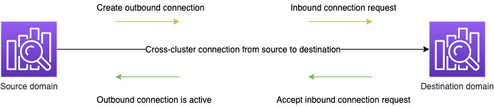

# Cross-Region and cross-account data

access with cross-cluster search

Using [Cross-cluster search](cross-cluster-search.md "cross-cluster-search.md") in Amazon OpenSearch Serverless,
you can perform queries and aggregations across multiple connected domains.

Cross-cluster search in Amazon OpenSearch Serverless uses the concepts of a _source domain_ and _destination
domain_. A cross-cluster search request originates from a source domain. The
destination domain can be in a different AWS account or AWS Region (or both) for the
source domain to query from. Using cross-cluster search, you can configure a source
domain to associate with your OpenSearch UI in the same account and then create
connections to destination domains. As a result, you can use OpenSearch UI with data
from the destination domains even if they are in a different account or Region.

You pay [standard AWS data
transfer charges](https://aws.amazon.com/opensearch-service/pricing/ "https://aws.amazon.com/opensearch-service/pricing/") for data transferred in and out of Amazon OpenSearch Service. You are not
charged for data transferred between nodes within your OpenSearch Service domain. For more information
about data "in" and "out" charges, see [Data Transfer](https://aws.amazon.com/ec2/pricing/on-demand/#Data_Transfer "https://aws.amazon.com/ec2/pricing/on-demand/#Data_Transfer") on the _Amazon EC2 On-Demand Pricing_ page.

You can use cross-cluster search as the mechanism for your OpenSearch UI to be
associated with clusters in a different account or different Region. The requests
between domains are encrypted in transit by default as part of the node-to-node
encryption.

###### Note

The open source OpenSearch tool also documents [cross-cluster search](https://opensearch.org/docs/latest/search-plugins/cross-cluster-search/ "https://opensearch.org/docs/latest/search-plugins/cross-cluster-search/"). Note that setup for the open source tool differs
significantly for open source clusters as compared to managed Amazon OpenSearch Serverless
domains.

Most notably, in Amazon OpenSearch Serverless, you configure cross-cluster connections using the
AWS Management Console instead of using `cURL` requests. The managed service uses
AWS Identity and Access Management (IAM) for cross-cluster authentication in addition to fine-grained
access control.

Therefore, we recommend using the content in this topic to configure cross-cluster
search for your domains instead of the open source OpenSearch
documentation.

###### Functional differences when using cross-cluster search

In comparison to regular domains, destination domains created using Cross-cluster
search have the following functional differences and requirements:

- You can't write to or run `PUT` commands to the remote cluster.
  Your access to the remote cluster is _read-only_.
- Both the source and destination domain must be OpenSearch domains. You can't
  connect an Elasticsearch domain or self-managed OpenSearch/Elasticsearch
  clusters for OpenSearch UI.
- A domain can have a maximum of 20 connections to other domains. This includes
  both outgoing and incoming connections.
- The source domain must be on the same or a higher version of OpenSearch than
  the destination domain. If you want to set up bi-directional connections between
  two domains, the two domains should be in the same version. We recommend
  upgrading both domains to the latest version before making the connection. If
  you need to update domains after setting up the bi-directional connection, you
  must first delete the connection, and then recreate it afterwards.
- You can't use custom dictionaries or SQL with the remote clusters.
- You can't use AWS CloudFormation to connect domains.
- You can't use cross-cluster search on M3 or burstable (T2 and T3)
  instances.
- Cross-cluster search does not work for Amazon OpenSearch Serverless collections.

###### Cross-cluster search prerequisites for OpenSearch UI

Before you set up cross-cluster search with two OpenSearch domains, make sure
that your domains meet the following requirements:

- Fine-grained access control is enabled for both domains
- Node-to-node encryption is enabled for both domains

###### Topics

- [Setting up access permissions for
  cross-Region and cross-account data access with cross-cluster search](#cross-cluster-search-security "#cross-cluster-search-security")
- [Creating a connection
  between domains](#cross-cluster-search-create-connection "#cross-cluster-search-create-connection")
- [Testing your security setup
  for cross-Region and cross-account data access with cross-cluster search](#cross-cluster-search-security-testing "#cross-cluster-search-security-testing")
- [Deleting a
  connection](#cross-cluster-search-deleting-connection "#cross-cluster-search-deleting-connection")

## Setting up access permissions for

cross-Region and cross-account data access with cross-cluster search

When you send a cross-cluster search request to the source domain, the domain
evaluates that request against its domain access policy. Cross-cluster search
requires fine-grained access control. The following is an example with an open
access policy on the source domain.

JSON

```
`{
"Version":"2012-10-17",
"Statement": [
 {
 "Effect": "Allow",
 "Principal": {
 "AWS": [
 "*"
 ]
 },
 "Action": [
 "es:ESHttp*"
 ],
 "Resource": "arn:aws:es:`us-east-1`:111222333444:domain/src-domain/*"
 }
 ]
}`

```

###### Note

If you include remote indexes in the path, you must URL-encode the URI in the
domain ARN.

For example, use the following ARN format:

`:arn:aws:es:us-east-1:111222333444:domain/my-domain/local_index,dst%3Aremote_index`

Do not use the following ARN format:

`arn:aws:es:us-east-1:111222333444:domain/my-domain/local_index,dst:remote_index.`

If you choose to use a restrictive access policy in addition to fine-grained
access control, your policy must at minimum allow access to
`es:ESHttpGet`. The following is an example:

JSON

```
`{
"Version":"2012-10-17",
 "Statement": [
 {
 "Effect": "Allow",
 "Principal": {
 "AWS": [
 "arn:aws:iam::111222333444:user/john-doe"
 ]
 },
 "Action": "es:ESHttpGet",
 "Resource": "arn:aws:es:`us-east-1`:`111122223333`:domain/my-domain/*"
 }
 ]
}`

```

[Fine-grained access control](fgac.md "fgac.md") on the source domain
evaluates the request to determine if it's signed with valid IAM or HTTP basic
credentials. If it is, fine-grained access control next evaluates whether the user
has permission to perform the search and access the data.

The following are the permission requirements for searches:

- If the request searches only data on the destination domain (for example,
  `dest-alias:dest-index/_search)`, permissions are required
  only on the destination domain.
- If the request searches data on both domains (for example,
  `source-index,dest-alias:dest-index/_search)`, permissions
  are required on both domains.
- To use fine-grained access control, the permission
  `indices:admin/shards/search_shards` is required in addition
  to standard read or search permissions for the relevant indexes.

The source domain passes the request to the destination domain. The destination
domain evaluates this request against its domain access policy. To support all
features in OpenSearch UI, such as indexing documents and performing standard
searches, full permissions must be set. The following is an example of our
recommended policy on the destination domain:

JSON

```
`{
"Version":"2012-10-17",
 "Statement": [
 {
 "Effect": "Allow",
 "Principal": {
 "AWS": [
 "*"
 ]
 },
 "Action": [
 "es:ESHttp*"
 ],
 "Resource": "arn:aws:es:us-east-2:111222333444:domain/my-destination-domain/*"
 },
 {
 "Effect": "Allow",
 "Principal": {
 "AWS": "*"
 },
 "Action": "es:ESCrossClusterGet",
 "Resource": "arn:aws:es:us-east-2:111222333444:domain/"
 }
 ]
}`

```

If you want to perform only basic searches, the minimum policy requirement is for
the `es:ESCrossClusterGet` permission to be applied for the destination
domain without wildcard support. For example, in the preceding policy, you would
specify the domain name as `/my-destination-domain` and not
`/my-destination-domain/*`.

In this case, the destination domain performs the search and returns the results
to the source domain. The source domain combines its own results (if any) with the
results from the destination domain and returns them to you.

## Creating a connection

between domains

A cross-cluster search connection is unidirectional from the source domain to the
destination domain. This means that the destination domains (in a different account
or Region) can't query the source domain, which is local to the OpenSearch UI. The
source domain creates an _outbound_ connection to
the destination domain. The destination domain receives an _inbound_ connection request from the source domain.



###### To create a connection between domains

1. Sign in to the Amazon OpenSearch Service console at [https://console.aws.amazon.com/aos/home](https://console.aws.amazon.com/aos/home "https://console.aws.amazon.com/aos/home").
2. In the left navigation, choose **Domains**.
3. Choose the name of a domain to serve as the source domain, and then choose
   the **Connections** tab.
4. In the **Outbound connections** area, choose
   **Request**.
5. For **Connection alias**, enter a name for your
   connection. The connection alias is used in OpenSearch UI for selecting
   the destination domains.
6. For **Connection mode**, choose
   **Direct** for cross-cluster searches or
   replication.
7. To specify that the connection should skip unavailable clusters during a
   search, select the **Skip unavailable clusters** box.
   Choosing this option ensures that your cross-cluster queries return partial
   results regardless of failures on one or more remote clusters.
8. For **Destination cluster**, choose between
   **Connect to a cluster in this AWS account** and
   **Connect to a cluster in another AWS account**.
9. For **Remote domain ARN**, enter the Amazon Resource Name
   (ARN) for the cluster. The domain ARN can be located in the
   **General information** area of the domain's detail
   page.

The domain must meet the following requirements:

    * The ARN must be in the format
     `arn:`partition`:es:`region``account-id`:`type`/`domain-id``.
     For example:


    `arn:aws:es:us-east-2:111222333444:domain/my-domain`
    * The domain must be configured to use OpenSearch version 1.0 (or
     later) or Elasticsearch version 6.7 (or later).
    * Fine-grained access control must be enabled on the domain.
    * The domain must be running OpenSearch.

10. Choose **Request**.

Cross-cluster search first validates the connection request to make sure the
prerequisites are met. If the domains are incompatible, the connection request
enters the `Validation failed` state.

If the connection request is validated successfully, it is sent to the destination
domain, where it must be approved. Until this approval is given, the connection
remains in a `Pending acceptance` state. When the connection request is
accepted at the destination domain, the state changes to `Active` and the
destination domain becomes available for queries.

The domain page shows you the overall domain health and instance health details of
your destination domain. Only domain owners have the flexibility to create, view,
remove, and monitor connections to or from their domains.

After the connection is established, any traffic that flows between the nodes of
the connected domains is encrypted. When you connect a VPC domain to a non-VPC
domain and the non-VPC domain is a public endpoint that can receive traffic from the
internet, the cross-cluster traffic between the domains is still encrypted and
secure.

## Testing your security setup

for cross-Region and cross-account data access with cross-cluster search

After you've set up access permissions for cross-Region and cross-account data
access with cross-cluster search, we recommend testing the setup using [Postman](https://www.postman.com/ "https://www.postman.com/"), a third-party
platform for collaborative API development.

###### To set your security setup using Postman

1. On the destination domain, index a document. The following is a sample
   request:

```
POST https://dst-domain.us-east-1.es.amazonaws.com/books/_doc/1
{
"Dracula": "Bram Stoker"
}
```

2. To query this index from the source domain, include the connection alias
   of the destination domain within the query. You can find the connection
   alias on the Connections tab on your domain dashboard. The following are a
   sample request and truncated response:

```
GET https://src-domain.us-east-1.es.amazonaws.com/`connection_alias`:books/_search
{
    ...
  "hits": [
    {
"_index": "source-destination:books",
      "_type": "_doc",
      "_id": "1",
      "_score": 1,
      "_source": {
"Dracula": "Bram Stoker"
      }
    }
  ]
}
```

3. (Optional) You can create a configuration that includes multiple domains
   in a single search. For example, say that you set up the following:

A connection between `domain-a` to
`domain-b`, with connection alias named
`cluster_b`

A connection between `domain-a` to
`domain-c`, with a connection alias named
`cluster_c`

In this case, your searches include the content
`domain-a`, `domain-b`, and
`domain-c`. The following are a sample request and
response:

Request

```
GET https://src-domain.us-east-1.es.amazonaws.com/local_index,cluster_b:b_index,cluster_c:c_index/_search
{
  "query": {
    "match": {
      "user": "domino"
    }
  }
}
```

Response:

```
{
"took": 150,
  "timed_out": false,
  "_shards": {
"total": 3,
    "successful": 3,
    "failed": 0,
    "skipped": 0
  },
  "_clusters": {
"total": 3,
    "successful": 3,
    "skipped": 0
  },
  "hits": {
"total": 3,
    "max_score": 1,
    "hits": [
      {
"_index": "local_index",
        "_type": "_doc",
        "_id": "0",
        "_score": 1,
        "_source": {
"user": "domino",
          "message": "This is message 1",
          "likes": 0
        }
      },
      {
"_index": "cluster_b:b_index",
        "_type": "_doc",
        "_id": "0",
        "_score": 2,
        "_source": {
"user": "domino",
          "message": "This is message 2",
          "likes": 0
        }
      },
      {
"_index": "cluster_c:c_index",
        "_type": "_doc",
        "_id": "0",
        "_score": 3,
        "_source": {
"user": "domino",
          "message": "This is message 3",
          "likes": 0
        }
      }
    ]
  }
}
```

If you did not choose to skip unavailable clusters in your connection setup, all
destination clusters that you search must be available for your search request to
run successfully. Otherwise, the whole request fails—even if one of the domains is
not available, no search results are returned.

## Deleting a

connection

Deleting a connection stops any cross-cluster search operations on the destination
domain.

You can perform the following procedure on either the source or destination domain
to remove the connection. After you remove the connection, it remains visible with a
status of `Deleted` for 15 days.

You can't delete a domain with active cross-cluster connections. To delete a
domain, first remove all incoming and outgoing connections from that domain. This
ensures you take into account the cross-cluster domain users before deleting the
domain.

###### To delete a connection

1. Sign in to the Amazon OpenSearch Service console at [https://console.aws.amazon.com/aos/home](https://console.aws.amazon.com/aos/home "https://console.aws.amazon.com/aos/home").
2. In the left navigation, choose **Domains**.
3. Choose the name of a domain to delete, and then choose the
   **Connections** tab.
4. Select the name of a connection to delete.
5. Choose **Delete**, and then confirm the deletion.
