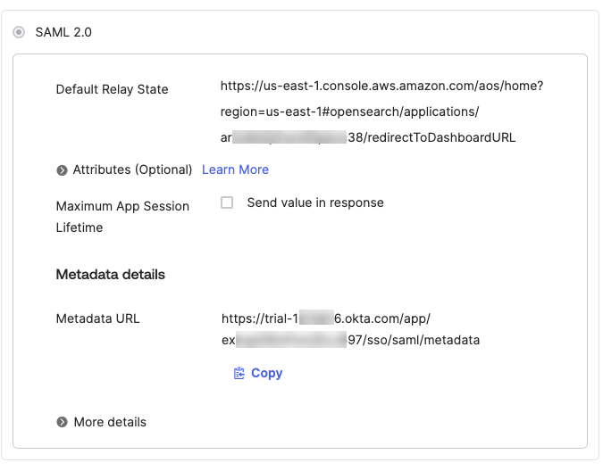
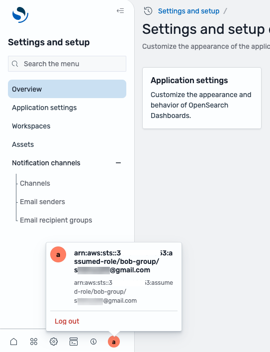

# Enabling SAML federation

with AWS Identity and Access Management

OpenSearch UI supports Security Assertion Markup Language 2.0 (SAML), an open
standard that many identity providers use. This enables identity federation with
AWS Identity and Access Management (IAM). With this support, users in your account or organization can directly
access OpenSearch UI by assuming IAM roles. You can create an identity
provider-initiated (IdP) single sign-on experience for your end users, where they can
authenticate in the external identity provider and be routed directly to your defined
page in OpenSearch UI. You can also implement fine-grained access control by
configuring your end-users or groups to assume different IAM roles with different
permissions for accessing OpenSearch UI and the associated data sources.

This topic presents step-by-step instructions for configuring SAML use with
OpenSearch UI. In these procedures, we use the steps for configuring the Okta identity
and access management application as an example. The configuration steps for other
identity providers, such as Azure Active Directory and Ping, are similar.

###### Topics

- [Step 1: Set up identity provider
  application (Okta)](#SAML-identity-federation-step-1 "#SAML-identity-federation-step-1")
- [Step 2: Set up AWS configuration
  for Okta](#SAML-identity-federation-step-2 "#SAML-identity-federation-step-2")
- [Step 3: Create the Amazon OpenSearch Service access
  policy in IAM](#SAML-identity-federation-step-3 "#SAML-identity-federation-step-3")
- [Step 4: Verify the identity
  provider-initiated Single Sign-On experience with SAML](#SAML-identity-federation-step-4 "#SAML-identity-federation-step-4")
- [Step 5: Configure SAML
  attribute-based fine-grained access control](#SAML-identity-federation-step-5 "#SAML-identity-federation-step-5")

## Step 1: Set up identity provider

application (Okta)

To use SAML with OpenSearch UI, the first step is to set up your identity
provider.

###### Task 1: Create Okta users

1. Sign in to your Okta organization at [https://login.okta.com/](https://login.okta.com/ "https://login.okta.com/") as a user with administrative
   privileges.
2. On the admin console, under **Directory** in the
   navigation pane, choose **People**.
3. Choose **Add person**.
4. For **First Name**, enter the user’s first name.
5. For **Last Name**, enter the user’s last name.
6. For **Username**, enter the user’s user name in email
   format.
7. Choose **I will set password** and enter a password
8. (Optional) Clear the **User must change password on first
   login** box if you don’t want the user to change the password
   at first sign in.
9. Choose **Save**.

###### Task 2: Create and assign groups

1. Sign in to your Okta organization at [https://login.okta.com/](https://login.okta.com/ "https://login.okta.com/") as a user with administrative
   privileges.
2. On the admin console, under **Directory** in the
   navigation pane, choose **Groups**.
3. Choose **Add group**.
4. Enter a group name and choose **Save**.
5. Choose the newly created group, and then choose **Assign
   people**.
6. Choose the plus sign (**+**), and then choose
   **Done**.
7. (Optional) Repeat Steps 1–6 to add more groups.

###### Task 3: Create Okta applications

1. Sign in to your Okta organization at [https://login.okta.com/](https://login.okta.com/ "https://login.okta.com/") as a user with administrative
   privileges.
2. On the admin console, under **Applications** in the
   navigation pane, choose **Applications**.
3. Choose **Create App Integration**.
4. Choose SAML 2.0 as the sign-in method, and then choose
   **Next**.
5. Enter a name for your app integration (for example,
   `OpenSearch_UI`), and then choose
   **Next**.
6. Enter following values in the app; you don't need to change other
   values:
   1. 1. For **Single Sign On URL**, enter
         `https://signin.aws.amazon.com/saml` for
         the commercial AWS Regions, or the URL specific to your Region.
   2. 2. For **Audience URI (SP Entity ID)**, enter
         `urn:amazon:webservices`.
   3. 3. For **Name ID format**, enter
         `EmailAddress`.

7. Choose **Next**.
8. Choose **I’m an Okta customer adding an internal app**,
   and then choose **This is an internal app that we have
   created**.
9. Choose **Finish**.
10. Choose **Assignments**, and then choose
    **Assign**.
11. Choose **Assign to groups**, and then select
    **Assign** next to the groups that you want to
    add.
12. Choose **Done**.

###### Task 4: Set up Okta advanced configuration

After you create the custom SAML application, complete the following
steps:

1. Sign in to your Okta organization at [https://login.okta.com/](https://login.okta.com/ "https://login.okta.com/") as a user with administrative
   privileges.

On the administrator console, in the **General** area,
choose **Edit** under **SAML settings**. 2. Choose **Next**. 3. Set **Default Relay State** to the OpenSearch UI
endpoint, using the format:

`https://`region`.console.aws.amazon.com/aos/home?region=`region`#opensearch/applications/`application-id`/redirectToDashboardURL`.

The following is an example:

`https://us-east-2.console.aws.amazon.com/aos/home?region=us-east-2#opensearch/applications/abc123def4567EXAMPLE/redirectToDashboardURL` 4. Under **Attribute Statements (optional)**, add the
following properties:

    1. Provide the IAM role and identity provider in comma-separated
     format using the **Role** attribute. You’ll use
     this same IAM role and identity provider in a later step when
     setting up AWS configuration.
    2. Set **user.login** for
     **RoleSessionName**. This is used as an
     identifier for the temporary credentials that are issued when the
     role is assumed.For reference:

| Name                                                     | Name format | Format                                                                                                     | Example                                                                                   |
| -------------------------------------------------------- | ----------- | ---------------------------------------------------------------------------------------------------------- | ----------------------------------------------------------------------------------------- | ---------------------------------------------------------------------------------------------------------------------------------------------------------------------------------------------------------------------------------------------------------------------------------------------------------------------------------------------------------------------------------------------------------------------------------------------------------------------------------------------------------------------------------------------------------------------------------------------------------------------------------------------------------------------------------------------------------------------------------------------------------------------------------------------------------------------------------------------------------------------------------------------------------------------------------------------------------------------------------------------------------------------------------------------------------------------------------------------------------------------------------------------------------------------------------------------------------------------------------------------------------------------------------------------------------------------------------------------------------------------------------------------------------------------------------------------------------------------------------------------------------------------------------------------------------------------------------------------------------------------------------------------------------------------------------------------------------------------------------------------------------------------------------------------------------------------------------------------------------------------------------------------------------------------------------------------------------------------------------------------------------------------------------------------------------------------------------------------------------------------------------------------------------------------------------------------------------------------------------------------------------------------------------------------------------------------------------------------------------------------------------------------------------------------------------------------------------------------------------------------------------------------------------------------------------------------------------------------------------------------------------------------------------------------------------------------------------------------------------------------------------------------------------------------------------------------------------------------------------------------------------------------------------------------------------------------------------------------------------------------------------------------------------------------------------------------------------------------------------------------------------------------------------------------------------------------------------------------------------------------------------------------------------------------------------------------------------------------------------------------------------------------------------------------------------------------------------------------------------------------------------------------------------------------------------------------------------------------------------------------------------------------------------------------------------------------------------------------------------------------------------------------------------------------------------------------------------------------------------------------------------------------------------------------------------------------------------------------------------------------------------------------------------------------------------------------------------------------------------------------------------------------------------------------------------------------------------------------------------------------------------------------------------------------------------------------------------------------------------------------------------------------------------------------------------------------------------------------------------------------------------------------------------------------------------------------------------------------------------------------------------------------------------------------------------------------------------------------------------------------------------------------------------------------------------------------------------------------------------------------------------------------------------------------------------------------------------------------------------------------------------------------------------------------------------------------------------------------------------------------------------------------------------------------------------------------------------------------------------------------------------------------------------------------------------------------------------------------------------------------------------------------------------------------------------------------------------------------------------------------------------------------------------------------------------------------------------------------------------------------------------------------------------------------------------------------------------------------------------------------------------------------------------------------------------------------------------------------------------------------------------------------------------------------------------------------------------------------------------------------------------------------------------------------------------------------------------------------------------------------------------------------------------------------------------------------------------------------------------------------------------------------------------------------------------------------------------------------------------------------------------------------------------------------------------------------------------------------------------------------------------------------------------------------------------------------------------------------------------------------------------------------------------------------------------------------------------------------------------------------------------------------------------------------------------------------------------------------------------------------------------------------------------------------------------------------------------------------------------------------------------------------------------------------------------------------------------------------------------------------------------------------------------------------------------------------------------------------------------------------------------------------------------------------------------------------------------------------------------------------------------------------------------------------------------------------------------------------------------------------------------------------------------------------------------------------------------------------------------------------------------------------------------------------------------------------------------------------------------------------------------------------------------------------------------------------------------------------------------------------------------------------------------------------------------------------------------------------------------------------------------------------------------------------------------------------------------------------------------------------------------------------------------------------------------------------------------------------------------------------------------------------------------------------------------------------------------------------------------------------------------------------------------------------------------------------------------------------------------------------------------------------------------------------------------------------------------------------------------------------------------------------------------------------------------------------------------------------------------------------------------------------------------------------------------------------------------------------------------------------------------------------------------------------------------------------------------------------------------------------------------------------------------------------------------------------------------------------------------------------------------------------------------------------------------------------------------------------------------------------------------------------------------------------------------------------------------------------------------------------------------------------------------------------------------------------------------------------------------------------------------------------------------------------------------------------------------------------------------------------------------------------------------------------------------------------------------------------------------------------------------------------------------------------------------------------------------------------------------------------------------------------------------------------------------------------------------------------------------------------------------------------------------------------------------------------------------------------------------------------------------------------------------------------------------------------------------------------------------------------------------------------------------------------------------------------------------------------------------------------------------------------------------------------------------------------------------------------------------------------------------------------------------------------------------------------------------------------------------------------------------------------------------------------------------------------------------------------------------------------------------------------------------------------------------------------------------------------------------------------------------------------------------------------------------------------------------------------------------------------------------------------------------------------------------------------------------------------------------------------------------------------------------------------------------------------------------------------------------------------------------------------------------------------------------------------------------------------------------------------------------------------------------------------------------------------------------------------------------------------------------------------------------------------------------------------------------------------------------------------------------------------------------------------------------------------------------------------------------------------------------------------------------------------------------------------------------------------------------------------------------------------------------------------------------------------------------------------------------------------------------------------------------------------------------------------------------------------------------------------------------------------------------------------------------------------------------------------------------------------------------------------------------------------------------------------------------------------------------------------------------------------------------------------------------------------------------------------------------------------------------------------------------------------------------------------------------------------------------------------------------------------------------------------------------------------------------------------------------------------------------------------------------------------------------------------------------------------------------------------------------------------------------------------------------------------------------------------------------------------------------------------------------------------------------------------------------------------------------------------------------------------------------------------------------------------------------------------------------------------------------------------------------------------------------------------------------------------------------------------------------------------------------------------------------------------------------------------------------------------------------------------------------------------------------------------------------------------------------------------------------------------------------------------------------------------------------------------------------------------------------------------------------------------------------------------- |
| `https://aws.amazon.com/SAML/Attributes/Role`            | Unspecified | `arn:aws:iam::`aws-account-id`:role/role-name,arn:aws:iam::`aws-account-id`:saml-provider/`provider-name`` | `arn:aws:iam::111222333444:role/oktarole,arn:aws:iam::111222333444:saml-provider/oktaidp` |
| `https://aws.amazon.com/SAML/Attributes/RoleSessionName` | Unspecified | `user.login`                                                                                               | `user.login`                                                                              | 5. After you add the attribute properties, choose **Next**, and then choose **Finish**. Your attributes should be similar in format to those shown in the following image. The **Default Relay State** value is the URL to define the landing page for end-users in your account or organization after they complete the single sign-on validation from Okta. You can set it to any page in OpenSearch UI, and then provide that URL to its intended end-users.  ## Step 2: Set up AWS configuration for Okta Complete the following tasks to set up your AWS configuration for Okta. ###### Task 1: Gather Okta Information For this step, you will need to gather your Okta information so that you can later configure it in AWS. 1. Sign in to your Okta organization at [https://login.okta.com/](https://login.okta.com/ "https://login.okta.com/") as a user with administrative privileges. 2. On the **Sign On** tab, in the lower right corner of the page, choose **View SAML setup instructions**. 3. Take note of the value for **Identity Provider Single Sign-on URL**. You can use this URL when connecting to any third-party SQL client such as [SQL Workbench/J](https://www.sql-workbench.eu/ "https://www.sql-workbench.eu/"). 4. Use the identity provider metadata in block 4, and then save the metadata file in .xml format (for example, `metadata.xml`). ###### Task 2: Create the IAM provider To create your IAM provider, complete the following steps: 1. Sign in to the AWS Management Console and open the IAM console at [https://console.aws.amazon.com/iam/](https://console.aws.amazon.com/iam/ "https://console.aws.amazon.com/iam/"). 2. In the navigation pane, under **Access management** , choose **Identity providers**. 3. Choose **Add provider**. 4. For **Provider type**¸ select **SAML**. 5. For **Provider name**¸ enter a name. 6. For **Metadata document**, choose **Choose file** and upload the metadata file (.xml) you downloaded earlier. 7. Choose **Add provider**. ###### Task 3: Create IAM role To create your AWS Identity and Access Management role, complete the following steps: 1. Sign in to the AWS Management Console and open the IAM console at [https://console.aws.amazon.com/iam/](https://console.aws.amazon.com/iam/ "https://console.aws.amazon.com/iam/"). 2. In the navigation pane, under **Access management** , choose **Roles**. 3. Choose **Create role**. 4. For **Trusted entity type**, select **SAML 2.0 federation**. 5. For **SAML 2.0-based provider**, choose the identity provider you created earlier. 6. Select **Allow programmatic and AWS Management Console access**. 7. Choose **Next**. 8. In the **Permissions policies** list, select the check boxes for the policy you created earlier and for **OpenSearchFullAccess**. 9. Choose **Next**. 10. In the **Review** area, for **Role name**, enter the name of your role; for example, `oktarole`. 11. (Optional) For **Description**, enter a brief description of the purpose of the role. 12. Choose **Create role**. 13. Navigate to the role that you just created, choose the **Trust Relationships** tab, and then choose **Edit trust policy**. 14. In the **Edit statement** pane, under **Add actions for STS**, select the box for **TagSession**. 15. Choose **Update policy**. ## Step 3: Create the Amazon OpenSearch Service access policy in IAM Learn how to configure your IAM roles for OpenSearch access control. With IAM roles, you can implement fine-grained access control for your Okta user groups to access OpenSearch resources. This topic demonstrates the IAM role-based configuration using two example groups. Sample group: Alice Request: `GET _plugins/_security/api/roles/alice-group` Result: `{ "alice-group": { "reserved": false, "hidden": false, "cluster_permissions": [ "unlimited" ], "index_permissions": [ { "index_patterns": [ "alice*" ], "dls": "", "fls": [], "masked_fields": [], "allowed_actions": [ "indices_all" ] } ], "tenant_permissions": [ { "tenant_patterns": [ "global_tenant" ], "allowed_actions": [ "kibana_all_write" ] } ], "static": false } }` Sample group: Bob Request: `GET _plugins/_security/api/roles/bob-group` Result: `{ "bob-group": { "reserved": false, "hidden": false, "cluster_permissions": [ "unlimited" ], "index_permissions": [ { "index_patterns": [ "bob*" ], "dls": "", "fls": [], "masked_fields": [], "allowed_actions": [ "indices_all" ] } ], "tenant_permissions": [ { "tenant_patterns": [ "global_tenant" ], "allowed_actions": [ "kibana_all_write" ] } ], "static": false } }` You can map the Amazon OpenSearch Service domain roles to IAM roles using backend roles mapping, as demonstrated in the following example: `{ "bob-group": { "hosts": [], "users": [], "reserved": false, "hidden": false, "backend_roles": [ "arn:aws:iam::111222333444:role/bob-group" ], "and_backend_roles": [] }, "alice-group": { "hosts": [], "users": [], "reserved": false, "hidden": false, "backend_roles": [ "arn:aws:iam::111222333444:role/alice-group" ], "and_backend_roles": [] } }` ## Step 4: Verify the identity provider-initiated Single Sign-On experience with SAML Open the URL for **Default Relay State** to open the Okta authentication page. Enter the credentials of an end-user. You are automatically redirected to OpenSearch UI. You can check for your current credentials by choosing the user icon on the bottom of the navigation panel, as illustrated in the following image:  You can also verify the fine-grained access control permissions for the user by accessing the Developer Tools on the bottom of the navigation panel and running queries in the console. The following are sample queries. Example 1: Displays information about the current user Request: `GET _plugins/_security/api/account` Result: `{ "user_name": "arn:aws:iam::XXXXXXXXXXXX:role/bob-group", "is_reserved": false, "is_hidden": false, "is_internal_user": false, "user_requested_tenant": null, "backend_roles": [ "arn:aws:iam::XXXXXXXXXXXX:role/bob-group" ], "custom_attribute_names": [], "tenants": { "global_tenant": true, "arn:aws:iam::XXXXXXXXXXXX:role/bob-group": true }, "roles": [ "bob-group" ] }` Example 2: Displays actions permitted for a user Request: `GET bob-test/_search` Result: `{ "took": 390, "timed_out": false, "_shards": { "total": 5, "successful": 5, "skipped": 0, "failed": 0 }, "hits": { "total": { "value": 1, "relation": "eq" }, "max_score": 1, "hits": [ { "_index": "bob-test", "_id": "ui01N5UBCIHpjO8Jlvfy", "_score": 1, "_source": { "title": "Your Name", "year": "2016" } } ] } }` Example 3: Displays actions not permitted for a user Request: `GET alice-test` Result: `{ "error": { "root_cause": [ { "type": "security_exception", "reason": "no permissions for [indices:admin/get] and User [name=arn:aws:iam::111222333444:role/bob-group, backend_roles=[arn:aws:iam::111222333444:role/bob-group], requestedTenant=null]" } ], "type": "security_exception", "reason": "no permissions for [indices:admin/get] and User [name=arn:aws:iam::111222333444:role/bob-group, backend_roles=[arn:aws:iam::111222333444:role/bob-group], requestedTenant=null]" }, "status": 403 }` ## Step 5: Configure SAML attribute-based fine-grained access control With Amazon OpenSearch Service, you can use fine-grained access control with SAML to map users and groups from your identity provider to OpenSearch fine-grained access control users and roles dynamically. You can scope these roles to specific OpenSearch domains and serverless collections, and define index-level permissions and document-level security. ###### Note For more information about fine-grained access control, see [Fine-grained access control in Amazon OpenSearch Service](fgac.md "fgac.md"). ###### Topics  • [SAML attributes for fine-grained access control](#saml-fgac-key-attributes "#saml-fgac-key-attributes")  • [Task 1: Configure Okta for fine-grained access control](#configure-okta-fgac "#configure-okta-fgac")  • [Task 2: Configure SAML in OpenSearch domain](#configure-opensearch-domain-fgac "#configure-opensearch-domain-fgac")  • [Task 3: Configure SAML in OpenSearch Serverless collections](#saml-configure-collections "#saml-configure-collections") ### SAML attributes for fine-grained access control **subjectKey** Maps to a unique user attribute, such as email or username, that identifies the user for authentication. **rolesKey** Maps to group or role attributes in your IdP that determine the roles or permissions for authorization. ### Task 1: Configure Okta for fine-grained access control ###### To configure Okta for fine-grained access control 1. Add a new attribute for the OpenSearch user principal in the **Attribute Statements** section:  • Name: `UserName`  • Value: `${user-email}` This attribute is used as the **Subject key** in the OpenSearch fine-grained access control configuration for authentication. 2. Add a group attribute for roles in the **Group Attribute Statement** section:  • Name: `groups`  • Filter: `OpenSearch_xxx` This attribute is used as the **Role key**for mapping groups to OpenSearch fine-grained access control roles for authorization. ### Task 2: Configure SAML in OpenSearch domain ###### To configure SAML in OpenSearch domain 1. In the AWS Management Console, identify the OpenSearch Service domain for which you want to enable fine-graned access control for the OpenSearch UI users. 2. Navigate to the details page of the specific domain. 3. Select the **Security configuration** tab and click **Edit**. 4. Expand **SAML via IAM Federate**. 5. Enter the `subjectKey` and `roleKey` that you defined in Okta. 6. Select**Save changes**. You can also configure fine-grained access control using the AWS CLI. `aws opensearch create-domain \ --domain-name testDomain \ --engine-version OpenSearch_1.3 \ --cluster-config InstanceType=r5.xlarge.search,InstanceCount=1,DedicatedMasterEnabled=false,ZoneAwarenessEnabled=false,WarmEnabled=false \ --access-policies '{"Version": "2012-10-17",		 	 	 "Statement":[{"Effect":"Allow","Principal":{"AWS":"*"},"Action":"es:*","Resource":"arn:aws:es:us-east-1:12345678901:domain/neosaml10/*"}]}' \ --domain-endpoint-options '{"EnforceHTTPS":true,"TLSSecurityPolicy":"Policy-Min-TLS-1-2-2019-07"}' \ --node-to-node-encryption-options '{"Enabled":true}' \ --encryption-at-rest-options '{"Enabled":true}' \ --advanced-security-options '{"Enabled":true,"InternalUserDatabaseEnabled":true,"MasterUserOptions":{"MasterUserName":"********","MasterUserPassword":"********"}, "IAMFederationOptions":{"Enabled": true,"SubjectKey":"TestSubjectKey","RolesKey":"TestRolesKey"}}' \ --ebs-options "EBSEnabled=true,VolumeType=gp2,VolumeSize=300" \ --no-verify-ssl \ --endpoint-url https://es.us-east-1.amazonaws.com \ --region us-east-1` To update an existing domain: `aws opensearch update-domain-config \ --domain-name testDomain \ --advanced-security-options '{"Enabled":true,"InternalUserDatabaseEnabled":true,"MasterUserOptions":{"MasterUserName":"********","MasterUserPassword":"********"}, "IAMFederationOptions":{"Enabled": true,"SubjectKey":"TestSubjectKey","RolesKey":"TestRolesKey"}}' \ --ebs-options "EBSEnabled=true,VolumeType=gp2,VolumeSize=300" \ --no-verify-ssl \ --endpoint-url https://es.us-east-1.amazonaws.com \ --region us-east-1` ### Task 3: Configure SAML in OpenSearch Serverless collections ###### To configure SAML-based fine-grained access control in OpenSearch Serverless 1. Open the AWS Management Console and navigate to Amazon OpenSearch Service. 2. In the navigation pane, under **Serverless**, choose **Security**, and then choose **Authentication**. 3. In the **IAM Federation** section, select **Edit**. You can control the SAML attribute-based fine-grained access control using this configuration. IAM Federation is disabled by default. 4. Select **Enable IAM Federation**. 5. Enter the `subjectKey` and `roleKey` values that you defined in Okta. For more information, see [SAML attributes for fine-grained access control](#saml-fgac-key-attributes "#saml-fgac-key-attributes") . 6. Select **Save**. 7. In the navigation pane under **Serverless**, choose **Data access policy**. 8. Either update an existing policy or create a new one. 9. Expand a rule, choose **Add principals**, and then select **IAM Federation users and groups**. 10. Add the required principals and choose **Save**. 11. Choose **Grant**. 12. Under this rule, do the following:  • Select the permissions you want to define for the selected principals.  • Specify the collections where you want to apply the permissions.  • Optionally, define index-level permissions. ###### Note You can create multiple rules to assign different permissions to different groups of principals. 13. When finished, choose **Save**. 14. Choose **Create**. Alternatively, you can use CLI to create the security configurations for collections, as given below: ``aws opensearchserverless create-security-config --region "`region`"  --type iamfederation --name "`configuration_name`" --description "`description`" --iam-federation-options '{"groupAttribute":"GroupKey","userAttribute":"UserKey"}'`` |
