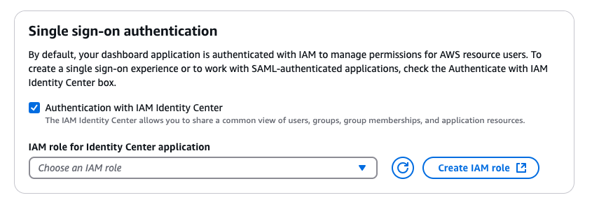
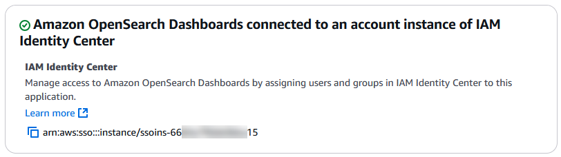
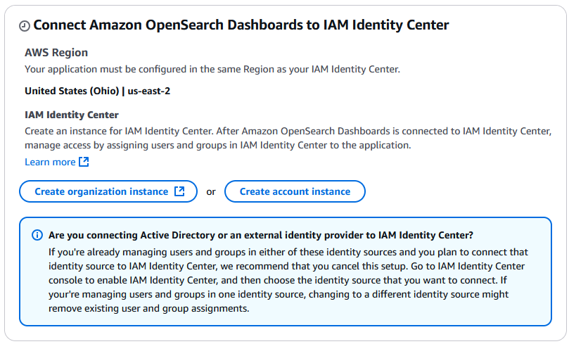
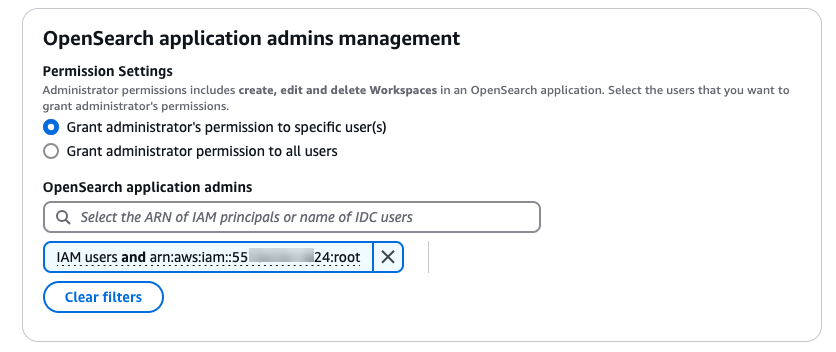

# Getting started with the OpenSearch user

interface in Amazon OpenSearch Service

In Amazon OpenSearch Service, an _application_ is an instance of the OpenSearch
user interface (OpenSearch UI). Each application can be associated with multiple data
sources, and a single source can be associated with multiple applications. You can
create multiple applications for different administrators using different supported
authentication options.

Use the information in this topic to guide you through the process of creating an
OpenSearch UI application using the AWS Management Console or the AWS CLI.

###### Topics

- [Required permissions for
  creating Amazon OpenSearch Service applications](#application-prerequisite-permissions "#application-prerequisite-permissions")
- [Creating an OpenSearch UI application](#create-application "#create-application")
- [Managing application
  administrators](#managing-application-administrators "#managing-application-administrators")

## Required permissions for

creating Amazon OpenSearch Service applications

Before you create an application, verify that you have been granted the necessary
permissions for the task. Contact an account administrator for assistance if
required.

### General permissions

To work with applications in OpenSearch Service, you need the permissions shown in the
following policy. The permissions serve the following purposes:

- The five `es:*Application` permissions are required to
  create and manage an application.
- The three `es:*Tags` permissions are required to add, list
  and remove tags from the application.
- The `aoss:BatchGetCollection`,
  `es:DescribeDomain` and
  `es:GetDirectQueryDataSource` permissions are required to
  associate data sources.
- The `aoss:APIAccessAll`, `es:ESHttp*`, and 4
  `opensearch:*DirectQuery*` permissions are required to
  access data sources.
- The `iam:CreateServiceLinkedRole` provides permission to
  Amazon OpenSearch Service for creating a service-linked role (SLR) in your account. This
  role is used and makes it possible for the OpenSearch UI application
  to publish Amazon CloudWatch metrics in your account. For more information, see
  [Permissions](slr-aos.md#slr-permissions "slr-aos.md#slr-permissions") in the topic [Using service-linked roles to create VPC domains and direct
  query data sources](slr-aos.md "slr-aos.md").

JSON

```
`{
 "Version":"2012-10-17",
 "Statement": [
 {
 "Sid": "VisualEditor0",
 "Effect": "Allow",
 "Action": [
 "es:CreateApplication",
 "es:DeleteApplication",
 "es:GetApplication",
 "es:ListApplications",
 "es:UpdateApplication",
 "es:AddTags",
 "es:ListTags",
 "es:RemoveTags",
 "aoss:APIAccessAll",
 "es:ESHttp*",
 "opensearch:StartDirectQuery",
 "opensearch:GetDirectQuery",
 "opensearch:CancelDirectQuery",
 "opensearch:GetDirectQueryResult",
 "aoss:BatchGetCollection",
 "aoss:ListCollections",
 "es:DescribeDomain",
 "es:DescribeDomains",
 "es:ListDomainNames",
 "es:GetDirectQueryDataSource",
 "es:ListDirectQueryDataSources"
 ],
 "Resource": "*"
 },
 {
 "Sid": "VisualEditor1",
 "Effect": "Allow",
 "Action": "iam:CreateServiceLinkedRole",
 "Resource": "arn:aws:iam::*:role/aws-service-role/opensearchservice.amazonaws.com/AWSServiceRoleForAmazonOpenSearchService"
 }
 ]
}`

```

### Permissions to create an

application that uses IAM Identity Center authentication (optional)

By default, dashboard applications are authenticated using AWS Identity and Access Management (IAM)
to manage permissions for AWS resource users. However, you can choose to
provide a single sign-on experience by using IAM Identity Center, which lets you use your
existing identity providers for logging into OpenSearch UI applications.
In this case, you'll
select the **Authentication with IAM Identity Center** option in the
procedure later in this topic, and then grant IAM Identity Center users the permissions
required to access the OpenSearch UI application.)

To create an application that uses IAM Identity Center authentication, you'll need the
following permissions. Replace the `placeholder values`
with your own information. Contact an account administrator for assistance if
required.

JSON

```
`{
 "Version":"2012-10-17",
 "Statement": [
 {
 "Sid": "IDCPermissions",
 "Effect": "Allow",
 "Action": [
 "es:CreateApplication",
 "es:DeleteApplication",
 "es:GetApplication",
 "es:ListApplications",
 "es:UpdateApplication",
 "es:AddTags",
 "es:ListTags",
 "es:RemoveTags",
 "aoss:BatchGetCollection",
 "aoss:ListCollections",
 "es:DescribeDomain",
 "es:DescribeDomains",
 "es:ListDomainNames",
 "es:GetDirectQueryDataSource",
 "es:ListDirectQueryDataSources",
 "sso:CreateApplication",
 "sso:DeleteApplication",
 "sso:PutApplicationGrant",
 "sso:PutApplicationAccessScope",
 "sso:PutApplicationAuthenticationMethod",
 "sso:ListInstances",
 "sso:DescribeApplicationAssignment",
 "sso:DescribeApplication",
 "sso:CreateApplicationAssignment",
 "sso:ListApplicationAssignments",
 "sso:DeleteApplicationAssignment",
 "sso-directory:SearchGroups",
 "sso-directory:SearchUsers",
 "sso:ListDirectoryAssociations",
 "identitystore:DescribeUser",
 "identitystore:DescribeGroup",
 "iam:ListRoles"
 ],
 "Resource": "*"
 },
 {
 "Sid": "SLRPermission",
 "Effect": "Allow",
 "Action": "iam:CreateServiceLinkedRole",
 "Resource": "arn:aws:iam::*:role/aws-service-role/opensearchservice.amazonaws.com/AWSServiceRoleForAmazonOpenSearchService"
 },
 {
 "Sid": "PassRolePermission",
 "Effect": "Allow",
 "Action": "iam:PassRole",
 "Resource": "arn:aws:iam::`111122223333`:role/`iam-role-for-identity-center`"
 }
 ]
}`

```

## Creating an OpenSearch UI application

Create an application that specifies and application name, authentication method,
and administrators using one of the following procedures.

###### Topics

- [Creating an
  OpenSearch UI application that uses IAM authentication in the
  console](#create-application-iam-authentication-console "#create-application-iam-authentication-console")
- [Creating an OpenSearch UI application that uses AWS IAM Identity Center authentication
  in the console](#create-application-iam-identity-center-authentication-console "#create-application-iam-identity-center-authentication-console")
- [Creating an OpenSearch UI application that uses AWS IAM Identity Center authentication
  using the AWS CLI](#create-application-iam-identity-center-authentication-cli "#create-application-iam-identity-center-authentication-cli")

### Creating an

OpenSearch UI application that uses IAM authentication in the
console

###### To create an OpenSearch UI application that uses IAM authentication

in the console

1. Sign in to the Amazon OpenSearch Service console at [https://console.aws.amazon.com/aos/home](https://console.aws.amazon.com/aos/home "https://console.aws.amazon.com/aos/home").
2. In the left navigation pane, choose **OpenSearch UI
   (Dashboards)**.
3. Choose **Create application**.
4. For **Application name**, enter a name for the
   application.
5. Do not select the **Authentication with IAM Identity Center** check
   box. For information about creating an application with authentication
   through AWS IAM Identity Center, see [Creating an OpenSearch UI application that uses AWS IAM Identity Center authentication
   in the console](#create-application-iam-identity-center-authentication-console "#create-application-iam-identity-center-authentication-console") later in this topic.
6. (Optional) You are automatically added as an administrator of the
   application you are creating. In the **OpenSearch application
   admins management** area, you can grant administrator
   permissions to other users.

###### Note

The OpenSearch UI application administrator role grants
permissions to edit and delete an OpenSearch UI application.
Application administrators can also create, edit and delete
workspaces in an OpenSearch UI application.

To grant administrator permissions to other users, choose one of the
following:

    * **Grant administrator's permission to specific
     user(s)** – In the **OpenSearch
     application admins** field, in the
     **Properties** pop-up list, select
     **IAM users** or


    **AWS IAM Identity Center users**, and then choose the
     individual users to grant administrator permissions to.
    * **Grant administrator permission to all
     users** – All users in your organization or
     account are granted administrator permissions.

7. (Optional) Configure encryption settings. By default, OpenSearch UI metadata is encrypted with AWS owned keys. To use your own customer managed key (CMK) for encryption, see [Encrypting OpenSearch UI application metadata with customer managed keys](application-encryption-cmk.md "application-encryption-cmk.md").
8. (Optional) In the **Tags** area, apply one or more
   tag key name/value pairs to the application.

Tags are optional metadata that you assign to a resource. Tags allow
you to categorize a resource in different ways, such as by purpose,
owner, or environment. 9. Choose **Create**.

### Creating an OpenSearch UI application that uses AWS IAM Identity Center authentication

in the console

In order create an OpenSearch UI application that uses AWS IAM Identity Center
authentication, you must have the IAM permissions described earlier in this
topic in [Permissions to create an
application that uses IAM Identity Center authentication (optional)](#prerequisite-permissions-idc "#prerequisite-permissions-idc").

###### To create an OpenSearch UI application that uses AWS IAM Identity Center

authentication in the console

1.  Sign in to the Amazon OpenSearch Service console at [https://console.aws.amazon.com/aos/home](https://console.aws.amazon.com/aos/home "https://console.aws.amazon.com/aos/home").
2.  In the left navigation pane, choose **OpenSearch UI
    (Dashboards)**.
3.  Choose **Create application**.
4.  For **Application name**, enter a name for the
    application.
5.  (Optional) To enable single sign-on for your organization or account,
    do the following:
    1. Select the **Authentication with IAM Identity Center**
       check box, as shown in the following image:

     2. Do one of the following:

        * In the **IAM role for Identity Center
         application** list, choose an existing
         IAM role that provides the required permissions for
         IAM Identity Center to access OpenSearch UI and the associated data
         sources. See the policies in the next bullet for the
         permissions the role must have.
        * Create a new role with the required permissions. Use
         the following procedures in the *IAM User Guide* with the specified
         options to create a new role and with the necessary
         permission policy and trust policy.


        	+ Procedure: [Create
        	 IAM policies (console)](access_policies_create-console.md "access_policies_create-console.md")


        	As you follow the steps in this procedure,
        	 paste the following policy into the policy editor
        	 **JSON** field:


        	JSON


        	```
        	`{
        	 "Version":"2012-10-17",
        	 "Statement": [
        	 {
        	 "Sid": "IdentityStoreOpenSearchDomainConnectivity",
        	 "Effect": "Allow",
        	 "Action": [
        	 "identitystore:DescribeUser",
        	 "identitystore:ListGroupMembershipsForMember",
        	 "identitystore:DescribeGroup"
        	 ],
        	 "Resource": "*",
        	 "Condition": {
        	 "ForAnyValue:StringEquals": {
        	 "aws:CalledViaLast": "es.amazonaws.com"
        	 }
        	 }
        	 },
        	 {
        	 "Sid": "OpenSearchDomain",
        	 "Effect": "Allow",
        	 "Action": [
        	 "es:ESHttp*"
        	 ],
        	 "Resource": "*"
        	 },
        	 {
        	 "Sid": "OpenSearchServerless",
        	 "Effect": "Allow",
        	 "Action": [
        	 "aoss:APIAccessAll"
        	 ],
        	 "Resource": "*"
        	 }
        	 ]
        	}`

        	```
        	+ Procedure: [Create a role using custom trust
        	 policies](../../../IAM/latest/UserGuide/id_roles_create_for-custom.md "../../../IAM/latest/UserGuide/id_roles_create_for-custom.md")


        	As you follow the steps in this procedure,
        	 replace the placeholder JSON in the
        	 **Custom trust policy** box with
        	 the following:


        	###### Tip

        	If you are adding the trust policy to an
        	 existing role, add the policy on the role's
        	 **Trust relationship**
        	 tab.


        	JSON


        	```
        	`{
        	 "Version":"2012-10-17",
        	 "Statement": [
        	 {
        	 "Effect": "Allow",
        	 "Principal": {
        	 "Service": "application.opensearchservice.amazonaws.com"
        	 },
        	 "Action": "sts:AssumeRole"
        	 },
        	 {
        	 "Effect": "Allow",
        	 "Principal": {
        	 "Service": "application.opensearchservice.amazonaws.com"
        	 },
        	 "Action": "sts:SetContext",
        	 "Condition": {
        	 "ForAllValues:ArnEquals": {
        	 "sts:RequestContextProviders": "arn:aws:iam::`123456789012`:oidc-provider/portal.sso.`us-east-1`.amazonaws.com/apl/`application-id`"
        	 }
        	 }
        	 }
        	 ]
        	}`

        	```

    3. If an IAM Identity Center instance has been created in your organization or
       account already, the console reports that Amazon
       OpenSearch Dashboards is already connected to an organization
       instance of IAM Identity Center, as shown in the following image.

    

    If IAM Identity Center is not yet available in your organization or account,
    you or an administrator with the necessary permissions can
    create an organization instance or account instance. The
    **Connect Amazon OpenSearch Dashboards to IAM
    Identity Center** area provides options for both,
    as shown in the following image:

    

    In this case, you can create an account instance in IAM Identity Center for
    testing, or request that an administrator create an
    organizational instance in IAM Identity Center. For more information, see the
    following topics in the _AWS IAM Identity Center User
    Guide_:

    ###### Note

    Currently, OpenSearch UI applications can be created
    only in the same AWS Region as your IAM Identity Center organizational
    instance. For information about accessing data sources in
    that Region after you create the application, see [Cross-Region and cross-account data
    access with cross-cluster search](application-cross-cluster-search.md "application-cross-cluster-search.md").

        * [Organization instances of IAM Identity Center](../../../singlesignon/latest/userguide/organization-instances-identity-center.md "../../../singlesignon/latest/userguide/organization-instances-identity-center.md")
        * [Account instances of IAM Identity Center](../../../singlesignon/latest/userguide/account-instances-identity-center.md "../../../singlesignon/latest/userguide/account-instances-identity-center.md")
        * [Enable AWS IAM Identity Center](../../../singlesignon/latest/userguide/enable-identity-center.md "../../../singlesignon/latest/userguide/enable-identity-center.md")

6.  (Optional) You are automatically added as an administrator of the
    application you are creating. In the **OpenSearch application
    admins management** area, you can grant administrator
    permissions to other users, as shown in the following image:



###### Note

The OpenSearch UI application administrator role grants
permissions to edit and delete an OpenSearch UI application.
Application administrators can also create, edit and delete
workspaces in an OpenSearch UI application.

To grant administrator permissions to other users, choose one of the
following:

    * **Grant administrator's permission to specific
     user(s)** – In the **OpenSearch
     application admins** field, in the
     **Properties** pop-up list, select
     **IAM users** or


    **AWS IAM Identity Center users**, and then choose the
     individual users to grant administrator permissions to.
    * **Grant administrator permission to all
     users** – All users in your organization or
     account are granted administrator permissions.

7. (Optional) In the **Tags** area, apply one or more
   tag key name/value pairs to the application.

Tags are optional metadata that you assign to a resource. Tags allow
you to categorize a resource in different ways, such as by purpose,
owner, or environment. 8. Choose **Create**.

### Creating an OpenSearch UI application that uses AWS IAM Identity Center authentication

using the AWS CLI

To create an OpenSearch UI application that uses AWS IAM Identity Center authentication
using the AWS CLI, use the [create-application](../../../cli/latest/reference/opensearch/create-application.md "../../../cli/latest/reference/opensearch/create-application.md") command with the following options:

- `--name` – The name of the application.
- `--iam-identity-center-options` – (Optional) The
  IAM Identity Center instance and the IAM role that OpenSearch will use for
  authentication and access control.

Replace the `placeholder values` with your own
information.

```
aws opensearch create-application \
    --name `application-name` \
    --iam-identity-center-options "
          {
          \"enabled\":true,
          \"iamIdentityCenterInstanceArn\":\"arn:aws:sso:::instance/`sso-instance`\",
          \"iamRoleForIdentityCenterApplicationArn\":\"arn:aws:iam::`account-id`:role/`role-name`\"
          }
    "
```

## Managing application

administrators

An OpenSearch UI application administrator is a defined role with permission to
edit and delete an OpenSearch UI application.

By default, as the creator of an OpenSearch UI application, you are the first
administrator of the OpenSearch UI application.

### Managing

OpenSearch UI administrators using the console

You can add additional administrators to an OpenSearch UI application in the
AWS Management Console, either during the application creation workflow or in the
**Edit** page after the application has been
created.

The OpenSearch UI application administrator role grants permissions to edit
and delete an OpenSearch UI application. Application administrators can also
create, edit and delete workspaces in an OpenSearch UI application.

On an application detail page, you can search for the Amazon Resource Name
(ARN) of an IAM principal or search for the name of IAM Identity Center user.

###### To manage OpenSearch UI administrators using the console

1. Sign in to the Amazon OpenSearch Service console at [https://console.aws.amazon.com/aos/home](https://console.aws.amazon.com/aos/home "https://console.aws.amazon.com/aos/home").
2. In the left navigation pane, choose **OpenSearch UI
   (Dashboards)**.
3. In the **OpenSearch applications** area, choose the
   name of an existing application.
4. Choose **Edit**
5. To grant administrator permissions to other users, choose one of the
   following:
   - **Grant administrator's permission to specific
     user(s)** – In the **OpenSearch
     application admins** field, in the
     **Properties** pop-up list, select
     **IAM users** or

   **AWS IAM Identity Center users**, and then choose the
   individual users to grant administrator permissions to.
   - **Grant administrator permission to all
     users** – All users in your organization or
     account are granted administrator permissions.

6. Choose **Update**.

You can remove additional administrators, but each OpenSearch UI application
must retain at least one administrator.

### Managing OpenSearch

UI administrators using the AWS CLI

You can create and update OpenSearch UI application administrators using the
AWS CLI.

#### Creating

OpenSearch UI administrators using the AWS CLI

The following are examples of adding IAM principals and IAM Identity Center users as
administrators when creating an OpenSearch UI application.

##### Example 1: Create an

OpenSearch UI application that adds an IAM user as an
administrator

Run the following command to create an OpenSearch UI application
that adds an IAM user as an administrator. Replace the
`placeholder values` with your own
information.

```
aws opensearch create-application \
    --name `application-name` \
    --app-configs "
        {
        \"key\":\"opensearchDashboards.dashboardAdmin.users\",
        \"value\":\"arn:aws:iam::`account-id`:user/`user-id`\"
        }
    "
```

##### Example 2:

Create an OpenSearch UI application that enables IAM Identity Center and adds an
IAM Identity Center user ID as an OpenSearch UI application
administrator

Run the following command to create an OpenSearch UI application
that enables IAM Identity Center and adds an IAM Identity Center user ID as an OpenSearch UI
application administrator. Replace the `placeholder
 values` with your own information.

`key` specifies the configuration item to set, such as the
administrator role for the OpenSearch UI application. Valid values
include `opensearchDashboards.dashboardAdmin.users` and
`opensearchDashboards.dashboardAdmin.groups`.

`xxxxxxxx-xxxx-xxxx-xxxx-xxxxxxxxxxxx`
represents the value assigned to the key, such as the Amazon Resource
Name (ARN) of an IAM user.

```
aws opensearch create-application \
    --name myapplication \
    --iam-identity-center-options "
        {
        \"enabled\":true,
        \"iamIdentityCenterInstanceArn\":\"arn:aws:sso:::instance/ssoins-`instance-id`\",
        \"iamRoleForIdentityCenterApplicationArn\":\"arn:aws:iam::`account-id`:role/`role-name`\"
        }
    " \
    --app-configs "
        {
        \"key\":\"opensearchDashboards.dashboardAdmin.users\",
        \"value\":\"`xxxxxxxx-xxxx-xxxx-xxxx-xxxxxxxxxxxx`\"
        }
    "
```

#### Updating

OpenSearch UI administrators using the AWS CLI

The following are examples of updating the IAM principals and IAM Identity Center
users assigned as administrators for an existing OpenSearch
application.

##### Example 1: Add an

IAM user as an administrator for an existing OpenSearch
application

Run the following command to update an OpenSearch UI application to
add an IAM user as an administrator. Replace the
`placeholder values` with your own
information.

```
aws opensearch update-application \
    --id myapplication \
    --app-configs "
        {
        \"key\":\"opensearchDashboards.dashboardAdmin.users\",
        \"value\":\"arn:aws:iam::`account-id`:user/`user-id`\"
        }
    "
```

##### Example

2: Update an OpenSearch UI application to add an IAM Identity Center user ID as
an OpenSearch UI application administrator

Run the following command to update an OpenSearch UI application to
add an IAM Identity Center user ID as an OpenSearch UI application administrator.
Replace the `placeholder values` with your own
information.

`key` specifies the configuration item to set, such as the
administrator role for the OpenSearch UI application. Valid values
include `opensearchDashboards.dashboardAdmin.users` and
`opensearchDashboards.dashboardAdmin.groups`.

`xxxxxxxx-xxxx-xxxx-xxxx-xxxxxxxxxxxx`
represents the value assigned to the key, such as the Amazon Resource
Name (ARN) of an IAM user.

```
aws opensearch update-application \
    --id myapplication \
    --app-configs "
        {
        \"key\":\"opensearchDashboards.dashboardAdmin.users\",
        \"value\":\"`xxxxxxxx-xxxx-xxxx-xxxx-xxxxxxxxxxxx`\"
        }
    "
```
