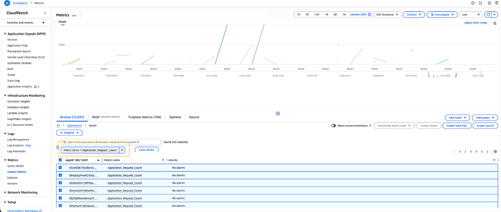

# Monitoring OpenSearch UI with Amazon CloudWatch

Amazon OpenSearch Service automatically publishes metrics for OpenSearch UI applications to CloudWatch. You
can use these metrics to monitor the health and performance of your OpenSearch UI
applications.

OpenSearch Service reports metrics to CloudWatch in 5-minute intervals. There is no charge for these metrics.
For more information, see [What is
Amazon CloudWatch?](../../../AmazonCloudWatch/latest/monitoring/WhatIsCloudWatch.md "../../../AmazonCloudWatch/latest/monitoring/WhatIsCloudWatch.md") in the _CloudWatch User Guide_.



## OpenSearch UI metrics

The `AWS/OpenSearch` namespace includes the following metrics for
OpenSearch UI applications.

### Dimensions

OpenSearch UI metrics use the following dimension.

| Dimension | Description                                              |
| --------- | -------------------------------------------------------- |
| `AppId`   | The unique identifier for the OpenSearch UI application. |

### Application metrics

| Metric                          | Description                                                                                                                                                                                                                                                                                         |
| ------------------------------- | --------------------------------------------------------------------------------------------------------------------------------------------------------------------------------------------------------------------------------------------------------------------------------------------------- |
| `Application_Request_Count`     | The total number of requests to the OpenSearch UI<br>application, regardless of the HTTP response code. Use this<br>metric to understand overall traffic volume.<br>Relevant statistics: Sum                                                                                                        |
| `Application_Request_2XX_Count` | The number of requests to the OpenSearch UI application that<br>resulted in a 2XX (success) HTTP response code. A 2XX response<br>indicates that the application successfully received and<br>processed the request.<br>Relevant statistics: Sum                                                    |
| `Application_Request_3XX_Count` | The number of requests to the OpenSearch UI application that<br>resulted in a 3XX (redirection) HTTP response code. A 3XX<br>response indicates that the client must take further action to<br>complete the request, such as following a redirect.<br>Relevant statistics: Sum                      |
| `Application_Request_4XX_Count` | The number of requests to the OpenSearch UI application that<br>resulted in a 4XX (client error) HTTP response code. A 4XX<br>response indicates a problem with the client request, such as<br>authentication failure, missing permissions, or a resource not<br>found.<br>Relevant statistics: Sum |
| `Application_Request_5XX_Count` | The number of requests to the OpenSearch UI application that<br>resulted in a 5XX (server error) HTTP response code. A 5XX<br>response indicates that the server encountered an unexpected<br>condition that prevented it from fulfilling the request.<br>Relevant statistics: Sum                  |

## Viewing OpenSearch UI metrics

You can view OpenSearch UI metrics using the CloudWatch console, the AWS CLI, or the CloudWatch
API.

###### To view metrics using the CloudWatch console

1. Open the CloudWatch console at [https://console.aws.amazon.com/cloudwatch/](https://console.aws.amazon.com/cloudwatch/ "https://console.aws.amazon.com/cloudwatch/").
2. In the navigation pane, choose **Metrics**, then choose
   **All metrics**.
3. Choose the **AWS/OpenSearch** namespace.
4. Choose **AppId** to view per-application metrics.

###### To view metrics using the AWS CLI

Use the following `list-metrics` command to list the available
OpenSearch UI metrics:

```
aws cloudwatch list-metrics --namespace AWS/OpenSearch --metric-name Application_Request_Count
```

Use the following `get-metric-statistics` command to get statistics for a
specific application:

```
aws cloudwatch get-metric-statistics \
  --namespace AWS/OpenSearch \
  --metric-name Application_Request_2XX_Count \
  --dimensions Name=AppId,Value=`your-app-id` \
  --start-time `2026-07-24T00:00:00Z` \
  --end-time `2026-07-24T12:00:00Z` \
  --period 300 \
  --statistics Sum
```

## Creating alarms

You can create CloudWatch alarms that send notifications when metrics cross a threshold
that you define. For example, create an alarm that notifies you when
`Application_Request_5XX_Count` exceeds a specific number of errors
within a given time period.

For more information about creating alarms, see [Using CloudWatch
alarms](../../../AmazonCloudWatch/latest/monitoring/AlarmThatSendsEmail.md "../../../AmazonCloudWatch/latest/monitoring/AlarmThatSendsEmail.md") in the _CloudWatch User Guide_.
