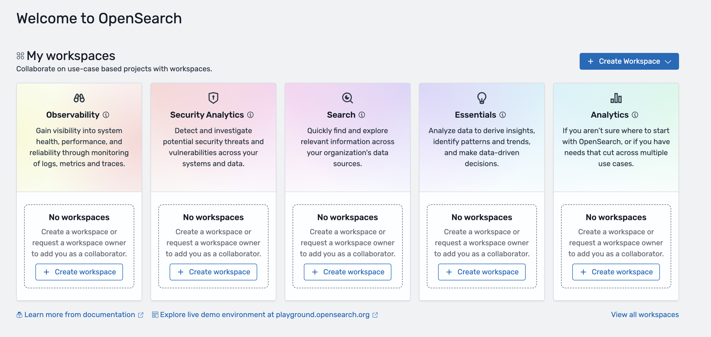

# Using Amazon OpenSearch Service workspaces

Amazon OpenSearch Service supports creating multiple use case-specific workspaces. Each workspace
provides a curated experience for popular use cases such as Observability, Security
Analytics and Search. Workspace also supports collaborator management, so that you can
share your workspace with only your intended collaborators and manage the permissions
for each one.

## Creating OpenSearch UI application

workspaces

After an OpenSearch UI application has been created and associated with data
sources, and user permissions have been configured for the application, you can
launch the OpenSearch UI application to create workspaces.

To start creating a workspace, you can select the **Launch
application** button on the application detail page or use the
OpenSearch UI application URL to open the OpenSearch UI application homepage in
a new browser window.

The OpenSearch UI application provides options for creating workspaces and lists
all the existing workspaces in the homepage, categorized by use case.

For more information about the supported types of workspaces, see [Workspace types](#application-workspaces-types "#application-workspaces-types").

## Workspace privacy

and collaborators

You can define a privacy setting for a workspace as the default permission level
for all users. You can do this while creating a workspace or modify an existing
workspace (on the workspace **Collaborators** tab). There are three
privacy options to choose from:

- **Private to collaborators** – Only collaborators
  you explicitly add to the workspace can access the workspace. You can define
  permission levels for each collaborator.
- \***\*Anyone can view\*\***
  – Anyone who has access to the OpenSearch UI application can access
  the workspace and view its assets, but they can't make any changes in the
  workspace.
- \***\*Anyone can edit\*\***
  – Anyone who has access to the OpenSearch UI application can access
  the workspace, view assets in it, and make changes to the assets in the
  workspace.

On the workspace **Collaborators** tab, you can add IAM users
or roles and AWS IAM Identity Center users as collaborators in a workspace. There are three levels
of permissions for collaborators to choose from:

- **Read only** – The collaborator can only view the
  assets in the workspace. This setting is overridden if the workspace is
  configured to use the **Anyone can edit** privacy
  setting.
- **Read and write** – The collaborator can view and
  edit assets in the workspace. If the workspace configured to use the
  **Anyone can view** privacy setting, the collaborator
  can still edit.
- **Admin** – The collaborator can update settings
  and delete the workspace. The collaborator can also change workspace privacy
  settings and manage collaborators. The user who creates the workspace is
  automatically assigned to be a workspace administrator.

## Workspace types

Amazon OpenSearch Service provides five workspace types, each with different features for the
different use cases:

- The **Observability** workspace is designed for gaining
  visibility into system health, performance, and reliability through
  monitoring of logs, metrics and traces.
- The **Security Analytics** workspace is designed for
  detecting and investigating potential security threats and vulnerabilities
  across your systems and data.
- The **Search** workspace is designed for quickly finding
  and exploring relevant information across your organization's data
  sources.
- The **Essentials** workspace is designed for OpenSearch Serverless as a
  data source, and enables analyzing data to derive insights, identify
  patterns and trends, and make data-driven decisions quickly. You can find
  and explore relevant information across your organization's data sources in
  an **Essentials** workspace.
- The **Analytics** (all features) workspace is designed
  for multi-purpose use cases and supports all the features available in OpenSearch Service
  UI (Dashboards).
