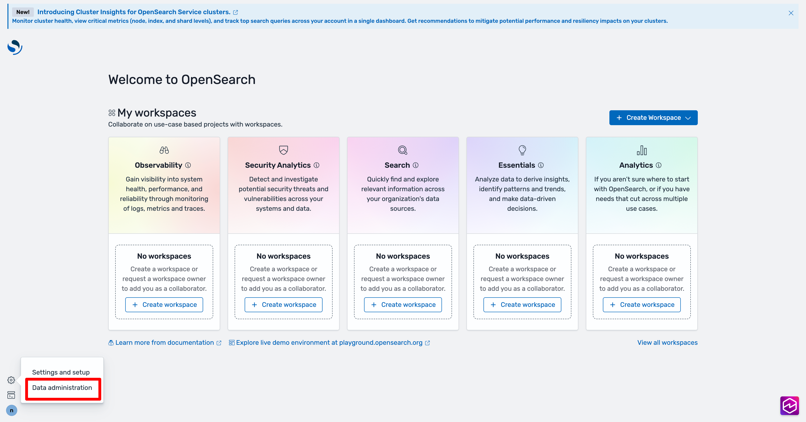
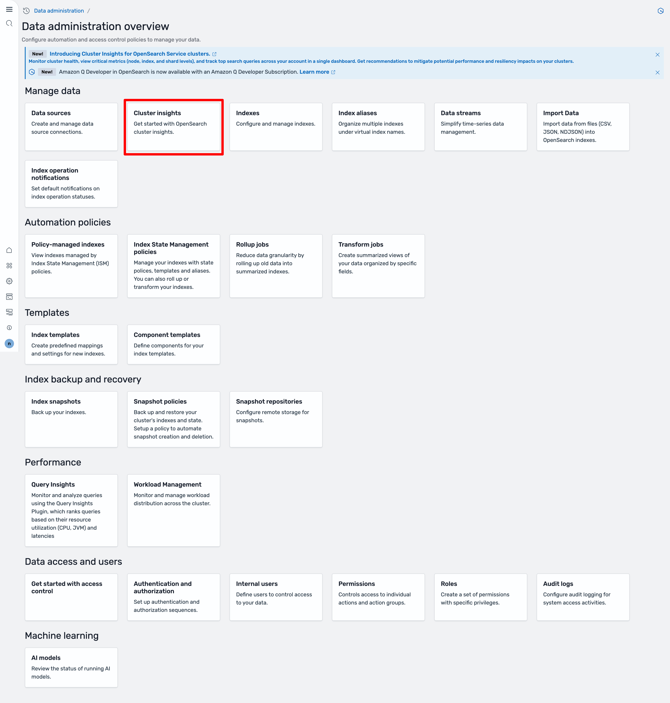
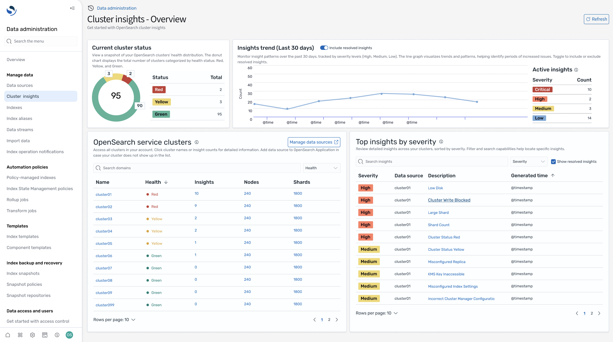
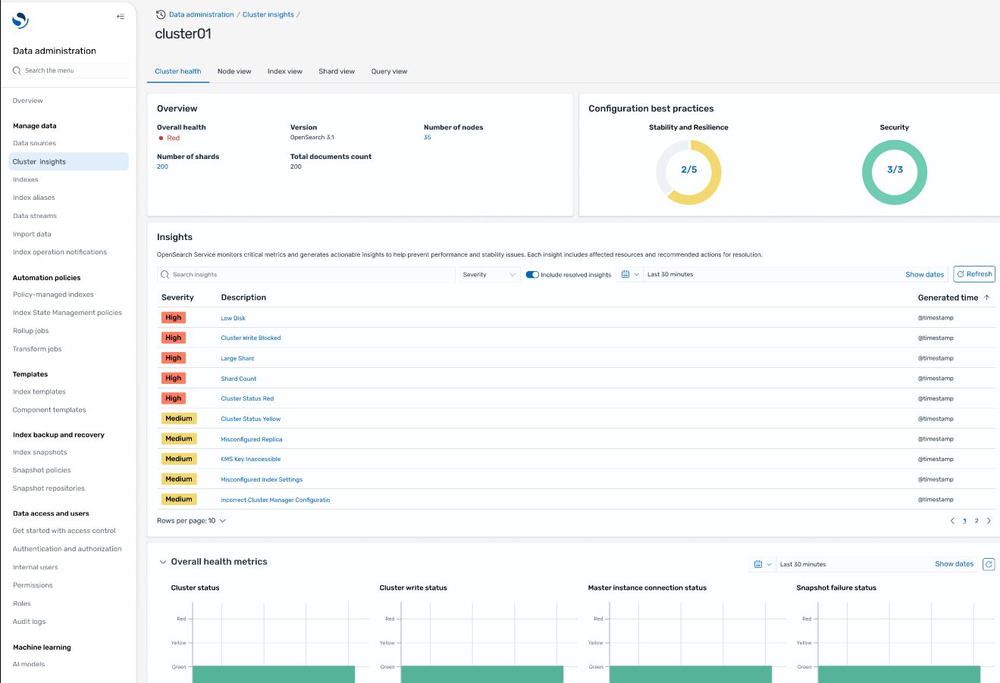
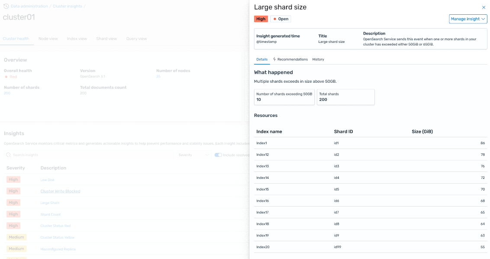
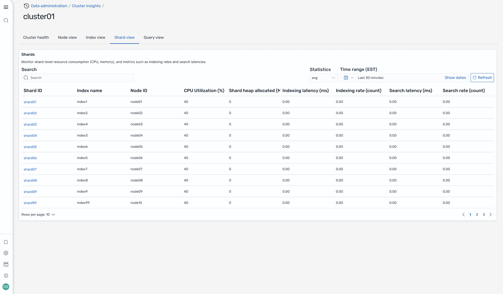
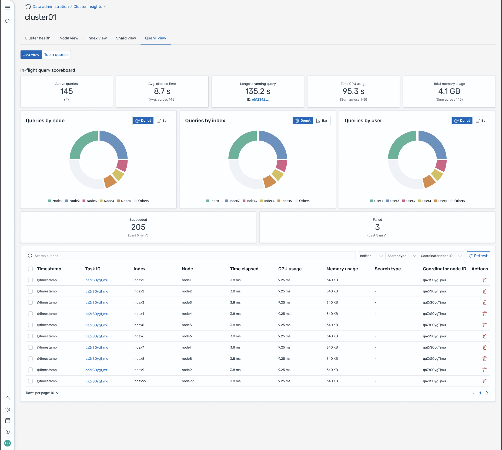

# Unified operational monitoring with Cluster Insights

Amazon OpenSearch Service now includes Cluster Insights, a monitoring solution that provides comprehensive operational visibility of your clusters through a single dashboard. This eliminates the complexity of having to analyze and correlate various logs and metrics to identify potential risks to cluster availability or performance. The solution automates the consolidation of critical operational data across nodes, indices, and shards, transforming complex troubleshooting into a streamlined process. You can detect issues like large shards and low disk watermarks, view detailed metrics at the node, index, and shard levels, and access security and resiliency best practices.

###### Note

Cluster Insights is available through OpenSearch Service UI at no additional cost to all users running OpenSearch version 2.17 or later.

## Benefits

- **Proactive monitoring** - Monitor cluster health proactively with detailed performance metrics across all components - from individual nodes and indices to shards and search queries.
- **Unified visibility** - Consolidate monitoring data into a single dashboard
- **Actionable recommendations** - Get step-by-step guidance for issue resolution
- **Comprehensive coverage** - Monitor security, stability, and resiliency across your OpenSearch clusters
- **Query optimization** - Identify resource-intensive queries and optimize performance

With Cluster Insights, you can maintain optimal cluster performance, reduce operational overhead, and ensure consistent best practices across your OpenSearch clusters

## Create and configure an OpenSearch application to view Cluster Insights

You can view insights for a specific OpenSearch Service cluster through the **OpenSearch UI (Dashboards)**.
In OpenSearch UI, an application is simply an organizational construct like a folder. Each application can connect to and display insights for multiple OpenSearch Service clusters. Accessing Cluster Insights requires an administrative role in the OpenSearch UI application.

###### Note

Accessing Cluster Insights requires an administrative role in the OpenSearch UI application.

## Create and configure an application to view Cluster Insights

1. Open the OpenSearch Service console at [https://console.aws.amazon.com/aos/home](https://console.aws.amazon.com/aos/home "https://console.aws.amazon.com/aos/home")
2. Choose **OpenSearch UI (Dashboards)** from the left navigation
3. Complete the following steps to create and configure an application:
   1. [Create an OpenSearch Service application](application-getting-started.md "application-getting-started.md")
   2. [Associate data sources](application-data-sources-and-vpc.md#application-data-source-association "application-data-sources-and-vpc.md#application-data-source-association")

4. After you complete the above two steps, you can view Cluster Insights in OpenSearch UI dashboard under the Settings > Data administrator > Cluster Insights section. The Settings icon is located at the bottom left of the OpenSearch UI screen.

Screen-1: Access Data Administrator from OpenSearch UI

Screen-2: Cluster Insights under the Manage data section

## Understanding Cluster Insights

This section describes the various insights available in Cluster Insights.

### Overview Dashboard

The **Cluster Insights Overview** page, as shown in the following screenshot, provides a high-level view of your cluster health at the application level and comprises the following sections:

Screen-3: Cluster Insights landing page in OpenSearch UI application.

### Current cluster status

A donut chart displays your cluster health status:

- **Green** - All primary shards and replicas are allocated to nodes
- **Yellow** - All primary shards are allocated, but some replicas aren't
- **Red** - At least one primary shard is not allocated to any node

### Insights trend

The trend graph tracks issue patterns over the past 30 days, helping you identify emerging problems and monitor resolution progress.

### Current open insights

A count organized by severity of open insights for the last 30 days.

### OpenSearch Service Clusters

This section lists all your OpenSearch clusters with key statistics including node count, shard count, and active queries.

### Top insights by severity

You can review insights across all domains in your application. This section prioritizes issues that need immediate attention (Critical, and High Severity). Each insight includes a description and specific recommendations, which can help you focus on critical issues first.

### Insight details

Each insight in the **Top insights by severity** section is interactive and provides detailed analysis. For example, when you choose the **Large Shard Size** insight:

1. You see how many shards exceed the threshold and which indices are affected.
2. A resource map identifies each oversized shard with its index, ID, and current size.
3. The recommendations tab provides step-by-step remediation guidance.
4. The History tab displays a timeline of resource remediation actions.

### Cluster Details

When you select a specific cluster in the **OpenSearch Service Clusters** section,
OpenSearch displays insights for that cluster across the following tabs: Cluster health, Nodes view, Index view, Shard view, and Query view.
The **Cluster health** tab displays the following information:

### Overview

Key information includes cluster health, shard count, node count, index count, and document statistics.

### Configuration best practices

Donut charts show compliance with recommended settings for resilience, and security.

### Insights

A table lists recent insights generated for the cluster, with the same detailed breakdown and remediation guidance available from the overview page.

Screen-4: Cluster Health overview provides key metrics, best practices, and Insights

When you click on any insights, you can see details and impacted resources, recommendations. In addition, you can also see history of fixed resources.

Screen-5: Insight details. Provides you details, recommendations, and historical timeline.

### Metrics Section

Interactive charts in this section display the following cluster metrics:

- Overall cluster health metrics such as Cluster Status, Write status, and searchable documents
- KPIs (Key Performance Indicators) like Indexing and Search rates and latencies
- Resource Utilization metrics like JVM and CPU utilization

### Node, Index, and Shard views

The **Node**, **Index**, and **Shard views** use OpenSearch stats to provide detailed visibility into cluster operations. You can view:

- Real-time metrics such as CPU utilization and JVM memory pressure
- Search and indexing performance data
- Resource hotspots across cluster components
- Granular node-level diagnostics
- Top shard heap allocated

Screen-6: Node, Index, and Shard level metrics

### Query View

###### Note

Query View feature is supported for OpenSearch versions 2.19 or later.

The **Query View** page helps you monitor resource-intensive queries with:

#### Live dashboards

View execution stats, CPU and memory usage, and completion progress for every query.

#### Top N queries

A ranked table shows the most significant queries with details including:

- Query count
- Latency, CPU, and memory usage
- Search type and coordinator node
- Target indices and shard count

#### Query details

Double-click any query to see:

- Exact query payload and execution steps
- Latency breakdown for each phase (expand, query, fetch)
- Optimization recommendations

Screen-7: In-flight live view. You can also view Top-N queries

