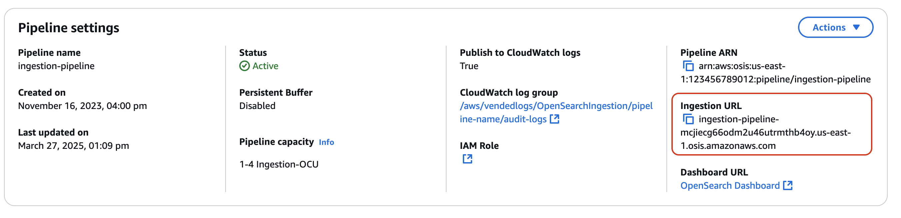
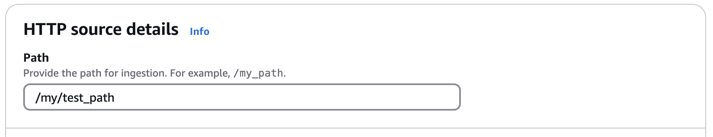

# Integrating Amazon OpenSearch Ingestion pipelines with other

services and applications

To successfully ingest data into an Amazon OpenSearch Ingestion pipeline, you must configure your
client application (the _source_) to send data to the pipeline endpoint.
Your source might be clients like Fluent Bit logs, the OpenTelemetry Collector, or a simple
S3 bucket. The exact configuration differs for each client.

The important differences during source configuration (compared to sending data directly
to an OpenSearch Service domain or OpenSearch Serverless collection) are the AWS service name (`osis`) and
the host endpoint, which must be the pipeline endpoint.

## Constructing the ingestion endpoint

To ingest data into a pipeline, send it to the ingestion endpoint. To locate the
ingestion URL, navigate to the **Pipeline settings** page and copy the
**Ingestion URL**.



To construct the full ingestion endpoint for pull-based sources like [OTel trace](https://opensearch.org/docs/latest/data-prepper/pipelines/configuration/sources/otel-trace/ "https://opensearch.org/docs/latest/data-prepper/pipelines/configuration/sources/otel-trace/") and [OTel metrics](https://opensearch.org/docs/latest/data-prepper/pipelines/configuration/sources/otel-metrics-source/ "https://opensearch.org/docs/latest/data-prepper/pipelines/configuration/sources/otel-metrics-source/"), add the ingestion path from your pipeline configuration to
the ingestion URL.

For example, say that your pipeline configuration has the following ingestion
path:



The full ingestion endpoint, which you specify in your client configuration, will take
the following format:
`https://`ingestion-pipeline-abcdefg`.us-east-1.osis.amazonaws.com`/my/test_path``.

## Creating an ingestion role

All requests to OpenSearch Ingestion must be signed with [Signature Version 4](../../../general/latest/gr/signature-version-4.md "../../../general/latest/gr/signature-version-4.md"). At minimum, the role that signs the request must be
granted permission for the `osis:Ingest` action, which allows it to send data
to an OpenSearch Ingestion pipeline.

For example, the following AWS Identity and Access Management (IAM) policy allows the corresponding role to
send data to a single pipeline:

JSON

```
`{
 "Version":"2012-10-17",
 "Statement": [
 {
 "Effect": "Allow",
 "Action": "osis:Ingest",
 "Resource": "arn:aws:osis:`us-east-1`:`111122223333`:pipeline/`pipeline-name`"
 }
 ]
}`

```

###### Note

To use the role for _all_ pipelines, replace the ARN in the
`Resource` element with a wildcard (\*).

### Providing cross-account ingestion

access

###### Note

You can only provide cross-account ingestion access for public pipelines, not
VPC pipelines.

You might need to ingest data into a pipeline from a different AWS account, such
as an account that houses your source application. If the principal that is writing
to a pipeline is in a different account than the pipeline itself, you need to
configure the principal to trust another IAM role to ingest data into the
pipeline.

###### To configure cross-account ingestion permissions

1. Create the ingestion role with `osis:Ingest` permission
   (described in the previous section) within the same AWS account as the
   pipeline. For instructions, see [Creating IAM
   roles](../../../IAM/latest/UserGuide/id_roles_create.md "../../../IAM/latest/UserGuide/id_roles_create.md").
2. Attach a [trust policy](../../../IAM/latest/UserGuide/roles-managingrole-editing-console.md#roles-managingrole_edit-trust-policy "../../../IAM/latest/UserGuide/roles-managingrole-editing-console.md#roles-managingrole_edit-trust-policy") to the ingestion role that allows a principal in
   another account to assume it:

JSON

```
`{
 "Version":"2012-10-17",
 "Statement": [{
 "Effect": "Allow",
 "Principal": {
 "AWS": "arn:aws:iam::`111122223333`:root"
 },
 "Action": "sts:AssumeRole"
 }]
}`

```

3. In the other account, configure your client application (for example,
   Fluent Bit) to assume the ingestion role. In order for this to work, the
   application account must grant permissions to the application user or role
   to assume the ingestion role.

The following example identity-based policy allows the attached principal
to assume `ingestion-role` from the pipeline account:

JSON

```
`{
 "Version":"2012-10-17",
 "Statement": [
 {
 "Effect": "Allow",
 "Action": "sts:AssumeRole",
 "Resource": "arn:aws:iam::`111122223333`:role/`ingestion-role`"
 }
 ]
}`

```

The client application can then use the [AssumeRole](../../../STS/latest/APIReference/API_AssumeRole.md "../../../STS/latest/APIReference/API_AssumeRole.md") operation
to assume `ingestion-role` and ingest data into the associated
pipeline.

## Next steps

After you export your data to a pipeline, you can [query it](searching.md "searching.md") from the OpenSearch Service domain that is configured as a sink for the
pipeline. The following resources can help you get started:

- [Observability in Amazon OpenSearch Service](observability.md "observability.md")
- [Trace Analytics for Amazon OpenSearch Service](trace-analytics.md "trace-analytics.md")
- [Querying Amazon OpenSearch Service data using Piped Processing Language](ppl-support.md "ppl-support.md")
