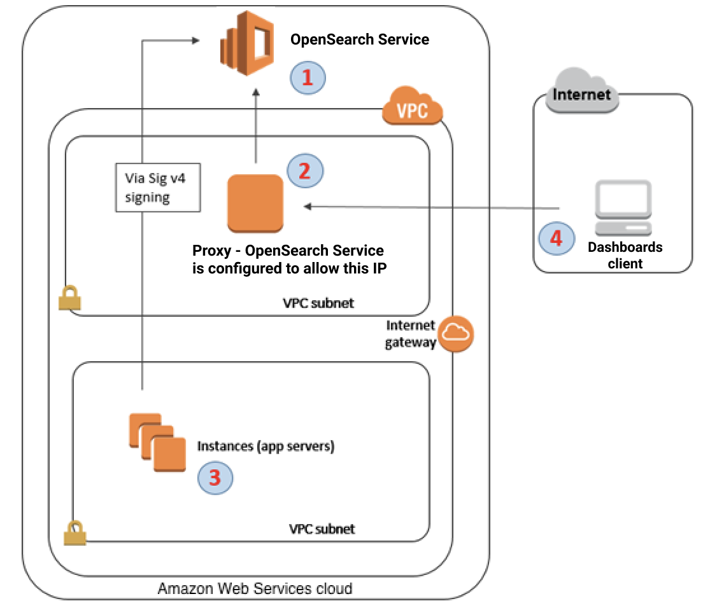
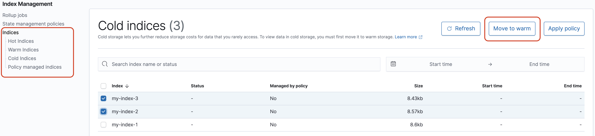

# Using OpenSearch Dashboards with Amazon OpenSearch Service

OpenSearch Dashboards is an open-source visualization tool designed to work with OpenSearch.
Amazon OpenSearch Service provides an installation of Dashboards with every OpenSearch Service domain. Dashboards runs on
the hot data nodes in the domain.

OpenSearch Dashboards is a visualization tool for exploring and analyzing data within a single
OpenSearch domain. In contrast, the centralized OpenSearch user interface (also called
an OpenSearch application) is a cloud-based UI that connects to multiple OpenSearch
domains, OpenSearch Serverless collections, and AWS data sources. It includes workspaces for specific use
cases like observability and security analytics, and provides a unified experience across
data sets. While Dashboards is tied to individual domains, the centralized UI enables
cross-domain data integration and analysis. For more information, see [Using OpenSearch UI in Amazon OpenSearch Service](application.md "application.md").

You can find a link to OpenSearch Dashboards on your domain dashboard in the OpenSearch Service console. For
domains running OpenSearch, the URL is
``domain-endpoint`/_dashboards/`. For domains
 running legacy Elasticsearch, the URL is
 ``domain-endpoint`/_plugin/kibana`.

Queries using this default Dashboards installation have a 300-second timeout.

###### Note

This documentation discusses OpenSearch Dashboards in the context of Amazon OpenSearch Service, including
different ways to connect to it. For comprehensive documentation, including a getting
started guide, instruction to create a dashboard, dashboards management, and Dashboards
Query Language (DQL), see [OpenSearch Dashboards](https://opensearch.org/docs/latest/dashboards/ "https://opensearch.org/docs/latest/dashboards/") in the open source OpenSearch documentation.

## Controlling access to Dashboards

Dashboards does not natively support IAM users and roles, but OpenSearch Service offers several
solutions for controlling access to Dashboards:

- Enable [SAML authentication for Dashboards](saml.md "saml.md").
- Use [fine-grained access control](fgac.md#fgac-concepts "fgac.md#fgac-concepts") with HTTP
  basic authentication.
- Configure [Cognito authentication for
  Dashboards](cognito-auth.md "cognito-auth.md").
- For public access domains, configure an [IP-based
  access policy](ac.md#ac-types-ip "ac.md#ac-types-ip") that either uses or does not use a [proxy server](#dashboards-proxy "#dashboards-proxy").
- For VPC access domains, use an open access policy that either uses or does not
  use a proxy server, and [security groups](../../../vpc/latest/userguide/VPC_SecurityGroups.md "../../../vpc/latest/userguide/VPC_SecurityGroups.md") to control access. To learn more, see [About access policies on VPC domains](vpc.md#vpc-security "vpc.md#vpc-security").

### Using a proxy to access OpenSearch Service from

Dashboards

###### Note

This process is only applicable if your domain uses public access and you
don't want to use [Cognito authentication](cognito-auth.md "cognito-auth.md").
See [Controlling access to Dashboards](#dashboards-access "#dashboards-access") .

Because Dashboards is a JavaScript application, requests originate from the user's
IP address. IP-based access control might be impractical due to the sheer number of
IP addresses you would need to allow in order for each user to have access to
Dashboards. One workaround is to place a proxy server between Dashboards and OpenSearch Service.
Then you can add an IP-based access policy that allows requests from only one IP
address, the proxy's. The following diagram shows this configuration.



1. This is your OpenSearch Service domain. IAM provides authorized access to this domain.
   An additional, IP-based access policy provides access to the proxy
   server.
2. This is the proxy server, running on an Amazon EC2 instance.
3. Other applications can use the Signature Version 4 signing process to send
   authenticated requests to OpenSearch Service.
4. Dashboards clients connect to your OpenSearch Service domain through the proxy.

To enable this sort of configuration, you need a resource-based policy that
specifies roles and IP addresses. Here's a sample policy:

JSON

```
`{
 "Version":"2012-10-17",
 "Statement":[
 {
 "Resource":"arn:aws:es:us-west-2:111111111111:domain/my-domain/*",
 "Principal":{
 "AWS":"arn:aws:iam::111111111111:role/allowedrole1"
 },
 "Action":[
 "es:ESHttpGet"
 ],
 "Effect":"Allow"
 },
 {
 "Effect":"Allow",
 "Principal":{
 "AWS":"*"
 },
 "Action":"es:*",
 "Condition":{
 "IpAddress":{
 "aws:SourceIp":[
 "`203.0.113.0/24`",
 "`2001:DB8:1234:5678::/64`"
 ]
 }
 },
 "Resource":"arn:aws:es:us-west-2:111111111111:domain/my-domain/*"
 }
 ]
}`

```

We recommend that you configure the EC2 instance running the proxy server with an
Elastic IP address. This way, you can replace the instance when necessary and still
attach the same public IP address to it. To learn more, see [Elastic IP Addresses](../../../AWSEC2/latest/UserGuide/elastic-ip-addresses-eip.md "../../../AWSEC2/latest/UserGuide/elastic-ip-addresses-eip.md")
in the _Amazon EC2 User Guide_.

If you use a proxy server _and_
[Cognito authentication](cognito-auth.md "cognito-auth.md"), you might need to add
settings for Dashboards and Amazon Cognito to avoid `redirect_mismatch` errors.
See the following `nginx.conf` example:

```
server {
    listen 443;
    server_name $host;
    rewrite ^/$ https://$host/_plugin/_dashboards redirect;

    ssl_certificate           /etc/nginx/cert.crt;
    ssl_certificate_key       /etc/nginx/cert.key;

    ssl on;
    ssl_session_cache  builtin:1000  shared:SSL:10m;
    ssl_protocols  TLSv1 TLSv1.1 TLSv1.2;
    ssl_ciphers HIGH:!aNULL:!eNULL:!EXPORT:!CAMELLIA:!DES:!MD5:!PSK:!RC4;
    ssl_prefer_server_ciphers on;

    location /_plugin/_dashboards {
        # Forward requests to Dashboards
        proxy_pass https://$dashboards_host/_plugin/_dashboards;

        # Handle redirects to Cognito
        proxy_redirect https://$cognito_host https://$host;

        # Update cookie domain and path
        proxy_cookie_domain $dashboards_host $host;
        proxy_cookie_path / /_plugin/_dashboards/;

        # Response buffer settings
        proxy_buffer_size 128k;
        proxy_buffers 4 256k;
        proxy_busy_buffers_size 256k;
    }

    location ~ \/(log|sign|fav|forgot|change|saml|oauth2) {
        # Forward requests to Cognito
        proxy_pass https://$cognito_host;

        # Handle redirects to Dashboards
        proxy_redirect https://$dashboards_host https://$host;

        # Update cookie domain
        proxy_cookie_domain $cognito_host $host;
    }
}
```

###### Note

(Optional) If you choose to provision a dedicated coordinator node, it will
automatically start hosting OpenSearch Dashboards. As a result, the availability of data
node resources such as CPU and memory is increased. This increased availability of
data node resources can help to improve the overall resiliency of your
domain.

## Configuring Dashboards to use a WMS map

server

The default installation of Dashboards for OpenSearch Service includes a map service, except for
domains in the India and China Regions. The map service supports up to
10 zoom levels.

Regardless of your Region, you can configure Dashboards to use a
different Web Map Service (WMS) server for coordinate map visualizations.
Region map visualizations only support the default map service.

###### To configure Dashboards to use a WMS map server:

1. Open Dashboards.
2. Choose **Stack Management**.
3. Choose **Advanced Settings**.
4. Locate **visualization:tileMap:WMSdefaults**.
5. Change `enabled` to `true` and `url` to the
   URL of a valid WMS map server:

```
{
  "enabled": true,
  "url": "`wms-server-url`",
  "options": {
    "format": "image/png",
    "transparent": true
  }
}
```

6. Choose **Save changes**.

To apply the new default value to visualizations, you might need to reload Dashboards.
If you have saved visualizations, choose **Options** after opening the
visualization. Verify that **WMS map server** is enabled and
**WMS url** contains your preferred map server, and then choose
**Apply changes**.

###### Note

Map services often have licensing fees or restrictions. You are responsible for
all such considerations on any map server that you specify. You might find the map
services from the [U.S. Geological
Survey](https://www.usgs.gov/products/maps "https://www.usgs.gov/products/maps") useful for testing.

## Connecting a local Dashboards server to OpenSearch Service

If you already invested significant time into configuring your own Dashboards
instance, you can use it instead of (or in addition to) the default Dashboards instance
that OpenSearch Service provides. The following procedure works for domains that use [fine-grained access control](fgac.md "fgac.md") with an open access policy.

###### To connect a local Dashboards server to OpenSearch Service

1. On your OpenSearch Service domain, create a user with the appropriate permissions:
   1. In Dashboards, go to **Security**, **Internal
      users**, and choose **Create internal
      user**.
   2. Provide a username and password and choose
      **Create**.
   3. Go to **Roles** and select a role.
   4. Select **Mapped users** and choose **Manage
      mapping**.
   5. In **Users**, add your username and choose
      **Map**.

2. Download and install the appropriate version of the OpenSearch [security plugin](https://docs.opensearch.org/latest/dashboards/install/plugins/#install "https://docs.opensearch.org/latest/dashboards/install/plugins/#install") on your self-managed Dashboards OSS installation.
3. On your local Dashboards server, open the
   `config/opensearch_dashboards.yml` file and add your OpenSearch Service
   endpoint with the username and password you created earlier:

```
opensearch.hosts: ['https://`domain-endpoint`']
opensearch.username: 'username'
opensearch.password: 'password'
```

You can use the following sample `opensearch_dashboards.yml`
file:

```
server.host: '0.0.0.0'

opensearch.hosts: ['https://`domain-endpoint`']

opensearchDashboards.index: ".username"

opensearch.ssl.verificationMode: none # if not using HTTPS

opensearch_security.auth.type: basicauth
opensearch_security.auth.anonymous_auth_enabled: false
opensearch_security.cookie.secure: false # set to true when using HTTPS
opensearch_security.cookie.ttl: 3600000
opensearch_security.session.ttl: 3600000
opensearch_security.session.keepalive: false
opensearch_security.multitenancy.enabled: false
opensearch_security.readonly_mode.roles: ['opensearch_dashboards_read_only']
opensearch_security.auth.unauthenticated_routes: []
opensearch_security.basicauth.login.title: 'Please log in using your username and password'

opensearch.username: 'username'
opensearch.password: 'password'
opensearch.requestHeadersWhitelist: [authorization, securitytenant, security_tenant]
```

To see your OpenSearch Service indexes, start your local Dashboards server, go to **Dev
Tools** and run the following command:

```
GET _cat/indices
```

## Managing indexes in Dashboards

The Dashboards installation on your OpenSearch Service domain provides a useful UI for managing
indexes in different storage tiers on your domain. Choose **Index
Management** from the Dashboards main menu to view all indexes in hot,
[UltraWarm](ultrawarm.md "ultrawarm.md"), and [cold](cold-storage.md "cold-storage.md") storage, as well as indexes managed by Index State Management (ISM)
policies. Use index management to move indexes between warm and cold storage, and to
monitor migrations between the three tiers.



Note that you won't see the hot, warm, and cold index options unless you have
UltraWarm and/or cold storage enabled.

## Additional features

The default Dashboards installation on each OpenSearch Service domain has some additional
features:

- User interfaces for the various [OpenSearch
  plugins](supported-plugins.md "supported-plugins.md")
- [Tenants](fgac.md#fgac-multitenancy "fgac.md#fgac-multitenancy")
- [Reports](https://opensearch.org/docs/latest/dashboards/reporting/ "https://opensearch.org/docs/latest/dashboards/reporting/")

Use the **Reporting** menu to generate on-demand CSV reports
from the Discover page and PDF or PNG reports of dashboards or visualizations.
CSV reports have a 10,000 row limit.

- [Gantt
  charts](https://docs.opensearch.org/latest/observing-your-data/trace/ta-dashboards/ "https://docs.opensearch.org/latest/observing-your-data/trace/ta-dashboards/")
- [Notebooks](https://opensearch.org/docs/latest/observability-plugin/notebooks/ "https://opensearch.org/docs/latest/observability-plugin/notebooks/")
