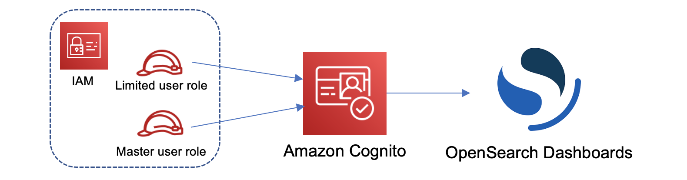

# Tutorial: Configure a domain with an IAM master user and Amazon Cognito

authentication

This tutorial covers a popular Amazon OpenSearch Service use case for [fine-grained
access control](fgac.md "fgac.md"): an IAM master user with Amazon Cognito authentication for OpenSearch Dashboards.

In the tutorial, we'll configure a _master_ IAM role and a
_limited_ IAM role, which we'll then associate with users in Amazon Cognito. The
master user can then sign in to OpenSearch Dashboards, map the limited user to a role, and use
fine-grained access control to limit the user's permissions.


Although these steps use the Amazon Cognito user pool for authentication, this same basic process
works for any Cognito authentication provider that lets you assign different IAM roles to
different users.

You'll complete the following steps in this tutorial:

1. [Create master and limited IAM roles](#fgac-iam-roles "#fgac-iam-roles")
2. [Create a domain with Cognito
   authentication](#fgac-iam-domain "#fgac-iam-domain")
3. [Configure a Cognito user pool and identity
   pool](#fgac-iam-cognito "#fgac-iam-cognito")
4. [Map roles in OpenSearch Dashboards](#fgac-iam-dashboards "#fgac-iam-dashboards")
5. [Test the permissions](#fgac-iam-test "#fgac-iam-test")

## Step 1: Create master and limited IAM roles

Navigate to the AWS Identity and Access Management (IAM) console and create two separate roles:

- `MasterUserRole` – The master user, which will have full
  permissions to the cluster and manage roles and role mappings.
- `LimitedUserRole` – A more restricted role, which you'll grant
  limited access to as the master user.

For instructions to create the roles, see [Creating a role using custom
trust policies](../../../IAM/latest/UserGuide/id_roles_create_for-custom.md "../../../IAM/latest/UserGuide/id_roles_create_for-custom.md") in the _IAM User Guide_.

Both roles must have the following trust policy, which allows your Cognito identity pool
to assume the roles:

JSON

```
`{
 "Version":"2012-10-17",
 "Statement": [{
 "Effect": "Allow",
 "Principal": {
 "Federated": "cognito-identity.amazonaws.com"
 },
 "Action": "sts:AssumeRoleWithWebIdentity",
 "Condition": {
 "StringEquals": {
 "cognito-identity.amazonaws.com:aud": "`{identity-pool-id}`"
 },
 "ForAnyValue:StringLike": {
 "cognito-identity.amazonaws.com:amr": "authenticated"
 }
 }
 }]
}`

```

###### Note

Replace `identity-pool-id` with the unique identifier of your Amazon Cognito
identity pool. For example,
`us-east-1:0c6cdba7-3c3c-443b-a958-fb9feb207aa6`.

## Step 2: Create a domain with Cognito

authentication

Navigate to the Amazon OpenSearch Service console at [https://console.aws.amazon.com/aos/home/](https://console.aws.amazon.com/aos/home/ "https://console.aws.amazon.com/aos/home/") and [create a domain](createupdatedomains.md "createupdatedomains.md") with the following settings:

- OpenSearch 1.0 or later, or Elasticsearch 7.8 or later
- Public access
- Fine-grained access control enabled with `MasterUserRole` as the master
  user (created in the previous step)
- Amazon Cognito authentication enabled for OpenSearch Dashboards. For instructions to enable
  Cognito authentication and select a user and identity pool, see [Configuring a domain to use Amazon Cognito
  authentication](cognito-auth.md#cognito-auth-config "cognito-auth.md#cognito-auth-config").
- The following domain access policy:

JSON

```
`{
 "Version":"2012-10-17",
 "Statement": [
 {
 "Effect": "Allow",
 "Principal": {
 "AWS": "arn:aws:iam::`111122223333`:root"
 },
 "Action": [
 "es:ESHttp*"
 ],
 "Resource": "arn:aws:es:`us-east-1`:`111122223333`:domain/`{domain-name}`/*"
 }
 ]
}`

```

- HTTPS required for all traffic to the domain
- Node-to-node encryption
- Encryption of data at rest

## Step 3: Configure Cognito users

While your domain is being created, configure the master and limited users within Amazon Cognito
by following [Create a user
pool](../../../cognito/latest/developerguide/cognito-user-pool-as-user-directory.md "../../../cognito/latest/developerguide/cognito-user-pool-as-user-directory.md") in the _Amazon Cognito Developer Guide_. Lastly, configure your
identity pool by following the steps in [Create an identity pool in Amazon Cognito](../../../cognito/latest/developerguide/getting-started-with-identity-pools.md#create-identity-pool "../../../cognito/latest/developerguide/getting-started-with-identity-pools.md#create-identity-pool"). The user pool and identity pool must be in the
same AWS Region.

## Step 4: Map roles in OpenSearch Dashboards

Now that your users are configured, you can sign in to OpenSearch Dashboards as the master
user and map users to roles.

1. Go back to the OpenSearch Service console and navigate to the OpenSearch Dashboards URL for the domain
   you created. The URL follows this format:
   ``domain-endpoint`/\_dashboards/`.
2. Sign in with the `master-user` credentials.
3. Choose **Add sample data** and add the sample flight data.
4. In the left navigation pane, choose **Security**,
   **Roles**, **Create role**.
5. Name the role `new-role`.
6. For **Index**, specify
   `opensearch_dashboards_sample_data_fli*`
   (`kibana_sample_data_fli*` on Elasticsearch domains).
7. For **Index permissions**, choose **read**.
8. For **Document level security**, specify the following
   query:

```
{
  "match": {
    "FlightDelay": true
  }
}
```

9. For field-level security, choose **Exclude** and specify
   `FlightNum`.
10. For **Anonymization**, specify `Dest`.
11. Choose **Create**.
12. Choose **Mapped users**, **Manage mapping**. Add
    the Amazon Resource Name (ARN) for `LimitedUserRole` as an external identity
    and choose **Map**.
13. Return to the list of roles and choose
    **opensearch_dashboards_user**. Choose **Mapped
    users**, **Manage mapping**. Add the ARN for
    `LimitedUserRole` as a backend role and choose
    **Map**.

## Step 5: Test the permissions

When your roles are mapped correctly, you can sign in as the limited user and test the
permissions.

1. In a new, private browser window, navigate to the OpenSearch Dashboards URL for the
   domain, sign in using the `limited-user` credentials, and choose
   **Explore on my own**.
2. Go to **Dev Tools** and run the default search:

```
GET _search
{
  "query": {
    "match_all": {}
  }
}
```

Note the permissions error. `limited-user` doesn't have permissions to
run cluster-wide searches. 3. Run another search:

```
GET opensearch_dashboards_sample_data_flights/_search
{
  "query": {
    "match_all": {}
  }
}
```

Note that all matching documents have a `FlightDelay` field of
`true`, an anonymized `Dest` field, and no
`FlightNum` field. 4. In your original browser window, signed in as `master-user`, choose
**Dev Tools**, and then perform the same searches. Note the
difference in permissions, number of hits, matching documents, and included
fields.
