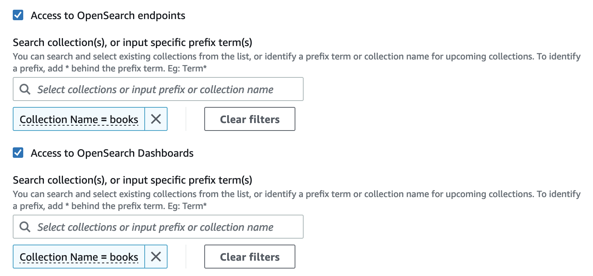
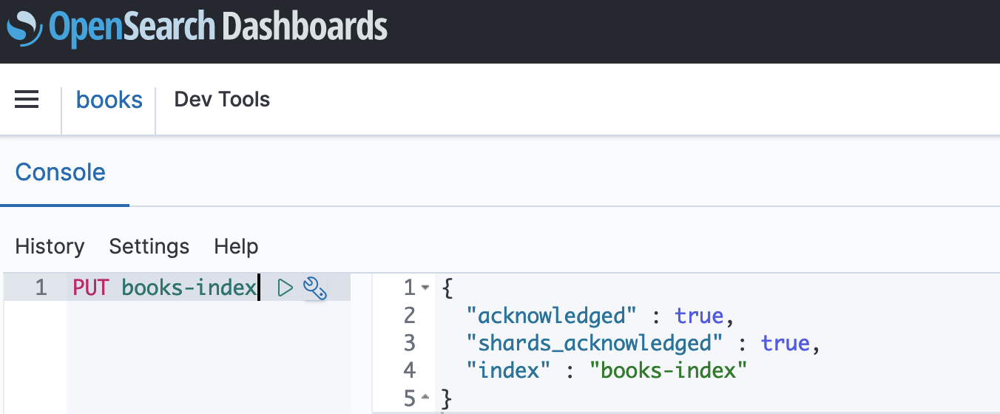

# Tutorial: Getting started with security in Amazon OpenSearch Serverless

(console)

This tutorial walks you through the basic steps to create and manage security policies
using the Amazon OpenSearch Serverless console.

You will complete the following steps in this tutorial:

1. [Configure permissions](#gsgpermissions "#gsgpermissions")
2. [Create an encryption policy](#gsg-encryption "#gsg-encryption")
3. [Create a network policy](#gsg-network "#gsg-network")
4. [Configure a data access policy](#gsg-data-access "#gsg-data-access")
5. [Create a collection](#gsgcreate-collection "#gsgcreate-collection")
6. [Upload and search data](#gsgindex-collection "#gsgindex-collection")
   This tutorial walks you through setting up a collection using the AWS Management Console. For the
   same steps using the AWS CLI, see [Tutorial: Getting started with security in
   Amazon OpenSearch Serverless (CLI)](gsg-serverless-cli.md "gsg-serverless-cli.md").

## Step 1: Configure permissions

###### Note

You can skip this step if you're already using a more broad identity-based
policy, such as `Action":"aoss:*"` or `Action":"*"`. In
production environments, however, we recommend that you follow the principal of
least privilege and only assign the minimum permissions necessary to complete a
task.

In order to complete this tutorial, you must have the correct IAM permissions.
Your user or role must have an attached [identity-based policy](security-iam-serverless.md#security-iam-serverless-id-based-policies "security-iam-serverless.md#security-iam-serverless-id-based-policies")
with the following minimum permissions:

JSON

```
`{
 "Version":"2012-10-17",
 "Statement": [
 {
 "Action": [
 "aoss:ListCollections",
 "aoss:BatchGetCollection",
 "aoss:CreateCollection",
 "aoss:CreateSecurityPolicy",
 "aoss:GetSecurityPolicy",
 "aoss:ListSecurityPolicies",
 "aoss:CreateAccessPolicy",
 "aoss:GetAccessPolicy",
 "aoss:ListAccessPolicies"
 ],
 "Effect": "Allow",
 "Resource": "*"
 }
 ]
}`

```

For a full list of OpenSearch Serverless permissions, see [Identity and Access Management for
Amazon OpenSearch Serverless](security-iam-serverless.md "security-iam-serverless.md").

## Step 2: Create an encryption policy

[Encryption policies](serverless-encryption.md "serverless-encryption.md") specify the AWS KMS
key that OpenSearch Serverless will use to encrypt the collection. You can encrypt collections with
an AWS managed key or a different key. For simplicity in this tutorial, we'll
encrypt our collection with an AWS managed key.

###### To create an encryption policy

1. Open the Amazon OpenSearch Service console at [https://console.aws.amazon.com/aos/home](https://console.aws.amazon.com/aos/home "https://console.aws.amazon.com/aos/home ").
2. Expand **Serverless** in the left navigation pane and
   choose **Encryption policies**.
3. Choose **Create encryption policy**.
4. Name the policy **books-policy**. For the description,
   enter **Encryption policy for books collection**.
5. Under **Resources**, enter **books**,
   which is what you'll name your collection. If you wanted to be more broad,
   you could include an asterisk (`books*`) to make the policy apply
   to all collections beginning with the word "books".
6. For **Encryption**, keep **Use AWS owned
   key** selected.
7. Choose **Create**.

## Step 3: Create a network policy

[Network policies](serverless-network.md "serverless-network.md") determine whether your
collection is accessible over the internet from public networks, or whether it must
be accessed through OpenSearch Serverless–managed VPC endpoints. In this tutorial, we'll
configure public access.

###### To create a network policy

1. Choose **Network policies** in the left navigation pane
   and choose **Create network policy**.
2. Name the policy **books-policy**. For the description,
   enter **Network policy for books collection**.
3. Under **Rule 1**, name the rule **Public access
   for books collection**.
4. For simplicity in this tutorial, we'll configure public access for the
   _books_ collection. For the access type, select
   **Public**.
5. We're going to access the collection from OpenSearch Dashboards. In order to do
   this, you need to configure network access for Dashboards
   _and_ the OpenSearch endpoint, otherwise Dashboards
   won't function.

For the resource type, enable both **Access to OpenSearch
endpoints** and **Access to OpenSearch
Dashboards**. 6. In both input boxes, enter **Collection Name = books**.
This setting scopes the policy down so that it only applies to a single
collection (`books`). Your rule should look like this:

 7. Choose **Create**.

## Step 4: Create a data access policy

Your collection data won't be accessible until you configure data access. [Data access policies](serverless-data-access.md "serverless-data-access.md") are separate from
the IAM identity-based policy that you configured in step 1. They allow users to
access the actual data within a collection.

In this tutorial, we'll provide a single user the permissions required to index
data into the _books_ collection.

###### To create a data access policy

1. Choose **Data access policies** in the left navigation
   pane and choose **Create access policy**.
2. Name the policy **books-policy**. For the description,
   enter **Data access policy for books collection**.
3. Select **JSON** for the policy definition method and
   paste the following policy in the JSON editor.

Replace the principal ARN with the ARN of the account that you'll use to
log in to OpenSearch Dashboards and index data.

```
[
   {
      "Rules":[
         {
            "ResourceType":"index",
            "Resource":[
               "index/books/*"
            ],
            "Permission":[
               "aoss:CreateIndex",
               "aoss:DescribeIndex",
               "aoss:ReadDocument",
               "aoss:WriteDocument",
               "aoss:UpdateIndex",
               "aoss:DeleteIndex"
            ]
         }
      ],
      "Principal":[
         "arn:aws:iam::`123456789012`:`user`/`my-user`"
      ]
   }
]
```

This policy provides a single user the minimum permissions required to
create an index in the _books_ collection, index some
data, and search for it. 4. Choose **Create**.

## Step 5: Create a collection

Now that you configured encryption and network policies, you can create a matching
collection and the security settings will be automatically applied to it.

###### To create an OpenSearch Serverless collection

1. Choose **Collections** in the left navigation pane and
   choose **Create collection**.
2. Name the collection **books**.
3. For collection type, choose **Search**.
4. Under **Encryption**, OpenSearch Serverless informs you that the
   collection name matches the `books-policy` encryption
   policy.
5. Under **Network access settings**, OpenSearch Serverless informs you
   that the collection name matches the `books-policy` network
   policy.
6. Choose **Next**.
7. Under **Data access policy options**, OpenSearch Serverless informs you
   that the collection name matches the `books-policy` data access
   policy.
8. Choose **Next**.
9. Review the collection configuration and choose **Submit**. Collections typically take less than a minute to
   initialize.

## Step 6: Upload and search data

You can upload data to an OpenSearch Serverless collection using Postman or curl. For brevity,
these examples use **Dev Tools** within the OpenSearch Dashboards
console.

###### To index and search data in a collection

1. Choose **Collections** in the left navigation pane and
   choose the **books** collection to open its details
   page.
2. Choose the OpenSearch Dashboards URL for the collection. The URL takes the
   format
   `https://`collection-id`.us-east-1.aoss.amazonaws.com/_dashboards`.
3. Sign in to OpenSearch Dashboards using the [AWS access and secret keys](../../../powershell/latest/userguide/pstools-appendix-sign-up.md "../../../powershell/latest/userguide/pstools-appendix-sign-up.md") for the principal that you
   specified in your data access policy.
4. Within OpenSearch Dashboards, open the left navigation menu and choose
   **Dev Tools**.
5. To create a single index called _books-index_, run the
   following command:

```
PUT books-index
```

 6. To index a single document into _books-index_, run the
following command:

```
PUT books-index/_doc/1
{
  "title": "The Shining",
  "author": "Stephen King",
  "year": 1977
}
```

7. To search data in OpenSearch Dashboards, you need to configure at least one
   index pattern. OpenSearch uses these patterns to identify which indexes you
   want to analyze. Open the Dashboards main menu, choose **Stack Management**, choose **Index
   Patterns**, and then choose **Create index
   pattern**. For this tutorial, enter _books-index_.
8. Choose **Next step** and then choose
   **Create index pattern**. After the pattern
   is created, you can view the various document fields such as
   `author` and `title`.
9. To begin searching your data, open the main menu again and choose
   **Discover**, or use the [search API](https://opensearch.org/docs/latest/opensearch/rest-api/search/ "https://opensearch.org/docs/latest/opensearch/rest-api/search/").
