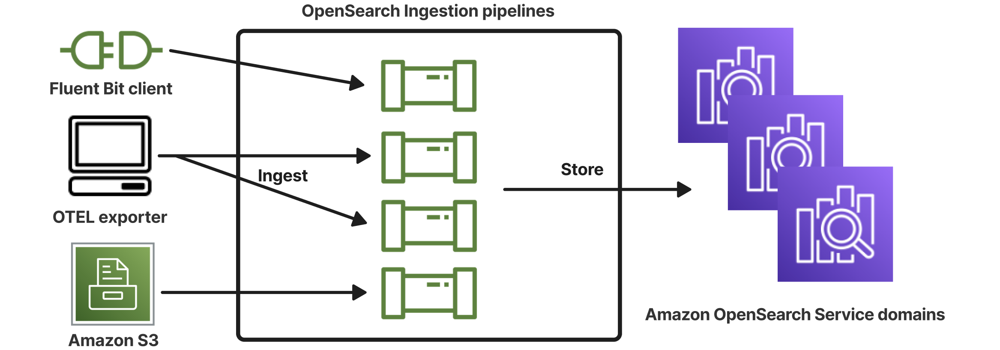

# Overview of Amazon OpenSearch Ingestion

Amazon OpenSearch Ingestion is a fully managed, serverless data collector that streams real-time
logs, metrics, and trace data to Amazon OpenSearch Service domains and OpenSearch Serverless collections.

With OpenSearch Ingestion, you no longer need third-party tools like Logstash or Jaeger to
ingest data. You configure your data producers to send data to OpenSearch Ingestion, and it
automatically delivers it to your specified domain or collection. You can also transform
data before delivery.

Because OpenSearch Ingestion is serverless, you don’t have to manage infrastructure, patch
software, or scale clusters manually. You can provision ingestion pipelines directly in the
AWS Management Console, and OpenSearch Ingestion handles the rest.

As a component of Amazon OpenSearch Service, OpenSearch Ingestion is powered by Data Prepper—an open-source data
collector that filters, enriches, transforms, normalizes, and aggregates data for downstream
analysis and visualization.

## Benefits of Amazon OpenSearch Ingestion

OpenSearch Ingestion has the following main benefits:

- Eliminates the need for you to manually manage a self-provisioned
  pipeline.
- Automatically scales your pipelines based on capacity limits that you
  define.
- Keeps your pipeline up to date with security and bug patches.
- Provides the option to connect pipelines to your virtual private cloud (VPC)
  for an added layer of security.
- Allows you to stop and start pipelines in order to control costs.
- Provides pipeline configuration blueprints for popular use cases to help you
  get up and running faster.
- Allows you to interact programmatically with your pipelines through the
  various AWS SDKs and the OpenSearch Ingestion API.
- Supports performance monitoring in Amazon CloudWatch and error logging in CloudWatch Logs.

## Supported Data Prepper versions

OpenSearch Ingestion currently supports the following major versions of Data
Prepper:

- 2.x

When you create a pipeline using the code editor, use the required
`version` option to specify the major version of Data Prepper to use. For
example, `version: "`2`"`. OpenSearch Ingestion retrieves
the latest supported _minor_ version of that major version and
provisions the pipeline with that version.

If you don't use the code editor to create your pipeline, OpenSearch Ingestion
automatically provisions your pipeline with the latest supported version.

Currently, OpenSearch Ingestion provisions pipelines with version 2.7 of Data Prepper. For
information, see the [2.7
release notes](https://github.com/opensearch-project/data-prepper/releases/tag/2.7.0 "https://github.com/opensearch-project/data-prepper/releases/tag/2.7.0"). Not every minor version of a particular major version is
supported by OpenSearch Ingestion.

When you update a pipeline's configuration, if there's support for a new minor version
of Data Prepper, OpenSearch Ingestion automatically upgrades the pipeline to the latest
supported minor version of the major version that's specified in the pipeline
configuration. For example, you might have `version: "2"` in your pipeline
configuration, and OpenSearch Ingestion initially provisioned the pipeline with version
2.6.0. When support for version 2.7.0 is added, and you make a change to the pipeline
configuration, OpenSearch Ingestion upgrades the pipeline to version 2.7.0. This process
keeps your pipeline up to date with the latest bug fixes and performance improvements.
OpenSearch Ingestion can't update the major version of your pipeline unless you manually
change the `version` option within the pipeline configuration. For more
information, see [Updating Amazon OpenSearch Ingestion pipelines](update-pipeline.md "update-pipeline.md").

## OpenSearch Ingestion pricing

At any specific time, you only pay for the number of Ingestion OCUs that are allocated
to a pipeline, regardless of whether there's data flowing through the pipeline.
OpenSearch Ingestion immediately accommodates your workloads by scaling pipeline capacity up
or down based on usage.

For full pricing details, see [Amazon OpenSearch Service
pricing](https://aws.amazon.com/opensearch-service/pricing/ "https://aws.amazon.com/opensearch-service/pricing/").

## Supported AWS Regions

OpenSearch Ingestion is available in a subset of AWS Regions that OpenSearch Service is available in.
For a list of supported Regions, see [Amazon OpenSearch Service endpoints and
quotas](../../../general/latest/gr/opensearch-service.md "../../../general/latest/gr/opensearch-service.md") in the _AWS General Reference_.
