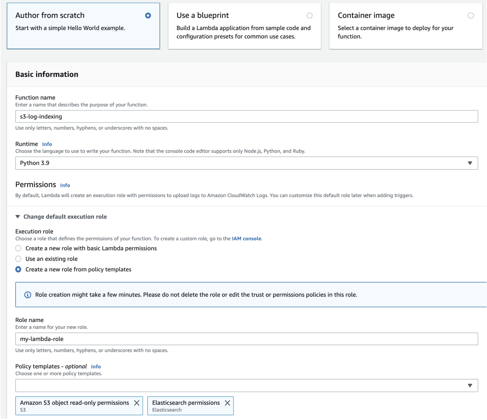

# Loading streaming data from Amazon S3

You can use Lambda to send data to your OpenSearch Service domain from Amazon S3. New data that arrives in
an S3 bucket triggers an event notification to Lambda, which then runs your custom code
to perform the indexing.

This method of streaming data is extremely flexible. You can [index object metadata](https://aws.amazon.com/blogs/database/indexing-metadata-in-amazon-elasticsearch-service-using-aws-lambda-and-python/ "https://aws.amazon.com/blogs/database/indexing-metadata-in-amazon-elasticsearch-service-using-aws-lambda-and-python/"), or if the object is plaintext, parse and index some
elements of the object body. This section includes some unsophisticated Python sample
code that uses regular expressions to parse a log file and index the matches.

## Prerequisites

Before proceeding, you must have the following resources.

| Prerequisite              | Description                                                                                                                                                                                                                                                                                            |
| ------------------------- | ------------------------------------------------------------------------------------------------------------------------------------------------------------------------------------------------------------------------------------------------------------------------------------------------------ | ------------------------------------------------------------------------------------------------------------------------------------------------------------------------------------------------------------------------------------------------------------------------------------------------------------------------------------------------------------------------------------------------------------------------------------------------------------------------------------------------------------------------------------------------------------------------------------------------------------------------------------------------------------------------------------------------------------------------------------------------------------------------------------------------------------------------------------------------------------------------------------------------------------------------------------------------------------------------------------------------------------------------------------------------------------------------------------------------------------------------------------------------------------------------------------------------------------------------------------------------------------------------------------------------------------------------------------------------------------------------------------------------------------------------------------------------------------------------------------------------------------------------------------------------------------------------------------------------------------------------------------------------------------------------------------------------------------------------------------------------------------------------------------------------------------------------------------------------------------------------------------------------------------------------------------------------------------------------------------------------------------------------------------------------------------------------------------------------------------------------------------------------------------------------------------------------------------------------------------------------------------------------------------------------------------------------------------------------------------------------------------------------------------------------------------------------------------------------------------------------------------------------------------------------------------------------------------------------------------------------------------------------------------------------------------------------------------------------------------------------------------------------------------------------------------------------------------------------------------------------------------------------------------------------------------------------------------------------------------------------------------------------------------------------------------------------------------------------------------------------------------------------------------------------------------------------------------------------------------------------------------------------------------------------------------------------------------------------------------------------------------------------------------------------------------------------------------------------------------------------------------------------------------------------------------------------------------------------------------------------------------------------------------------------------------------------------------------------------------------------------------------------------------------------------------------------------------------------------------------------------------------------------------------------------------------------------------------------------------------------------------------------------------------------------------------------------------------------------------------------------------------------------------------------------------------------------------------------------------------------------------------------------------------------------------------------------------------------------------------------------------------------------------------------------------------------------------------------------------------------------------------------------------------------------------------------------------------------------------------------------------------------------------------------------------------------------------------------------------------------------------------------------------------------------------------------------------------------------------------------------------------------------------------------------------------------------------------------------------------------------------------------------------------------------------------------------------------------------------------------------------------------------------------------------------------------------------------------------------------------------------------------------------------------------------------------------------------------------------------------------------------------------------------------------------------------------------------------------------------------------------------------------------------------------------------------------------------------------------------------------------------------------------------------------------------------------------------------------------------------------------------------------------------------------------------------------------------------------------------------------------------------------------------------------------------------------------------------------------------------------------------------- |
| Amazon S3 bucket          | For more information, see [Create your first S3 bucket](../../../AmazonS3/latest/userguide/CreatingABucket.md "../../../AmazonS3/latest/userguide/CreatingABucket.md") in the _Amazon Simple Storage Service User Guide_. The bucket must reside in the same Region as your OpenSearch Service domain. |
| OpenSearch Service domain | The destination for data after your Lambda function processes it. For more information, see [Creating OpenSearch Service domains](createupdatedomains.md#createdomains "createupdatedomains.md#createdomains").                                                                                        | ## Create the Lambda deployment package Deployment packages are ZIP or JAR files that contain your code and its dependencies. This section includes Python sample code. For other programming languages, see [Lambda deployment packages](../../../lambda/latest/dg/gettingstarted-package.md "../../../lambda/latest/dg/gettingstarted-package.md") in the _AWS Lambda Developer Guide_. 1. Create a directory. In this sample, we use the name `s3-to-opensearch`. 2. Create a file within the directory named `sample.py`: `import boto3 import re import requests from requests_aws4auth import AWS4Auth region = '' # e.g. us-west-1 service = 'es' credentials = boto3.Session().get_credentials() awsauth = AWS4Auth(credentials.access_key, credentials.secret_key, region, service, session_token=credentials.token) host = '' # the OpenSearch Service domain, e.g. https://search-mydomain.us-west-1.es.amazonaws.com index = 'lambda-s3-index' datatype = '_doc' url = host + '/' + index + '/' + datatype headers = { "Content-Type": "application/json" } s3 = boto3.client('s3') # Regular expressions used to parse some simple log lines ip_pattern = re.compile('(\d+\.\d+\.\d+\.\d+)') time_pattern = re.compile('\[(\d+\/\w\w\w\/\d\d\d\d:\d\d:\d\d:\d\d\s-\d\d\d\d)\]') message_pattern = re.compile('\"(.+)\"') # Lambda execution starts here def handler(event, context): for record in event['Records']: # Get the bucket name and key for the new file bucket = record['s3']['bucket']['name'] key = record['s3']['object']['key'] # Get, read, and split the file into lines obj = s3.get_object(Bucket=bucket, Key=key) body = obj['Body'].read() lines = body.splitlines() # Match the regular expressions to each line and index the JSON for line in lines: line = line.decode("utf-8") ip = ip_pattern.search(line).group(1) timestamp = time_pattern.search(line).group(1) message = message_pattern.search(line).group(1) document = { "ip": ip, "timestamp": timestamp, "message": message } r = requests.post(url, auth=awsauth, json=document, headers=headers)` Edit the variables for `region` and `host`. 3. [Install pip](https://pip.pypa.io/en/stable/installation/ "https://pip.pypa.io/en/stable/installation/") if you haven't already, then install the dependencies to a new `package` directory: `cd s3-to-opensearch pip install --target ./package requests pip install --target ./package requests_aws4auth` All Lambda execution environments have [Boto3](https://aws.amazon.com/sdk-for-python/ "https://aws.amazon.com/sdk-for-python/") installed, so you don't need to include it in your deployment package. 4. Package the application code and dependencies: `cd package zip -r ../lambda.zip . cd .. zip -g lambda.zip sample.py` ## Create the Lambda function After you create the deployment package, you can create the Lambda function. When you create a function, choose a name, runtime (for example, Python 3.8), and IAM role. The IAM role defines the permissions for your function. For detailed instructions, see [Create a Lambda function with the console](../../../lambda/latest/dg/get-started-create-function.md "../../../lambda/latest/dg/get-started-create-function.md") in the _AWS Lambda Developer Guide_. This example assumes you're using the console. Choose Python 3.9 and a role that has S3 read permissions and OpenSearch Service write permissions, as shown in the following screenshot:  After you create the function, you must add a trigger. For this example, we want the code to run whenever a log file arrives in an S3 bucket: 1. Choose **Add trigger** and select **S3**. 2. Choose your bucket. 3. For **Event type**, choose **PUT**. 4. For **Prefix**, type `logs/`. 5. For **Suffix**, type `.log`. 6. Acknowledge the recursive invocation warning and choose **Add**. Finally, you can upload your deployment package: 1. Choose **Upload from** and **.zip file**, then follow the prompts to upload your deployment package. 2. After the upload finishes, edit the **Runtime settings** and change the **Handler** to `sample.handler`. This setting tells Lambda the file (`sample.py`) and method (`handler`) that it should run after a trigger. At this point, you have a complete set of resources: a bucket for log files, a function that runs whenever a log file is added to the bucket, code that performs the parsing and indexing, and an OpenSearch Service domain for searching and visualization. ## Testing the Lambda Function After you create the function, you can test it by uploading a file to the Amazon S3 bucket. Create a file named `sample.log` using following sample log lines: `12.345.678.90 - [10/Oct/2000:13:55:36 -0700] "PUT /some-file.jpg" 12.345.678.91 - [10/Oct/2000:14:56:14 -0700] "GET /some-file.jpg"` Upload the file to the `logs` folder of your S3 bucket. For instructions, see [Upload an object to your bucket](../../../AmazonS3/latest/userguide/PuttingAnObjectInABucket.md "../../../AmazonS3/latest/userguide/PuttingAnObjectInABucket.md") in the _Amazon Simple Storage Service User Guide_. Then use the OpenSearch Service console or OpenSearch Dashboards to verify that the `lambda-s3-index` index contains two documents. You can also make a standard search request: ``GET https://`domain-name`/lambda-s3-index/_search?pretty { "hits" : { "total" : 2, "max_score" : 1.0, "hits" : [ { "_index" : "lambda-s3-index", "_type" : "_doc", "_id" : "vTYXaWIBJWV_TTkEuSDg", "_score" : 1.0, "_source" : { "ip" : "12.345.678.91", "message" : "GET /some-file.jpg", "timestamp" : "10/Oct/2000:14:56:14 -0700" } }, { "_index" : "lambda-s3-index", "_type" : "_doc", "_id" : "vjYmaWIBJWV_TTkEuCAB", "_score" : 1.0, "_source" : { "ip" : "12.345.678.90", "message" : "PUT /some-file.jpg", "timestamp" : "10/Oct/2000:13:55:36 -0700" } } ] } }`` |
