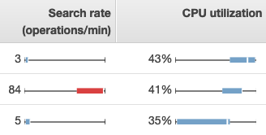

# Monitoring OpenSearch cluster metrics with

Amazon CloudWatch

Amazon OpenSearch Service publishes data from your domains to Amazon CloudWatch. CloudWatch lets you retrieve statistics
about those data points as an ordered set of time-series data, known as _metrics_. OpenSearch Service sends most metrics to CloudWatch in 60-second
intervals. If you use General Purpose or Magnetic EBS volumes, the EBS volume metrics update
only every five minutes. All cumulative metrics (e.g. `ThreadpoolWriteRejected`,
`ThreadpoolSearchRejected`) are in-memory and will lose state. Metrics will
reset during a node drop, node bounce, node replacement, and blue/green deployment. For more
information about Amazon CloudWatch, see the [Amazon CloudWatch User Guide](../../../AmazonCloudWatch/latest/monitoring.md "../../../AmazonCloudWatch/latest/monitoring.md").

The OpenSearch Service console displays a series of charts based on the raw data from CloudWatch. Depending on
your needs, you might prefer to view cluster data in CloudWatch instead of the graphs in the
console. The service archives metrics for two weeks before discarding them. The metrics are
provided at no extra charge, but CloudWatch still charges for creating dashboards and alarms. For
more information, see [Amazon CloudWatch
pricing](https://aws.amazon.com/cloudwatch/pricing/ "https://aws.amazon.com/cloudwatch/pricing/").

OpenSearch Service publishes the following metrics to CloudWatch:

- [Cluster
  metrics](#managedomains-cloudwatchmetrics-cluster-metrics "#managedomains-cloudwatchmetrics-cluster-metrics")
- [Dedicated master
  node metrics](#managedomains-cloudwatchmetrics-master-node-metrics "#managedomains-cloudwatchmetrics-master-node-metrics")
- [EBS volume
  metrics](#managedomains-cloudwatchmetrics-master-ebs-metrics "#managedomains-cloudwatchmetrics-master-ebs-metrics")
- [Instance
  metrics](#managedomains-cloudwatchmetrics-instance-metrics "#managedomains-cloudwatchmetrics-instance-metrics")
- [UltraWarm metrics](#managedomains-cloudwatchmetrics-uw "#managedomains-cloudwatchmetrics-uw")
- [Dedicated coordinator node
  metrics](#managedomains-dedicated-coordinator-nodes "#managedomains-dedicated-coordinator-nodes")
- [Cold storage
  metrics](#managedomains-cloudwatchmetrics-coldstorage "#managedomains-cloudwatchmetrics-coldstorage")
- [Alerting metrics](#managedomains-cloudwatchmetrics-alerting "#managedomains-cloudwatchmetrics-alerting")
- [Anomaly detection
  metrics](#managedomains-cloudwatchmetrics-anomaly-detection "#managedomains-cloudwatchmetrics-anomaly-detection")
- [Asynchronous
  search metrics](#managedomains-cloudwatchmetrics-asynchronous-search "#managedomains-cloudwatchmetrics-asynchronous-search")
- [SQL metrics](#managedomains-cloudwatchmetrics-sql "#managedomains-cloudwatchmetrics-sql")
- [k-NN metrics](#managedomains-cloudwatchmetrics-knn "#managedomains-cloudwatchmetrics-knn")
- [Cross-cluster
  search metrics](#managedomains-cloudwatchmetrics-cross-cluster-search "#managedomains-cloudwatchmetrics-cross-cluster-search")
- [Cross-cluster replication
  metrics](#managedomains-cloudwatchmetrics-replication "#managedomains-cloudwatchmetrics-replication")
- [Learning to Rank
  metrics](#managedomains-cloudwatchmetrics-learning-to-rank "#managedomains-cloudwatchmetrics-learning-to-rank")
- [Piped Processing Language
  metrics](#managedomains-cloudwatchmetrics-ppl "#managedomains-cloudwatchmetrics-ppl")

## Viewing metrics in CloudWatch

CloudWatch metrics are grouped first by the service namespace, and then by the various
dimension combinations within each namespace.

###### To view metrics using the CloudWatch console

1. Open the CloudWatch console at [https://console.aws.amazon.com/cloudwatch/](https://console.aws.amazon.com/cloudwatch/ "https://console.aws.amazon.com/cloudwatch/").
2. In the left navigation pane, find **Metrics** and choose
   **All metrics**. Select the
   **ES/OpenSearchService** namespace.
3. Choose a dimension to view the corresponding metrics. Metrics for individual
   nodes are in the `ClientId, DomainName, NodeId` dimension. Cluster
   metrics are in the `Per-Domain, Per-Client Metrics` dimension. Some
   node metrics are aggregated at the cluster level and thus included in both
   dimensions. Shard metrics are in the `ClientId, DomainName, NodeId,
ShardRole` dimension.

**To view a list of metrics using the AWS CLI**

Run the following command:

```
aws cloudwatch list-metrics --namespace "AWS/ES"
```

## Interpreting health charts

in OpenSearch Service

To view metrics in OpenSearch Service, use the **Cluster health** and
**Instance health** tabs. The **Instance health**
tab uses box charts to provide at-a-glance visibility into the health of each OpenSearch
node:



- Each colored box shows the range of values for the node over the specified
  time period.
- Blue boxes represent values that are consistent with other nodes. Red boxes
  represent outliers.
- The white line within each box shows the node's current value.
- The “whiskers” on either side of each box show the minimum and maximum values
  for all nodes over the time period.

If you make configuration changes to your domain, the list of individual instances in the
**Cluster health** and **Instance health** tabs often
double in size for a brief period before returning to the correct number. For an explanation
of this behavior, see [Making configuration changes in
Amazon OpenSearch Service](managedomains-configuration-changes.md "managedomains-configuration-changes.md").

## Cluster

metrics

Amazon OpenSearch Service provides the following metrics for clusters.

| Metric                                                     | Description                                                                                                                                                                                                                                                                                                                                                                                                                                                                                                                                                                                                                                                                                                                                                                                                                                                                                                                                                                                                                                                                                                                                                                                                                      |
| ---------------------------------------------------------- | -------------------------------------------------------------------------------------------------------------------------------------------------------------------------------------------------------------------------------------------------------------------------------------------------------------------------------------------------------------------------------------------------------------------------------------------------------------------------------------------------------------------------------------------------------------------------------------------------------------------------------------------------------------------------------------------------------------------------------------------------------------------------------------------------------------------------------------------------------------------------------------------------------------------------------------------------------------------------------------------------------------------------------------------------------------------------------------------------------------------------------------------------------------------------------------------------------------------------------- |
| `ClusterStatus.green`                                      | A value of 1 indicates that all index shards are allocated to<br>nodes in the cluster.<br>Relevant statistics: Maximum                                                                                                                                                                                                                                                                                                                                                                                                                                                                                                                                                                                                                                                                                                                                                                                                                                                                                                                                                                                                                                                                                                           |
| `ClusterStatus.yellow`                                     | A value of 1 indicates that the primary shards for all indexes are<br>allocated to nodes in the cluster, but replica shards for at least one<br>index are not. For more information, see [Yellow cluster status](handling-errors.md#handling-errors-yellow-cluster-status "handling-errors.md#handling-errors-yellow-cluster-status").Relevant<br>statistics: Maximum                                                                                                                                                                                                                                                                                                                                                                                                                                                                                                                                                                                                                                                                                                                                                                                                                                                            |
| `ClusterStatus.red`                                        | A value of 1 indicates that the primary and replica shards for at<br>least one index are not allocated to nodes in the cluster. For more<br>information, see [Red cluster status](handling-errors.md#handling-errors-red-cluster-status "handling-errors.md#handling-errors-red-cluster-status").<br>Relevant statistics: Maximum                                                                                                                                                                                                                                                                                                                                                                                                                                                                                                                                                                                                                                                                                                                                                                                                                                                                                                |
| `Shards.active`                                            | The total number of active primary and replica shards.<br>Relevant statistics: Maximum, Sum                                                                                                                                                                                                                                                                                                                                                                                                                                                                                                                                                                                                                                                                                                                                                                                                                                                                                                                                                                                                                                                                                                                                      |
| `Shards.unassigned`                                        | The number of shards that are not allocated to nodes in the<br>cluster.<br>Relevant statistics: Maximum, Sum                                                                                                                                                                                                                                                                                                                                                                                                                                                                                                                                                                                                                                                                                                                                                                                                                                                                                                                                                                                                                                                                                                                     |
| `Shards.delayedUnassigned`                                 | The number of shards whose node allocation has been delayed by the<br>timeout settings.<br>Relevant statistics: Maximum, Sum                                                                                                                                                                                                                                                                                                                                                                                                                                                                                                                                                                                                                                                                                                                                                                                                                                                                                                                                                                                                                                                                                                     |
| `Shards.activePrimary`                                     | The number of active primary shards.<br>Relevant statistics: Maximum, Sum                                                                                                                                                                                                                                                                                                                                                                                                                                                                                                                                                                                                                                                                                                                                                                                                                                                                                                                                                                                                                                                                                                                                                        |
| `Shards.initializing`                                      | The number of shards that are under initialization.<br>Relevant statistics: Sum                                                                                                                                                                                                                                                                                                                                                                                                                                                                                                                                                                                                                                                                                                                                                                                                                                                                                                                                                                                                                                                                                                                                                  |
| `Shards.relocating`                                        | The number of shards that are under relocation.<br>Relevant statistics: Sum                                                                                                                                                                                                                                                                                                                                                                                                                                                                                                                                                                                                                                                                                                                                                                                                                                                                                                                                                                                                                                                                                                                                                      |
| `Nodes`                                                    | The number of nodes in the OpenSearch Service cluster, including dedicated<br>master nodes and UltraWarm nodes. For more information, see [Making configuration changes in<br>Amazon OpenSearch Service](managedomains-configuration-changes.md "managedomains-configuration-changes.md").<br>Relevant statistics: Maximum                                                                                                                                                                                                                                                                                                                                                                                                                                                                                                                                                                                                                                                                                                                                                                                                                                                                                                       |
| `SearchableDocuments`                                      | The total number of searchable documents across all data nodes in<br>the cluster.<br>Relevant statistics: Minimum, Maximum, Average                                                                                                                                                                                                                                                                                                                                                                                                                                                                                                                                                                                                                                                                                                                                                                                                                                                                                                                                                                                                                                                                                              |
| `DeletedDocuments`                                         | The total number of documents marked for deletion across all data<br>nodes in the cluster. These documents no longer appear in search<br>results, but OpenSearch only removes deleted documents from disk<br>during segment merges. This metric increases after delete requests<br>and decreases after segment merges.<br>Relevant statistics: Minimum, Maximum, Average                                                                                                                                                                                                                                                                                                                                                                                                                                                                                                                                                                                                                                                                                                                                                                                                                                                         |
| `CPUUtilization`                                           | The percentage of CPU usage for data nodes in the cluster. Maximum<br>shows the node with the highest CPU usage. Average represents all<br>nodes in the cluster. This metric is also available for individual<br>nodes.<br>Relevant statistics: Maximum, Average                                                                                                                                                                                                                                                                                                                                                                                                                                                                                                                                                                                                                                                                                                                                                                                                                                                                                                                                                                 |
| `FreeStorageSpace`                                         | The free space for data nodes in the cluster. `Sum`<br>shows total free space for the cluster, but you must leave the<br>period at one minute to get an accurate value. `Minimum`<br>and `Maximum` show the nodes with the least and most free<br>space, respectively. This metric is also available for individual<br>nodes. OpenSearch Service throws a `ClusterBlockException` when this<br>metric reaches `0`. To recover, you must either delete<br>indexes, add larger instances, or add EBS-based storage to existing<br>instances. To learn more, see [Lack of available storage space](handling-errors.md#handling-errors-watermark "handling-errors.md#handling-errors-watermark").<br>The OpenSearch Service console displays this value in GiB. The Amazon CloudWatch console<br>displays it in MiB.<br>Note`FreeStorageSpace` will always be lower than the<br>values that the OpenSearch `_cluster/stats` and<br>`_cat/allocation` APIs provide. OpenSearch Service reserves a<br>percentage of the storage space on each instance for internal<br>operations. For more information, see [Calculating storage requirements](bp-storage.md "bp-storage.md").<br>Relevant statistics: Minimum, Maximum, Average, Sum |
| `ClusterUsedSpace`                                         | The total used space for the cluster. You must leave the period at<br>one minute to get an accurate value.<br>The OpenSearch Service console displays this value in GiB. The Amazon CloudWatch console<br>displays it in MiB.<br>Relevant statistics: Minimum, Maximum                                                                                                                                                                                                                                                                                                                                                                                                                                                                                                                                                                                                                                                                                                                                                                                                                                                                                                                                                           |
| `ClusterIndexWritesBlocked`                                | Indicates whether your cluster is accepting or blocking incoming<br>write requests. A value of 0 means that the cluster is accepting<br>requests. A value of 1 means that it is blocking requests.<br>Some common factors include the following:<br>`FreeStorageSpace` is too low or<br>`JVMMemoryPressure` is too high. To alleviate this<br>issue, consider adding more disk space or scaling your<br>cluster.<br>Relevant statistics: Maximum                                                                                                                                                                                                                                                                                                                                                                                                                                                                                                                                                                                                                                                                                                                                                                                 |
| `JVMMemoryPressure`                                        | The maximum percentage of the Java heap used for all data nodes in<br>the cluster. OpenSearch Service uses half of an instance's RAM for the Java heap, up to a heap size of 32 GiB. You can scale instances vertically up to 64 GiB of RAM, at which point you can scale horizontally by adding instances. See [Recommended CloudWatch alarms for Amazon OpenSearch Service](cloudwatch-alarms.md "cloudwatch-alarms.md").<br>Relevant statistics: Maximum<br>NoteThe logic for this metric changed in service software<br>R20220323. For more information, see the [release notes](release-notes.md "release-notes.md").                                                                                                                                                                                                                                                                                                                                                                                                                                                                                                                                                                                                       |
| `OldGenJVMMemoryPressure`                                  | The maximum percentage of the Java heap used for the "old<br>generation" on all data nodes in the cluster. This metric is also<br>available at the node level.<br>Relevant statistics: Maximum                                                                                                                                                                                                                                                                                                                                                                                                                                                                                                                                                                                                                                                                                                                                                                                                                                                                                                                                                                                                                                   |
| `AutomatedSnapshotFailure`                                 | The number of failed automated snapshots for the cluster. A value<br>of `1` indicates that no automated snapshot was taken for<br>the domain in the previous 36 hours.<br>Relevant statistics: Minimum, Maximum                                                                                                                                                                                                                                                                                                                                                                                                                                                                                                                                                                                                                                                                                                                                                                                                                                                                                                                                                                                                                  |
| `CPUCreditBalance`                                         | The remaining CPU credits available for data nodes in the cluster.<br>A CPU credit provides the performance of a full CPU core for one<br>minute. For more information, see [CPU<br>credits](../../../AWSEC2/latest/UserGuide/burstable-credits-baseline-concepts.md "../../../AWSEC2/latest/UserGuide/burstable-credits-baseline-concepts.md") in the _Amazon EC2 Developer<br>Guide_. This metric is available only for the T2<br>instance types.<br>Relevant statistics: Minimum                                                                                                                                                                                                                                                                                                                                                                                                                                                                                                                                                                                                                                                                                                                                              |
| `OpenSearchDashboardsHealthyNodes`                         | A health check for OpenSearch Dashboards. If the minimum, maximum,<br>and average are all equal to 1, Dashboards is behaving normally. If<br>you have 10 nodes with a maximum of 1, minimum of 0, and average of<br>0.7, this means 7 nodes (70%) are healthy and 3 nodes (30%) are<br>unhealthy.<br>Relevant statistics: Minimum, Maximum, Average                                                                                                                                                                                                                                                                                                                                                                                                                                                                                                                                                                                                                                                                                                                                                                                                                                                                              |
| `OpensearchDashboardsReportingFailedRequestSysErrCount`    | The number of requests to generate OpenSearch Dashboards reports<br>that failed due to server problems or feature limitations.<br>Relevant statistics: Sum                                                                                                                                                                                                                                                                                                                                                                                                                                                                                                                                                                                                                                                                                                                                                                                                                                                                                                                                                                                                                                                                       |
| `OpensearchDashboardsReportingFailedRequestUserErrCount`   | The number of requests to generate OpenSearch Dashboards reports<br>that failed due to client issues.<br>Relevant statistics: Sum                                                                                                                                                                                                                                                                                                                                                                                                                                                                                                                                                                                                                                                                                                                                                                                                                                                                                                                                                                                                                                                                                                |
| `OpensearchDashboardsReportingRequestCount`                | The total number of requests to generate OpenSearch Dashboards<br>reports.<br>Relevant statistics: Sum                                                                                                                                                                                                                                                                                                                                                                                                                                                                                                                                                                                                                                                                                                                                                                                                                                                                                                                                                                                                                                                                                                                           |
| `OpensearchDashboardsReportingSuccessCount`                | The number of successful requests to generate OpenSearch Dashboards<br>reports.<br>Relevant statistics: Sum                                                                                                                                                                                                                                                                                                                                                                                                                                                                                                                                                                                                                                                                                                                                                                                                                                                                                                                                                                                                                                                                                                                      |
| `KMSKeyError`                                              | A value of 1 indicates that the AWS KMS key used to encrypt data at<br>rest has been disabled. To restore the domain to normal operations,<br>re-enable the key. The console displays this metric only for domains<br>that encrypt data at rest.<br>Relevant statistics: Minimum, Maximum                                                                                                                                                                                                                                                                                                                                                                                                                                                                                                                                                                                                                                                                                                                                                                                                                                                                                                                                        |
| `KMSKeyInaccessible`                                       | A value of 1 indicates that the AWS KMS key used to encrypt data at<br>rest has been deleted or revoked its grants to OpenSearch Service. You can't<br>recover domains that are in this state. If you have a manual<br>snapshot, though, you can use it to migrate the domain's data<br>to a new domain. The console displays this metric only for domains<br>that encrypt data at rest.<br>Relevant statistics: Minimum, Maximum                                                                                                                                                                                                                                                                                                                                                                                                                                                                                                                                                                                                                                                                                                                                                                                                |
| `InvalidHostHeaderRequests`                                | The number of HTTP requests made to the OpenSearch cluster that<br>included an invalid (or missing) host header. Valid requests include<br>the domain hostname as the host header value. OpenSearch Service rejects invalid<br>requests for public access domains that don't have a<br>restrictive access policy. We recommend applying a restrictive<br>access policy to all domains.<br>If you see large values for this metric, confirm that your<br>OpenSearch clients include the domain hostname (and not, for example,<br>its IP address) in their requests.<br>Relevant statistics: Sum                                                                                                                                                                                                                                                                                                                                                                                                                                                                                                                                                                                                                                  |
| `OpenSearchRequests (previously<br>ElasticsearchRequests)` | The number of requests made to the OpenSearch cluster.<br>Relevant statistics: Sum                                                                                                                                                                                                                                                                                                                                                                                                                                                                                                                                                                                                                                                                                                                                                                                                                                                                                                                                                                                                                                                                                                                                               |
| `2xx, 3xx, 4xx, 5xx`                                       | The number of requests to the domain that resulted in the given<br>HTTP response code (2*xx*,<br>3*xx*, 4*xx*,<br>5*xx*).<br>Relevant statistics: Sum                                                                                                                                                                                                                                                                                                                                                                                                                                                                                                                                                                                                                                                                                                                                                                                                                                                                                                                                                                                                                                                                            |
| `ThroughputThrottle`                                       | Indicates whether or not disks have been throttled. Throttling<br>occurs when the combined throughput of<br>`ReadThroughputMicroBursting` and<br>`WriteThroughputMicroBursting` is higher than maximum<br>throughput, `MaxProvisionedThroughput`.<br>`MaxProvisionedThroughput` is the lower value of the<br>instance throughput or the provisioned volume throughput. A value of<br>1 indicates that disks have been throttled. A value of 0 indicates<br>normal behavior.<br>For information on instance throughput, see [Amazon EBS–optimized<br>instances](../../../AWSEC2/latest/UserGuide/ebs-optimized.md "../../../AWSEC2/latest/UserGuide/ebs-optimized.md"). For information on volume throughput, see<br>[Amazon EBS volume<br>types](https://console.aws.amazon.com/ebs/volume-types/ "https://console.aws.amazon.com/ebs/volume-types/").<br>Relevant statistics: Minimum, Maximum                                                                                                                                                                                                                                                                                                                                  |
| `IopsThrottle`                                             | Indicates whether or not the number of input/output operations per<br>second (IOPS) on the domain have been throttled. Throttling occurs<br>when IOPS of the data node breach the maximum allowed limit of the<br>EBS volume or the EC2 instance of the data node.<br>For information on instance IOPS, see [Amazon EBS–optimized<br>instances](../../../AWSEC2/latest/UserGuide/ebs-optimized.md "../../../AWSEC2/latest/UserGuide/ebs-optimized.md"). For information on volume IOPS, see [Amazon EBS volume<br>types](https://aws.amazon.com/ebs/volume-types/ "https://aws.amazon.com/ebs/volume-types/").<br>Relevant statistics: Minimum, Maximum                                                                                                                                                                                                                                                                                                                                                                                                                                                                                                                                                                          |
| `HighSwapUsage`                                            | A value of 1 indicates that swapping due to page faults has<br>potentially caused spikes in underlying disk usage during a specific<br>time period.<br>Relevant statistics: Maximum                                                                                                                                                                                                                                                                                                                                                                                                                                                                                                                                                                                                                                                                                                                                                                                                                                                                                                                                                                                                                                              |

## Dedicated master

node metrics

Amazon OpenSearch Service provides the following metrics for [dedicated master nodes](managedomains-dedicatedmasternodes.md "managedomains-dedicatedmasternodes.md").

| Metric                          | Description                                                                                                                                                                                                                                                                                                                                                                                                                                                                                     |
| ------------------------------- | ----------------------------------------------------------------------------------------------------------------------------------------------------------------------------------------------------------------------------------------------------------------------------------------------------------------------------------------------------------------------------------------------------------------------------------------------------------------------------------------------- |
| `MasterCPUUtilization`          | The maximum percentage of CPU resources used by the dedicated<br>master nodes. We recommend increasing the size of the instance type<br>when this metric reaches 60 percent.<br>Relevant statistics: Maximum                                                                                                                                                                                                                                                                                    |
| `MasterFreeStorageSpace`        | This metric is not relevant and can be ignored. The service does<br>not use master nodes as data nodes.                                                                                                                                                                                                                                                                                                                                                                                         |
| `MasterJVMMemoryPressure`       | The maximum percentage of the Java heap used for all dedicated<br>master nodes in the cluster. We recommend moving to a larger<br>instance type when this metric reaches 85 percent.<br>Relevant statistics: Maximum<br>NoteThe logic for this metric changed in service software<br>R20220323. For more information, see the [release notes](release-notes.md "release-notes.md").                                                                                                             |
| `MasterOldGenJVMMemoryPressure` | The maximum percentage of the Java heap used for the "old<br>generation" per master node.<br>Relevant statistics: Maximum                                                                                                                                                                                                                                                                                                                                                                       |
| `MasterCPUCreditBalance`        | The remaining CPU credits available for dedicated master nodes in<br>the cluster. A CPU credit provides the performance of a full CPU<br>core for one minute. For more information, see [CPU<br>credits](../../../AWSEC2/latest/UserGuide/burstable-credits-baseline-concepts.md "../../../AWSEC2/latest/UserGuide/burstable-credits-baseline-concepts.md") in the _Amazon EC2 Developer<br>Guide_. This metric is available only for the T2<br>instance types.<br>Relevant statistics: Minimum |
| `MasterReachableFromNode`       | A health check for `MasterNotDiscovered` exceptions. A<br>value of 1 indicates normal behavior. A value of 0 indicates that<br>`/_cluster/health/` is failing.<br>Failures mean that the master node is unreachable from the source<br>node. They're usually the result of a network connectivity issue or<br>an AWS dependency problem.<br>Relevant statistics: Maximum                                                                                                                        |
| `MasterSysMemoryUtilization`    | The percentage of the master node's memory that is in<br>use.<br>Relevant statistics: Maximum                                                                                                                                                                                                                                                                                                                                                                                                   |

## Dedicated coordinator node

metrics

Amazon OpenSearch Service provides the following metrics for Dedicated coordinator
nodes.

| Metric                               | Description                                                                                                                                                                                                               |
| ------------------------------------ | ------------------------------------------------------------------------------------------------------------------------------------------------------------------------------------------------------------------------- |
| `CoordinatorCPUUtilization`          | The maximum percentage of CPU resources used by the dedicated<br>coordinator nodes. We recommend increasing the size of the instance<br>type when this metric reaches 80 percent.<br>Relevant statistics: Maximum         |
| `CoordinatorJVMMemoryPressure`       | The maximum percentage of the Java heap used for all dedicated<br>coordinator nodes in the cluster. We recommend moving to a larger<br>instance type when this metric reaches 85 percent.<br>Relevant statistics: Maximum |
| `CoordinatorOldGenJVMMemoryPressure` | The maximum percentage of the Java heap used for the "old<br>generation" per master node.<br>Relevant statistics: Maximum                                                                                                 |
| `CoordinatorSysMemoryUtilization`    | The percentage of the coordinator node's memory that is in<br>use.<br>Relevant statistics: Maximum                                                                                                                        |
| `CoordinatorFreeStorageSpace`        | This metric indicates that the service does not use coordinator<br>nodes as data nodes.                                                                                                                                   |

## EBS volume

metrics

Amazon OpenSearch Service provides the following metrics for EBS volumes.

| Metric                         | Description                                                                                                                                                                                                                                                                                                                                                                                                                                                                                                                                                     |
| ------------------------------ | --------------------------------------------------------------------------------------------------------------------------------------------------------------------------------------------------------------------------------------------------------------------------------------------------------------------------------------------------------------------------------------------------------------------------------------------------------------------------------------------------------------------------------------------------------------- |
| `ReadLatency`                  | The latency, in seconds, for read operations on EBS volumes. This<br>metric is also available for individual nodes.<br>Relevant statistics: Minimum, Maximum, Average                                                                                                                                                                                                                                                                                                                                                                                           |
| `WriteLatency`                 | The latency, in seconds, for write operations on EBS volumes. This<br>metric is also available for individual nodes.<br>Relevant statistics: Minimum, Maximum, Average                                                                                                                                                                                                                                                                                                                                                                                          |
| `ReadThroughput`               | The throughput, in bytes per second, for read operations on EBS<br>volumes. This metric is also available for individual nodes.<br>Relevant statistics: Minimum, Maximum, Average                                                                                                                                                                                                                                                                                                                                                                               |
| `ReadThroughputMicroBursting`  | The throughput, in bytes per second, for read operations on EBS<br>volumes when [micro-bursting](https://repost.aws/knowledge-center/ebs-identify-micro-bursting "https://repost.aws/knowledge-center/ebs-identify-micro-bursting") is taken into consideration. This metric<br>is also available for individual nodes. Micro-bursting occurs when<br>an EBS volume bursts high IOPS or throughput for significantly<br>shorter periods of time (less than one minute).<br>Relevant statistics: Minimum, Maximum, Average                                       |
| `WriteThroughput`              | The throughput, in bytes per second, for write operations on EBS<br>volumes. This metric is also available for individual nodes.<br>Relevant statistics: Minimum, Maximum, Average                                                                                                                                                                                                                                                                                                                                                                              |
| `WriteThroughputMicroBursting` | The throughput, in bytes per second, for write operations on EBS<br>volumes when [micro-bursting](https://repost.aws/knowledge-center/ebs-identify-micro-bursting "https://repost.aws/knowledge-center/ebs-identify-micro-bursting") is taken into consideration. This metric<br>is also available for individual nodes. Micro-bursting occurs when<br>an EBS volume bursts high IOPS or throughput for significantly<br>shorter periods of time (less than one minute).<br>Relevant statistics: Minimum, Maximum, Average                                      |
| `DiskQueueDepth`               | The number of pending input and output (I/O) requests for an EBS<br>volume.<br>Relevant statistics: Minimum, Maximum, Average                                                                                                                                                                                                                                                                                                                                                                                                                                   |
| `ReadIOPS`                     | The number of input and output (I/O) operations per second for<br>read operations on EBS volumes. This metric is also available for<br>individual nodes.<br>Relevant statistics: Minimum, Maximum, Average                                                                                                                                                                                                                                                                                                                                                      |
| `ReadIOPSMicroBursting`        | The number of input and output (I/O) operations per second for<br>read operations on EBS volumes when [micro-bursting](https://repost.aws/knowledge-center/ebs-identify-micro-bursting "https://repost.aws/knowledge-center/ebs-identify-micro-bursting") is taken into consideration. This metric<br>is also available for individual nodes. Micro-bursting occurs when<br>an EBS volume bursts high IOPS or throughput for significantly<br>shorter periods of time (less than one minute).<br>Relevant statistics: Minimum, Maximum, Average                 |
| `WriteIOPS`                    | The number of input and output (I/O) operations per second for<br>write operations on EBS volumes. This metric is also available for<br>individual nodes.<br>Relevant statistics: Minimum, Maximum, Average                                                                                                                                                                                                                                                                                                                                                     |
| `WriteIOPSMicroBursting`       | The number of input and output (I/O) operations per second for<br>write operations on EBS volumes when [micro-bursting](https://repost.aws/knowledge-center/ebs-identify-micro-bursting "https://repost.aws/knowledge-center/ebs-identify-micro-bursting") is taken into consideration. This metric<br>is also available for individual nodes. Micro-bursting occurs when<br>an EBS volume bursts high IOPS or throughput for significantly<br>shorter periods of time (less than one minute).<br>Relevant statistics: Minimum, Maximum, Average                |
| `BurstBalance`                 | The percentage of input and output (I/O) credits remaining in the<br>burst bucket for an EBS volume. A value of 100 means that the volume<br>has accumulated the maximum number of credits. If this percentage<br>falls below 70%, see [Low EBS burst balance](handling-errors.md#handling-errors-low-ebs-burst "handling-errors.md#handling-errors-low-ebs-burst"). The burst balance stays at 0 for domains with gp3 volumes types,<br>and domains with gp2 volumes that have a volume size above 1000 GiB.<br>Relevant statistics: Minimum, Maximum, Average |
| `VolumeStalledIOcheck`         | The status of your EBS volumes to determine when they are<br>impaired. The metrics is a binary value that returns a 0 (pass) or a<br>1 (fail) status based on whether the EBS volume can complete input<br>and output operations. `VolumeStalledIOcheck` is also<br>available for individual nodes.<br>Relevant statistics: Minimum, Maximum, Average                                                                                                                                                                                                           |

## Instance

metrics

Amazon OpenSearch Service provides the following metrics for each instance in a domain. OpenSearch Service also
aggregates these instance metrics to provide insight into overall cluster health. You
can verify this behavior using the **Sample Count** statistic in the
console. Note that each metric in the following table has relevant statistics for the
node _and_ the cluster.

###### Important

Different versions of Elasticsearch use different thread pools to process calls to
the `_index` API. Elasticsearch 1.5 and 2.3 use the index thread pool.
Elasticsearch 5._x_, 6.0, and 6.2 use the bulk
thread pool. OpenSearch and Elasticsearch 6.3 and later use the write thread pool.
Currently, the OpenSearch Service console doesn't include a graph for the bulk thread
pool.

Use `GET _cluster/settings?include_defaults=true` to check thread pool
and queue sizes for your cluster.

| Metric                                         | Description                                                                                                                                                                                                                                                                                                                                                                                                                                                                                                                                                                                                                                                                         |
| ---------------------------------------------- | ----------------------------------------------------------------------------------------------------------------------------------------------------------------------------------------------------------------------------------------------------------------------------------------------------------------------------------------------------------------------------------------------------------------------------------------------------------------------------------------------------------------------------------------------------------------------------------------------------------------------------------------------------------------------------------- |
| `FetchLatency`                                 | The difference in total time, in milliseconds, taken by all shard<br>fetch operations in a node between minute N and minute (N<br>• 1).<br>Relevant node statistics: Average<br>Relevant cluster statistics: Average, Maximum                                                                                                                                                                                                                                                                                                                                                                                                                                                       |
| `FetchRate`                                    | The total number of shard fetch operations per minute for all<br>shards on a data node.<br>Relevant node statistics: Average<br>Relevant cluster statistics: Average, Maximum, Sum                                                                                                                                                                                                                                                                                                                                                                                                                                                                                                  |
| `ScrollTotal`                                  | The total number of shard scroll operations per minute for all<br>shards on a data node.<br>Relevant node statistics: Average, Maximum<br>Relevant cluster statistics: Average, Maximum, Sum                                                                                                                                                                                                                                                                                                                                                                                                                                                                                        |
| `ScrollCurrent`                                | The number of shard scroll operations that are currently<br>running.<br>Relevant node statistics: Average, Maximum<br>Relevant cluster statistics: Average, Maximum, Sum                                                                                                                                                                                                                                                                                                                                                                                                                                                                                                            |
| `OpenContexts`                                 | The number of open search contexts.<br>Relevant node statistics: Average, Maximum<br>Relevant cluster statistics: Average, Maximum, Sum                                                                                                                                                                                                                                                                                                                                                                                                                                                                                                                                             |
| `ThreadCount`                                  | The total number of threads currently being utilized by the<br>OpenSearch process.<br>Relevant node statistics: Average, Maximum<br>Relevant cluster statistics: Average, Maximum, Sum                                                                                                                                                                                                                                                                                                                                                                                                                                                                                              |
| `ShardReactivateCount`                         | The total number of times that all shards have been activated from<br>an idle state.<br>Relevant node statistics: Sum, Maximum<br>Relevant cluster statistics: Sum, Maximum                                                                                                                                                                                                                                                                                                                                                                                                                                                                                                         |
| `ConcurrentSearchRate`                         | The total number of search requests using concurrent segment<br>search per minute for all shards on a data node. A single call to<br>the `_search` API might return results from many<br>different shards. If five of these shards are on one node, the node<br>would report 5 for this metric, even though the client only made one<br>request.<br>Relevant node statistics: Average<br>Relevant cluster statistics: Average, Maximum, Sum                                                                                                                                                                                                                                         |
| `ConcurrentSearchLatency`                      | The difference in total time, in milliseconds, taken by all<br>searches using concurrent segment search in a node between minute N<br>and minute (N-1).<br>Relevant node statistics: Average<br>Relevant cluster statistics: Average, Maximum                                                                                                                                                                                                                                                                                                                                                                                                                                       |
| `IndexingLatency`                              | The difference in total time, in milliseconds, taken by all<br>indexing operations in a node between minute N and minute<br>(N-1).<br>Relevant node statistics: Average<br>Relevant cluster statistics: Average, Maximum                                                                                                                                                                                                                                                                                                                                                                                                                                                            |
| `IndexingRate`                                 | The number of indexing operations per minute. A single call to the<br>`_bulk` API that adds two documents and updates two<br>counts as four operations, which might be spread across one or more<br>nodes. If that index has one or more replicas and is on an OpenSearch<br>domain without [optimized instances](or1.md "or1.md"), other nodes in the cluster also<br>record a total of four indexing operations. For OpenSearch domains<br>with optimized instances, other nodes with replicas do not record<br>any operation. Document deletions do not count towards this<br>metric.<br>Relevant node statistics: Average<br>Relevant cluster statistics: Average, Maximum, Sum |
| `SearchLatency`                                | The difference in total time, in milliseconds, taken by all<br>searches in a node between minute N and minute (N-1).<br>Relevant node statistics: Average<br>Relevant cluster statistics: Average, Maximum                                                                                                                                                                                                                                                                                                                                                                                                                                                                          |
| `SearchRate`                                   | The total number of search requests per minute for all shards on a<br>data node. A single call to the `_search` API might<br>return results from many different shards. If five of these shards<br>are on one node, the node would report 5 for this metric, even<br>though the client only made one request.<br>Relevant node statistics: Average<br>Relevant cluster statistics: Average, Maximum, Sum                                                                                                                                                                                                                                                                            |
| `SegmentCount`                                 | The number of segments on a data node. The more segments you have,<br>the longer each search takes. OpenSearch occasionally merges<br>smaller segments into a larger one.<br>Relevant node statistics: Maximum, Average<br>Relevant cluster statistics: Sum, Maximum, Average                                                                                                                                                                                                                                                                                                                                                                                                       |
| `SysMemoryUtilization`                         | The percentage of the instance's memory that is in use. High<br>values for this metric are normal and usually do not represent a<br>problem with your cluster. For a better indicator of potential<br>performance and stability issues, see the<br>`JVMMemoryPressure` metric.<br>Relevant node statistics: Minimum, Maximum, Average<br>Relevant cluster statistics: Minimum, Maximum, Average                                                                                                                                                                                                                                                                                     |
| `JVMGCYoungCollectionCount`                    | The number of times that "young generation" garbage collection has<br>run. A large, ever-growing number of runs is a normal part of<br>cluster operations.<br>Relevant node statistics: Maximum<br>Relevant cluster statistics: Sum, Maximum, Average                                                                                                                                                                                                                                                                                                                                                                                                                               |
| `JVMGCYoungCollectionTime`                     | The amount of time, in milliseconds, that the cluster has spent<br>performing "young generation" garbage collection.<br>Relevant node statistics: Maximum<br>Relevant cluster statistics: Sum, Maximum, Average                                                                                                                                                                                                                                                                                                                                                                                                                                                                     |
| `JVMGCOldCollectionCount`                      | The number of times that "old generation" garbage collection has<br>run. In a cluster with sufficient resources, this number should<br>remain small and grow infrequently.<br>Relevant node statistics: Maximum<br>Relevant cluster statistics: Sum, Maximum, Average                                                                                                                                                                                                                                                                                                                                                                                                               |
| `JVMGCOldCollectionTime`                       | The amount of time, in milliseconds, that the cluster has spent<br>performing "old generation" garbage collection.<br>Relevant node statistics: Maximum<br>Relevant cluster statistics: Sum, Maximum, Average                                                                                                                                                                                                                                                                                                                                                                                                                                                                       |
| `OpenSearchDashboardsConcurrentConnections`    | The number of active concurrent connections to OpenSearch<br>Dashboards. If this number is consistently high, consider scaling<br>your cluster.<br>Relevant node statistics: Maximum<br>Relevant cluster statistics: Sum, Maximum, Average                                                                                                                                                                                                                                                                                                                                                                                                                                          |
| `OpenSearchDashboardsHealthyNode`              | A health check for the individual OpenSearch Dashboards node. A<br>value of 1 indicates normal behavior. A value of 0 indicates that<br>Dashboards is inaccessible.<br>Relevant node statistics: Minimum<br>Relevant cluster statistics: Minimum, Maximum, Average                                                                                                                                                                                                                                                                                                                                                                                                                  |
| `OpenSearchDashboardsHeapTotal`                | The amount of heap memory allocated to OpenSearch Dashboards in<br>MiB. Different EC2 instance types can impact the exact memory<br>allocation.<br>Relevant node statistics: Maximum<br>Relevant cluster statistics: Sum, Maximum, Average                                                                                                                                                                                                                                                                                                                                                                                                                                          |
| `OpenSearchDashboardsHeapUsed`                 | The absolute amount of heap memory used by OpenSearch Dashboards in<br>MiB.<br>Relevant node statistics: Maximum<br>Relevant cluster statistics: Sum, Maximum, Average                                                                                                                                                                                                                                                                                                                                                                                                                                                                                                              |
| `OpenSearchDashboardsHeapUtilization`          | The maximum percentage of available heap memory used by OpenSearch<br>Dashboards. If this value increases above 80%, consider scaling your<br>cluster.<br>Relevant node statistics: Maximum<br>Relevant cluster statistics: Minimum, Maximum, Average                                                                                                                                                                                                                                                                                                                                                                                                                               |
| `OpenSearchDashboardsOS1MinuteLoad`            | The one-minute CPU load average for OpenSearch Dashboards. The CPU<br>load should ideally stay below 1.00. While temporary spikes are<br>fine, we recommend increasing the size of the instance type if this<br>metric is consistently above 1.00.<br>Relevant node statistics: Average<br>Relevant cluster statistics: Average, Maximum                                                                                                                                                                                                                                                                                                                                            |
| `OpenSearchDashboardsRequestTotal`             | The total count of HTTP requests made to OpenSearch Dashboards. If<br>your system is slow or you see high numbers of Dashboards requests,<br>consider increasing the size of the instance type.<br>Relevant node statistics: Sum<br>Relevant cluster statistics: Sum                                                                                                                                                                                                                                                                                                                                                                                                                |
| `OpenSearchDashboardsResponseTimesMaxInMillis` | The maximum amount of time, in milliseconds, that it takes for<br>OpenSearch Dashboards to respond to a request. If requests<br>consistently take a long time to return results, consider increasing<br>the size of the instance type.<br>Relevant node statistics: Maximum<br>Relevant cluster statistics: Maximum, Average                                                                                                                                                                                                                                                                                                                                                        |
| `SearchTaskCancelled`                          | The number of coordinator node cancellations.<br>Relevant node statistics: Sum<br>Relevant cluster statistics: Sum                                                                                                                                                                                                                                                                                                                                                                                                                                                                                                                                                                  |
| `SearchShardTaskCancelled`                     | The number of data node cancellations.<br>Relevant node statistics: Sum<br>Relevant cluster statistics: Sum,                                                                                                                                                                                                                                                                                                                                                                                                                                                                                                                                                                        |
| `ThreadpoolForce_mergeQueue`                   | The number of queued tasks in the force merge thread pool. If the<br>queue size is consistently high, consider scaling your<br>cluster.<br>Relevant node statistics: Maximum<br>Relevant cluster statistics: Sum, Maximum, Average                                                                                                                                                                                                                                                                                                                                                                                                                                                  |
| `ThreadpoolForce_mergeRejected`                | The number of rejected tasks in the force merge thread pool. If<br>this number continually grows, consider scaling your cluster.<br>Relevant node statistics: Maximum<br>Relevant cluster statistics: Sum                                                                                                                                                                                                                                                                                                                                                                                                                                                                           |
| `ThreadpoolForce_mergeThreads`                 | The size of the force merge thread pool.<br>Relevant node statistics: Maximum<br>Relevant cluster statistics: Average, Sum                                                                                                                                                                                                                                                                                                                                                                                                                                                                                                                                                          |
| `ThreadpoolIndexQueue`                         | The number of queued tasks in the index thread pool. If the queue<br>size is consistently high, consider scaling your cluster. The<br>maximum index queue size is 200.<br>Relevant node statistics: Maximum<br>Relevant cluster statistics: Sum, Maximum, Average                                                                                                                                                                                                                                                                                                                                                                                                                   |
| `ThreadpoolIndexRejected`                      | The number of rejected tasks in the index thread pool. If this<br>number continually grows, consider scaling your cluster.<br>Relevant node statistics: Maximum<br>Relevant cluster statistics: Sum                                                                                                                                                                                                                                                                                                                                                                                                                                                                                 |
| `ThreadpoolIndexThreads`                       | The size of the index thread pool.<br>Relevant node statistics: Maximum<br>Relevant cluster statistics: Average, Sum                                                                                                                                                                                                                                                                                                                                                                                                                                                                                                                                                                |
| `ThreadpoolSearchQueue`                        | The number of queued tasks in the search thread pool. If the queue<br>size is consistently high, consider scaling your cluster. The<br>maximum search queue size is 1,000.<br>Relevant node statistics: Maximum<br>Relevant cluster statistics: Sum, Maximum, Average                                                                                                                                                                                                                                                                                                                                                                                                               |
| `ThreadpoolSearchRejected`                     | The number of rejected tasks in the search thread pool. If this<br>number continually grows, consider scaling your cluster.<br>Relevant node statistics: Maximum<br>Relevant cluster statistics: Sum                                                                                                                                                                                                                                                                                                                                                                                                                                                                                |
| `ThreadpoolSearchThreads`                      | The size of the search thread pool.<br>Relevant node statistics: Maximum<br>Relevant cluster statistics: Average, Sum                                                                                                                                                                                                                                                                                                                                                                                                                                                                                                                                                               |
| `Threadpoolsql-workerQueue`                    | The number of queued tasks in the SQL search thread pool. If the<br>queue size is consistently high, consider scaling your cluster.<br>Relevant node statistics: Maximum<br>Relevant cluster statistics: Sum, Maximum, Average                                                                                                                                                                                                                                                                                                                                                                                                                                                      |
| `Threadpoolsql-workerRejected`                 | The number of rejected tasks in the SQL search thread pool. If<br>this number continually grows, consider scaling your cluster.<br>Relevant node statistics: Maximum<br>Relevant cluster statistics: Sum                                                                                                                                                                                                                                                                                                                                                                                                                                                                            |
| `Threadpoolsql-workerThreads`                  | The size of the SQL search thread pool.<br>Relevant node statistics: Maximum<br>Relevant cluster statistics: Average, Sum                                                                                                                                                                                                                                                                                                                                                                                                                                                                                                                                                           |
| `ThreadpoolBulkQueue`                          | The number of queued tasks in the bulk thread pool. If the queue<br>size is consistently high, consider scaling your cluster.<br>Relevant node statistics: Maximum<br>Relevant cluster statistics: Sum, Maximum, Average                                                                                                                                                                                                                                                                                                                                                                                                                                                            |
| `ThreadpoolBulkRejected`                       | The number of rejected tasks in the bulk thread pool. If this<br>number continually grows, consider scaling your cluster.<br>Relevant node statistics: Maximum<br>Relevant cluster statistics: Sum                                                                                                                                                                                                                                                                                                                                                                                                                                                                                  |
| `ThreadpoolBulkThreads`                        | The size of the bulk thread pool.<br>Relevant node statistics: Maximum<br>Relevant cluster statistics: Average, Sum                                                                                                                                                                                                                                                                                                                                                                                                                                                                                                                                                                 |
| `ThreadpoolIndexSearcherQueue`                 | The number of queued tasks in the index searcher thread<br>pool.<br>Relevant node statistics: Maximum<br>Relevant cluster statistics: Sum, Maximum, Average                                                                                                                                                                                                                                                                                                                                                                                                                                                                                                                         |
| `ThreadpoolIndexSearcherRejected`              | The number of rejected tasks in the index searcher thread<br>pool.<br>Relevant node statistics: Maximum<br>Relevant cluster statistics: Sum                                                                                                                                                                                                                                                                                                                                                                                                                                                                                                                                         |
| `ThreadpoolIndexSearcherThreads`               | The size of the index searcher thread pool.<br>Relevant node statistics: Maximum<br>Relevant cluster statistics: Average, Sum                                                                                                                                                                                                                                                                                                                                                                                                                                                                                                                                                       |
| `ThreadpoolWriteThreads`                       | The size of the write thread pool.<br>Relevant node statistics: Maximum<br>Relevant cluster statistics: Average, Sum                                                                                                                                                                                                                                                                                                                                                                                                                                                                                                                                                                |
| `ThreadpoolWriteQueue`                         | The number of queued tasks in the write thread pool.<br>Relevant node statistics: Maximum<br>Relevant cluster statistics: Average, Sum                                                                                                                                                                                                                                                                                                                                                                                                                                                                                                                                              |
| `ThreadpoolWriteRejected`                      | The number of rejected tasks in the write thread pool.<br>Relevant node statistics: Maximum<br>Relevant cluster statistics: Average, Sum<br>NoteBecause the default write queue size was increased from 200 to<br>10000 in version 7.1, this metric is no longer the only<br>indicator of rejections from OpenSearch Service. Use the<br>`CoordinatingWriteRejected`,<br>`PrimaryWriteRejected`, and<br>`ReplicaWriteRejected` metrics to monitor<br>rejections in versions 7.1 and later.                                                                                                                                                                                          |
| `CoordinatingWriteRejected`                    | The total number of rejections happened on the coordinating node<br>due to indexing pressure since the last OpenSearch Service process startup.<br>Relevant node statistics: Maximum<br>Relevant cluster statistics: Average, Sum<br>This metric is available in version 7.1 and above.                                                                                                                                                                                                                                                                                                                                                                                             |
| `PrimaryWriteRejected`                         | The total number of rejections happened on the primary shards due<br>to indexing pressure since the last OpenSearch Service process startup.<br>Relevant node statistics: Maximum<br>Relevant cluster statistics: Average, Sum<br>This metric is available in version 7.1 and above.                                                                                                                                                                                                                                                                                                                                                                                                |
| `ReplicaWriteRejected`                         | The total number of rejections happened on the replica shards due<br>to indexing pressure since the last OpenSearch Service process startup.<br>Relevant node statistics: Maximum<br>Relevant cluster statistics: Average, Sum<br>This metric is available in version 7.1 and above.                                                                                                                                                                                                                                                                                                                                                                                                |
| `WorkloadManagementEnabled`                    | Indicates whether the workload management feature is enabled. A<br>value of 1 means it is enabled, and a value of 0 means its<br>`monitor_only` or disabled.<br>Relevant node statistics: Maximum, Minimum<br>Relevant cluster statistics: Average, Sum<br>This metric is available in version 7.1 and above.                                                                                                                                                                                                                                                                                                                                                                       |
| `SoftQueryGroupCount`                          | Number of query groups under soft mode in the domain.<br>Relevant node statistics: Average, Maximum<br>Relevant cluster statistics: Average, Maximum, Sum<br>This metric is available in version 7.1 and above.                                                                                                                                                                                                                                                                                                                                                                                                                                                                     |
| `EnforcedQueryGroupCount`                      | Number of query groups under enforced mode in the domain.<br>Relevant node statistics: Average, Maximum<br>Relevant cluster statistics: Average, Maximum, Sum<br>This metric is available in version 7.1 and above.                                                                                                                                                                                                                                                                                                                                                                                                                                                                 |

## UltraWarm metrics

Amazon OpenSearch Service provides the following metrics for [UltraWarm](ultrawarm.md "ultrawarm.md")
nodes.

| Metric                                | Description                                                                                                                                                                                                                                                                                                                                                                                                                                      |
| ------------------------------------- | ------------------------------------------------------------------------------------------------------------------------------------------------------------------------------------------------------------------------------------------------------------------------------------------------------------------------------------------------------------------------------------------------------------------------------------------------ |
| `WarmCPUUtilization`                  | The percentage of CPU usage for UltraWarm nodes in the cluster.<br>Maximum shows the node with the highest CPU usage. Average<br>represents all UltraWarm nodes in the cluster. This metric is also<br>available for individual UltraWarm nodes.<br>Relevant statistics: Maximum, Average                                                                                                                                                        |
| `WarmFreeStorageSpace`                | The amount of free warm storage space in MiB. Because UltraWarm<br>uses Amazon S3 rather than attached disks, `Sum` is the only<br>relevant statistic. You must leave the period at one minute to get<br>an accurate value.<br>Relevant statistics: Sum                                                                                                                                                                                          |
| `WarmSearchableDocuments`             | The total number of searchable documents across all warm indexes<br>in the cluster. You must leave the period at one minute to get an<br>accurate value.<br>Relevant statistics: Sum                                                                                                                                                                                                                                                             |
| `WarmSearchLatency`                   | The difference in total time, in milliseconds, taken by all<br>searches in an UltraWarm between minute N and minute (N-1).<br>Relevant node statistics: Average<br>Relevant cluster statistics: Average, Maximum                                                                                                                                                                                                                                 |
| `WarmSearchRate`                      | The total number of search requests per minute for all shards on<br>an UltraWarm node. A single call to the `_search` API<br>might return results from many different shards. If five of these<br>shards are on one node, the node would report 5 for this metric,<br>even though the client only made one request.<br>Relevant node statistics: Average<br>Relevant cluster statistics: Average, Maximum, Sum                                   |
| `WarmStorageSpaceUtilization`         | The total amount of warm storage space, in MiB, that the cluster<br>is using.<br>Relevant statistics: Maximum                                                                                                                                                                                                                                                                                                                                    |
| `HotStorageSpaceUtilization`          | The total amount of hot storage space that the cluster is using.<br>Relevant statistics: Maximum                                                                                                                                                                                                                                                                                                                                                 |
| `WarmSysMemoryUtilization`            | The percentage of the warm node's memory that is in<br>use.<br>Relevant statistics: Maximum                                                                                                                                                                                                                                                                                                                                                      |
| `HotToWarmMigrationQueueSize`         | The number of indexes currently waiting to migrate from hot to<br>warm storage.<br>Relevant statistics: Maximum                                                                                                                                                                                                                                                                                                                                  |
| `WarmToHotMigrationQueueSize`         | The number of indexes currently waiting to migrate from warm to<br>hot storage.<br>Relevant statistics: Maximum                                                                                                                                                                                                                                                                                                                                  |
| `HotToWarmMigrationFailureCount`      | The total number of failed hot to warm migrations.<br>Relevant statistics: Sum                                                                                                                                                                                                                                                                                                                                                                   |
| `HotToWarmMigrationForceMergeLatency` | The average latency of the force merge stage of the migration<br>process. If this stage consistently takes too long, consider<br>increasing<br>`index.ultrawarm.migration.force_merge.max_num_segments`.<br>Relevant statistics: Average                                                                                                                                                                                                         |
| `HotToWarmMigrationSnapshotLatency`   | The average latency of the snapshot stage of the migration<br>process. If this stage consistently takes too long, ensure that your<br>shards are appropriately sized and distributed throughout the<br>cluster.<br>Relevant statistics: Average                                                                                                                                                                                                  |
| `HotToWarmMigrationProcessingLatency` | The average latency of successful hot to warm migrations,<br>\*not<br>• including time spent in<br>the queue. This value is the sum of the amount of time it takes to<br>complete the force merge, snapshot, and shard relocation stages of<br>the migration process.<br>Relevant statistics: Average                                                                                                                                            |
| `HotToWarmMigrationSuccessCount`      | The total number of successful hot to warm migrations.<br>Relevant statistics: Sum                                                                                                                                                                                                                                                                                                                                                               |
| `HotToWarmMigrationSuccessLatency`    | The average latency of successful hot to warm migrations,<br>including time spent in the queue.<br>Relevant statistics: Average                                                                                                                                                                                                                                                                                                                  |
| `WarmThreadpoolSearchThreads`         | The size of the UltraWarm search thread pool.<br>Relevant node statistics: Maximum<br>Relevant cluster statistics: Average, Sum                                                                                                                                                                                                                                                                                                                  |
| `WarmThreadpoolSearchRejected`        | The number of rejected tasks in the UltraWarm search thread pool.<br>If this number continually grows, consider adding more UltraWarm<br>nodes.<br>Relevant node statistics: Maximum<br>Relevant cluster statistics: Sum                                                                                                                                                                                                                         |
| `WarmThreadpoolSearchQueue`           | The number of queued tasks in the UltraWarm search thread pool. If<br>the queue size is consistently high, consider adding more UltraWarm<br>nodes.Relevant node statistics: MaximumRelevant<br>cluster statistics: Sum, Maximum, Average                                                                                                                                                                                                        |
| `WarmJVMMemoryPressure`               | The maximum percentage of the Java heap used for the UltraWarm<br>nodes.<br>Relevant statistics: Maximum<br>NoteThe logic for this metric changed in service software<br>R20220323. For more information, see the [release notes](release-notes.md "release-notes.md").                                                                                                                                                                          |
| `WarmOldGenJVMMemoryPressure`         | The maximum percentage of the Java heap used for the "old<br>generation" per UltraWarm node.<br>Relevant statistics: Maximum                                                                                                                                                                                                                                                                                                                     |
| `WarmJVMGCYoungCollectionCount`       | The number of times that "young generation" garbage collection has<br>run on UltraWarm nodes. A large, ever-growing number of runs is a<br>normal part of cluster operations.<br>Relevant node statistics: Maximum<br>Relevant cluster statistics: Sum, Maximum, Average                                                                                                                                                                         |
| `WarmJVMGCYoungCollectionTime`        | The amount of time, in milliseconds, that the cluster has spent<br>performing "young generation" garbage collection on UltraWarm<br>nodes.<br>Relevant node statistics: Maximum<br>Relevant cluster statistics: Sum, Maximum, Average                                                                                                                                                                                                            |
| `WarmJVMGCOldCollectionCount`         | The number of times that "old generation" garbage collection has<br>run on UltraWarm nodes. In a cluster with sufficient resources, this<br>number should remain small and grow infrequently.<br>Relevant node statistics: Maximum<br>Relevant cluster statistics: Sum, Maximum, Average                                                                                                                                                         |
| `WarmConcurrentSearchRate`            | The total number of search requests using concurrent segment<br>search per minute for all shards on a UltraWarm node. A single call<br>to the `_search` API might return results from many<br>different shards. If five of these shards are on one node, the node<br>would report 5 for this metric, even though the client only made one<br>request.<br>Relevant node statistics: Average<br>Relevant cluster statistics: Sum, Maximum, Average |
| `WarmConcurrentSearchLatency`         | The difference in total time, in milliseconds, taken by all<br>searches using concurrent segment search in a UltraWarm node between<br>minute N and minute (N-1).<br>Relevant node statistics: Average<br>Relevant cluster statistics: Maximum, Average                                                                                                                                                                                          |
| `WarmThreadpoolIndexSearcherQueue`    | The number of queued tasks in the UltraWarm index searcher thread<br>pool.<br>Relevant node statistics: Maximum<br>Relevant cluster statistics: Sum, Maximum, Average                                                                                                                                                                                                                                                                            |
| `WarmThreadpoolIndexSearcherRejected` | The number of rejected tasks in the UltraWarm index searcher<br>thread pool.<br>Relevant node statistics: Maximum<br>Relevant cluster statistics: Sum                                                                                                                                                                                                                                                                                            |
| `WarmThreadpoolIndexSearcherThreads`  | The size of the UltraWarm index searcher thread pool.<br>Relevant node statistics: Maximum<br>Relevant cluster statistics: Sum, Average                                                                                                                                                                                                                                                                                                          |

## Cold storage

metrics

Amazon OpenSearch Service provides the following metrics for [cold
storage](cold-storage.md "cold-storage.md").

| Metric                            | Description                                                                                                      |
| --------------------------------- | ---------------------------------------------------------------------------------------------------------------- |
| `ColdStorageSpaceUtilization`     | The total amount of cold storage space, in MiB, that the cluster<br>is using.<br>Relevant statistics: Max        |
| `ColdToWarmMigrationFailureCount` | The total number of failed cold to warm migrations.<br>Relevant statistics: Sum                                  |
| `ColdToWarmMigrationLatency`      | The amount of time for successful cold to warm migrations to<br>complete.<br>Relevant statistics: Average        |
| `ColdToWarmMigrationQueueSize`    | The number of indexes currently waiting to migrate from cold to<br>warm storage.<br>Relevant statistics: Maximum |
| `ColdToWarmMigrationSuccessCount` | The total number of successful cold to warm migrations.<br>Relevant statistics: Sum                              |
| `WarmToColdMigrationFailureCount` | The total number of failed warm to cold migrations.<br>Relevant statistics: Sum                                  |
| `WarmToColdMigrationLatency`      | The amount of time for successful warm to cold migrations to<br>complete.<br>Relevant statistics: Average        |
| `WarmToColdMigrationQueueSize`    | The number of indexes currently waiting to migrate from warm to<br>cold storage.<br>Relevant statistics: Maximum |
| `WarmToColdMigrationSuccessCount` | The total number of successful warm to cold migrations.<br>Relevant statistics: Sum                              |

## OpenSearch Optimized Instances (OR1) metrics

Amazon OpenSearch Service provides the following metrics for [OR1
instances](or1.md "or1.md").

| Metric                       | Description                                                                                                                                                                                                             |
| ---------------------------- | ----------------------------------------------------------------------------------------------------------------------------------------------------------------------------------------------------------------------- |
| `RemoteStorageUsedSpace`     | The total amount of Amazon S3 space, in MiB, that the cluster is<br>using.<br>Relevant statistics: Sum                                                                                                                  |
| `RemoteStorageWriteRejected` | The total number of requests rejected on primary shards due to<br>remote storage and replication pressure. This is calculated starting<br>from the last OpenSearch Service process startup.<br>Relevant statistics: Sum |
| `ReplicationLagMaxTime`      | The amount of time, in milliseconds, that replica shards are<br>behind the primary shards.<br>Relevant statistics: Maximum                                                                                              |

## Alerting metrics

Amazon OpenSearch Service provides the following metrics for [alerting](alerting.md "alerting.md").

| Metric                        | Description                                                                                                                                                                                                                                                                                                                   |
| ----------------------------- | ----------------------------------------------------------------------------------------------------------------------------------------------------------------------------------------------------------------------------------------------------------------------------------------------------------------------------- |
| `AlertingDegraded`            | A value of 1 means that either the alerting index is red or one or<br>more nodes is not on schedule. A value of 0 indicates normal<br>behavior.<br>Relevant statistics: Maximum                                                                                                                                               |
| `AlertingIndexExists`         | A value of 1 means the `.opensearch-alerting-config`<br>index exists. A value of 0 means it does not. Until you use the<br>alerting feature for the first time, this value remains 0.<br>Relevant statistics: Maximum                                                                                                         |
| `AlertingIndexStatus.green`   | The health of the index. A value of 1 means green. A value of 0<br>means that the index either doesn't exist or isn't green.<br>Relevant statistics: Maximum                                                                                                                                                                  |
| `AlertingIndexStatus.red`     | The health of the index. A value of 1 means red. A value of 0<br>means that the index either doesn't exist or isn't red.<br>Relevant statistics: Maximum                                                                                                                                                                      |
| `AlertingIndexStatus.yellow`  | The health of the index. A value of 1 means yellow. A value of 0<br>means that the index either doesn't exist or isn't yellow.<br>Relevant statistics: Maximum                                                                                                                                                                |
| `AlertingNodesNotOnSchedule`  | A value of 1 means some jobs are not running on schedule. A value<br>of 0 means that all alerting jobs are running on schedule (or that<br>no alerting jobs exist). Check the OpenSearch Service console or make a<br>`_nodes/stats` request to see if any nodes show high<br>resource usage.<br>Relevant statistics: Maximum |
| `AlertingNodesOnSchedule`     | A value of 1 means that all alerting jobs are running on schedule<br>(or that no alerting jobs exist). A value of 0 means some jobs are<br>not running on schedule.<br>Relevant statistics: Maximum                                                                                                                           |
| `AlertingScheduledJobEnabled` | A value of 1 means that the<br>`opensearch.scheduled_jobs.enabled` cluster setting<br>is true. A value of 0 means it is false, and scheduled jobs are<br>disabled.<br>Relevant statistics: Maximum                                                                                                                            |

## Anomaly detection

metrics

Amazon OpenSearch Service provides the following metrics for [anomaly
detection](ad.md "ad.md").

| Metric                                     | Description                                                                                                                                                                                                                                                                         |
| ------------------------------------------ | ----------------------------------------------------------------------------------------------------------------------------------------------------------------------------------------------------------------------------------------------------------------------------------- |
| `ADPluginUnhealthy`                        | A value of 1 means that the anomaly detection plugin is not<br>functioning properly, either because of a high number of failures or<br>because one of the indexes that it uses is red. A value of 0<br>indicates the plugin is working as expected.<br>Relevant statistics: Maximum |
| `ADExecuteRequestCount`                    | The number of requests to detect anomalies.<br>Relevant statistics: Sum                                                                                                                                                                                                             |
| `ADExecuteFailureCount`                    | The number of failed requests to detect anomalies.<br>Relevant statistics: Sum                                                                                                                                                                                                      |
| `ADHCExecuteFailureCount`                  | The number of failed requests to detect anomalies for high<br>cardinality detectors.<br>Relevant statistics: Sum                                                                                                                                                                    |
| `ADHCExecuteRequestCount`                  | The number of requests to detect anomalies for high cardinality<br>detectors.<br>Relevant statistics: Sum                                                                                                                                                                           |
| `ADAnomalyResultsIndexStatusIndexExists`   | A value of 1 means the index that the<br>`.opensearch-anomaly-results` alias points to exists.<br>Until you use anomaly detection for the first time, this value<br>remains 0.<br>Relevant statistics: Maximum                                                                      |
| `ADAnomalyResultsIndexStatus.red`          | A value of 1 means the index that the<br>`.opensearch-anomaly-results` alias points to is red.<br>A value of 0 means it is not. Until you use anomaly detection for<br>the first time, this value remains 0.<br>Relevant statistics: Maximum                                        |
| `ADAnomalyDetectorsIndexStatusIndexExists` | A value of 1 means that the<br>`.opensearch-anomaly-detectors` index exists. A value<br>of 0 means it does not. Until you use anomaly detection for the<br>first time, this value remains 0.<br>Relevant statistics: Maximum                                                        |
| `ADAnomalyDetectorsIndexStatus.red`        | A value of 1 means that the<br>`.opensearch-anomaly-detectors` index is red. A value<br>of 0 means it is not. Until you use anomaly detection for the first<br>time, this value remains 0.<br>Relevant statistics: Maximum                                                          |
| `ADModelsCheckpointIndexStatusIndexExists` | A value of 1 means that the<br>`.opensearch-anomaly-checkpoints` index exists. A<br>value of 0 means it does not. Until you use anomaly detection for<br>the first time, this value remains 0.<br>Relevant statistics: Maximum                                                      |
| `ADModelsCheckpointIndexStatus.red`        | A value of 1 means that the<br>`.opensearch-anomaly-checkpoints` index is red. A<br>value of 0 means it is not. Until you use anomaly detection for the<br>first time, this value remains 0.<br>Relevant statistics: Maximum                                                        |

## Asynchronous

search metrics

Amazon OpenSearch Service provides the following metrics for [asynchronous search](asynchronous-search.md "asynchronous-search.md").

**Asynchronous search coordinator node statistics (per coordinator
node)**

| Metric                                | Description                                                                          |
| ------------------------------------- | ------------------------------------------------------------------------------------ |
| `AsynchronousSearchSubmissionRate`    | The number of asynchronous searches submitted in the last<br>minute.                 |
| `AsynchronousSearchInitializedRate`   | The number of asynchronous searches initialized in the last<br>minute.               |
| `AsynchronousSearchRunningCurrent`    | The number of asynchronous searches currently running.                               |
| `AsynchronousSearchCompletionRate`    | The number of asynchronous searches successfully completed in the<br>last minute.    |
| `AsynchronousSearchFailureRate`       | The number of asynchronous searches that completed and failed in<br>the last minute. |
| `AsynchronousSearchPersistRate`       | The number of asynchronous searches that persisted in the last<br>minute.            |
| `AsynchronousSearchPersistFailedRate` | The number of asynchronous searches that failed to persist in the<br>last minute.    |
| `AsynchronousSearchRejected`          | The total number of asynchronous searches rejected since the node<br>up time.        |
| `AsynchronousSearchCancelled`         | The total number of asynchronous searches cancelled since the node<br>up time.       |
| `AsynchronousSearchMaxRunningTime`    | The duration of longest running asynchronous search on a node in<br>the last minute. |

**Asynchronous search cluster statistics**

| Metric                                  | Description                                                                         |
| --------------------------------------- | ----------------------------------------------------------------------------------- |
| `AsynchronousSearchStoreHealth`         | The health of the store in the persisted index (RED/non-RED) in<br>the last minute. |
| `AsynchronousSearchStoreSize`           | The size of the system index across all shards in the last<br>minute.               |
| `AsynchronousSearchStoredResponseCount` | The numbers of stored responses in the system index in the last<br>minute.          |

## Auto-Tune

metrics

Amazon OpenSearch Service provides the following metrics for [Auto-Tune](auto-tune.md "auto-tune.md").

| Metric                                  | Description                                                                                               |
| --------------------------------------- | --------------------------------------------------------------------------------------------------------- |
| `AutoTuneChangesHistoryHeapSize`        | The change history in MiB for heap size tuning values.                                                    |
| `AutoTuneChangesHistoryJVMYoungGenArgs` | The change history for JVM YongGen arguments.                                                             |
| `AutoTuneFailed`                        | A boolean that indicates if the Auto-Tune change failed.                                                  |
| `AutoTuneSucceeded`                     | A boolean that indicates if the Auto-Tune change succeeded.                                               |
| `AutoTuneValue`                         | The queue change history (count) and cache tunings change history (in<br>MiB) for non-disruptive changes. |

## Multi-AZ with Standby

metrics

Amazon OpenSearch Service provides the following metrics for [Multi-AZ with Standby](managedomains-multiaz.md#managedomains-za-no-standby "managedomains-multiaz.md#managedomains-za-no-standby").

**Node-level metrics for data nodes in active Availability
Zones**

| Metric                     | Description                                                                                                                                                                                                                                                                                                                                                                                                                                                                                                                                                                                                                                                                                                                                                                                                      |
| -------------------------- | ---------------------------------------------------------------------------------------------------------------------------------------------------------------------------------------------------------------------------------------------------------------------------------------------------------------------------------------------------------------------------------------------------------------------------------------------------------------------------------------------------------------------------------------------------------------------------------------------------------------------------------------------------------------------------------------------------------------------------------------------------------------------------------------------------------------- |
| `CPUUtilization`           | The percentage of CPU usage for data nodes in the cluster. Maximum<br>shows the node with the highest CPU usage. Average represents all nodes<br>in the cluster. This metric is also available for individual<br>nodes.                                                                                                                                                                                                                                                                                                                                                                                                                                                                                                                                                                                          |
| `FreeStorageSpace`         | The free space for data nodes in the cluster. `Sum`<br>shows total free space for the cluster, but you must leave the<br>period at one minute to get an accurate value. `Minimum`<br>and `Maximum` show the nodes with the least and most free<br>space, respectively. This metric is also available for individual<br>nodes. OpenSearch Service throws a `ClusterBlockException` when this<br>metric reaches `0`. To recover, you must either delete<br>indexes, add larger instances, or add EBS-based storage to existing<br>instances. To learn more, see [Lack of available storage space](handling-errors.md#handling-errors-watermark "handling-errors.md#handling-errors-watermark").<br>The OpenSearch Service console displays this value in GiB. The Amazon CloudWatch console<br>displays it in MiB. |
| `JVMMemoryPressure`        | The maximum percentage of the Java heap used for all data nodes in<br>the cluster. OpenSearch Service uses half of an instance's RAM for the Java heap, up to a heap size of 32 GiB. You can scale instances vertically up to 64 GiB of RAM, at which point you can scale horizontally by adding instances. See [Recommended CloudWatch alarms for Amazon OpenSearch Service](cloudwatch-alarms.md "cloudwatch-alarms.md").                                                                                                                                                                                                                                                                                                                                                                                      |
| `SysMemoryUtilization`     | The percentage of the instance's memory that is in use. High<br>values for this metric are normal and usually do not represent a problem<br>with your cluster. For a better indicator of potential performance and<br>stability issues, see the `JVMMemoryPressure` metric.                                                                                                                                                                                                                                                                                                                                                                                                                                                                                                                                      |
| `IndexingLatency`          | The difference in total time, in milliseconds, taken by all<br>indexing operations in a node between minute N and minute<br>(N-1).                                                                                                                                                                                                                                                                                                                                                                                                                                                                                                                                                                                                                                                                               |
| `IndexingRate`             | The number of indexing operations per minute.                                                                                                                                                                                                                                                                                                                                                                                                                                                                                                                                                                                                                                                                                                                                                                    |
| `SearchLatency`            | The difference in total time, in milliseconds, taken by all<br>searches in a node between minute N and minute (N-1).                                                                                                                                                                                                                                                                                                                                                                                                                                                                                                                                                                                                                                                                                             |
| `SearchRate`               | The total number of search requests per minute for all shards on a<br>data node.                                                                                                                                                                                                                                                                                                                                                                                                                                                                                                                                                                                                                                                                                                                                 |
| `ThreadpoolSearchQueue`    | The number of queued tasks in the search thread pool. If the queue<br>size is consistently high, consider scaling your cluster. The maximum<br>search queue size is 1,000.                                                                                                                                                                                                                                                                                                                                                                                                                                                                                                                                                                                                                                       |
| `ThreadpoolWriteQueue`     | The number of queued tasks in the write thread pool.                                                                                                                                                                                                                                                                                                                                                                                                                                                                                                                                                                                                                                                                                                                                                             |
| `ThreadpoolSearchRejected` | The number of rejected tasks in the search thread pool. If this<br>number continually grows, consider scaling your cluster.                                                                                                                                                                                                                                                                                                                                                                                                                                                                                                                                                                                                                                                                                      |
| `ThreadpoolWriteRejected`  | The number of rejected tasks in the write thread pool.                                                                                                                                                                                                                                                                                                                                                                                                                                                                                                                                                                                                                                                                                                                                                           |

**Cluster-level metrics for clusters in active Availability
Zones**

| Metric                         | Description                                                             |
| ------------------------------ | ----------------------------------------------------------------------- |
| `DataNodes`                    | The total number of active and standby shards.                          |
| `DataNodesShards.active`       | The total number of active primary and replica shards.                  |
| `DataNodesShards.unassigned`   | The number of shards that are not allocated to nodes in the<br>cluster. |
| `DataNodesShards.initializing` | The number of shards that are under initialization.                     |
| `DataNodesShards.relocating`   | The number of shards that are under relocation.                         |

**Availability Zone rotation metrics**

If `ActiveReads.`Availability-Zone` = 1`, then the
zone is active. If `ActiveReads.`Availability-Zone` =
 0`, then the zone is in standby.

## Point in time metrics

Amazon OpenSearch Service provides the following metrics for [point in time](pit.md "pit.md")
(PIT) searches.

**PIT coordinator node statistics (per coordinator
node)**

| Metric                    | Description                                                                                                                      |
| ------------------------- | -------------------------------------------------------------------------------------------------------------------------------- |
| `CurrentPointInTime`      | The number of active PIT search contexts in the node.                                                                            |
| `TotalPointInTime`        | The number of expired PIT search contexts since the node up<br>time.                                                             |
| `AvgPointInTimeAliveTime` | The average keep alive of PIT search contexts since the node up<br>time.                                                         |
| `HasActivePointInTime`    | A value of 1 indicates that there are active PIT contexts on nodes<br>since the node up time. A value of 0 means there are not.  |
| `HasUsedPointInTime`      | A value of 1 indicates that there are expired PIT contexts on nodes<br>since the node up time. A value of 0 means there are not. |

## SQL metrics

Amazon OpenSearch Service provides the following metrics for [SQL
support](sql-support.md "sql-support.md").

| Metric                          | Description                                                                                                                                                                                                                                                                                                                                                                                              |
| ------------------------------- | -------------------------------------------------------------------------------------------------------------------------------------------------------------------------------------------------------------------------------------------------------------------------------------------------------------------------------------------------------------------------------------------------------- |
| `SQLFailedRequestCountByCusErr` | The number of requests to the `_sql` API that failed<br>due to a client issue. For example, a request might return HTTP<br>status code 400 due to an<br>`IndexNotFoundException`.<br>Relevant statistics: Sum                                                                                                                                                                                            |
| `SQLFailedRequestCountBySysErr` | The number of requests to the `_sql` API that failed<br>due to a server problem or feature limitation. For example, a<br>request might return HTTP status code 503 due to a<br>`VerificationException`.<br>Relevant statistics: Sum                                                                                                                                                                      |
| `SQLRequestCount`               | The number of requests to the `_sql` API.<br>Relevant statistics: Sum                                                                                                                                                                                                                                                                                                                                    |
| `SQLDefaultCursorRequestCount`  | Similar to `SQLRequestCount`, but only counts<br>pagination requests.<br>Relevant statistics: Sum                                                                                                                                                                                                                                                                                                        |
| `SQLUnhealthy`                  | A value of 1 indicates that, in response to certain requests, the<br>SQL plugin is returning 5\*xx<br>• response codes or<br>passing invalid query DSL to OpenSearch. Other requests should<br>continue to succeed. A value of 0 indicates no recent failures. If<br>you see a sustained value of 1, troubleshoot the requests your<br>clients are making to the plugin.<br>Relevant statistics: Maximum |

## k-NN metrics

Amazon OpenSearch Service includes the following metrics for the k-nearest neighbor ([k-NN](knn.md "knn.md")) plugin.

| Metric                            | Description                                                                                                                                                                                                                                                                                                           |
| --------------------------------- | --------------------------------------------------------------------------------------------------------------------------------------------------------------------------------------------------------------------------------------------------------------------------------------------------------------------- |
| `KNNCacheCapacityReached`         | Per-node metric for whether cache capacity has been reached. This<br>metric is only relevant to approximate k-NN search.<br>Relevant statistics: Maximum                                                                                                                                                              |
| `KNNCircuitBreakerTriggered`      | Per-cluster metric for whether the circuit breaker is triggered.<br>If any nodes return a value of 1 for<br>`KNNCacheCapacityReached`, this value will also<br>return 1. This metric is only relevant to approximate k-NN<br>search.<br>Relevant statistics: Maximum                                                  |
| `KNNEvictionCount`                | Per-node metric for the number of graphs that have been evicted<br>from the cache due to memory constraints or idle time. Explicit<br>evictions that occur because of index deletion are not counted. This<br>metric is only relevant to approximate k-NN search.<br>Relevant statistics: Sum                         |
| `KNNGraphIndexErrors`             | Per-node metric for the number of requests to add the<br>`knn_vector` field of a document to a graph that<br>produced an error.<br>Relevant statistics: Sum                                                                                                                                                           |
| `KNNGraphIndexRequests`           | Per-node metric for the number of requests to add the<br>`knn_vector` field of a document to a graph.<br>Relevant statistics: Sum                                                                                                                                                                                     |
| `KNNGraphMemoryUsage`             | Per-node metric for the current cache size (total size of all<br>graphs in memory) in kilobytes. This metric is only relevant to<br>approximate k-NN search.<br>Relevant statistics: Average                                                                                                                          |
| `KNNGraphQueryErrors`             | Per-node metric for the number of graph queries that produced an<br>error.<br>Relevant statistics: Sum                                                                                                                                                                                                                |
| `KNNGraphQueryRequests`           | Per-node metric for the number of graph queries.<br>Relevant statistics: Sum                                                                                                                                                                                                                                          |
| `KNNHitCount`                     | Per-node metric for the number of cache hits. A cache hit occurs<br>when a user queries a graph that is already loaded into memory. This<br>metric is only relevant to approximate k-NN search.<br>Relevant statistics: Sum                                                                                           |
| `KNNLoadExceptionCount`           | Per-node metric for the number of times an exception occurred<br>while trying to load a graph into the cache. This metric is only<br>relevant to approximate k-NN search.<br>Relevant statistics: Sum                                                                                                                 |
| `KNNLoadSuccessCount`             | Per-node metric for the number of times the plugin successfully<br>loaded a graph into the cache. This metric is only relevant to<br>approximate k-NN search.<br>Relevant statistics: Sum                                                                                                                             |
| `KNNMissCount`                    | Per-node metric for the number of cache misses. A cache miss<br>occurs when a user queries a graph that is not yet loaded into<br>memory. This metric is only relevant to approximate k-NN<br>search.<br>Relevant statistics: Sum                                                                                     |
| `KNNQueryRequests`                | Per-node metric for the number of query requests the k-NN plugin<br>received.<br>Relevant statistics: Sum                                                                                                                                                                                                             |
| `KNNRemoteBuildEnabled`           | Binary value that specifies whether the feature is enabled.<br>Relevant statistics: Binary                                                                                                                                                                                                                            |
| `KNNRemoteIndexBuildFailureCount` | Total number of build failures.<br>Relevant statistics: Sum                                                                                                                                                                                                                                                           |
| `KNNRemoteIndexBuildSuccessCount` | Total number of successful builds.<br>Relevant statistics: Sum                                                                                                                                                                                                                                                        |
| `KNNScriptCompilationErrors`      | Per-node metric for the number of errors during script<br>compilation. This statistic is only relevant to k-NN score script<br>search.<br>Relevant statistics: Sum                                                                                                                                                    |
| `KNNScriptCompilations`           | Per-node metric for the number of times the k-NN script has been<br>compiled. This value should usually be 1 or 0, but if the cache<br>containing the compiled scripts is filled, the k-NN script might be<br>recompiled. This statistic is only relevant to k-NN score script<br>search.<br>Relevant statistics: Sum |
| `KNNScriptQueryErrors`            | Per-node metric for the number of errors during script queries.<br>This statistic is only relevant to k-NN score script search.<br>Relevant statistics: Sum                                                                                                                                                           |
| `KNNScriptQueryRequests`          | Per-node metric for the total number of script queries. This<br>statistic is only relevant to k-NN score script search.<br>Relevant statistics: Sum                                                                                                                                                                   |
| `KNNTotalLoadTime`                | The time in nanoseconds that k-NN has taken to load graphs into<br>the cache. This metric is only relevant to approximate k-NN<br>search.<br>Relevant statistics: Sum                                                                                                                                                 |

## Cross-cluster

search metrics

Amazon OpenSearch Service provides the following metrics for [cross-cluster search](cross-cluster-search.md "cross-cluster-search.md").

**Source domain metrics**

| Metric                            | Dimension      | Description                                                                                                                                                                                                           |
| --------------------------------- | -------------- | --------------------------------------------------------------------------------------------------------------------------------------------------------------------------------------------------------------------- |
| `CrossClusterOutboundConnections` | `ConnectionId` | Number of connected nodes. If your response includes one or more<br>skipped domains, use this metric to trace any unhealthy connections.<br>If this number drops to 0, then the connection is unhealthy.              |
| `CrossClusterOutboundRequests`    | `ConnectionId` | Number of search requests sent to the destination domain. Use to<br>check if the load of cross-cluster search requests are overwhelming<br>your domain, correlate any spike in this metric with any JVM/CPU<br>spike. |

**Destination domain metric**

| Metric                        | Dimension      | Description                                                                |
| ----------------------------- | -------------- | -------------------------------------------------------------------------- |
| `CrossClusterInboundRequests` | `ConnectionId` | Number of incoming connection requests received from the source<br>domain. |

Add a CloudWatch alarm in the event that you lose a connection unexpectedly. For steps
to create an alarm, see [Create a CloudWatch
Alarm Based on a Static Threshold](../../../AmazonCloudWatch/latest/monitoring/ConsoleAlarms.md "../../../AmazonCloudWatch/latest/monitoring/ConsoleAlarms.md").

## Cross-cluster replication

metrics

Amazon OpenSearch Service provides the following metrics for [cross-cluster
replication](replication.md "replication.md").

| Metric                                    | Description                                                                                                                                                                                                                                                                                       |
| ----------------------------------------- | ------------------------------------------------------------------------------------------------------------------------------------------------------------------------------------------------------------------------------------------------------------------------------------------------- |
| `ReplicationRate`                         | The average rate of replication operations per second. This metric<br>is similar to the `IndexingRate` metric.                                                                                                                                                                                    |
| `LeaderCheckPoint`                        | For a specific connection, the sum of leader checkpoint values<br>across all replicating indexes. You can use this metric to measure<br>replication latency.                                                                                                                                      |
| `FollowerCheckPoint`                      | For a specific connection, the sum of follower checkpoint values<br>across all replicating indexes. You can use this metric to measure<br>replication latency.                                                                                                                                    |
| `ReplicationNumSyncingIndices`            | The number of indexes that have a replication status of<br>`SYNCING`.                                                                                                                                                                                                                             |
| `ReplicationNumBootstrappingIndices`      | The number of indexes that have a replication status of<br>`BOOTSTRAPPING`.                                                                                                                                                                                                                       |
| `ReplicationNumPausedIndices`             | The number of indexes that have a replication status of<br>`PAUSED`.                                                                                                                                                                                                                              |
| `ReplicationNumFailedIndices`             | The number of indexes that have a replication status of<br>`FAILED`.                                                                                                                                                                                                                              |
| `CrossClusterOutboundReplicationRequests` | The number of replication transport requests on the follower<br>domain. Transport requests are internal and occur each time a<br>replication API operation is called. They also occur when the<br>follower domain polls changes from the leader domain.                                           |
| `CrossClusterInboundReplicationRequests`  | The number of replication transport requests on the leader domain.<br>Transport requests are internal and occur each time a replication<br>API operation is called.                                                                                                                               |
| `AutoFollowNumSuccessStartReplication`    | The number of follower indexes that have been successfully created<br>by a replication rule for a specific connection.                                                                                                                                                                            |
| `AutoFollowNumFailedStartReplication`     | The number of follower indexes that failed to be created by a<br>replication rule when there was a matching pattern. This problem<br>might arise due to a network issue on the remote cluster, or a<br>security issue (i.e. the associated role doesn't have permission to<br>start replication). |
| `AutoFollowLeaderCallFailure`             | Whether there have been any failed queries from the follower index<br>to the leader index to pull new data. A value of `1`<br>means that there have been 1 or more failed calls in the last<br>minute.                                                                                            |

## Learning to Rank

metrics

Amazon OpenSearch Service provides the following metrics for [Learning
to Rank](learning-to-rank.md "learning-to-rank.md").

| Metric                            | Description                                                                   |
| --------------------------------- | ----------------------------------------------------------------------------- |
| `LTRRequestTotalCount`            | Total count of ranking requests.                                              |
| `LTRRequestErrorCount`            | Total count of unsuccessful requests.                                         |
| `LTRStatus.red`                   | Tracks if one of the indexes needed to run the plugin is<br>red.              |
| `LTRMemoryUsage`                  | Total memory used by the plugin.                                              |
| `LTRFeatureMemoryUsageInBytes`    | The amount of memory, in bytes, used by Learning to Rank feature<br>fields.   |
| `LTRFeaturesetMemoryUsageInBytes` | The amount of memory, in bytes, used by all Learning to Rank<br>feature sets. |
| `LTRModelMemoryUsageInBytes`      | The amount of memory, in bytes, used by all Learning to Rank<br>models.       |

## Piped Processing Language

metrics

Amazon OpenSearch Service provides the following metrics for [Piped
Processing Language](observability.md "observability.md").

| Metric                          | Description                                                                                                                                                                                             |
| ------------------------------- | ------------------------------------------------------------------------------------------------------------------------------------------------------------------------------------------------------- |
| `PPLFailedRequestCountByCusErr` | The number of requests to the `_ppl` API that failed<br>due to a client issue. For example, a request might return HTTP<br>status code 400 due to an<br>`IndexNotFoundException`.                       |
| `PPLFailedRequestCountBySysErr` | The number of requests to the `_ppl` API that failed<br>due to a server problem or feature limitation. For example, a<br>request might return HTTP status code 503 due to a<br>`VerificationException`. |
| `PPLRequestCount`               | The number of requests to the `_ppl` API.                                                                                                                                                               |
