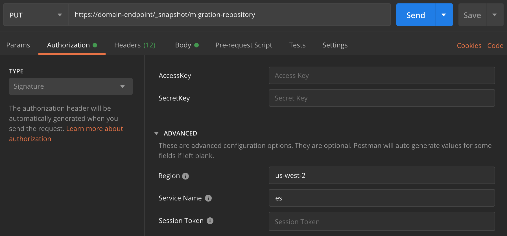

# Tutorial: Migrating to Amazon OpenSearch Service

Index snapshots are a popular way to migrate from a self-managed OpenSearch or legacy
Elasticsearch cluster to Amazon OpenSearch Service. Broadly, the process consists of the following
steps:

1. Take a snapshot of the existing cluster, and upload the snapshot to an Amazon S3
   bucket.
2. Create an OpenSearch Service domain.
3. Give OpenSearch Service permissions to access the bucket, and ensure you have permissions to
   work with snapshots.
4. Restore the snapshot on the OpenSearch Service domain.
   This walk through provides more detailed steps and alternate options, where
   applicable.

## Take and upload the snapshot

Although you can use the [repository-s3](https://docs.opensearch.org/latest/opensearch/snapshot-restore/#amazon-s3 "https://docs.opensearch.org/latest/opensearch/snapshot-restore/#amazon-s3") plugin to take snapshots directly to S3, you have to install
the plugin on every node, tweak `opensearch.yml` (or
`elasticsearch.yml` if using an Elasticsearch cluster), restart each
node, add your AWS credentials, and finally take the snapshot. The plugin is a great
option for ongoing use or for migrating larger clusters.

For smaller clusters, a one-time approach is to take a [shared file system snapshot](https://docs.opensearch.org/latest/opensearch/snapshot-restore/#shared-file-system "https://docs.opensearch.org/latest/opensearch/snapshot-restore/#shared-file-system") and then use the AWS CLI to upload it to S3. If
you already have a snapshot, skip to step 4.

###### **To take a snapshot and upload it to Amazon S3**

1. Add the `path.repo` setting to `opensearch.yml` (or
   `Elasticsearch.yml`) on all nodes, and then restart each
   node.

```
path.repo: ["`/my/shared/directory/snapshots`"]
```

2. Register a [snapshot repository](https://opensearch.org/docs/latest/opensearch/snapshot-restore/#register-repository "https://opensearch.org/docs/latest/opensearch/snapshot-restore/#register-repository"), which is required before you take a snapshot.
   A repository is just a storage location: a shared file system, Amazon S3, Hadoop
   Distributed File System (HDFS), etc. In this case, we'll use a shared file
   system ("fs"):

```
PUT _snapshot/`my-snapshot-repo-name`
{
  "type": "fs",
  "settings": {
    "location": "`/my/shared/directory/snapshots`"
  }
}
```

3. Take the snapshot:

```
PUT _snapshot/`my-snapshot-repo-name`/`my-snapshot-name`
{
  "indices": "`migration-index1`,`migration-index2`,`other-indices-*`",
  "include_global_state": false
}
```

4. Install the [AWS CLI](https://aws.amazon.com/cli/ "https://aws.amazon.com/cli/"), and run
   `aws configure` to add your credentials.
5. Navigate to the snapshot directory. Then run the following commands to create
   a new S3 bucket and upload the contents of the snapshot directory to that
   bucket:

```
aws s3 mb s3://`amzn-s3-demo-bucket` --region `us-west-2`
aws s3 sync . s3://`amzn-s3-demo-bucket` --sse AES256
```

Depending on the size of the snapshot and the speed of your internet
connection, this operation can take a while.

## Create a domain

Although the console is the easiest way to create a domain, in this case, you already
have the terminal open and the AWS CLI installed. Modify the following command to create a
domain that fits your needs:

```
aws opensearch create-domain \
  --domain-name `migration-domain` \
  --engine-version `OpenSearch_1.0` \
  --cluster-config InstanceType=c5.large.search,InstanceCount=2 \
  --ebs-options EBSEnabled=true,VolumeType=gp2,VolumeSize=100 \
  --node-to-node-encryption-options Enabled=true \
  --encryption-at-rest-options Enabled=true \
  --domain-endpoint-options EnforceHTTPS=true,TLSSecurityPolicy=Policy-Min-TLS-1-2-2019-07 \
  --advanced-security-options Enabled=true,InternalUserDatabaseEnabled=true,MasterUserOptions='{MasterUserName=`master-user`,MasterUserPassword=`master-user-password`}' \
  --access-policies '{"Version": "2012-10-17",		 	 	 "Statement":[{"Effect":"Allow","Principal": {"AWS": "arn:aws:iam::`aws-region`:user/`UserName`"},"Action":["es:ESHttp*"],"Resource":"arn:aws:es:`aws-region`:`111122223333`:domain/`migration-domain`/*"}]}' \
  --region `aws-region`
```

As is, the command creates an internet-accessible domain with two data nodes, each
with 100 GiB of storage. It also enables [fine-grained access
control](fgac.md "fgac.md") with HTTP basic authentication and all encryption settings. Use the
OpenSearch Service console if you need a more advanced security configuration, such as a VPC.

Before issuing the command, change the domain name, master user credentials, and
account number. Specify the same AWS Region that you used for the S3 bucket and an
OpenSearch/Elasticsearch version that is compatible with your snapshot.

###### Important

Snapshots are only forward-compatible, and only by one major version. For example,
you can't restore a snapshot from an OpenSearch 1._x_ cluster on an Elasticsearch 7._x_
cluster, only an OpenSearch 1._x_ or 2._x_ cluster. Minor version matters, too. You can't
restore a snapshot from a self-managed 5.3.3 cluster on a 5.3.2 OpenSearch Service domain. We
recommend choosing the most recent version of OpenSearch or Elasticsearch that your
snapshot supports. For a table of compatible versions, see [Using a snapshot to migrate data](snapshot-based-migration.md "snapshot-based-migration.md").

## Provide permissions to the S3 bucket

In the AWS Identity and Access Management (IAM) console, [create a role](../../../IAM/latest/UserGuide/id_roles_create.md "../../../IAM/latest/UserGuide/id_roles_create.md") with the following permissions and [trust relationship](../../../IAM/latest/UserGuide/roles-managingrole-editing-console.md#roles-managingrole_edit-trust-policy "../../../IAM/latest/UserGuide/roles-managingrole-editing-console.md#roles-managingrole_edit-trust-policy"). When creating the role, choose **S3**
as the **AWS Service**. Name the role
`OpenSearchSnapshotRole` so it's easy to find.

**Permissions**

JSON

```
`{
 "Version":"2012-10-17",
 "Statement": [{
 "Action": [
 "s3:ListBucket"
 ],
 "Effect": "Allow",
 "Resource": [
 "arn:aws:s3:::`amzn-s3-demo-bucket`"
 ]
 },
 {
 "Action": [
 "s3:GetObject",
 "s3:PutObject",
 "s3:DeleteObject"
 ],
 "Effect": "Allow",
 "Resource": [
 "arn:aws:s3:::`amzn-s3-demo-bucket`/*"
 ]
 }
 ]
}`

```

**Trust relationship**

JSON

```
`{
 "Version":"2012-10-17",
 "Statement": [{
 "Effect": "Allow",
 "Principal": {
 "Service": "es.amazonaws.com"
 },
 "Action": "sts:AssumeRole"
 }
 ]
}`

```

Then give your personal IAM role permissions to assume
`OpenSearchSnapshotRole`. Create the following policy and [attach it](../../../IAM/latest/UserGuide/access_policies_manage-attach-detach.md "../../../IAM/latest/UserGuide/access_policies_manage-attach-detach.md") to
your identity:

**Permissions**

JSON

```
`{
 "Version":"2012-10-17",
 "Statement": [{
 "Effect": "Allow",
 "Action": "iam:PassRole",
 "Resource": "arn:aws:iam::`123456789012`:role/OpenSearchSnapshotRole"
 }
 ]
}`

```

### Map the snapshot role in OpenSearch

Dashboards (if using fine-grained access control)

If you enabled [fine-grained access control](fgac.md#fgac-mapping "fgac.md#fgac-mapping"),
even if you use HTTP basic authentication for all other purposes, you need to map
the `manage_snapshots` role to your IAM role so you can work with
snapshots.

###### To give your identity permissions to work with snapshots

1. Log in to Dashboards using the master user credentials you specified when
   you created the OpenSearch Service domain. You can find the Dashboards URL in the OpenSearch Service
   console. It takes the form of
   `https://`domain-endpoint`/_dashboards/`.
2. From the main menu choose **Security**,
   **Roles**, and select the
   **manage_snapshots** role.
3. Choose **Mapped users**, **Manage mapping**.
4. Add the domain ARN of your personal IAM role in the appropriate field.
   The ARN takes one of the following formats:

```
arn:aws:iam::`123456789123`:user/`user-name`
```

```
arn:aws:iam::`123456789123`:role/`role-name`
```

5. Select **Map** and confirm role shows up
   under **Mapped users**.

## Restore the snapshot

At this point, you have two ways to access your OpenSearch Service domain: HTTP basic authentication
with your master user credentials or AWS authentication using your IAM credentials.
Because snapshots use Amazon S3, which has no concept of the master user, you must use your
IAM credentials to register the snapshot repository with your OpenSearch Service domain.

Most programming languages have libraries to assist with signing requests, but the
simpler approach is to use a tool like [Postman](https://www.postman.com/downloads/ "https://www.postman.com/downloads/") and put your IAM credentials into the
**Authorization** section.



###### To restore the snapshot

1. Regardless of how you choose to sign your requests, the first step is to
   register the repository:

```
PUT _snapshot/`my-snapshot-repo-name`
{
  "type": "s3",
  "settings": {
    "bucket": "`amzn-s3-demo-bucket`",
    "region": "`us-west-2`",
    "role_arn": "arn:aws:iam::123456789012:role/OpenSearchSnapshotRole"
  }
}
```

2. Then list the snapshots in the repository, and find the one you want to
   restore. At this point, you can continue using Postman or switch to a tool like
   [curl](https://curl.haxx.se/ "https://curl.haxx.se/").

**Shorthand**

```
GET _snapshot/`my-snapshot-repo-name`/_all
```

**curl**

```
curl -XGET -u '`master-user`:`master-user-password`' https://`domain-endpoint`/_snapshot/`my-snapshot-repo-name`/_all
```

3. Restore the snapshot.

**Shorthand**

```
POST _snapshot/`my-snapshot-repo-name`/`my-snapshot-name`/_restore
{
  "indices": "`migration-index1`,`migration-index2`,`other-indices-*`",
  "include_global_state": false
}
```

**curl**

```
curl -XPOST -u '`master-user`:`master-user-password`' https://`domain-endpoint`/_snapshot/`my-snapshot-repo-name`/`my-snapshot-name`/_restore \
  -H 'Content-Type: application/json' \
  -d '{"indices":"`migration-index1`,`migration-index2`,`other-indices-*`","include_global_state":false}'
```

4. Finally, verify that your indexes restored as expected.

**Shorthand**

```
GET _cat/indices?v
```

**curl**

```
curl -XGET -u '`master-user`:`master-user-password`' https://`domain-endpoint`/_cat/indices?v
```

At this point, the migration is complete. You might configure your clients to use the
new OpenSearch Service endpoint, [resize the domain](sizing-domains.md "sizing-domains.md") to suit your
workload, check the shard count for your indexes, switch to an [IAM master user](fgac.md#fgac-concepts "fgac.md#fgac-concepts"), or start building visualizations
in OpenSearch Dashboards.
