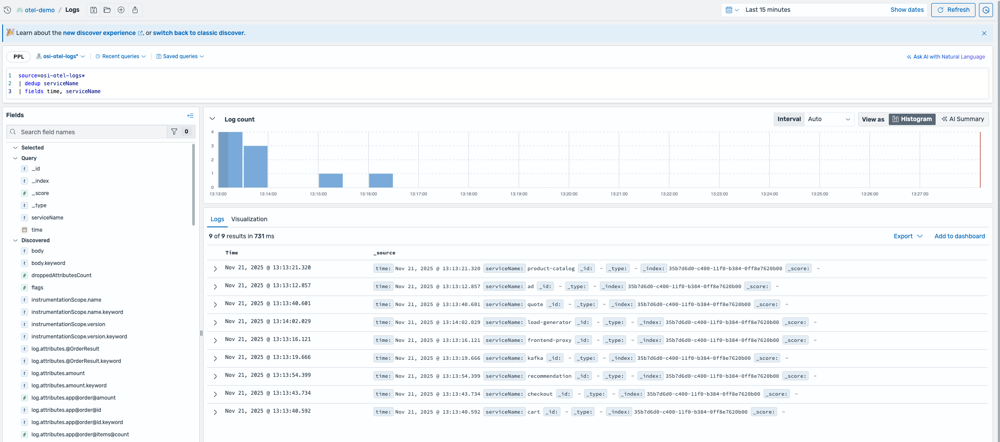
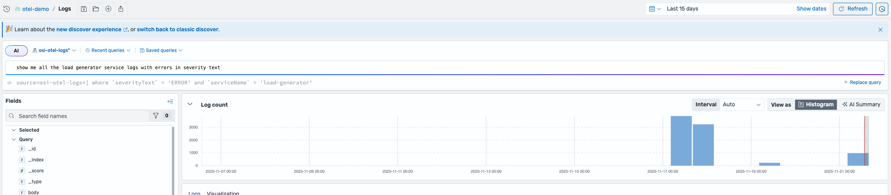
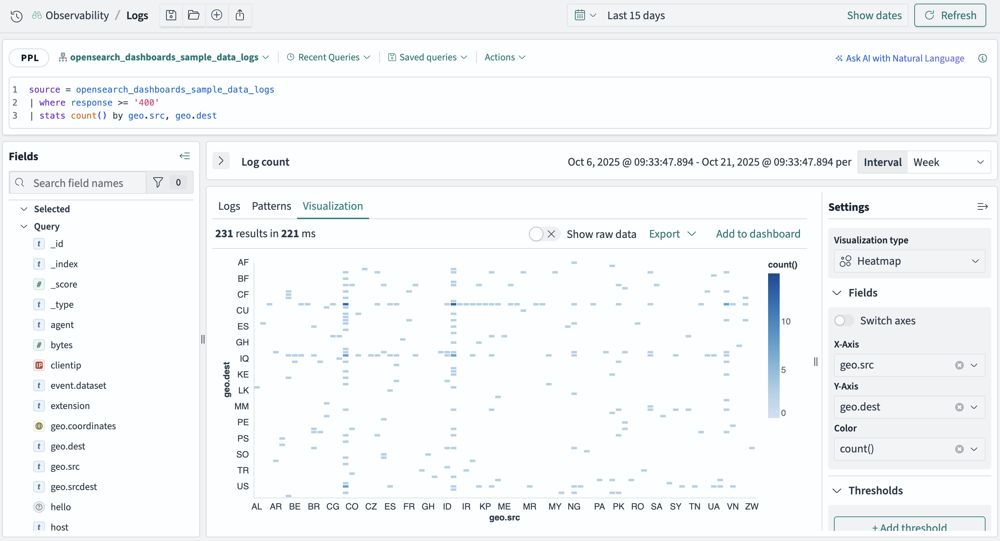

# Logs

OpenSearch Ingestion can transform unstructured log data into a structured format during
ingestion. OpenSearch Ingestion provides processors that normalize and enrich your data
before it is indexed. Examples of helpful processors are:

- `grok` – Parses and structures unstructured text data
  such as web server access logs, into distinct fields.
- `date` – Parses a date from a log field and sets it as
  the event's timestamp.
- `parse_json` – Parses a string field that contains a JSON
  object.
  **Note** – To make getting started easier, we’ve created a new [Get Started](https://us-east-1.console.aws.amazon.com/aos/home#/opensearch/getting-started "https://us-east-1.console.aws.amazon.com/aos/home#/opensearch/getting-started") workflow for logs in the Amazon OpenSearch Service console which will
  set up a new Otel tailored ingestion pipeline, point it to an existing OpenSearch cluster, and
  create a new OpenSearch UI application with an observability workspace created. All you have to
  do is point your Otel agents to the new ingestion endpoint.

## OpenSearch UI and observability workspace

After your logs data is ingested into Amazon OpenSearch Service, you use the tools provided by the Amazon
OpenSearch Service observability workspace in OpenSearch UI to analyze it. The observability workspace provides
specialized tools designed to extract meaningful insights in Discover and Dashboards.

The observability workspace comes with a new Discover experience which uses [piped processing language](https://github.com/opensearch-project/sql/blob/main/docs/user/ppl/index.rst "https://github.com/opensearch-project/sql/blob/main/docs/user/ppl/index.rst") (PPL) complemented with a natural language assistant powered by Amazon Q Developer for Business.
The language assistance makes it simple for anyone to get started with piped languages.
After refining your query, create visualizations and dashboards right from new Discover without
jumping to other parts of the tool. To query your data using [DQL](https://docs.opensearch.org/latest/dashboards/dql/ "https://docs.opensearch.org/latest/dashboards/dql/") or [SQL](https://github.com/opensearch-project/sql/blob/main/docs/user/index.rst "https://github.com/opensearch-project/sql/blob/main/docs/user/index.rst"), switch to the old Discover experience.



## Querying your logs using PPL

You have several options for querying your logs to gather insights into the
operation of your application or service.

Piped processing language (PPL) is a query language with pipe-based
(|) syntax for chaining commands. You can use it to build powerful
expressions to analyze your logs.

**Note**: To unlock newer PPL commands/functions in OpenSearch 2.19,
you’ll need to change a feature flag in OpenSearch Developer Tools using the following query
(not required for OpenSearch 3.3):

```
PUT /_plugins/_query/settings { "transient" : { "plugins.calcite.enabled" : true } }
```

### Find the hosts with the most errors

This example analyzes you logs to determine the service hosts with
the most total errors.

```
source = my-index |
    where level = "ERROR" |
    stats count() as error_count by host |
    sort -error_count |
    head 5
```

### Calculate average request time

This example analyzes your logs to calculate the average request
time for each status code in the log.

```
source = my-index |
    stats avg(request_time) by status_code
```

For more information about PPL, see the [reference manual](https://github.com/opensearch-project/sql/blob/main/docs/user/ppl/index.rst "https://github.com/opensearch-project/sql/blob/main/docs/user/ppl/index.rst") on GitHub.

### Querying your logs using AI

This example analyzes your logs to show the errors logged in the
last 5 minutes.

```
Show me all of the error logs from the last 5 minutes
```



### Querying your logs using SQL

SQL provides a familiar way to query log data.

This example analyzes your logs to show errors by
timestamp.

```
SELECT timestamp, severity_text, body, service_name
FROM opentelemetry_logs
WHERE severity_text = 'ERROR' AND service_name = 'my-service'
ORDER BY timestamp DESC;
```

For more information about SQL, see the [SQL reference manual](https://github.com/opensearch-project/sql/blob/main/docs/user/index.rst "https://github.com/opensearch-project/sql/blob/main/docs/user/index.rst") on GitHub.

### Querying your logs using DQL

DQL is good for quick searching and filtering.

This example analyzes your logs and returns errors and
exceptions.

```
error OR exception
```

For more information about DQL, see the [DQL reference manual](https://docs.opensearch.org/latest/dashboards/dql/ "https://docs.opensearch.org/latest/dashboards/dql/") on opensearch.org.

## Dashboards and alerts for

logs

In the new Discover experience with PPL, you can create visualizations from the visualizations
tab within Discover. Choose from 12 visualization types and edit on the fly before adding them to a dashboard.
In the old Discover experience, you’ll browse to Visualize in the left navigation to create a new visualization
and to Dashboards to add the visualizations to your dashboards.



You can define alert monitors using PPL or the OpenSearch Service query DSL to run scheduled
queries. A trigger condition, such as a specific number of error logs, fires an
alert. You can send notifications through channels such Amazon Simple Notification Service or
webhooks.

For more information about alerting, see the [alerting documentation](https://docs.opensearch.org/latest/observing-your-data/alerting/index/ "https://docs.opensearch.org/latest/observing-your-data/alerting/index/") on opensearch.org.
