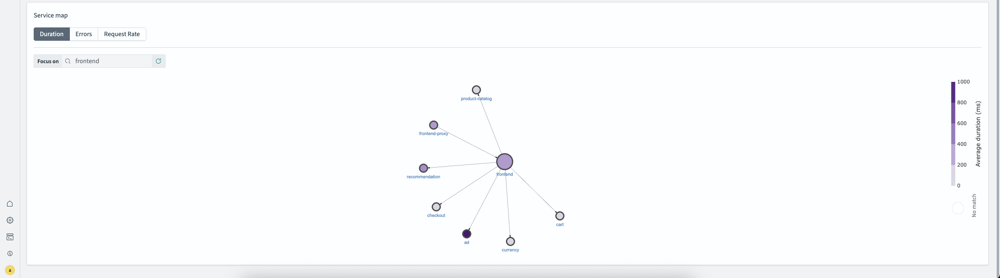
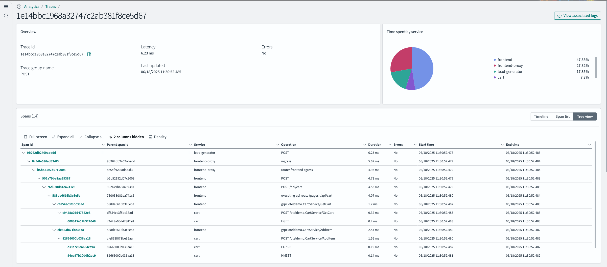
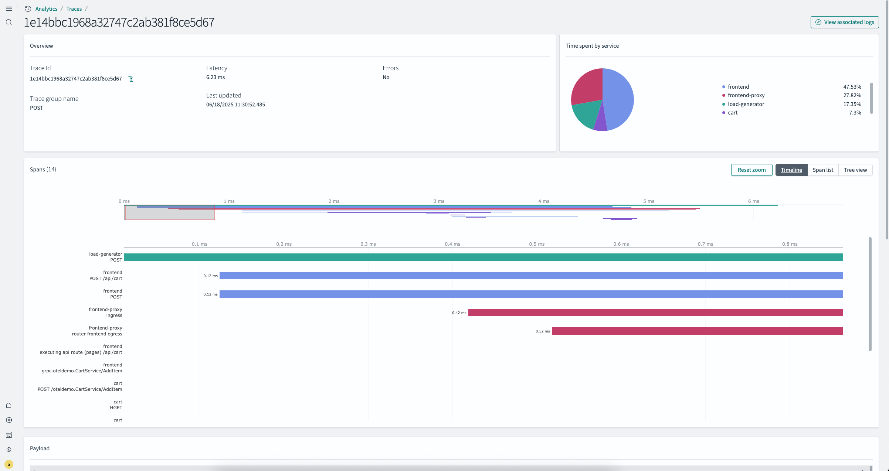

# Traces

Amazon OpenSearch Service provides comprehensive distributed tracing capabilities that help you understand
application performance and diagnose issues across your microservices architecture. By [ingesting OpenTelemetry (OTel) trace data with OpenSearch Ingestion](configure-client-otel.md "configure-client-otel.md"), OpenSearch Service automatically
processes and structures your telemetry information, giving you end-to-end visibility into request flows through
your distributed systems.

## Trace Data Processing and Ingestion

OpenSearch Ingestion provides specialized processors that normalize and enrich your trace data during
ingestion, ensuring your telemetry follows consistent patterns and is ready for analysis. Key processors
for trace data include:

- `service_map` – Automatically builds service dependency graphs from span relationships,
  showing how requests flow between services.
- `trace_group` – Aggregates related spans into logical trace groups based on entry span
  attributes like HTTP method and path.
- `otel_trace_raw` – Processes raw OpenTelemetry trace data and extracts span attributes,
  resource attributes, and instrumentation scope information into searchable fields.

## OpenSearch UI and Observability Workspace

After your trace data is ingested into Amazon OpenSearch Service, you use the tools provided by the Amazon
OpenSearch Service observability workspace in OpenSearch UI to analyze it. The observability workspace provides
specialized visualizations and analysis tools designed to help you understand service performance, identify bottlenecks,
and troubleshoot issues across your distributed architecture.

The observability workspace includes a Services view that displays RED metrics (rate, error rate, duration)
for all instrumented services, along with an interactive service map showing dependencies and communication patterns.
The Traces view allows you to search for specific traces using trace IDs or span IDs, then drill down into detailed
waterfall charts and span analysis to understand the complete request journey through your system.

## Key Features

### Services View

The Services view provides a comprehensive overview of your application's health and performance through:

- **RED metrics dashboard** – Monitor the rate (requests per second), error rate
  (percentage of failed requests), and duration (latency percentiles) for each service in your distributed system.
  These metrics give you immediate insight into service health and help you quickly identify performance degradation.
- **Interactive service map** – Visualize how your services communicate with each
  other through an automatically generated dependency graph. The service map shows request flows between services,
  helping you understand your system architecture and identify bottlenecks or cascading failures.
- **Service health indicators** – Quickly identify problematic services based on
  error rates and latency thresholds. Services are color-coded to highlight those requiring immediate attention, making
  it easy to prioritize troubleshooting efforts.
- **Service correlation dialog** – Drill down from any service to analyze related logs and traces.
  This integrated view connects service-level metrics with detailed trace data and associated log entries, enabling faster root
  cause analysis without switching between different tools.

### Traces View

The Traces view enables deep investigation of individual requests through your distributed system:

- **Trace grouping by HTTP method and path** – Automatically organizes traces into logical groups based
  on API endpoints, showing aggregate metrics like average latency, error rate, and performance trends over time. This helps you identify
  which endpoints are experiencing issues and track performance improvements.
- **Trace ID and span ID search** – Quickly locate specific traces using trace identifiers or span
  identifiers. This is particularly useful when investigating issues reported by users or correlating with error logs that contain trace
  context.
- **Waterfall charts** – Visualize the complete timeline of a request as it flows through your services.
  The waterfall view shows span timing and duration, making it easy to identify slow operations, sequential vs. parallel processing, and
  where time is being spent in your distributed system.
- **Tree view with hierarchical span breakdown** – Navigate the parent-child relationships between spans
  to understand the call hierarchy within a trace. This view helps you see how a request branches across services and identify which service
  calls are contributing to overall latency.
- **Associated logs panel** – View logs that occurred during the same timeframe as your trace, filtered by
  relevant service and trace context. This correlation between traces and logs significantly improves troubleshooting by providing both the
  request flow and detailed application logs in a single interface.

### Advanced Capabilities

- **Correlation analysis** – Seamlessly link traces, spans, and services with corresponding logs.
  The observability workspace automatically correlates telemetry data using trace context, allowing you to pivot between different
  views of the same request without losing context.
- **Custom index names and cross-cluster support** – Configure OpenSearch Service to read trace
  data from custom index patterns or across multiple OpenSearch clusters. This flexibility supports complex deployment scenarios and
  allows you to organize your telemetry data according to your operational needs.
- **Configurable service map limits** – Adjust the number of services and connections displayed
  in the service map to handle large-scale topologies. For systems with hundreds of services, you can filter the map to focus on
  specific service subsets or adjust rendering limits to maintain performance.
- **Mini-map navigation for Gantt charts** – Navigate large trace waterfall charts efficiently
  using the mini-map overview. This feature is especially helpful when analyzing traces with many spans, allowing you to quickly jump
  to different sections of the timeline.

Traces provides at-a-glance visibility into application performance based on OpenTelemetry (OTel) protocol data. It helps you understand how
requests flow through your distributed system by tracking their end-to-end journey across services.
