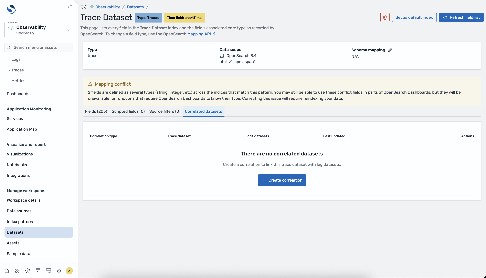
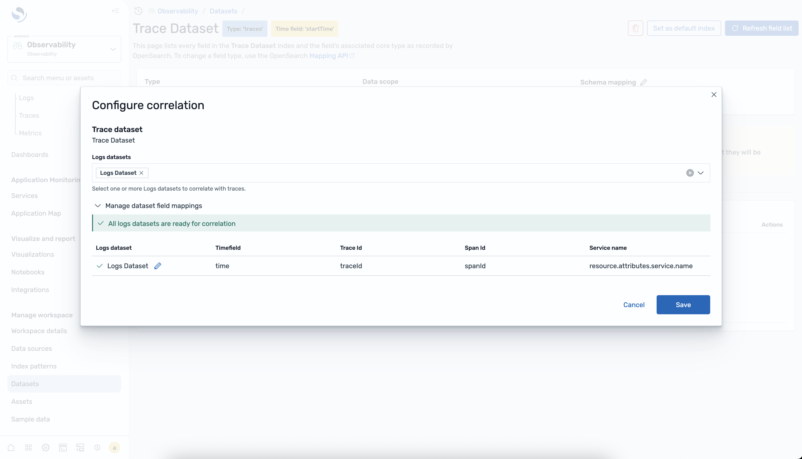
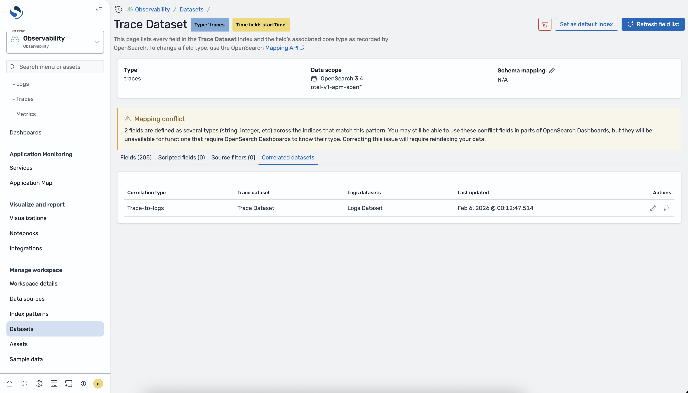
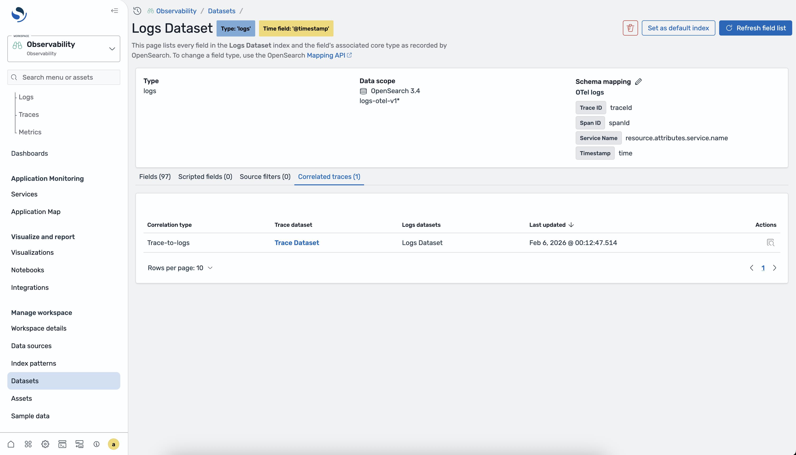
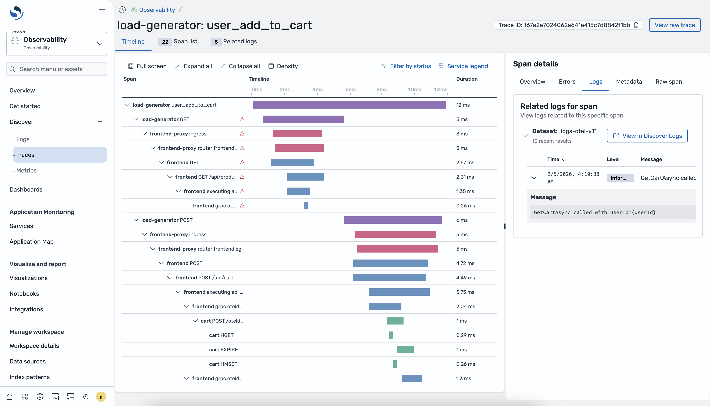

# Correlations

Correlations link a traces dataset to a logs dataset so that you can view related log
entries when you investigate trace spans. By defining a correlation, you enable the
Discover Traces page to display logs that occurred during a span's execution, helping
you diagnose issues faster without switching between pages.

## Correlation requirements

To create a correlation, your log and trace data must contain matching fields. The
following table describes the fields that the correlation uses to join trace and log
data.

| Field        | Description                                                                                     | Required |
| ------------ | ----------------------------------------------------------------------------------------------- | -------- |
| Trace ID     | The unique identifier for the trace. Must exist in both the trace span index and the log index. | Yes      |
| Span ID      | The unique identifier for the span. Used to match logs to a specific span within a trace.       | No       |
| Service name | The name of the service that generated the telemetry. Used to filter related logs by service.   | No       |
| Timestamp    | The time field used to scope related logs to the span's time range.                             | Yes      |

## To create a trace-to-logs correlation

Complete the following steps to create a correlation between a traces dataset and a
logs dataset.

1. In your observability workspace, expand **Discover** in the
   left navigation and choose **Traces**.
2. Select the traces dataset that you want to correlate.
3. Choose the **Correlations** tab in the dataset
   configuration panel.

 4. Choose **Create correlation**. 5. In the configuration dialog, select the target logs dataset and map the
required correlation fields (trace ID and timestamp). Optionally, map span ID
and service name for more precise matching.

 6. Choose **Create** to save the correlation. 7. Verify that the correlation appears in the correlations table.

## Viewing correlations in logs datasets

After you create a correlation, you can also view it from the logs dataset side.
Navigate to the Discover Logs page, select the correlated logs dataset, and choose
the **Correlations** tab to see the linked traces dataset.

## Using correlations in the Traces page

When a correlation exists, the Discover Traces page displays related logs in the
span details view. Choose a span in the span table to open the details flyout, then
choose the **Related logs** tab to view correlated log entries.

## Managing correlations

You can edit or remove correlations from the **Correlations** tab
of either the traces or logs dataset.

- **Editing** – Choose the correlation in
  the table and choose **Edit** to update the field mappings
  or target dataset.
- **Removing** – Choose the correlation in
  the table and choose **Delete** to remove the correlation.
  Removing a correlation does not delete any data.
