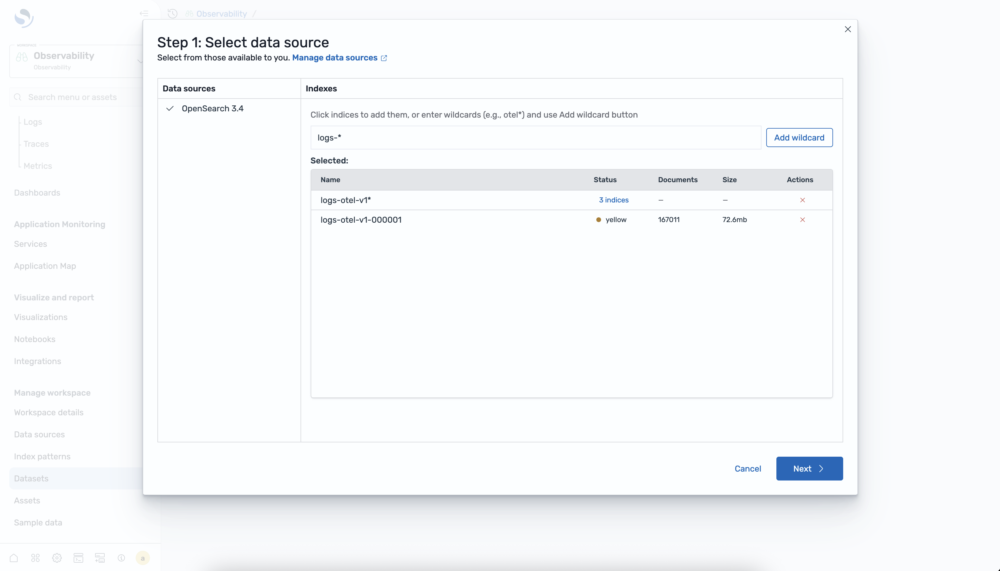
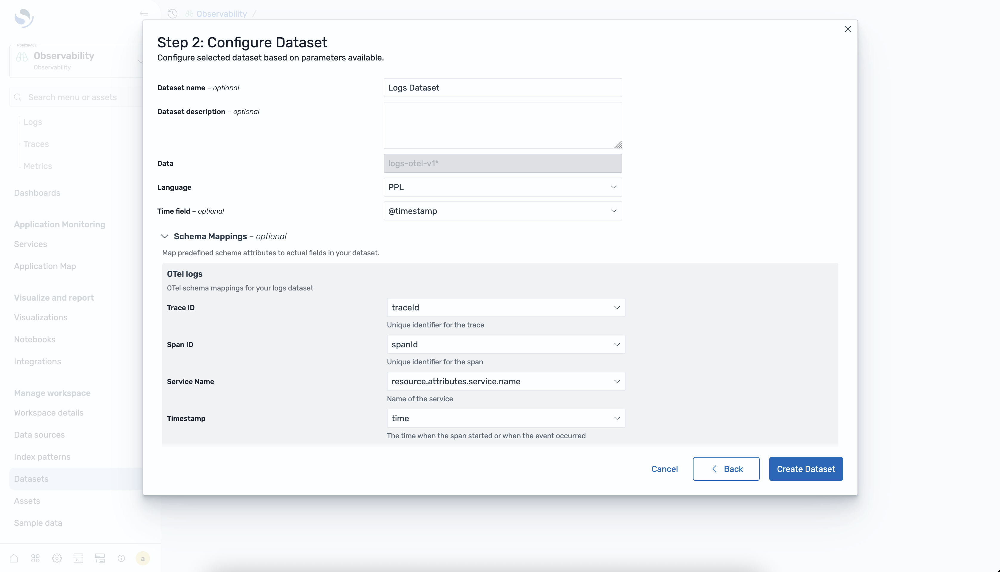
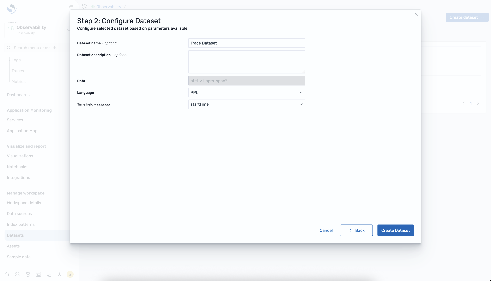
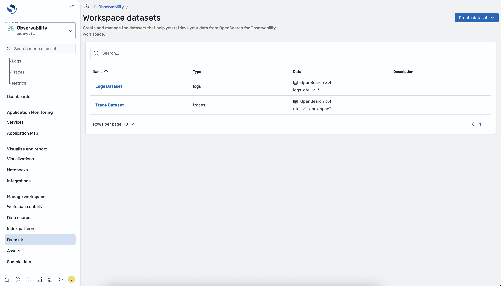

# Datasets

Datasets are collections of indexes that represent a logical grouping of your observability
data. You use datasets to organize logs and traces data so that you can query and analyze
related indexes together in the Discover experience. Each dataset maps to one or more
indexes in your OpenSearch Service domain and defines the data type, time field, and query language
for the Discover page.

## Dataset types

The following table describes the dataset types that you can create.

| Type   | Description                                                                              | Query language |
| ------ | ---------------------------------------------------------------------------------------- | -------------- |
| Logs   | Groups one or more log indexes for querying and visualization in the Discover Logs page. | PPL            |
| Traces | Groups trace span indexes for querying and visualization in the Discover Traces page.    | PPL            |

###### Note

Metrics do not require a dataset because metric data is not stored in OpenSearch. Metrics are queried directly from Amazon Managed Service for Prometheus using PromQL.

## To create a logs dataset

Complete the following steps to create a logs dataset in OpenSearch UI.

1. In your observability workspace, expand **Discover** in the
   left navigation and choose **Logs**.
2. Choose **Create dataset**.
3. Select a data source from the list of available OpenSearch Service connections.

 4. Configure the dataset by entering a name, selecting the index, and
specifying the timestamp field.

 5. Choose **Create dataset** to save the configuration.

## To create a traces dataset

Complete the following steps to create a traces dataset in OpenSearch UI.

1. In your observability workspace, expand **Discover** in the
   left navigation and choose **Traces**.
2. Choose **Create dataset**.
3. Select a data source from the list of available OpenSearch Service connections.
4. Configure the dataset by entering a name, selecting the span index,
   and specifying the timestamp field.

 5. Choose **Create dataset** to save the configuration.

## To view datasets

You can view all configured datasets from the dataset selector on the Discover Logs
or Discover Traces page. The dataset list shows the name, type, data source, and
timestamp field for each dataset.

## Analyzing datasets in Discover

After you create a dataset, you can analyze it in the corresponding Discover page.

### Logs

Select a logs dataset from the dataset selector on the Discover Logs page to
query and visualize your log data using PPL. For more information, see
[Discover Logs](observability-analyze-logs.md "observability-analyze-logs.md").

### Traces

Select a traces dataset from the dataset selector on the Discover Traces page to
explore trace spans, view RED metrics, and drill into individual traces. For more
information, see [Discover Traces](observability-analyze-traces.md "observability-analyze-traces.md").
