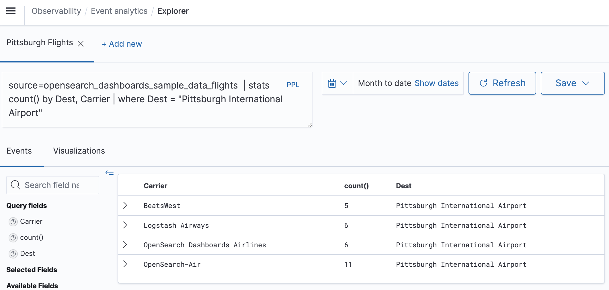
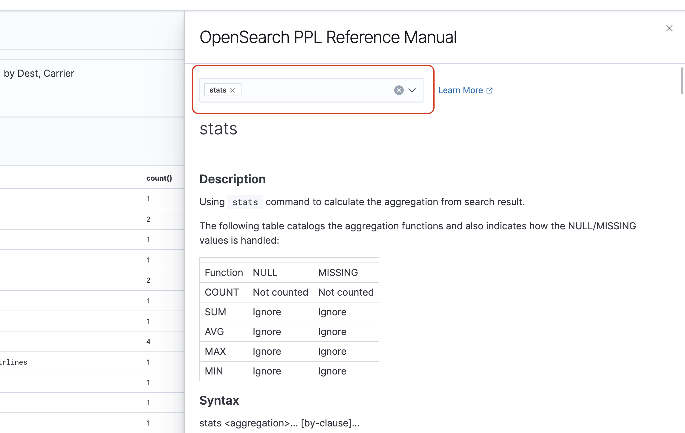
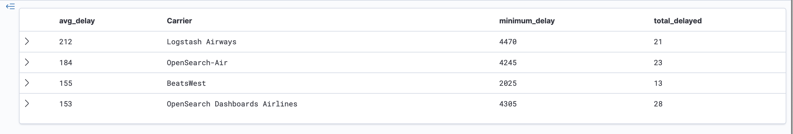
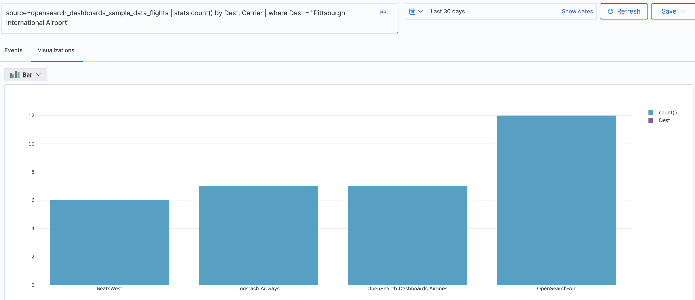

# Observability in Amazon OpenSearch Service

The default installation of OpenSearch Dashboards for Amazon OpenSearch Service includes the Observability
plugin, which you can use to visualize data-driven events using Piped Processing Language
(PPL) in order to explore, discover, and query data stored in OpenSearch. The plugin
requires OpenSearch 1.2 or later.

The Observability plugin provides a unified experience for collecting and monitoring
metrics, logs, and traces from common data sources. Data collection and monitoring in one
place enables full-stack, end-to-end observability of your entire infrastructure.

###### Note

This documentation provides a brief overview of Observability in OpenSearch Service. For
comprehensive documentation of the Observability plugin, including permissions, see
[Observability](https://opensearch.org/docs/latest/observing-your-data/ "https://opensearch.org/docs/latest/observing-your-data/").

Everyone's process for exploring data is different. If you’re new to exploring data and
creating visualizations, we recommend trying a workflow like the following.

## Explore your data with event analytics

To start, let's say that you're collecting flight data in your OpenSearch Service domain and you
want to find out which airline had the most flights arriving in Pittsburgh International
Airport last month. You write the following PPL query:

```
source=opensearch_dashboards_sample_data_flights |
    stats count() by Dest, Carrier |
    where Dest = "Pittsburgh International Airport"
```

This query pulls data from the index named
`opensearch_dashboards_sample_data_flights`. It then uses the
`stats` command to get a total count of flights and groups it according
to destination airport and carrier. Finally, it uses the `where` clause to
filter the results to flights arriving in Pittsburgh International Airport.

Here's what the data looks like when displayed over the last month:



You can choose the **PPL** button in the query editor to get usage
information and examples for each PPL command:



Let's look at a more complex example, which queries for information about flight
delays:

```
source=opensearch_dashboards_sample_data_flights |
    where FlightDelayMin > 0 |
    stats sum(FlightDelayMin) as minimum_delay, count() as total_delayed by Carrier, Dest |
    eval avg_delay=minimum_delay / total_delayed |
    sort - avg_delay
```

Each command in the query impacts the final output:

- `source=opensearch_dashboards_sample_data_flights` - pulls data
  from the same index as the previous example
- `where FlightDelayMin > 0` - filters the data to flights that were
  delayed
- `stats sum(FlightDelayMin) as minimum_delay, count() as total_delayed by
Carrier` - for each carrier, gets the total minimum delay time and the
  total count of delayed flights
- `eval avg_delay=minimum_delay / total_delayed` - calculates the
  average delay time for each carrier by dividing the minimum delay time by the
  total number of delayed flights
- `sort - avg_delay` - sorts the results by average delay in
  descending order

With this query, you can determine that OpenSearch Dashboards Airlines has, on
average, fewer delays.



You can find more sample PPL queries under **Queries and
Visualizations** on the **Event analytics** page.

## Create visualizations

Once you correctly query the data that you're interested in, you can save those
queries as visualizations:



Then add those visualizations to [operational panels](https://opensearch.org/docs/latest/observability-plugin/operational-panels "https://opensearch.org/docs/latest/observability-plugin/operational-panels") to compare different pieces of data. Leverage [notebooks](https://opensearch.org/docs/latest/observability-plugin/notebooks "https://opensearch.org/docs/latest/observability-plugin/notebooks") to combine different visualizations and code blocks that you can
share with team members.

## Dive deeper with Trace Analytics

[Trace Analytics](trace-analytics.md "trace-analytics.md") provides a way to visualize the
flow of events in your OpenSearch data to identify and fix performance problems in
distributed applications.


