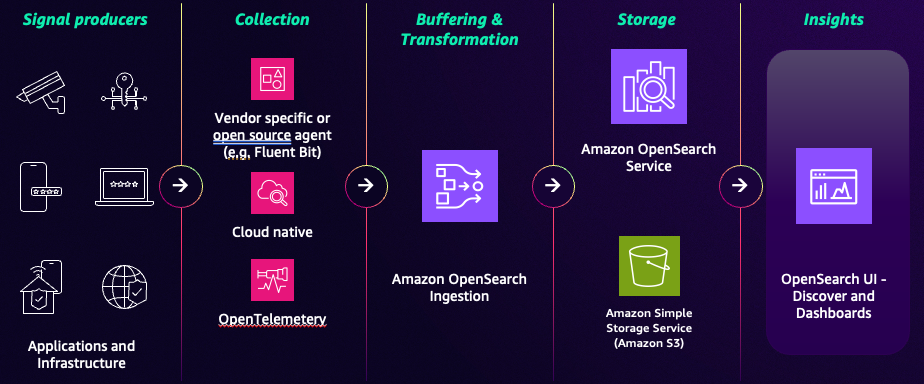
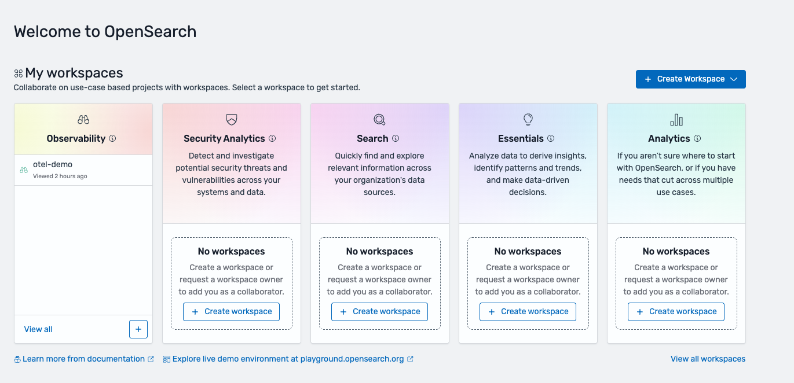

# Observability in Amazon OpenSearch Service

**Observability** is the practice of gaining insight into the internal
state and performance of your complex systems by examining their outputs. Traditional
monitoring can tell you that your system is down, observability helps you understand why
it's down by allowing you to ask new questions about your data.

Amazon OpenSearch Service provides a unified solution by collecting and correlating key types of telemetry
data.

- **Logs** provide timestamped records of events, such
  as application errors, user requests, or system status messages.
- **Traces** represent the end-to-end journey of a
  request as it travels through the different services in a distributed system.
  By bringing these data types together, Amazon OpenSearch Service helps operations teams, site
  reliability engineers, and developers detect, diagnose, and resolve operational issues faster.

## The observability workflow in OpenSearch Service

Getting data from your applications into OpenSearch Service for analysis uses a multi-stage
pipeline:

1. **Collection**

The process begins at the source with lightweight agents or collectors that
gather telemetry data from your signal producers such as applications and infrastructure.
Two common open-source agents are:

    * [OpenTelemetry](configure-client-otel.md "configure-client-otel.md") (OTel) collector – The industry standard and
     preferred method for collecting logs and traces.
    * [Fluent Bit](configure-client-fluentbit.md "configure-client-fluentbit.md") – A lightweight, high-performance log processor and
     forwarder that supports the OTel schema for logs and traces.

2. **Ingestion (Amazon OpenSearch Ingestion)**

After telemetry is collected, data is sent to OpenSearch Ingestion, a fully
managed, serverless data pipeline. You can create custom pipelines to:

    * **Filter** – Remove unnecessary
     data to reduce storage costs.
    * **Enrich** – Add valuable metadata,
     such as geographic information from an IP address.
    * **Transform and normalize** –
     Structure unstructured logs into a consistent format.
    * **Route** – Send different types of
     data to different OpenSearch Service indexes or Amazon S3.

3. **Analytics and visualization**

After processing, data is loaded into an OpenSearch Service domain or collection. You can
store, index, and analyze vast amounts of data in near real time. You interact
with this data through a visualization interface such as [OpenSearch UI's observability workspace](application.md "application.md") to run queries, build dashboards,
and set up alerts.

## OpenSearch UI and OpenSearch Dashboards

OpenSearch Service provides two distinct user interfaces for observability. We recommend that you
use OpenSearch UI and set up an [observability workspace](application.md "application.md") for new installations and migrate from existing OpenSearch
Dashboards. Below is a table outlining the benefits of OpenSearch UI v. traditional OpenSearch
Dashboards.

| Feature       | OpenSearch UI                                                                                                                                | OpenSearch Dashboards                                                                        |
| ------------- | -------------------------------------------------------------------------------------------------------------------------------------------- | -------------------------------------------------------------------------------------------- |
| Data sources  | \*_Multi-source_ • – can connect to multiple OpenSearch Service domains, OpenSearch Serverless collections, and other data sources. | \*_Single-source_ • – co-located with a single OpenSearch Service domain.              |
| Updates       | New features arrive here first because it is not tied to a specific OpenSearch version.                                                   | New features are tied to the OpenSearch version. Updates may be deprecated in the future. |
| Availability  | Hosted in the AWS Cloud ensuring zero downtime during cluster upgrades.                                                                   | Can become temporarily unavailable during domain maintenance and upgrades                 |
| Collaboration | Features workspaces for curated team collaboration on specific workflows.                                                                 | Collaboration is based on sharing saved objects in a single domain.                       |

**Note** – To make getting started easier, we’ve created a new [Get Started](configure-client-otel.md "configure-client-otel.md") workflow for logs in the Amazon OpenSearch Service console which will
set up a new OTel tailored ingestion pipeline, allow you to select an existing OpenSearch cluster, and create a new
OpenSearch UI application with an observability workspace created. All you have to do is point your OTel agents
to the new ingestion endpoint and you are ready to unlock insights on your OTel formatted data.

Since ingestion and analytics are handled differently in logs and traces, we’ve
created separate sections to dive deep into.
