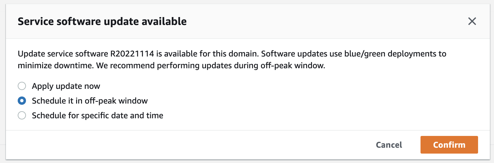

# Defining off-peak windows for Amazon OpenSearch Service

When you create an Amazon OpenSearch Service domain, you define a daily 10-hour window that's considered
_off-peak_ hours. OpenSearch Service uses this window to schedule service
software updates and Auto-Tune optimizations that require a [blue/green deployment](managedomains-configuration-changes.md "managedomains-configuration-changes.md") during
comparatively lower traffic times, whenever possible. Blue/green refers to the process of
creating a new environment for domain updates and routing users to the new environment after
those updates are complete.

Although blue/green deployments are non-disruptive, to minimize any potential [performance impact](managedomains-configuration-changes.md#initiating-tracking-configuration-changes "managedomains-configuration-changes.md#initiating-tracking-configuration-changes") while resources
are being consumed for a blue/green deployment, we recommend that you schedule these deployments
during the domain's configured off-peak window. Updates such as node replacements, or those that
need to be deployed to the domain immediately, don't use the off-peak window.

You can modify the start time for the off-peak window, but you can't modify the length of
the window.

###### Note

Off-peak windows were introduced on February 16, 2023. All domains created before this
date have the off-peak window disabled by default. You must manually enable and configure the
off-peak window for these domains. All domains created _after_ this date
will have the off-peak window enabled by default. You can't disable the off-peak window for a
domain after it's enabled.

## Off-peak service software updates

OpenSearch Service has two broad categories of service software
updates—_optional_ and _required_. Both types
require blue/green deployments. Optional updates aren't enforced on your domains, while
required updates are automatically installed if you take no action before the specified
deadline (typically two weeks from availability). For more information, see [Optional versus required updates](service-software.md#service-software-optional-required "service-software.md#service-software-optional-required").

When you initiate an _optional_ update, you have the choice to apply
the update immediately, schedule it for a subsequent off-peak window, or specify a custom date
and time to apply it.



For _required_ updates, OpenSearch Service automatically schedules a date and time
during off-peak hours to perform the update. You receive a notification three days before the
scheduled update, and you can choose to reschedule it for a later date and time within the
required deployment period. For instructions, see [Rescheduling actions](#off-peak-reschedule "#off-peak-reschedule").

## Off-peak Auto-Tune optimizations

Previously, Auto-Tune used [maintenance windows](auto-tune-schedule.md "auto-tune-schedule.md")
to schedule changes that required a blue/green deployment. Domains that already had Auto-Tune
and maintenance windows enabled prior to the introduction of off-peak windows will continue to
use maintenance windows for these updates, unless you migrate them to use the off-peak
window.

We recommend that you migrate your domains to use the off-peak window, as it's used to
schedule other activities on the domain such as service softwate updates. For instructions,
see [Migrating from Auto-Tune maintenance windows](#off-peak-migrate "#off-peak-migrate"). You can't revert back to using maintenance windows
after you migrate your domain to the off-peak window.

All domains created after February 16, 2023 will use the off-peak window, rather than
legacy maintenance windows, to schedule blue/green deployments. You can't disable the off-peak
window for a domain. For a list of Auto-Tune optimizations that require blue/green
deployments, see [Types of changes](auto-tune.md#auto-tune-types "auto-tune.md#auto-tune-types").

## Enabling the off-peak window

Any domains created before February 16, 2023 (when off-peak windows were introduced) have
the feature disabled by default. You must manually enable it for these domains. You can't
disable the off-peak window after it's enabled.

###### To enable the off-peak window for a domain

1. Open the Amazon OpenSearch Service console at [https://console.aws.amazon.com/aos/home](https://console.aws.amazon.com/aos/home "https://console.aws.amazon.com/aos/home ").
2. Select the name of the domain to open its configuration.
3. Navigate to the **Off-peak window** tab and choose
   **Edit**.
4. Specify a custom start time in Coordinated Universal Time (UTC). For example, to
   configure a start time of 11:30 P.M. in the US West (Oregon) Region,
   specify **07:30**.
5. Choose **Save changes**.
   To modify the off-peak window using the AWS CLI, send an [UpdateDomainConfig](../APIReference/API_UpdateDomainConfig.md "../APIReference/API_UpdateDomainConfig.md") request:

```
aws opensearch update-domain-config \
  --domain-name `my-domain` \
  --off-peak-window-options 'Enabled=true, OffPeakWindow={WindowStartTime={Hours=`02`,Minutes=`00`}}'
```

If you don't specify a custom window start time, it defaults to 00:00 UTC.

## Configuring a custom off-peak window

You specify a custom off-peak window for your domain in Coordinated Universal Time (UTC).
For example, if your want the off-peak window to start at 11:00 P.M. for a domain in the
US East (N. Virginia) Region, you'd specify 04:00 UTC.

###### To modify the off-peak window for a domain

1. Open the Amazon OpenSearch Service console at [https://console.aws.amazon.com/aos/home](https://console.aws.amazon.com/aos/home "https://console.aws.amazon.com/aos/home ").
2. Select the name of the domain to open its configuration.
3. Navigate to the **Off-peak window** tab. You can view the
   configured off-peak window and a list of upcoming scheduled actions for the
   domain.
4. Choose **Edit** and specify a new start time in UTC. For example,
   to configure a start time of 9:00 PM in the US East (N. Virginia) Region,
   specify **02:00 UCT**.
5. Choose **Save changes**.
   To configure a custom off-peak window using the AWS CLI, send an [UpdateDomainConfig](../APIReference/API_UpdateDomainConfig.md "../APIReference/API_UpdateDomainConfig.md") request and specify the hour and minute in 24-hour time
   format.

For example, the following request changes the window start time to 2:00 A.M.
UTC:

```
aws opensearch update-domain-config \
  --domain-name `my-domain` \
  --off-peak-window-options 'OffPeakWindow={WindowStartTime={Hours=`02`,Minutes=`00`}}'
```

If you don't specify a window start time, it defaults to 10:00 P.M. local time for the
AWS Region that the domain is created in.

## Viewing scheduled actions

You can view all actions that are currently scheduled, in progress, or pending for each of
your domains. Actions can have a severity of `HIGH`, `MEDIUM`, and
`LOW`.

Actions can have the following statuses:

- `Pending update` – The action is in the queue to be
  processed.
- `In progress` – The action is currently in progress.
- `Failed` – The action failed to complete.
- `Completed` – The action has completed successfully.
- `Not eligible` – Only for service software updates. The update can't
  proceed because the cluster is in an unhealthy state.
- `Eligible` – Only for service software updates. The domain is
  eligible for an update.

The OpenSearch Service console displays all scheduled actions within the domain configuration, along
with each action's severity and current status.

###### To view scheduled actions for a domain

1. Open the Amazon OpenSearch Service console at [https://console.aws.amazon.com/aos/home](https://console.aws.amazon.com/aos/home "https://console.aws.amazon.com/aos/home ").
2. Select the name of the domain to open its configuration.
3. Navigate to the **Off-peak window** tab.
4. Under **Scheduled actions**, view all actions that are currently
   scheduled, in progress, or pending for the domain.
   To view scheduled actions using the AWS CLI, send a [ListScheduledActions](../APIReference/API_ListScheduledActions.md "../APIReference/API_ListScheduledActions.md") request:

```
aws opensearch list-scheduled-actions \
  --domain-name `my-domain`
```

**Response**:

```
{
    "ScheduledActions": [
        {
            "Cancellable": true,
            "Description": "The Deployment type is : BLUE_GREEN.",
            "ID": "R20220721-P13",
            "Mandatory": false,
            "Severity": "HIGH",
            "ScheduledBy": "CUSTOMER",
            "ScheduledTime": 1.673871601E9,
            "Status": "PENDING_UPDATE",
            "Type": "SERVICE_SOFTWARE_UPDATE",
        },
        {
            "Cancellable": true,
            "Description": "Amazon Opensearch will adjust the young generation JVM arguments on your domain to improve performance",
            "ID": "Auto-Tune",
            "Mandatory": true,
            "Severity": "MEDIUM",
            "ScheduledBy": "SYSTEM",
            "ScheduledTime": 1.673871601E9,
            "Status": "PENDING_UPDATE",
            "Type": "JVM_HEAP_SIZE_TUNING",
        }
    ]
}
```

## Rescheduling actions

OpenSearch Service notifies you of scheduled service software updates and Auto-Tune optimizations. You
can choose to apply the change immediately, or reschedule it for a later date and time.

###### Note

OpenSearch Service can schedule the action within an hour of the time you select. For exmple, if you
choose to apply an update at 5 P.M., it can be applied between 5 and 6 P.M.

###### To reschedule an action

1. Open the Amazon OpenSearch Service console at [https://console.aws.amazon.com/aos/home](https://console.aws.amazon.com/aos/home "https://console.aws.amazon.com/aos/home ").
2. Select the name of the domain to open its configuration.
3. Navigate to the **Off-peak window** tab.
4. Under **Scheduled actions**, select the action and choose
   **Reschedule**.
5. Choose one of the following options:
   - **Apply update now** - Immediately schedules the action to
     happen in the current hour _if there's capacity available_. If
     capacity isn't available, we provide other available time slots to choose
     from.
   - **Schedule it in off-peak window** - Marks the action to be
     picked up during an upcoming off-peak window. There's no guarantee that the change
     will be implemented during the immediate next window. Depending on capacity, it
     might happen in subsequent days.
   - **Reschedule this update** - Lets you specify a custom date
     and time to apply the change. If the time that you specify is unavailable for
     capacity reasons, you can select a different time slot.
   - **Cancel scheduled update** - Cancels the update. This option
     is only available for optional service software updates. It's not available for
     Auto-Tune actions or mandatory software updates.

6. Choose **Save changes**.
   To reschedule an action using the AWS CLI, send an [UpdateScheduledAction](../APIReference/API_UpdateScheduledAction.md "../APIReference/API_UpdateScheduledAction.md") request. To retrieve the action ID, send a
   `ListScheduledActions` request.

The following request reschedules a service software update for a specific date and
time:

```
aws opensearch update-scheduled-action \
  --domain-name `my-domain` \
  --action-id `R20220721-P13` \
  --action-type "SERVICE_SOFTWARE_UPDATE" \
  --desired-start-time `1677348395000` \
  --schedule-at `TIMESTAMP`
```

**Response**:

```
{
   "ScheduledAction": {
      "Cancellable": true,
      "Description": "Cluster status is updated.",
      "Id": "R20220721-P13",
      "Mandatory": false,
      "ScheduledBy": "CUSTOMER",
      "ScheduledTime": 1677348395000,
      "Severity": "HIGH",
      "Status": "PENDING_UPDATE",
      "Type": "SERVICE_SOFTWARE_UPDATE"
   }
}
```

If the request fails with a `SlotNotAvailableException`, it means that the
time you specified isn't available for capacity reasons, and you must specify a different
time. OpenSearch Service provides alternate available slot suggestions in the response.

## Migrating from Auto-Tune maintenance windows

If a domain was created before February 16, 2023, it could use [maintenance windows](auto-tune-schedule.md "auto-tune-schedule.md") to schedule Auto-Tune optimizations
that require a blue/green deployment. You can migrate your existing Auto-Tune domains to use
the off-peak window instead.

###### Note

You can't revert back to using maintenance windows after you migrate your domain to use
off-peak windows.

###### To migrate a domain to use the off-peak window

1. Within the Amazon OpenSearch Service console, select the name of the domain to open its
   configuration.
2. Go to the **Auto-Tune** tab and choose
   **Edit**.
3. Select **Migrate to off-peak window**.
4. For **Start time (UTC)**, provide a daily start time for the
   off-peak window in Universal Coordinated Time (UTC).
5. Choose **Save changes**.
   To migrate from a Auto-Tune maintenance window to the off-peak window using the AWS CLI,
   send an [UpdateDomainConfig](../APIReference/API_UpdateDomainConfig.md "../APIReference/API_UpdateDomainConfig.md") request:

```
aws opensearch update-domain-config \
  --domain-name `my-domain` \
  --auto-tune-options DesiredState=ENABLED,UseOffPeakWindow=true,MaintenanceSchedules=[]
```

The off-peak window must be turned on in order for you to migrate a domain from the
Auto-Tune maintenance window to the off-peak window. You can enable the off-peak window in
a separate request or in the same request. For instructions, see [Enabling the off-peak window](#off-peak-enable "#off-peak-enable").
