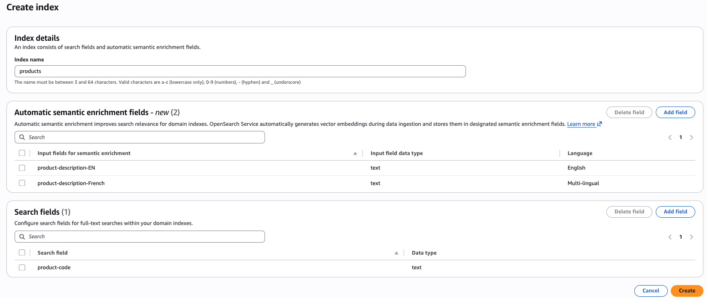

# Automatic semantic enrichment for

Amazon OpenSearch Service

## Introduction

Amazon OpenSearch Service uses word-to-word matching (lexical search) to find results, similar to other
traditional search engines. This approach works well for specific queries like product codes
or model numbers, but struggles with abstract searches where understanding user intent
becomes crucial. For example, when you search for "shoes for the beach," lexical search
matches individual words "shoes," "beach," "for," and "the" in catalog items, potentially
missing relevant products like "water-resistant sandals" or "surf footwear" that don't
contain the exact search terms.

Automatic Semantic Enrichment solves this limitation by considering both keyword matches
and the contextual meaning behind searches. This feature understands search intent and
improves search relevance by up to 20%. Enable this feature for text fields in your index to
enhance search results.

###### Note

Automatic semantic enrichment is available for OpenSearch Service domains running version 2.19 or later.
Additionally, domains with OpenSearch version 2.19 also need to be on the latest service software version update.
Currently, feature is available for public domains, and VPC domains are not supported.

## Model details and performance benchmark

While this feature handles the technical complexities behind the scenes without exposing the underlying model,
we provide transparency through a brief model description and benchmark results to help you make informed decisions about
feature adoption in your critical workloads.

Automatic semantic enrichment uses a service-managed, pre-trained sparse model that works effectively without requiring custom fine-tuning.
The model analyzes the fields you specify, expanding them into sparse vectors based on learned associations from diverse training data.
The expanded terms and their significance weights are stored in native Lucene index format for efficient retrieval.
We’ve optimized this process using [document-only mode,](https://docs.opensearch.org/docs/latest/vector-search/ai-search/neural-sparse-with-pipelines/#step-1a-choose-the-search-mode "https://docs.opensearch.org/docs/latest/vector-search/ai-search/neural-sparse-with-pipelines/#step-1a-choose-the-search-mode")
where encoding happens only during data ingestion. Search queries are merely tokenized rather than processed through the sparse model,
making the solution both cost-effective and performant.

Our performance validation during feature development used the [MS MARCO](https://huggingface.co/datasets/BeIR/msmarco "https://huggingface.co/datasets/BeIR/msmarco")
passage retrieval dataset, featuring passages averaging 334 characters. For relevance scoring, we measured average Normalized Discounted Cumulative Gain (NDCG) for
the first 10 search results (ndcg@10) on the [BEIR](https://github.com/beir-cellar/beir "https://github.com/beir-cellar/beir")
benchmark for English content and average ndcg@10 on MIRACL for multilingual content.
We assessed latency through client-side, 90th-percentile (p90) measurements and search response p90
[took values.](https://github.com/beir-cellar/beir "https://github.com/beir-cellar/beir")
These benchmarks provide baseline performance indicators for both search relevance and response times. Here are the key benchmark numbers -

- English language - Relevance improvement of 20% over lexical search. It also lowered P90 search latency by 7.7% over lexical search (BM25 is 26 ms, and automatic semantic enrichment is 24 ms).
- Multi-lingual - Relevance improvement of 105% over lexical search, whereas P90 search latency increased by 38.4% over lexical search (BM25 is 26 ms, and automatic semantic enrichment is 36 ms).

Given the unique nature of each workload, we encourage you to evaluate this feature in your development environment using your own benchmarking criteria before making implementation decisions.

## Languages Supported

The feature supports English. In addition, the model also supports Arabic, Bengali, Chinese, Finnish, French, Hindi, Indonesian, Japanese, Korean, Persian, Russian, Spanish, Swahili, and Telugu.

## Set up an automatic semantic enrichment index for domains

Setting up an index with automatic semantic enrichment enabled for your text fields is easy,
and you can manage it through the console, APIs, and CloudFormation templates during new index creation.
To enable it for an existing index, you need to recreate the index with automatic semantic enrichment enabled for text fields.

Console experience -
The AWS console allows you to easily create an index with automatic semantic enrichment fields.
Once you select a domain, you will find the create index button at the top of the console. Once you click the create index button,
you will find options to define automatic semantic enrichment fields. In one index, you can have combinations of
automatic semantic enrichment for English and multilingual, as well as lexical fields.



API experience - To create an automatic semantic enrichment index using the AWS Command Line Interface (AWS CLI), use the create-index command:

```
aws opensearch create-index \
--domain-name [domain_name] \
--index-name [index_name] \
--index-schema [index_body] \

```

In the following example index-schema, the _title_semantic_ field has a field type set to _text_ and has parameter
_semantic_enrichment_ set to status _ENABLED_.
Setting the _semantic_enrichment_ parameter enables automatic semantic enrichment on the _title_semantic_ field.
You can use the _language_options_ field to specify either _english_ or _multi-lingual_.

```

    aws opensearch create-index \
    --id XXXXXXXXX \
    --index-name 'product-catalog' \
    --index-schema '{
    "mappings": {
        "properties": {
            "product_id": {
                "type": "keyword"
            },
            "title_semantic": {
                "type": "text",
                "semantic_enrichment": {
                    "status": "ENABLED",
                    "language_options": "english"
                }
            },
            "title_non_semantic": {
                "type": "text"
            }
        }
    }
}'

```

To describe the created index, use the following command:

```
aws opensearch get-index \
--domain-name [domain_name] \
--index-name [index_name] \

```

## Data ingestion and search

Once you've created an index with automatic semantic enrichment enabled,
the feature works automatically during data ingestion process, no additional configuration required.

Data ingestion: When you add documents to your index, the system automatically:

- Analyzes the text fields you designated for semantic enrichment
- Generates semantic encodings using OpenSearch Service managed sparse model
- Stores these enriched representations alongside your original data

This process uses OpenSearch's built-in ML connectors and ingest pipelines, which are created and managed automatically behind the scenes.

Search: The semantic enrichment data is already indexed, so queries run efficiently without invoking the ML model again.
This means you get improved search relevance with no additional search latency overhead.

## Configuring permissions for

automatic semantic enrichment

Before creating an index with automatic semantic enrichment, you need to configure the
required permissions. This section explains the permissions needed for different index
operations and how to set them up for both AWS Identity and Access Management (IAM) and fine-grained access
control scenarios.

### IAM

permissions

The following IAM permissions are required for automatic semantic enrichment
operations. These permissions vary depending on the specific index operation you
want to perform.

#### CreateIndex API permissions

To create an index with automatic semantic enrichment, you need the following
IAM permissions:

- `es:CreateIndex` – Create an index with semantic
  enrichment capabilities.
- `es:ESHttpHead` – Perform HEAD requests to check
  index existence.
- `es:ESHttpPut` – Perform PUT requests for index
  creation.
- `es:ESHttpPost` – Perform POST requests for index
  operations.

#### UpdateIndex API permissions

To update an existing index with automatic semantic enrichment, you need the
following IAM permissions:

- `es:UpdateIndex` – Update index settings and
  mappings.
- `es:ESHttpPut` – Perform PUT requests for index
  updates.
- `es:ESHttpGet` – Perform GET requests to retrieve
  index information.
- `es:ESHttpPost` – Perform POST requests for index
  operations.

#### GetIndex

API permissions

To retrieve information about an index with automatic semantic enrichment, you
need the following IAM permissions:

- `es:GetIndex` – Retrieve index information and
  settings.
- `es:ESHttpGet` – Perform GET requests to retrieve
  index data.

#### DeleteIndex API permissions

To delete an index with automatic semantic enrichment, you need the following
IAM permissions:

- `es:DeleteIndex` – Delete an index and its semantic
  enrichment components.
- `es:ESHttpDelete` – Perform DELETE requests for
  index removal.

### Sample IAM

policy

The following sample identity-based access policy provides the permissions
necessary for a user to manage indexes with automatic semantic enrichment:

```
{
    "Version": "2012-10-17",
    "Statement": [
        {
            "Sid": "AllowSemanticEnrichmentIndexOperations",
            "Effect": "Allow",
            "Action": [
                "es:CreateIndex",
                "es:UpdateIndex",
                "es:GetIndex",
                "es:DeleteIndex",
                "es:ESHttpHead",
                "es:ESHttpGet",
                "es:ESHttpPut",
                "es:ESHttpPost",
                "es:ESHttpDelete"
            ],
            "Resource": "arn:aws:es:`aws-region`:`111122223333`:domain/`domain-name`/*"
        }
    ]
}
```

Replace `aws-region`, `111122223333`, and
`domain-name` with your specific values. You can
further restrict access by specifying particular index patterns in the resource
ARN.

### Fine-grained

access control permissions

If your Amazon OpenSearch Service domain has fine-grained access control enabled, you need
additional permissions beyond the IAM permissions. The following permissions are
required for each index operation.

#### CreateIndex API permissions

When fine-grained access control is enabled, the following additional
permissions are required for creating an index with automatic semantic
enrichment:

- `indices:admin/create` – Create index
  operations.
- `indices:admin/mapping/put` – Create and update
  index mappings.
- `cluster:admin/opensearch/ml/create_connector` –
  Create machine learning connectors for semantic processing.
- `cluster:admin/opensearch/ml/register_model` –
  Register machine learning models for semantic enrichment.
- `cluster:admin/ingest/pipeline/put` – Create ingest
  pipelines for data processing.
- `cluster:admin/search/pipeline/put` – Create search
  pipelines for query processing.

#### UpdateIndex API permissions

When fine-grained access control is enabled, the following additional
permissions are required for updating an index with automatic semantic
enrichment:

- `indices:admin/get` – Retrieve index
  information.
- `indices:admin/settings/update` – Update index
  settings.
- `indices:admin/mapping/put` – Update index
  mappings.
- `cluster:admin/opensearch/ml/create_connector` –
  Create machine learning connectors.
- `cluster:admin/opensearch/ml/register_model` –
  Register machine learning models.
- `cluster:admin/ingest/pipeline/put` – Create ingest
  pipelines.
- `cluster:admin/search/pipeline/put` – Create search
  pipelines.
- `cluster:admin/ingest/pipeline/get` – Retrieve
  ingest pipeline information.
- `cluster:admin/search/pipeline/get` – Retrieve
  search pipeline information.

#### GetIndex

API permissions

When fine-grained access control is enabled, the following additional
permissions are required for retrieving information about an index with
automatic semantic enrichment:

- `indices:admin/get` – Retrieve index
  information.
- `cluster:admin/ingest/pipeline/get` – Retrieve
  ingest pipeline information.
- `cluster:admin/search/pipeline/get` – Retrieve
  search pipeline information.

#### DeleteIndex API permissions

When fine-grained access control is enabled, the following additional
permission is required for deleting an index with automatic semantic
enrichment:

- `indices:admin/delete` – Delete index
  operations.

## Query Rewrites

Automatic semantic enrichment automatically converts your existing “match”
queries to semantic search queries without requiring query modifications. If a match query is part of a compound query,
the system traverses your query structure, finds match queries, and replaces them with neural sparse queries.
Currently, the feature only supports replacing “match” queries, whether it’s a standalone query or part of a compound query.
“multi_match” is not supported. In addition, the feature supports all compound queries to replace their nested match queries.
Compound queries include: bool, boosting, constant_score, dis_max, function_score, and hybrid.

## Limitations of automatic semantic enrichment

Automatic semantic search is most effective when applied to small-to-medium
sized fields containing natural language content, such as movie titles, product descriptions,
reviews, and summaries. Although semantic search enhances relevance for most use cases,
it might not be optimal for certain scenarios. Consider following limitations when deciding whether
to implement automatic semantic enrichment for your specific use case.

- Very long documents – The current sparse model processes only the first 8,192 tokens of each document for English.
  For multilingual documents, it’s 512 tokens. For lengthy articles, consider implementing document chunking to
  ensure complete content processing.
- Log analysis workloads – Semantic enrichment significantly increases index size,
  which might be unnecessary for log analysis where exact matching typically suffices.
  The additional semantic context rarely improves log search effectiveness enough to justify the increased storage requirements.
- Automatic semantic enrichment is not compatible with the Derived Source feature.

## Pricing

Amazon OpenSearch Service bills automatic semantic enrichment based on OpenSearch Compute Units (OCUs)
consumed during sparse vector generation at indexing time. You’re charged only for actual usage during indexing.
You can monitor this consumption using the Amazon CloudWatch metric SemanticSearchOCU. For specific details
about model token limits, volume throughput per OCU, and example of sample calculation, visit [OpenSearch Service Pricing](https://aws.amazon.com/opensearch-service/pricing/ "https://aws.amazon.com/opensearch-service/pricing/").
