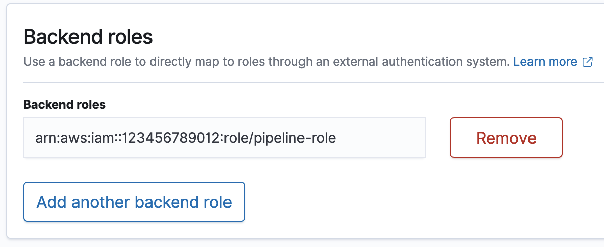

# Granting Amazon OpenSearch Ingestion pipelines access to

domains

An Amazon OpenSearch Ingestion pipeline needs permission to write to the OpenSearch Service domain that is
configured as its sink. To provide access, you configure an AWS Identity and Access Management (IAM) role with a
restrictive permissions policy that limits access to the domain that a pipeline is sending
data to. For example, you might want to limit an ingestion pipeline to only the domain and
indexes that are required to support its use case.

###### Important

You can choose to manually create the pipeline role, or you can have OpenSearch Ingestion
create it for you during pipeline creation. If you choose automatic role creation,
OpenSearch Ingestion adds all required permissions to the pipeline role access policy based
on the source and sink that you choose. It creates a pipeline role in IAM with the
prefix `OpenSearchIngestion-` and the suffix that you enter. For more
information, see [Pipeline role](pipeline-security-overview.md#pipeline-security-sink "pipeline-security-overview.md#pipeline-security-sink").

If you have OpenSearch Ingestion create the pipeline role for you, you still need to
include the role in the domain access policy and map it to a backend role (if the domain
uses fine-graned access control), either before or after you create the pipeline. See
step 2 for instructions.

###### Topics

- [Step 1: Create the pipeline role](#pipeline-access-configure "#pipeline-access-configure")
- [Step 2: Configure data access for the
  domain](#pipeline-access-domain "#pipeline-access-domain")

## Step 1: Create the pipeline role

The pipeline role must have an attached permissions policy that allows it to send data
to the domain sink. It must also have a trust relationship that allows OpenSearch Ingestion
to assume the role. For instructions on how to attach a policy to a role, see [Adding IAM identity permissions](../../../IAM/latest/UserGuide/access_policies_manage-attach-detach.md#add-policies-console "../../../IAM/latest/UserGuide/access_policies_manage-attach-detach.md#add-policies-console") in the _IAM User Guide_.

The following sample policy demonstrates the [least privilege](../../../IAM/latest/UserGuide/best-practices.md#grant-least-privilege "../../../IAM/latest/UserGuide/best-practices.md#grant-least-privilege") that you can provide in a pipeline role for it to write to
a single domain:

JSON

```
`{
 "Version":"2012-10-17",
 "Statement": [
 {
 "Effect": "Allow",
 "Action": "es:DescribeDomain",
 "Resource": "arn:aws:es:*:`111122223333`:domain/*"
 },
 {
 "Effect": "Allow",
 "Action": "es:ESHttp*",
 "Resource": "arn:aws:es:*:`111122223333`:domain/`domain-name`/*"
 }
 ]
}`

```

If you plan to reuse the role to write to multiple domains, you can make the policy
more broad by replacing the domain name with a wildcard character
(`*`).

The role must have the following [trust relationship](../../../IAM/latest/UserGuide/roles-managingrole-editing-console.md#roles-managingrole_edit-trust-policy "../../../IAM/latest/UserGuide/roles-managingrole-editing-console.md#roles-managingrole_edit-trust-policy"), which allows OpenSearch Ingestion to assume the pipeline
role:

JSON

```
`{
 "Version":"2012-10-17",
 "Statement":[
 {
 "Effect":"Allow",
 "Principal":{
 "Service":"osis-pipelines.amazonaws.com"
 },
 "Action":"sts:AssumeRole"
 }
 ]
}`

```

## Step 2: Configure data access for the

domain

In order for a pipeline to write data to a domain, the domain must have a [domain-level access policy](ac.md#ac-types-resource "ac.md#ac-types-resource") that
allows the pipeline role to access it.

The following sample domain access policy allows the pipeline role named
`pipeline-role` to write data to the domain named
`ingestion-domain`:

JSON

```
`{
 "Version":"2012-10-17",
 "Statement": [
 {
 "Effect": "Allow",
 "Principal": {
 "AWS": "arn:aws:iam::`111122223333`:role/`pipeline-role`"
 },
 "Action": [
 "es:DescribeDomain",
 "es:ESHttp*"
 ],
 "Resource": "arn:aws:es:`us-east-1`:`111122223333`:domain/`domain-name`/*"
 }
 ]
}`

```

### Map the pipeline role (only for

domains that use fine-grained access control)

If your domain uses [fine-grained access control](fgac.md "fgac.md") for authentication, there are extra steps
you need to take to provide your pipeline access to a domain. The steps differ
depending on your domain configuration:

- **Scenario 1: Different master role and pipeline
  role** – If you're using an IAM Amazon Resource Name
  (ARN) as the master user and it's _different_ than the
  pipeline role, you need to map the pipeline role to the OpenSearch
  `all_access` backend role. This adds the pipeline role as an
  additional master user. For more information, see [Additional master
  users](fgac.md#fgac-more-masters "fgac.md#fgac-more-masters").
- **Scenario 2: Master user in the internal user
  database** – If your domain uses a master user in the
  internal user database and HTTP basic authentication for OpenSearch Dashboards,
  you can't pass the master username and password directly into the pipeline
  configuration. Instead, map the pipeline role to the OpenSearch
  `all_access` backend role. This adds the pipeline role as an
  additional master user. For more information, see [Additional master
  users](fgac.md#fgac-more-masters "fgac.md#fgac-more-masters").
- **Scenario 3: Same master role and pipeline role
  (uncommon)** – If you're using an IAM ARN as the
  master user, and it's the same ARN that you're using as the pipeline role,
  you don't need to take any further action. The pipeline has the required
  permissions to write to the domain. This scenario is uncommon because most
  environments use an administrator role or some other role as the master
  role.

The following image shows how to map the pipeline role to a backend role:


