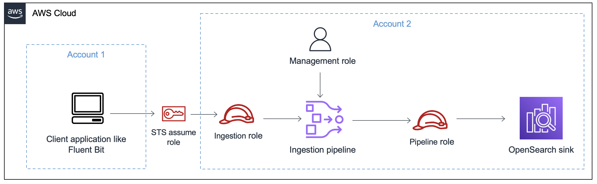
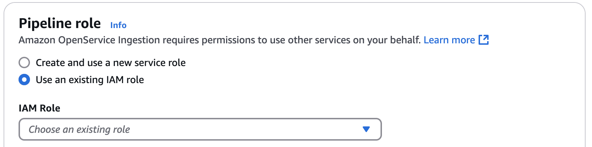

# Setting up roles and users in

Amazon OpenSearch Ingestion

Amazon OpenSearch Ingestion uses a variety of permissions models and IAM roles in order to allow
source applications to write to pipelines, and to allow pipelines to write to sinks. Before
you can start ingesting data, you need to create one or more IAM roles with specific
permissions based on your use case.

At minimum, the following roles are required to set up a successful pipeline.

| Name                                                                                | Description                                                                                                                                                                                                                               |
| ----------------------------------------------------------------------------------- | ----------------------------------------------------------------------------------------------------------------------------------------------------------------------------------------------------------------------------------------- | --------------------------------------------------------------------------------------------------------------------------------------------------------------------------------------------------------------------------------------------------------------------------------------------------------------------------------------------------------------------------------------------------------------------------------------------------------------------------------------------------------------------------------------------------------------------------------------------------------------------------------------------------------------------------------------------------------------------------------------------------------------------------------------------------------------------------------------------------------------------------------------------------------------------------------------------------------------------------------------------------------------------------------------------------------------------------------------------------------------------------------------------------------------------------------------------------------------------------------------------------------------------------------------------------------------------------------------------------------------------------------------------------------------------------------------------------------------------------------------------------------------------------------------------------------------------------------------------------------------------------------------------------------------------------------------------------------------------------------------------------------------------------------------------------------------------------------------------------------------------------------------------------------------------------------------------------------------------------------------------------------------------------------------------------------------------------------------------------------------------------------------------------------------------------------------------------------------------------------------------------------------------------------------------------------------------------------------------------------------------------------------------------------------------------------------------------------------------------------------------------------------------------------------------------------------------------------------------------------------------------------------------------------------------------------------------------------------------------------------------------------------------------------------------------------------------------------------------------------------------------------------------------------------------------------------------------------------------------------------------------------------------------------------------------------------------------------------------------------------------------------------------------------------------------------------------------------------------------------------------------------------------------------------------------------------------------------------------------------------------------------------------------------------------------------------------------------------------------------------------------------------------------------------------------------------------------------------------------------------------------------------------------------------------------------------------------------------------------------------------------------------------------------------------------------------------------------------------------------------------------------------------------------------------------------------------------------------------------------------------------------------------------------------------------------------------------------------------------------------------------------------------------------------------------------------------------------------------------------------------------------------------------------------------------------------------------------------------------------------------------------------------------------------------------------------------------------------------------------------------------------------------------------------------------------------------------------------------------------------------------------------------------------------------------------------------------------------------------------------------------------------------------------------------------------------------------------------------------------------------------------------------------------------------------------------------------------------------------------------------------------------------------------------------------------------------------------------------------------------------------------------------------------------------------------------------------------------------------------------------------------------------------------------------------------------------------------------------------------------------------------------------------------------------------------------------------------------------------------------------------------------------------------------------------------------------------------------------------------------------------------------------------------------------------------------------------------------------------------------------------------------------------------------------------------------------------------------------------------------------------------------------------------------------------------------------------------------------------------------------------------------------------------------------------------------------------------------------------------------------------------------------------------------------------------------------------------------------------------------------------------------------------------------------------------------------------------------------------------------------------------------------------------------------------------------------------------------------------------------------------------------------------------------------------------------------------------------------------------------------------------------------------------------------------------------------------------------------------------------------------------------------------------------------------------------------------------------------------------------------------------------------------------------------------------------------------------------------------------------------------------------------------------------------------------------------------------------------------------------------------------------------------------------------------------------------------------------------------------------------------------------------------------------------------------------------------------------------------------------------------------------------------------------------------------------------------------------------------------------------------------------------------------------------------------------------------------------------------------------------------------------------------------------------------------------------------------------------------------------------------------------------------------------------------------------------------------------------------------------------------------------------------------------------------------------------------------------------------------------------------------------------------------------------------------------------------------------------------------------------------------------------------------------------------------------------------------------------------------------------------------------------------------------------------------------------------------------------------------------------------------------------------------------------------------------------------------------------------------------------------------------------------------------------------------------------------------------------------------------------------------------------------------------------------------------------------------------------------------------------------------------------------------------------------------------------------------------------------------------------------------------------------------------------------------------------------------------------------------------------------------------------------------------------------------------------------------------------------------------------------------------------------------------------------------------------------------------------------------------------------------------------------------------------------------------------------------------------------------------------------------------------------------------------------------------------------------------------------------------------------------------------------------------------------------------------------------------------------------------------------------------------------------------------------------------------------------------------------------------------------------------------------------------------------------------------------------------------------------------------------------------------------------------------------------------------------------------------------------------------------------------------------------------------------------------------------------------------------------------------------------------------------------------------------------------------------------------------------------------------------------------------------------------------------------------------------------------------------------------------------------------------------------------------------------------------------------------------------------------------------------------------------------------------------------------------------------------------------------------------------------------------------------------------------------------------------------------------------------------------------------------------------------------------------------------------------------------------------------------------------------------------------------------------------------------------------------------------------------------------------------------------------------------------------------------------------------------------- |
| [Pipeline role](#pipeline-security-sink "#pipeline-security-sink")                  | The pipeline role provides the required permissions for a pipeline to read from the source and write to the domain or collection sink. You can manually create the pipeline role, or you can have OpenSearch Ingestion create it for you. |
| [Ingestion role](#pipeline-security-same-account "#pipeline-security-same-account") | The ingestion role contains the `osis:Ingest` permission for the pipeline resource. This permission allows push-based sources to ingest data into a pipeline.                                                                             | The following image demonstrates a typical pipeline setup, where a data source such as Amazon S3 or Fluent Bit is writing to a pipeline in a different account. In this case, the client needs to assume the ingestion role in order to access the pipeline. For more information, see [Cross-account ingestion](#pipeline-security-different-account "#pipeline-security-different-account").  For a simple setup guide, see [Tutorial: Ingesting data into a domain using Amazon OpenSearch Ingestion](osis-get-started.md "osis-get-started.md"). **Topics**  • [Pipeline role](#pipeline-security-sink "#pipeline-security-sink")  • [Ingestion role](#pipeline-security-same-account "#pipeline-security-same-account")  • [Cross-account ingestion](#pipeline-security-different-account "#pipeline-security-different-account") ## Pipeline role A pipeline needs certain permissions to read from its source and write to its sink. These permissions depend on the client application or AWS service that is writing to the pipeline, and whether the sink is an OpenSearch Service domain, an OpenSearch Serverless collection, or Amazon S3. In addition, a pipeline might need permissions to physically _pull_ data from the source application (if the source is a pull-based plugin), and permissions to write to an S3 dead letter queue, if enabled. When you create a pipeline, you have the option of specifying an existing IAM role that you manually created, or having OpenSearch Ingestion automatically create the pipeline role based on the source and the sink that you selected. The following image shows how to specify the pipeline role in the AWS Management Console.  ###### Topics  • [Automating pipeline role creation](#pipeline-role-auto-create "#pipeline-role-auto-create")  • [Manually creating the pipeline role](#pipeline-role-manual-create "#pipeline-role-manual-create") ### Automating pipeline role creation You can choose to have OpenSearch Ingestion create the pipeline role for you. It automatically identifies which permissions the role requires based on the configured source and sinks. It creates an IAM role with the prefix `OpenSearchIngestion-`, and with the suffix that you enter. For example, if you enter `PipelineRole` as the suffix, OpenSearch Ingestion creates a role named `OpenSearchIngestion-PipelineRole`. Automatically creating the pipeline role simplifies the setup process and reduces the likelihood of configuration errors. By automating the role creation, you can avoid manually assigning permissions, ensuring that the correct policies are applied without risking security misconfigurations. This also saves time and enhances security compliance by enforcing best practices, while ensuring consistency across multiple pipeline deployments. You can only have OpenSearch Ingestion automatically create the pipeline role in the AWS Management Console. If you're using the AWS CLI, the OpenSearch Ingestion API, or one of the SDKs, you must specify a manually-created pipeline role. To have OpenSearch Ingestion create the role for you, select **Create and use a new service role**. ###### Important You still need to manually modify the domain or collection access policy to grant access to the pipeline role. For domains that use fine-grained access control, you must also map the pipeline role to a backend role. You can perform these steps before or after you create the pipeline. For instructions, see the following topics:  • [Configure data access for the domain](pipeline-domain-access.md#pipeline-access-domain "pipeline-domain-access.md#pipeline-access-domain")  • [Configure data and network access for the collection](pipeline-domain-access.md#pipeline-collection-acces "pipeline-domain-access.md#pipeline-collection-acces") ### Manually creating the pipeline role You might prefer to manually create the pipeline role if you need more control over permissions to meet specific security or compliance requirements. Manual creation allows you to tailor roles to fit existing infrastructure or access management strategies. You might also choose manual setup to integrate the role with other AWS services or ensure it aligns with your unique operational needs. To choose a manually-created pipeline role, select **Use an existing IAM role** and choose an existing role. The role must have all permissions needed to receive data from the selected source and write to the selected sink. The following sections outline how to manually create a pipeline role. ###### Topics  • [Permissions to read from a source](#pipeline-security--source "#pipeline-security--source")  • [Permissions to write to a domain sink](#pipeline-security-domain-sink "#pipeline-security-domain-sink")  • [Permissions to write to a collection sink](#pipeline-security--collection-sink "#pipeline-security--collection-sink")  • [Permissions to write to Amazon S3 or a dead-letter queue](#pipeline-security-dlq "#pipeline-security-dlq") #### Permissions to read from a source An OpenSearch Ingestion pipeline needs permission to read and receive data from the specified source. For example, for an Amazon DynamoDB source, it needs permissions such as `dynamodb:DescribeTable` and `dynamodb:DescribeStream`. For sample pipeline role access policies for common sources, such as Amazon S3, Fluent Bit, and the OpenTelemetry Collector, see [Integrating Amazon OpenSearch Ingestion pipelines with other services and applications](configure-client.md "configure-client.md"). #### Permissions to write to a domain sink An OpenSearch Ingestion pipeline needs permission to write to an OpenSearch Service domain that is configured as its sink. These permissions include the ability to describe the domain and send HTTP requests to it. These permissions are the same for public and VPC domains. For instructions to create a pipeline role and specify it in the domain access policy, see [Allowing pipelines to access domains](pipeline-domain-access.md "pipeline-domain-access.md"). #### Permissions to write to a collection sink An OpenSearch Ingestion pipeline needs permission to write to an OpenSearch Serverless collection that is configured as its sink. These permissions include the ability to describe the collection and send HTTP requests to it. First, make sure your pipeline role access policy grants the required permissions. Then, include this role in a data access policy and provide it permissions to create indexes, update indexes, describe indexes, and write documents within the collection. For instructions to complete each of these steps, see [Allowing pipelines to access collections](pipeline-collection-access.md "pipeline-collection-access.md"). #### Permissions to write to Amazon S3 or a dead-letter queue If you specify Amazon S3 as a sink destination for your pipeline, or if you enable a [dead-letter queue](https://opensearch.org/docs/latest/data-prepper/pipelines/dlq/ "https://opensearch.org/docs/latest/data-prepper/pipelines/dlq/") (DLQ), the pipeline role must allow it to access the S3 bucket that you specify as the destination. Attach a separate permissions policy to the pipeline role that provides DLQ access. At minimum, the role must be granted the `S3:PutObject` action on the bucket resource: JSON `` `{ "Version":"2012-10-17", "Statement": [ { "Sid": "WriteToS3DLQ", "Effect": "Allow", "Action": "s3:PutObject", "Resource": "arn:aws:s3:::`my-dlq-bucket`/*" } ] }` `` ## Ingestion role The ingestion role is an IAM role that allows external services to securely interact with and send data to an OpenSearch Ingestion pipeline. For push-based sources, such as Amazon Security Lake, this role must grant permissions to push data into the pipeline, including `osis:Ingest`. For pull-based sources, like Amazon S3, the role must enable OpenSearch Ingestion to assume it and access the data with the necessary permissions. ###### Topics  • [Ingestion role for push-based sources](#ingestion-role-push-based "#ingestion-role-push-based")  • [Ingestion role for pull-based sources](#ingestion-role-pull-based "#ingestion-role-pull-based")  • [Cross-account ingestion](#pipeline-security-different-account "#pipeline-security-different-account") ### Ingestion role for push-based sources For push-based sources, data is sent or pushed to the ingestion pipeline from another service, such as Amazon Security Lake or Amazon DynamoDB. In this scenario, the ingestion role needs, at minimum, the `osis:Ingest` permission to interact with the pipeline. The following IAM access policy demonstrates how to grant this permission to the ingestion role: JSON `` `{ "Version":"2012-10-17", "Statement": [ { "Effect": "Allow", "Action": [ "osis:Ingest" ], "Resource": "arn:aws:osis:`us-east-1`:`111122223333`:pipeline/`pipeline-name`/*" } ] }` `` ### Ingestion role for pull-based sources For pull-based sources, the OpenSearch Ingestion pipeline actively pulls or fetches data from an external source, such as Amazon S3. In this case, the pipeline must assume an IAM pipeline role that grants the necessary permissions to access the data source. In these scenarios, the _ingestion role_ is synonymous with the _pipeline role_. The role must include a trust relationship that allows OpenSearch Ingestion to assume it, and permissions specific to the data source. For more information, see [Permissions to read from a source](#pipeline-security--source "#pipeline-security--source"). ### Cross-account ingestion You might need to ingest data into a pipeline from a different AWS account, such as an application account. To configure cross-account ingestion, define an ingestion role within the same account as the pipeline and establish a trust relationship between the ingestion role and the application account: JSON `` `{ "Version":"2012-10-17", "Statement": [{ "Effect": "Allow", "Principal": { "AWS": "arn:aws:iam::`444455556666`:root" }, "Action": "sts:AssumeRole" }] }` `` Then, configure your application to assume the ingestion role. The application account must grant the application role [AssumeRole](../../../STS/latest/APIReference/API_AssumeRole.md "../../../STS/latest/APIReference/API_AssumeRole.md") permissions for the ingestion role in the pipeline account. For detailed steps and example IAM policies, see [Providing cross-account ingestion access](configure-client.md#configure-client-cross-account "configure-client.md#configure-client-cross-account"). |
