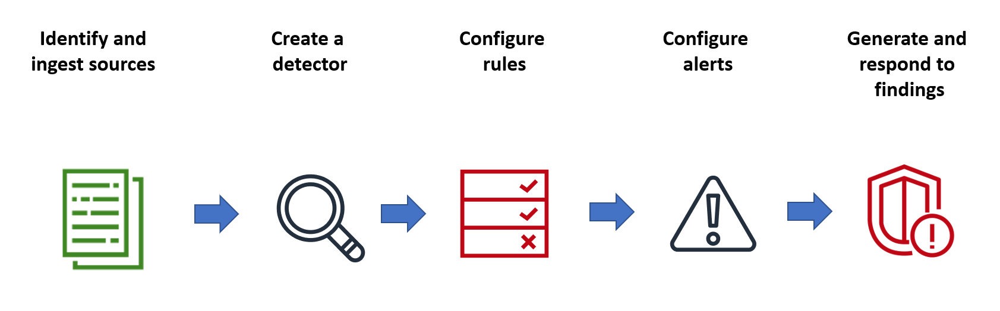
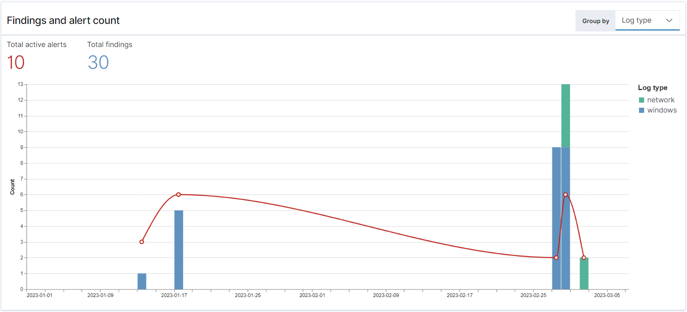
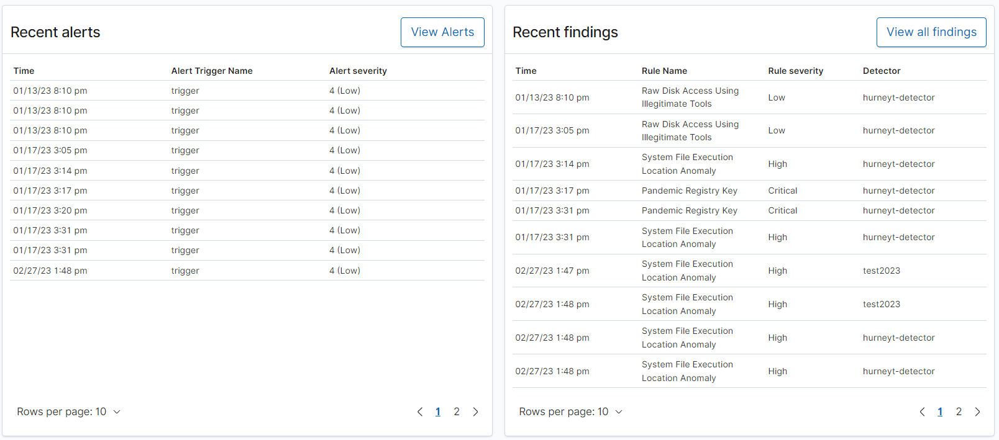
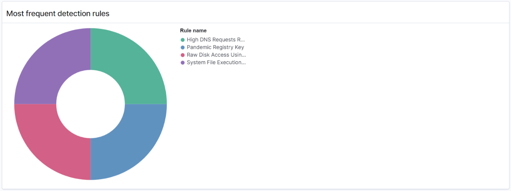
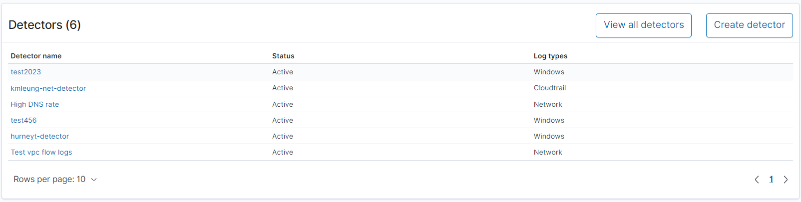

# Security Analytics for Amazon OpenSearch Service

Security Analytics is an OpenSearch solution that provides visibility into your
organization's infrastructure, monitors for anomalous activity, detects potential security
threats in real time, and trigger alerts to pre-configured destinations. You can monitor for
malicious activity from your security event logs by continuously evaluating security rules
and reviewing auto-generated security findings. In addition, Security Analytics can generate
automated alerts and send them to a specified notification channel, such as Slack or
email.

You can use the Security Analytics plugin to detect common threats out-of-the-box and
generate critical security insights from your existing security event logs, such as firewall
logs, windows logs, and authentication audit logs. To use Security Analytics, your domain
must be running OpenSearch version 2.5 or later.

###### Note

This documentation provides a brief overview of Security Analytics for Amazon OpenSearch Service. It
defines key concepts and provides steps to configure permissions. For comprehensive
documentation, including a setup guide, an API reference, and a reference of all
available settings, see [Security
Analytics](https://opensearch.org/docs/latest/security-analytics/ "https://opensearch.org/docs/latest/security-analytics/") in the OpenSearch documentation..

## Security analytics components and concepts

A number of tools and features provide the foundation to the operation of Security
Analytics. The major components that compose the plugin include detectors, log types,
rules, findings, and alerts.

### Log types

OpenSearch supports several types of logs and provides out-of-the-box mappings for
each type. You specify the log type and configure a time interval when you create a
detector, and from there Security Analytics automatically activates a relevant set
of rules that run at that interval.

### Detectors

Detectors identify a range of cybersecurity threats for a log type across your
data indexes. You configure your detector to use both custom rules and pre-packaged
Sigma rules that evaluate events occurring in the system. The detector then
generates security findings from these events. For more information about detectors,
see [Creating detectors](https://opensearch.org/docs/latest/security-analytics/sec-analytics-config/detectors-config/ "https://opensearch.org/docs/latest/security-analytics/sec-analytics-config/detectors-config/") in the OpenSearch documentation.

### Rules

Threat detection rules define the conditions that detectors apply to ingested log
data to identify a security event. Security Analytics supports importing, creating,
and customizing rules to meet your requirements, and also provides prepackaged,
open-source Sigma rules to detect common threats from your logs. Security Analytics
maps many rules to an ever-growing knowledge base of adversary tactics and
techniques maintained by the MITRE ATT&CK organization. You can
use both OpenSearch Dashboards or the APIs to create and use rules. For more information
about rules, see [Working
with rules](https://opensearch.org/docs/latest/security-analytics/usage/rules/ "https://opensearch.org/docs/latest/security-analytics/usage/rules/") in the OpenSearch documentation.

### Findings

When a detector matches a rule with a log event, it generates a finding. Each
finding includes a unique combination of select rules, a log type, and a rule
severity. Findings don’t necessarily point to imminent threats within the system,
but they always isolate an event of interest. For more information about findings,
see [Working with findings](https://opensearch.org/docs/latest/security-analytics/usage/findings/ "https://opensearch.org/docs/latest/security-analytics/usage/findings/") in the OpenSearch documentation.

### Alerts

When you create a detector, you can specify one or more conditions that trigger an
alert. An alert is a notification sent to a preferred channel, such as Slack or
email. You set the alert to be triggered when the detector matches one or multiple
rules, and can customize the notification message. For more information about
alerts, see [Working with alerts](https://opensearch.org/docs/latest/security-analytics/usage/alerts/ "https://opensearch.org/docs/latest/security-analytics/usage/alerts/") in the OpenSearch documentation.

## Exploring Security Analytics

You can use OpenSearch Dashboards to visualize and gain insight into your Security
Analytics plugin. The **Overview** view provides
information such as findings and alert counts, recent findings and alerts, frequent
detection rules, and a list of your detectors. You can see a summary view comprised of
multiple visualizations. The following chart, for example, shows the findings and alerts
trend for various log types over a given period of time.

Further down the page, you can review your most recent findings and alerts.

Additionally, you can see a distribution of the most frequently triggered rules across
all the active detectors. This can help you detect and investigate different types of
malicious activities across log types.

Finally, you can view the status of configured detectors. From this panel, you can
also navigate to the create detector workflow.

To configure your Security Analytics setup, create rules with the **Rules** page and use those rules to write detectors in the
**Detectors** page. For a more focused view of your
Security Analytics results, you can use the **Findings**
and **Alerts** pages.

## Configure permissions

If you enable Security Analytics on a preexisting OpenSearch Service domain, the
`security_analytics_manager` role might not be defined on the domain.
Non-admin users must be mapped to this role in order to manage warm indexes on domains
using fine-grained access control. To manually create the
`security_analytics_manager` role, perform the following steps:

1. In OpenSearch Dashboards, go to **Security** and choose
   **Permissions**.
2. Choose **Create action group** and configure the following
   groups:

| Group name                       | Permissions                                                                                                                                                                                                                                                                                                                                                                                                                                                                                                                    |
| -------------------------------- | ------------------------------------------------------------------------------------------------------------------------------------------------------------------------------------------------------------------------------------------------------------------------------------------------------------------------------------------------------------------------------------------------------------------------------------------------------------------------------------------------------------------------------ | --------------------------------------------------------------------------------------------------------------------------------------------------------------------------------------------------------------------------------------------------------------------------------------------------------------------------------------------------------------------------------------------------------------------------------------------------------------------------------------------------------------------------------------------------------------------------------------------------------------------------------------------------------------------------------------------------------------------------------------------------------------------------------------------------------------------------------------------------------------------------------------------------------------------- |
| `security_analytics_full_access` |  • `cluster:admin/opensearch/securityanalytics/alerts/*`  • `cluster:admin/opensearch/securityanalytics/detector/*`  • `cluster:admin/opensearch/securityanalytics/findings/*`  • `cluster:admin/opensearch/securityanalytics/mapping/*`  • `cluster:admin/opensearch/securityanalytics/rule/*`                                                                                                                                                                                                                 |
| `security_analytics_read_access` |  • `cluster:admin/opensearch/securityanalytics/alerts/get`  • `cluster:admin/opensearch/securityanalytics/detector/get`  • `cluster:admin/opensearch/securityanalytics/detector/search`  • `cluster:admin/opensearch/securityanalytics/findings/get`  • `cluster:admin/opensearch/securityanalytics/mapping/get`  • `cluster:admin/opensearch/securityanalytics/mapping/view/get`  • `cluster:admin/opensearch/securityanalytics/rule/get`  • `cluster:admin/opensearch/securityanalytics/rule/search` | 3. Choose **Roles** and **Create role**. 4. Name the role **security_analytics_manager**. 5. For **Cluster permissions,** select `security_analytics_full_access` and `security_analytics_read_access`. 6. For **Index**, type `*`. 7. For **Index permissions**, select `indices:admin/mapping/put` and `indices:admin/mappings/get`. 8. Choose **Create**. 9. After you create the role, [map it](fgac.md#fgac-mapping "fgac.md#fgac-mapping") to any user or backend role that will manage Security Analytics indexes. ## Troubleshooting ### No such index error If you have no detectors and you open the Security Analytics dashboard, you might see a notification on the bottom right that says `[index_not_found_exception] no such index [.opensearch-sap-detectors-config]`. You can disregard this notification, which disappears within a few seconds and won't appear again once you create a detector. |
