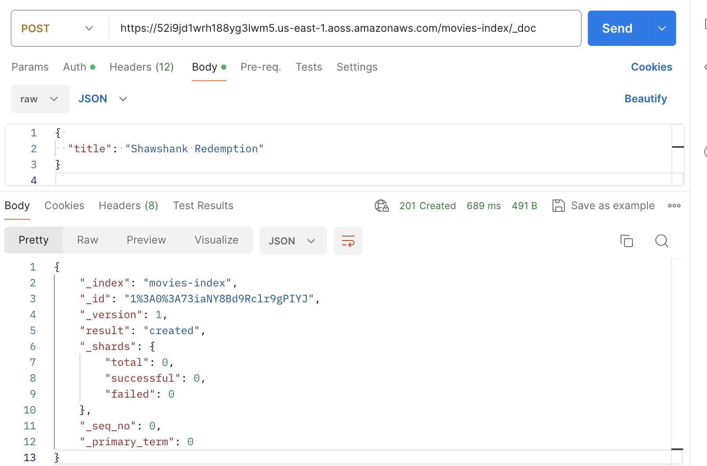

# Ingesting data into Amazon OpenSearch Serverless collections

These sections provide details about the supported ingest pipelines for data ingestion
into Amazon OpenSearch Serverless collections. They also cover some of the clients that you can use to
interact with the OpenSearch API operations. Your clients should be compatible with OpenSearch
2.x in order to integrate with OpenSearch Serverless.

###### Topics

- [Minimum required permissions](#serverless-ingestion-permissions "#serverless-ingestion-permissions")
- [OpenSearch Ingestion](#serverless-osis-ingestion "#serverless-osis-ingestion")
- [Fluent Bit](#serverless-fluentbit "#serverless-fluentbit")
- [Amazon Data Firehose](#serverless-kdf "#serverless-kdf")
- [Go](#serverless-go "#serverless-go")
- [Java](#serverless-java "#serverless-java")
- [JavaScript](#serverless-javascript "#serverless-javascript")
- [Logstash](#serverless-logstash "#serverless-logstash")
- [Python](#serverless-python "#serverless-python")
- [Ruby](#serverless-ruby "#serverless-ruby")
- [Signing HTTP requests with other clients](#serverless-signing "#serverless-signing")

## Minimum required permissions

In order to ingest data into an OpenSearch Serverless collection, the principal that is writing the
data must have the following minimum permissions assigned in a [data access policy](serverless-data-access.md "serverless-data-access.md"):

```
[
   {
      "Rules":[
         {
            "ResourceType":"index",
            "Resource":[
               "index/`target-collection`/`logs`"
            ],
            "Permission":[
               "aoss:CreateIndex",
               "aoss:WriteDocument",
               "aoss:UpdateIndex"
            ]
         }
      ],
      "Principal":[
         "arn:aws:iam::`123456789012`:user/`my-user`"
      ]
   }
]
```

The permissions can be more broad if you plan to write to additional indexes. For
example, rather than specifying a single target index, you can allow permission to all
indexes (index/`target-collection`/\*), or a subset of indexes
(index/`target-collection`/`logs*`).

For a reference of all available OpenSearch API operations and their associated
permissions, see [Supported operations and plugins in Amazon OpenSearch Serverless](serverless-genref.md "serverless-genref.md").

## OpenSearch Ingestion

Rather than using a third-party client to send data directly to an OpenSearch Serverless collection,
you can use Amazon OpenSearch Ingestion. You configure your data producers to send data to
OpenSearch Ingestion, and it automatically delivers the data to the collection that you
specify. You can also configure OpenSearch Ingestion to transform your data before delivering
it. For more information, see [Overview of Amazon OpenSearch Ingestion](ingestion.md "ingestion.md").

An OpenSearch Ingestion pipeline needs permission to write to an OpenSearch Serverless collection that is
configured as its sink. These permissions include the ability to describe the collection
and send HTTP requests to it. For instructions to use OpenSearch Ingestion to add data to a
collection, see [Granting Amazon OpenSearch Ingestion pipelines access
to collections](pipeline-collection-access.md "pipeline-collection-access.md").

To get started with OpenSearch Ingestion, see [Tutorial: Ingesting data into a collection
using Amazon OpenSearch Ingestion](osis-serverless-get-started.md "osis-serverless-get-started.md").

## Fluent Bit

You can use [AWS
for Fluent Bit image](https://github.com/aws/aws-for-fluent-bit#public-images "https://github.com/aws/aws-for-fluent-bit#public-images") and the [OpenSearch output
plugin](https://docs.fluentbit.io/manual/pipeline/outputs/opensearch "https://docs.fluentbit.io/manual/pipeline/outputs/opensearch") to ingest data into OpenSearch Serverless collections.

###### Note

You must have version 2.30.0 or later of the AWS for Fluent Bit image in order
to integrate with OpenSearch Serverless.

**Example configuration**:

This sample output section of the configuration file shows how to use an OpenSearch Serverless
collection as a destination. The important addition is the `AWS_Service_Name`
parameter, which is `aoss`. `Host` is the collection
endpoint.

```
[OUTPUT]
    Name  opensearch
    Match *
    Host  `collection-endpoint`.`us-west-2`.aoss.amazonaws.com
    Port  443
    Index  `my_index`
    Trace_Error On
    Trace_Output On
    AWS_Auth On
    AWS_Region `<region>`
    **AWS\_Service\_Name aoss**
    tls     On
    Suppress_Type_Name On
```

## Amazon Data Firehose

Firehose supports OpenSearch Serverless as a delivery destination. For instructions to send data into
OpenSearch Serverless, see [Creating a Kinesis Data Firehose
Delivery Stream](../../../firehose/latest/dev/basic-create.md "../../../firehose/latest/dev/basic-create.md") and [Choose OpenSearch Serverless for Your Destination](../../../firehose/latest/dev/create-destination.md#create-destination-opensearch-serverless "../../../firehose/latest/dev/create-destination.md#create-destination-opensearch-serverless") in the
_Amazon Data Firehose Developer Guide_.

The IAM role that you provide to Firehose for delivery must be specified within a data
access policy with the `aoss:WriteDocument` minimum permission for the target
collection, and you must have a preexisting index to send data to. For more information,
see [Minimum required permissions](#serverless-ingestion-permissions "#serverless-ingestion-permissions").

Before you send data to OpenSearch Serverless, you might need to perform transforms on the data. To
learn more about using Lambda functions to perform this task, see [Amazon Kinesis Data Firehose Data
Transformation](../../../firehose/latest/dev/data-transformation.md "../../../firehose/latest/dev/data-transformation.md") in the same guide.

## Go

The following sample code uses the [opensearch-go](https://github.com/opensearch-project/opensearch-go "https://github.com/opensearch-project/opensearch-go")
client for Go to establish a secure connection to the specified OpenSearch Serverless collection and
create a single index. You must provide values for `region` and
`host`.

```
package main

import (
  "context"
  "log"
  "strings"
  "github.com/aws/aws-sdk-go-v2/aws"
  "github.com/aws/aws-sdk-go-v2/config"
  opensearch "github.com/opensearch-project/opensearch-go/v2"
  opensearchapi "github.com/opensearch-project/opensearch-go/v2/opensearchapi"
  requestsigner "github.com/opensearch-project/opensearch-go/v2/signer/awsv2"
)

const endpoint = "" // serverless collection endpoint

func main() {
	ctx := context.Background()

	awsCfg, err := config.LoadDefaultConfig(ctx,
		config.WithRegion("<AWS_REGION>"),
		config.WithCredentialsProvider(
			getCredentialProvider("<AWS_ACCESS_KEY>", "<AWS_SECRET_ACCESS_KEY>", "<AWS_SESSION_TOKEN>"),
		),
	)
	if err != nil {
		log.Fatal(err) // don't log.fatal in a production-ready app
	}

	// create an AWS request Signer and load AWS configuration using default config folder or env vars.
	signer, err := requestsigner.NewSignerWithService(awsCfg, "aoss") // "aoss" for Amazon OpenSearch Serverless
	if err != nil {
		log.Fatal(err) // don't log.fatal in a production-ready app
	}

	// create an opensearch client and use the request-signer
	client, err := opensearch.NewClient(opensearch.Config{
		Addresses: []string{endpoint},
		Signer:    signer,
	})
	if err != nil {
		log.Fatal("client creation err", err)
	}

	indexName := "go-test-index"

  // define index mapping
	mapping := strings.NewReader(`{
	 "settings": {
	   "index": {
	        "number_of_shards": 4
	        }
	      }
	 }`)

	// create an index
	createIndex := opensearchapi.IndicesCreateRequest{
		Index: indexName,
    Body: mapping,
	}
	createIndexResponse, err := createIndex.Do(context.Background(), client)
	if err != nil {
		log.Println("Error ", err.Error())
		log.Println("failed to create index ", err)
		log.Fatal("create response body read err", err)
	}
	log.Println(createIndexResponse)

	// delete the index
	deleteIndex := opensearchapi.IndicesDeleteRequest{
		Index: []string{indexName},
	}

	deleteIndexResponse, err := deleteIndex.Do(context.Background(), client)
	if err != nil {
		log.Println("failed to delete index ", err)
		log.Fatal("delete index response body read err", err)
	}
	log.Println("deleting index", deleteIndexResponse)
}

func getCredentialProvider(accessKey, secretAccessKey, token string) aws.CredentialsProviderFunc {
	return func(ctx context.Context) (aws.Credentials, error) {
		c := &aws.Credentials{
			AccessKeyID:     accessKey,
			SecretAccessKey: secretAccessKey,
			SessionToken:    token,
		}
		return *c, nil
	}
}
```

## Java

The following sample code uses the [opensearch-java](https://search.maven.org/artifact/org.opensearch.client/opensearch-java "https://search.maven.org/artifact/org.opensearch.client/opensearch-java") client for Java to establish a secure connection to the
specified OpenSearch Serverless collection and create a single index. You must provide values for
`region` and `host`.

The important difference compared to OpenSearch Service _domains_ is the service
name (`aoss` instead of `es`).

```
// import OpenSearchClient to establish connection to OpenSearch Serverless collection
import org.opensearch.client.opensearch.OpenSearchClient;

SdkHttpClient httpClient = ApacheHttpClient.builder().build();
// create an opensearch client and use the request-signer
OpenSearchClient client = new OpenSearchClient(
    new AwsSdk2Transport(
        httpClient,
        "...us-west-2.aoss.amazonaws.com", // serverless collection endpoint
        "aoss" // signing service name
        Region.US_WEST_2, // signing service region
        AwsSdk2TransportOptions.builder().build()
    )
);

String index = "sample-index";

// create an index
CreateIndexRequest createIndexRequest = new CreateIndexRequest.Builder().index(index).build();
CreateIndexResponse createIndexResponse = client.indices().create(createIndexRequest);
System.out.println("Create index reponse: " + createIndexResponse);

// delete the index
DeleteIndexRequest deleteIndexRequest = new DeleteIndexRequest.Builder().index(index).build();
DeleteIndexResponse deleteIndexResponse = client.indices().delete(deleteIndexRequest);
System.out.println("Delete index reponse: " + deleteIndexResponse);

httpClient.close();
```

The following sample code again establishes a secure connection, and then searches an
index.

```
import org.opensearch.client.opensearch.OpenSearchClient;

SdkHttpClient httpClient = ApacheHttpClient.builder().build();

OpenSearchClient client = new OpenSearchClient(
    new AwsSdk2Transport(
        httpClient,
        "...us-west-2.aoss.amazonaws.com", // serverless collection endpoint
        "aoss" // signing service name
        Region.US_WEST_2, // signing service region
        AwsSdk2TransportOptions.builder().build()
    )
);

Response response = client.generic()
    .execute(
        Requests.builder()
            .endpoint("/" + "users" + "/_search?typed_keys=true")
            .method("GET")
            .json("{"
                + "    \"query\": {"
                + "        \"match_all\": {}"
                + "    }"
                + "}")
            .build());

httpClient.close();
```

## JavaScript

The following sample code uses the [opensearch-js](https://www.npmjs.com/package/@opensearch-project/opensearch "https://www.npmjs.com/package/@opensearch-project/opensearch") client for JavaScript to establish a secure connection to the
specified OpenSearch Serverless collection, create a single index, add a document, and delete the
index. You must provide values for `node` and `region`.

The important difference compared to OpenSearch Service _domains_ is the service
name (`aoss` instead of `es`).

Version 3
This example uses [version
3](../../../AWSJavaScriptSDK/v3/latest.md "../../../AWSJavaScriptSDK/v3/latest.md") of the SDK for JavaScript in Node.js.

```
const { defaultProvider } = require('@aws-sdk/credential-provider-node');
const { Client } = require('@opensearch-project/opensearch');
const { AwsSigv4Signer } = require('@opensearch-project/opensearch/aws');

async function main() {
    // create an opensearch client and use the request-signer
    const client = new Client({
        ...AwsSigv4Signer({
            region: '`us-west-2`',
            service: 'aoss',
            getCredentials: () => {
                const credentialsProvider = defaultProvider();
                return credentialsProvider();
            },
        }),
        node: '' # // serverless collection endpoint
    });

    const index = 'movies';

    // create index if it doesn't already exist
    if (!(await client.indices.exists({ index })).body) {
        console.log((await client.indices.create({ index })).body);
    }

    // add a document to the index
    const document = { foo: 'bar' };
    const response = await client.index({
        id: '1',
        index: index,
        body: document,
    });
    console.log(response.body);

    // delete the index
    console.log((await client.indices.delete({ index })).body);
}

main();
```

Version 2
This example uses [version
2](../../../AWSJavaScriptSDK/latest.md "../../../AWSJavaScriptSDK/latest.md") of the SDK for JavaScript in Node.js.

```
const AWS = require('aws-sdk');
const { Client } = require('@opensearch-project/opensearch');
const { AwsSigv4Signer } = require('@opensearch-project/opensearch/aws');

async function main() {
    // create an opensearch client and use the request-signer
    const client = new Client({
        ...AwsSigv4Signer({
            region: '`us-west-2`',
            service: 'aoss',
            getCredentials: () =>
                new Promise((resolve, reject) => {
                    AWS.config.getCredentials((err, credentials) => {
                        if (err) {
                            reject(err);
                        } else {
                            resolve(credentials);
                        }
                    });
                }),
        }),
        node: '' # // serverless collection endpoint
    });

    const index = 'movies';

    // create index if it doesn't already exist
    if (!(await client.indices.exists({ index })).body) {
        console.log((await client.indices.create({
            index
        })).body);
    }

    // add a document to the index
    const document = {
        foo: 'bar'
    };
    const response = await client.index({
        id: '1',
        index: index,
        body: document,
    });
    console.log(response.body);

    // delete the index
    console.log((await client.indices.delete({ index })).body);
}

main();
```

## Logstash

You can use the [Logstash
OpenSearch plugin](https://github.com/opensearch-project/logstash-output-opensearch "https://github.com/opensearch-project/logstash-output-opensearch") to publish logs to OpenSearch Serverless collections.

###### To use Logstash to send data to OpenSearch Serverless

1. Install version _2.0.0 or later_ of the [logstash-output-opensearch](https://github.com/opensearch-project/logstash-output-opensearch "https://github.com/opensearch-project/logstash-output-opensearch") plugin using Docker or Linux.

Docker
Docker hosts the Logstash OSS software with the OpenSearch output
plugin preinstalled: [opensearchproject/logstash-oss-with-opensearch-output-plugin](https://hub.docker.com/r/opensearchproject/logstash-oss-with-opensearch-output-plugin/tags?page=1&ordering=last_updated&name=8.4.0 "https://hub.docker.com/r/opensearchproject/logstash-oss-with-opensearch-output-plugin/tags?page=1&ordering=last_updated&name=8.4.0").
You can pull the image just like any other image:

```
docker pull opensearchproject/logstash-oss-with-opensearch-output-plugin:latest
```

Linux
First, [install the latest version of Logstash](https://www.elastic.co/guide/en/logstash/current/installing-logstash.html "https://www.elastic.co/guide/en/logstash/current/installing-logstash.html") if you haven't
already. Then, install version 2.0.0 of the output plugin:

```
cd logstash-8.5.0/
bin/logstash-plugin install --version 2.0.0 logstash-output-opensearch
```

If the plugin is already installed, update it to the latest
version:

```
bin/logstash-plugin update logstash-output-opensearch
```

Starting with version 2.0.0 of the plugin, the AWS SDK uses
version 3. If you're using a Logstash version earlier than 8.4.0,
you must remove any pre-installed AWS plugins and install the
`logstash-integration-aws` plugin:

```
/usr/share/logstash/bin/logstash-plugin remove logstash-input-s3
/usr/share/logstash/bin/logstash-plugin remove logstash-input-sqs
/usr/share/logstash/bin/logstash-plugin remove logstash-output-s3
/usr/share/logstash/bin/logstash-plugin remove logstash-output-sns
/usr/share/logstash/bin/logstash-plugin remove logstash-output-sqs
/usr/share/logstash/bin/logstash-plugin remove logstash-output-cloudwatch

/usr/share/logstash/bin/logstash-plugin install --version 0.1.0.pre logstash-integration-aws
```

2. In order for the OpenSearch output plugin to work with OpenSearch Serverless, you must make
   the following modifications to the `opensearch` output section of
   logstash.conf:
   - Specify `aoss` as the `service_name` under
     `auth_type`.
   - Specify your collection endpoint for `hosts`.
   - Add the parameters `default_server_major_version` and
     `legacy_template`. These parameters are required for the
     plugin to work with OpenSearch Serverless.

```
output {
  opensearch {
    hosts => "`collection-endpoint`:443"
    auth_type => {
      ...
      service_name => 'aoss'
    }
    default_server_major_version => 2
    legacy_template => false
  }
}
```

This example configuration file takes its input from files in an S3 bucket and
sends them to an OpenSearch Serverless collection:

```
input {
  s3  {
    bucket => "`my-s3-bucket`"
    region => "`us-east-1`"
  }
}

output {
  opensearch {
    ecs_compatibility => disabled
    hosts => "https://`my-collection-endpoint`.`us-east-1`.aoss.amazonaws.com:443"
    index => `my-index`
    auth_type => {
      type => 'aws_iam'
      aws_access_key_id => '`your-access-key`'
      aws_secret_access_key => '`your-secret-key`'
      region => '`us-east-1`'
      service_name => '**aoss**'
    }
    default_server_major_version => 2
    legacy_template => false
  }
}
```

3. Then, run Logstash with the new configuration to test the plugin:

```
bin/logstash -f config/`test-plugin`.conf
```

## Python

The following sample code uses the [opensearch-py](https://pypi.org/project/opensearch-py/ "https://pypi.org/project/opensearch-py/") client for
Python to establish a secure connection to the specified OpenSearch Serverless collection, create a
single index, and search that index. You must provide values for `region` and
`host`.

The important difference compared to OpenSearch Service _domains_ is the service
name (`aoss` instead of `es`).

```
from opensearchpy import OpenSearch, RequestsHttpConnection, AWSV4SignerAuth
import boto3

host = ''  # serverless collection endpoint, without https://
region = ''  # e.g. us-east-1

service = 'aoss'
credentials = boto3.Session().get_credentials()
auth = AWSV4SignerAuth(credentials, region, service)

# create an opensearch client and use the request-signer
client = OpenSearch(
    hosts=[{'host': host, 'port': 443}],
    http_auth=auth,
    use_ssl=True,
    verify_certs=True,
    connection_class=RequestsHttpConnection,
    pool_maxsize=20,
)

# create an index
index_name = 'books-index'
create_response = client.indices.create(
    index_name
)

print('\nCreating index:')
print(create_response)

# index a document
document = {
  'title': 'The Green Mile',
  'director': 'Stephen King',
  'year': '1996'
}

response = client.index(
    index = 'books-index',
    body = document,
    id = '1'
)


# delete the index
delete_response = client.indices.delete(
    index_name
)

print('\nDeleting index:')
print(delete_response)
```

## Ruby

The `opensearch-aws-sigv4` gem provides access to OpenSearch Serverless, along with OpenSearch Service,
out of the box. It has all features of the [opensearch-ruby](https://rubygems.org/gems/opensearch-ruby "https://rubygems.org/gems/opensearch-ruby") client
because it's a dependency of this gem.

When instantiating the Sigv4 signer, specify `aoss` as the service
name:

```
require 'opensearch-aws-sigv4'
require 'aws-sigv4'

signer = Aws::Sigv4::Signer.new(service: 'aoss',
                                region: 'us-west-2',
                                access_key_id: 'key_id',
                                secret_access_key: 'secret')

# create an opensearch client and use the request-signer
client = OpenSearch::Aws::Sigv4Client.new(
  { host: 'https://your.amz-opensearch-serverless.endpoint',
    log: true },
  signer)

# create an index
index = 'prime'
client.indices.create(index: index)

# insert data
client.index(index: index, id: '1', body: { name: 'Amazon Echo',
                                            msrp: '5999',
                                            year: 2011 })

# query the index
client.search(body: { query: { match: { name: 'Echo' } } })

# delete index entry
client.delete(index: index, id: '1')

# delete the index
client.indices.delete(index: index)
```

## Signing HTTP requests with other clients

The following requirements apply when [signing requests](../../../general/latest/gr/signature-version-4.md "../../../general/latest/gr/signature-version-4.md") to OpenSearch Serverless
collections when you construct HTTP requests with another clients.

- You must specify the service name as `aoss`.
- The `x-amz-content-sha256` header is required for all AWS
  Signature Version 4 requests. It provides a hash of the request payload. If
  there's a request payload, set the value to its Secure Hash Algorithm (SHA)
  cryptographic hash (SHA256). If there's no request payload, set the value to
  `e3b0c44298fc1c149afbf4c8996fb92427ae41e4649b934ca495991b7852b855`,
  which is the hash of an empty string.

###### Topics

- [Indexing with cURL](#serverless-signing-curl "#serverless-signing-curl")
- [Indexing with Postman](#serverless-signing-postman "#serverless-signing-postman")

### Indexing with cURL

The following example request uses the Client URL Request Library (cURL) to send a
single document to an index named `movies-index` within a
collection:

```
curl -XPOST \
    --user "$AWS_ACCESS_KEY_ID":"$AWS_SECRET_ACCESS_KEY" \
    --aws-sigv4 "aws:amz:`us-east-1`:aoss" \
    --header "x-amz-content-sha256: $REQUEST_PAYLOAD_SHA_HASH" \
    --header "x-amz-security-token: $AWS_SESSION_TOKEN" \
    "https://`my-collection-endpoint`.`us-east-1`.aoss.amazonaws.com/`movies-index`/_doc" \
    -H "Content-Type: application/json" -d '{"title": "Shawshank Redemption"}'
```

### Indexing with Postman

The following image shows how to send a requests to a collection using Postman.
For instructions to authenticate, see [Authenticate with AWS Signature authentication workflow in
Postman](https://learning.postman.com/docs/sending-requests/authorization/aws-signature/ "https://learning.postman.com/docs/sending-requests/authorization/aws-signature/").


