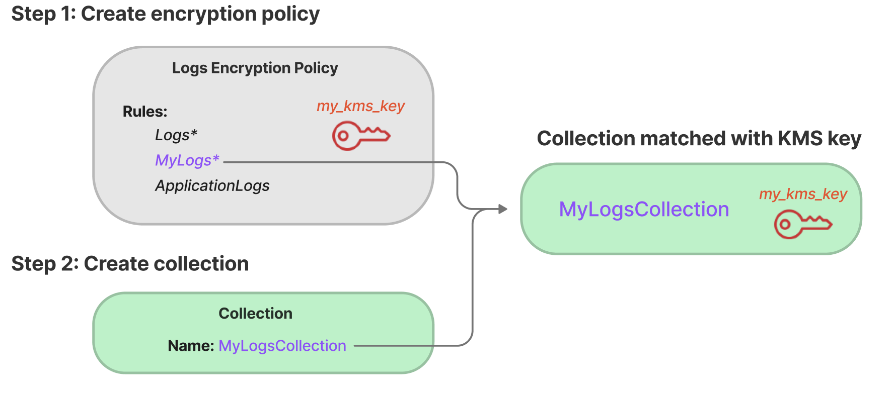

# Encryption in Amazon OpenSearch Serverless

## Encryption at rest

Each Amazon OpenSearch Serverless collection that you create is protected with encryption of data at
rest, a security feature that helps prevent unauthorized access to your data. Encryption
at rest uses AWS Key Management Service (AWS KMS) to store and manage your encryption keys. It
uses the Advanced Encryption Standard algorithm with 256-bit keys (AES-256) to perform
the encryption.

###### Topics

- [Encryption policies](#serverless-encryption-policies "#serverless-encryption-policies")
- [Considerations](#serverless-encryption-considerations "#serverless-encryption-considerations")
- [Permissions required](#serverless-encryption-permissions "#serverless-encryption-permissions")
- [Key policy for a customer managed key](#serverless-customer-cmk-policy "#serverless-customer-cmk-policy")
- [How OpenSearch Serverless uses grants in
  AWS KMS](#serverless-encryption-grants "#serverless-encryption-grants")
- [Creating encryption policies
  (console)](#serverless-encryption-console "#serverless-encryption-console")
- [Creating encryption policies
  (AWS CLI)](#serverless-encryption-cli "#serverless-encryption-cli")
- [Viewing encryption policies](#serverless-encryption-list "#serverless-encryption-list")
- [Updating encryption policies](#serverless-encryption-update "#serverless-encryption-update")
- [Deleting encryption policies](#serverless-encryption-delete "#serverless-encryption-delete")

### Encryption policies

With encryption policies, you can manage many collections at scale by
automatically assigning an encryption key to newly created collections that match a
specific name or pattern.

When you create an encryption policy, you can either specify a
_prefix_, which is a wildcard-based matching rule such as
`MyCollection*`, or enter a single collection name. Then, when you
create a collection that matches that name or prefix pattern, the policy and
corresponding KMS key are automatically assigned to it.



Encryption policies contain the following elements:

- `Rules` – one or more collection matching rules, each
  with the following sub-elements:
  - `ResourceType` – Currently the only option is
    "collection". Encryption policies apply to collection resources
    only.
  - `Resource` – One or more collection names or
    patterns that the policy will apply to, in the format
    `collection/<`collection
    name|pattern`>`.

- `AWSOwnedKey` – Whether to use an
  AWS owned key.
- `KmsARN` – If you set `AWSOwnedKey` to false,
  specify the Amazon Resource Name (ARN) of the KMS key to encrypt the
  associated collections with. If you include this parameter, OpenSearch Serverless ignores
  the `AWSOwnedKey` parameter.

The following sample policy will assign a customer managed key to any future collection
named `autopartsinventory`, as well as collections that begin with the
term "sales":

```
{
   "Rules":[
      {
         "ResourceType":"collection",
         "Resource":[
            "collection/`autopartsinventory`",
            "collection/`sales*`"
         ]
      }
   ],
   "AWSOwnedKey":false,
   "KmsARN":"arn:aws:encryption:`us-east-1`:`123456789012`:key/`93fd6da4-a317-4c17-bfe9-382b5d988b36`"
}
```

Even if a policy matches a collection name, you can choose to override this
automatic assignment during collection creation if the resource pattern contains a
wildcard (\*). If you choose to override automatic key assignment, OpenSearch Serverless creates an
encryption policy for you named
**auto-<`collection-name`>**
and attaches it to the collection. The policy initially only applies to a single
collection, but you can modify it to include additional collections.

If you modify policy rules to no longer match a collection, the associated
KMS key won't be unassigned from that collection. The collection always remains
encrypted with its initial encryption key. If you want to change the encryption key
for a collection, you must recreate the collection.

If rules from multiple policies match a collection, the more specific rule is
used. For example, if one policy contains a rule for `collection/log*`,
and another for `collection/logSpecial`, the encryption key for the
second policy is used because it's more specific.

You can't use a name or a prefix in a policy if it already exists in another
policy. OpenSearch Serverless displays an error if you try to configure identical resource patterns
in different encryption policies.

### Considerations

Consider the following when you configure encryption for your collections:

- Encryption at rest is _required_ for all serverless
  collections.
- You have the option to use a customer managed key or an AWS owned key. If you
  choose a customer managed key, we recommend that you enable [automatic key rotation](../../../kms/latest/developerguide/rotate-keys.md "../../../kms/latest/developerguide/rotate-keys.md").
- You can't change the encryption key for a collection after the collection
  is created. Carefully choose which AWS KMS to use the first time you set up a
  collection.
- A collection can only match a single encryption policy.
- Collections with unique KMS keys can't share OpenSearch Compute Units
  (OCUs) with other collections. Each collection with a unique key requires
  its own 4 OCUs.
- If you update the KMS key in an encryption policy, the change doesn't
  affect existing matching collections with KMS keys already
  assigned.
- OpenSearch Serverless doesn't explicitly check user permissions on customer managed keys. If a user
  has permissions to access a collection through a data access policy, they
  will be able to ingest and query the data that is encrypted with the
  associated key.

### Permissions required

Encryption at rest for OpenSearch Serverless uses the following AWS Identity and Access Management (IAM) permissions.
You can specify IAM conditions to restrict users to specific collections.

- `aoss:CreateSecurityPolicy` – Create an encryption
  policy.
- `aoss:ListSecurityPolicies` – List all encryption
  policies and collections that they are attached to.
- `aoss:GetSecurityPolicy` – See details of a specific
  encryption policy.
- `aoss:UpdateSecurityPolicy` – Modify an encryption
  policy.
- `aoss:DeleteSecurityPolicy` – Delete an encryption
  policy.

The following sample identity-based access policy provides the minimum permissions
necessary for a user to manage encryption policies with the resource pattern
`collection/application-logs`.

JSON

```
`{
 "Version":"2012-10-17",
 "Statement":[
 {
 "Effect":"Allow",
 "Action":[
 "aoss:CreateSecurityPolicy",
 "aoss:UpdateSecurityPolicy",
 "aoss:DeleteSecurityPolicy",
 "aoss:GetSecurityPolicy"
 ],
 "Resource":"*",
 "Condition":{
 "StringEquals":{
 "aoss:collection":"`application-logs`"
 }
 }
 },
 {
 "Effect":"Allow",
 "Action":[
 "aoss:ListSecurityPolicies"
 ],
 "Resource":"*"
 }
 ]
}`

```

### Key policy for a customer managed key

If you select a [customer managed key](../../../kms/latest/developerguide/concepts.md#customer-cmk "../../../kms/latest/developerguide/concepts.md#customer-cmk") to
protect a collection, OpenSearch Serverless gets permission to use the KMS key on behalf of the
principal who makes the selection. That principal, a user or role, must have the
permissions on the KMS key that OpenSearch Serverless requires. You can provide these permissions
in a [key policy](../../../kms/latest/developerguide/key-policies.md "../../../kms/latest/developerguide/key-policies.md") or an [IAM policy](../../../kms/latest/developerguide/iam-policies.md "../../../kms/latest/developerguide/iam-policies.md").

At a minimum, OpenSearch Serverless requires the following permissions on a customer managed key:

- [kms:DescribeKey](../../../kms/latest/APIReference/API_DescribeKey.md "../../../kms/latest/APIReference/API_DescribeKey.md")
- [kms:CreateGrant](../../../kms/latest/APIReference/API_CreateGrant.md "../../../kms/latest/APIReference/API_CreateGrant.md")

For example:

JSON

```
`{
 "Version":"2012-10-17",
 "Statement": [
 {
 "Action": "kms:DescribeKey",
 "Effect": "Allow",
 "Principal": {
 "AWS": "arn:aws:iam::123456789012:user/Dale"
 },
 "Resource": "*",
 "Condition": {
 "StringEquals": {
 "kms:ViaService": "aoss.us-east-1.amazonaws.com"
 }
 }
 },
 {
 "Action": "kms:CreateGrant",
 "Effect": "Allow",
 "Principal": {
 "AWS": "arn:aws:iam::123456789012:user/Dale"
 },
 "Resource": "*",
 "Condition": {
 "StringEquals": {
 "kms:ViaService": "aoss.us-east-1.amazonaws.com"
 },
 "ForAllValues:StringEquals": {
 "kms:GrantOperations": [
 "Decrypt",
 "GenerateDataKey"
 ]
 },
 "Bool": {
 "kms:GrantIsForAWSResource": "true"
 }
 }
 }
 ]
}`

```

OpenSearch Serverless create a grant with the [kms:GenerateDataKey](../../../kms/latest/APIReference/API_GenerateDataKey.md "../../../kms/latest/APIReference/API_GenerateDataKey.md") and [kms:Decrypt](../../../kms/latest/APIReference/API_Decrypt.md "../../../kms/latest/APIReference/API_Decrypt.md") permissions.

For more information, see [Using key
policies in AWS KMS](../../../kms/latest/developerguide/key-policies.md "../../../kms/latest/developerguide/key-policies.md") in the _AWS Key Management Service Developer Guide_.

### How OpenSearch Serverless uses grants in

AWS KMS

OpenSearch Serverless requires a [grant](../../../kms/latest/developerguide/grants.md "../../../kms/latest/developerguide/grants.md") in order to use a
customer managed key.

When you create an encryption policy in your account with a new key, OpenSearch Serverless
creates a grant on your behalf by sending a [CreateGrant](../../../kms/latest/APIReference/API_CreateGrant.md "../../../kms/latest/APIReference/API_CreateGrant.md") request
to AWS KMS. Grants in AWS KMS are used to give OpenSearch Serverless access to a KMS key in a
customer account.

OpenSearch Serverless requires the grant to use your customer managed key for the following internal
operations:

- Send [DescribeKey](../../../kms/latest/APIReference/API_DescribeKey.md "../../../kms/latest/APIReference/API_DescribeKey.md")
  requests to AWS KMS to verify that the symmetric customer managed key ID provided is
  valid.
- Send [GenerateDataKey](../../../kms/latest/APIReference/API_GenerateDataKey.md "../../../kms/latest/APIReference/API_GenerateDataKey.md") requests to KMS key to create data keys with
  which to encrypt objects.
- Send [Decrypt](../../../kms/latest/APIReference/API_Decrypt.md "../../../kms/latest/APIReference/API_Decrypt.md") requests
  to AWS KMS to decrypt the encrypted data keys so that they can be used to
  encrypt your data.

You can revoke access to the grant, or remove the service's access to the
customer managed key at any time. If you do, OpenSearch Serverless won't be able to access any of the data
encrypted by the customer managed key, which affects all the operations that are dependent on
that data, leading to `AccessDeniedException` errors and failures in the
asynchronous workflows.

OpenSearch Serverless retires grants in an asynchronous workflow when a given customer managed key isn't
associated with any security policies or collections.

### Creating encryption policies

(console)

In an encryption policy, you specify an KMS key and a series of collection
patterns that the policy will apply to. Any new collections that match one of the
patterns defined in the policy will be assigned the corresponding KMS key when you
create the collection. We recommend that you create encryption policies
_before_ you start creating collections.

###### To create an OpenSearch Serverless encryption policy

1. Open the Amazon OpenSearch Service console at [https://console.aws.amazon.com/aos/home](https://console.aws.amazon.com/aos/home "https://console.aws.amazon.com/aos/home").
2. On the left navigation panel, expand **Serverless** and
   choose **Encryption policies**.
3. Choose **Create encryption policy**.
4. Provide a name and description for the policy.
5. Under **Resources**, enter one or more resource patterns
   for this encryption policy. Any newly created collections in the current
   AWS account and Region that match one of the patterns are
   automatically assigned to this policy. For example, if you enter
   `ApplicationLogs` (with no wildcard), and later create a
   collection with that name, the policy and corresponding KMS key are
   assigned to that collection.

You can also provide a prefix such as `Logs*`, which assigns
the policy to any new collections with names beginning with
`Logs`. By using wildcards, you can manage encryption
settings for multiple collections at scale. 6. Under **Encryption**, choose an KMS key to use. 7. Choose **Create**.

#### Next step: Create

collections

After you configure one or more encryption policies, you can start creating
collections that match the rules defined in those policies. For instructions,
see [Creating collections](serverless-create.md "serverless-create.md").

In the **Encryptions** step of collection creation, OpenSearch Serverless
informs you that the name that you entered matches the pattern defined in an
encryption policy, and automatically assigns the corresponding KMS key to the
collection. If the resource pattern contains a wildcard (\*), you can choose to
override the match and select your own key.

### Creating encryption policies

(AWS CLI)

To create an encryption policy using the OpenSearch Serverless API operations, you specify
resource patterns and an encryption key in JSON format. The [CreateSecurityPolicy](../ServerlessAPIReference/API_CreateSecurityPolicy.md "../ServerlessAPIReference/API_CreateSecurityPolicy.md") request accepts both inline policies and .json
files.

Encryption policies take the following format. This sample
`my-policy.json` file matches any future collection named
`autopartsinventory`, as well as any collections with names beginning
with `sales`.

```
{
   "Rules":[
      {
         "ResourceType":"collection",
         "Resource":[
            "collection/`autopartsinventory`",
            "collection/`sales*`"
         ]
      }
   ],
   "AWSOwnedKey":false,
   "KmsARN":"arn:aws:encryption:`us-east-1`:`123456789012`:key/`93fd6da4-a317-4c17-bfe9-382b5d988b36`"
}
```

To use a service-owned key, set `AWSOwnedKey` to
`true`:

```
{
   "Rules":[
      {
         "ResourceType":"collection",
         "Resource":[
            "collection/`autopartsinventory`",
            "collection/`sales*`"
         ]
      }
   ],
   "AWSOwnedKey":true
}
```

The following request creates the encryption policy:

```
aws opensearchserverless create-security-policy \
    --name `sales-inventory` \
    --type encryption \
    --policy file://`my-policy.json`
```

Then, use the [CreateCollection](../ServerlessAPIReference/API_CreateCollection.md "../ServerlessAPIReference/API_CreateCollection.md") API operation to create one or more collections that
match one of the resource patterns.

### Viewing encryption policies

Before you create a collection, you might want to preview the existing encryption
policies in your account to see which one has a resource pattern that matches your
collection's name. The following [ListSecurityPolicies](../ServerlessAPIReference/API_ListSecurityPolicies.md "../ServerlessAPIReference/API_ListSecurityPolicies.md") request lists all encryption policies in your
account:

```
aws opensearchserverless list-security-policies --type encryption
```

The request returns information about all configured encryption policies. Use the
contents of the `policy` element to view the pattern rules that are
defined in the policy:

```
{
   "securityPolicyDetails": [
      {
         "createdDate": 1663693217826,
         "description": "Sample encryption policy",
         "lastModifiedDate": 1663693217826,
         "name": "my-policy",
         "policy": "{\"Rules\":[{\"ResourceType\":\"collection\",\"Resource\":[\"collection/autopartsinventory\",\"collection/sales*\"]}],\"AWSOwnedKey\":true}",
         "policyVersion": "MTY2MzY5MzIxNzgyNl8x",
         "type": "encryption"
      }
   ]
}
```

To view detailed information about a specific policy, including the KMS key, use
the [GetSecurityPolicy](../ServerlessAPIReference/API_GetSecurityPolicy.md "../ServerlessAPIReference/API_GetSecurityPolicy.md") command.

### Updating encryption policies

If you update the KMS key in an encryption policy, the change only applies to
the newly created collections that match the configured name or pattern. It doesn't
affect existing collections that have KMS keys already assigned.

The same applies to policy matching rules. If you add, modify, or delete a rule,
the change only applies to newly created collections. Existing collections don't
lose their assigned KMS key if you modify a policy's rules so that it no longer
matches a collection's name.

To update an encryption policy in the OpenSearch Serverless console, choose **Encryption
policies**, select the policy to modify, and choose
**Edit**. Make your changes and choose
**Save**.

To update an encryption policy using the OpenSearch Serverless API, use the [UpdateSecurityPolicy](../ServerlessAPIReference/API_UpdateSecurityPolicy.md "../ServerlessAPIReference/API_UpdateSecurityPolicy.md") operation. The following request updates an
encryption policy with a new policy JSON document:

```
aws opensearchserverless update-security-policy \
    --name sales-inventory \
    --type encryption \
    --policy-version 2 \
    --policy file://`my-new-policy.json`
```

### Deleting encryption policies

When you delete an encryption policy, any collections that are currently using the
KMS key defined in the policy are not affected. To delete a policy in the OpenSearch Serverless
console, select the policy and choose **Delete**.

You can also use the [DeleteSecurityPolicy](../ServerlessAPIReference/API_DeleteSecurityPolicy.md "../ServerlessAPIReference/API_DeleteSecurityPolicy.md") operation:

```
aws opensearchserverless delete-security-policy --name `my-policy` --type encryption
```

## Encryption in transit

Within OpenSearch Serverless, all paths in a collection are encrypted in transit using Transport
Layer Security 1.2 (TLS) with an industry-standard AES-256 cipher. Access to all APIs
and Dashboards for Opensearch is also through TLS 1.2 . TLS is a set of
industry-standard cryptographic protocols used for encrypting information that is
exchanged over the network.
