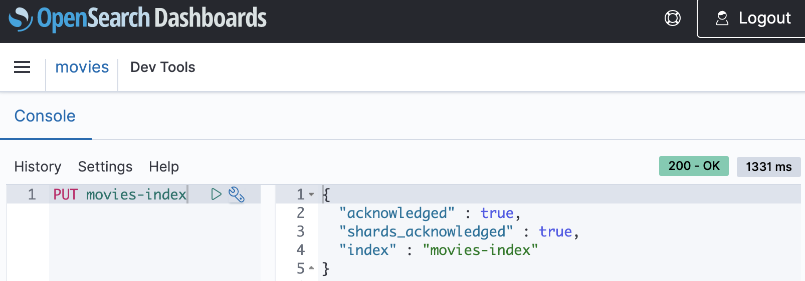

# Tutorial: Getting started with

Amazon OpenSearch Serverless

This tutorial walks you through the basic steps to get an Amazon OpenSearch Serverless
_search_ collection up and running quickly. A search collection
allows you to power applications in your internal networks and internet-facing applications,
such as ecommerce website search and content search.

To learn how to use a _vector search_ collection, see [Working with vector search collections](serverless-vector-search.md "serverless-vector-search.md"). For more detailed information about using
collections, see [Managing Amazon OpenSearch Serverless collections](serverless-manage.md "serverless-manage.md") and the other topics within this
guide.

You'll complete the following steps in this tutorial:

1. [Configure permissions](serverless-getting-started.md#serverless-gsg-permissions "serverless-getting-started.md#serverless-gsg-permissions")
2. [Create a collection](serverless-getting-started.md#serverless-gsg-create "serverless-getting-started.md#serverless-gsg-create")
3. [Upload and search data](serverless-getting-started.md#serverless-gsg-index "serverless-getting-started.md#serverless-gsg-index")
4. [Delete the collection](serverless-getting-started.md#serverless-gsg-delete "serverless-getting-started.md#serverless-gsg-delete")

###### Note

We recommend that you use only ASCII characters for your
`IndexName`. If you do not use ASCII characters for your
`IndexName`, the `IndexName` in CloudWatch metrics will be
converted to a URL encoded format for Non-ASCII characters.

## Step 1: Configure permissions

In order to complete this tutorial, and to use OpenSearch Serverless in general, you must have the
correct IAM permissions. In this tutorial, you will create a collection, upload and
search data, and then delete the collection.

Your user or role must have an attached [identity-based policy](security-iam-serverless.md#security-iam-serverless-id-based-policies "security-iam-serverless.md#security-iam-serverless-id-based-policies")
with the following minimum permissions:

JSON

```
`{
 "Version":"2012-10-17",
 "Statement": [
 {
 "Action": [
 "aoss:CreateCollection",
 "aoss:ListCollections",
 "aoss:BatchGetCollection",
 "aoss:DeleteCollection",
 "aoss:CreateAccessPolicy",
 "aoss:ListAccessPolicies",
 "aoss:UpdateAccessPolicy",
 "aoss:CreateSecurityPolicy",
 "aoss:GetSecurityPolicy",
 "aoss:UpdateSecurityPolicy",
 "iam:ListUsers",
 "iam:ListRoles"
 ],
 "Effect": "Allow",
 "Resource": "*"
 }
 ]
}`

```

For more information about OpenSearch Serverless IAM permissions, see [Identity and Access Management for
Amazon OpenSearch Serverless](security-iam-serverless.md "security-iam-serverless.md").

## Step 2: Create a collection

A collection is a group of OpenSearch indexes that work together to support a specific
workload or use case.

###### To create an OpenSearch Serverless collection

1. Open the Amazon OpenSearch Service console at [https://console.aws.amazon.com/aos/home](https://console.aws.amazon.com/aos/home "https://console.aws.amazon.com/aos/home ").
2. Choose **Collections** in the left navigation pane and choose
   **Create collection**.
3. Name the collection **movies**.
4. For collection type, choose **Search**. For more
   information, see [Choosing a collection type](serverless-overview.md#serverless-usecase "serverless-overview.md#serverless-usecase").
5. For **Security**, choose **Standard
   create**.
6. Under **Encryption**, select **Use
   AWS owned key**. This is the AWS KMS key that OpenSearch Serverless will use
   to encrypt your data.
7. Under **Network**, configure network settings for the
   collection.
   - For the access type, select **Public**.
   - For the resource type, choose both **Enable access to
     OpenSearch endpoints** and **Enable access to
     OpenSearch Dashboards**. Since you'll upload and search
     data using OpenSearch Dashboards, you need to enable both.

8. Choose **Next**.
9. For **Configure data access**, set up access settings for the
   collection. [Data access policies](serverless-data-access.md "serverless-data-access.md")
   allow users and roles to access the data within a collection. In this tutorial,
   we'll provide a single user the permissions required to index and search data in
   the _movies_ collection.

Create a single rule that provides access to the _movies_
collection. Name the rule **Movies collection access**. 10. Choose **Add principals**, **IAM users and
roles** and select the user or role that you'll use to sign in to
OpenSearch Dashboards and index data. Choose **Save**. 11. Under **Index permissions**, select all of the
permissions. 12. Choose **Next**. 13. For the access policy settings, choose **Create a new data access
policy** and name the policy **movies**. 14. Choose **Next**. 15. Review your collection settings and choose **Submit**. Wait several minutes for the collection status to become
`Active`.

## Step 3: Upload and search data

You can upload data to an OpenSearch Serverless collection using [Postman](https://www.postman.com/downloads/ "https://www.postman.com/downloads/") or cURL. For brevity, these
examples use **Dev Tools** within the OpenSearch Dashboards console.

###### To index and search data in the movies collection

1. Choose **Collections** in the left navigation pane and choose
   the **movies** collection to open its details page.
2. Choose the OpenSearch Dashboards URL for the collection. The URL takes the format
   `https://dashboards.`{region}`.aoss.amazonaws.com/_login/?collectionId=`{collection-id}``.
3. Within OpenSearch Dashboards, open the left navigation pane and choose
   **Dev Tools**.
4. To create a single index called _movies-index_, send the
   following request:

```
PUT movies-index
```

 5. To index a single document into _movies-index_, send the
following request:

```
PUT movies-index/_doc/1
{
  "title": "Shawshank Redemption",
  "genre": "Drama",
  "year": 1994
}
```

6. To search data in OpenSearch Dashboards, you need to configure at least one index
   pattern. OpenSearch uses these patterns to identify which indexes you want to
   analyze. Open the left navigation pane, choose **Stack
   Management**, choose **Index
   Patterns**, and then choose **Create index
   pattern**. For this tutorial, enter _movies_.
7. Choose **Next step** and then choose **Create index pattern**. After the pattern is created,
   you can view the various document fields such as `title` and
   `genre`.
8. To begin searching your data, open the left navigation pane again and choose
   **Discover**, or use the [search
   API](https://opensearch.org/docs/latest/api-reference/search/ "https://opensearch.org/docs/latest/api-reference/search/") within Dev Tools.

## Handling errors

When running index and search operations, you may get the following error
responses:

- `HTTP 507` – Indicates that an internal server error
  occurred. This error generally indicates that your OpenSearch compute units
  (OCUs) are overloaded by the volume or complexity of your requests. Although
  OpenSearch Serverless scales automatically to manage the load, there can be a delay in
  deploying additional resources.

To mitigate this error, implement an exponential backoff retry policy. This
approach temporarily reduces the request rate to effectively manage the load.
For more details, refer to [Retry behavior](../../../sdkref/latest/guide/feature-retry-behavior.md "../../../sdkref/latest/guide/feature-retry-behavior.md")
in the _AWS SDKs and Tools Reference
Guide_.

- `HTTP 402` – Indicates that you reached the maximum
  OpenSearch compute unit (OCU) capacity limit. Optimize your workload to reduce
  the OCU usage or request a quota increase.

## Step 4: Delete the collection

Because the _movies_ collection is for test purposes,
make sure to delete it when you're done experimenting.

###### To delete an OpenSearch Serverless collection

1. Go back to the **Amazon OpenSearch Service** console.
2. Choose **Collections** in the left navigation pane and select
   the **movies** collection.
3. Choose **Delete** and confirm deletion.

## Next steps

Now that you know how to create a collection and index data, you might want to try
some of the following exercises:

- See more advanced options for creating a collection. For more information, see
  [Managing Amazon OpenSearch Serverless collections](serverless-manage.md "serverless-manage.md").
- Learn how to configure security policies to manage collection security at
  scale. For more information, see [Overview of security in Amazon OpenSearch Serverless](serverless-security.md "serverless-security.md").
- Discover other ways to index data into collections. For more information, see
  [Ingesting data into Amazon OpenSearch Serverless collections](serverless-clients.md "serverless-clients.md").
