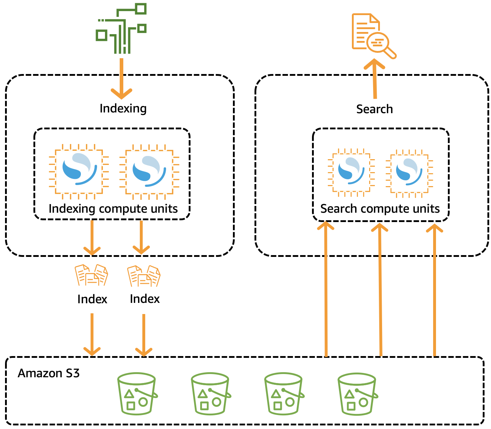
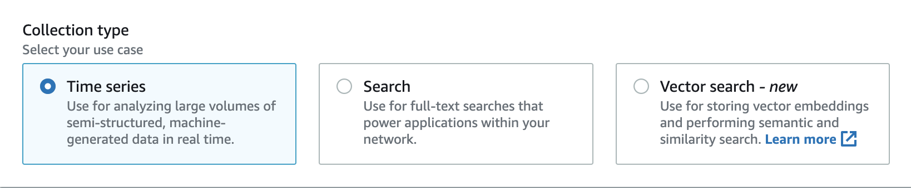

# What is Amazon OpenSearch Serverless?

Amazon OpenSearch Serverless is an on-demand, serverless option for Amazon OpenSearch Service that eliminates the
operational complexity of provisioning, configuring, and tuning OpenSearch clusters. It’s
ideal for organizations that prefer not to self-manage their clusters or lack the
dedicated resources and expertise to operate large-scale deployments. With OpenSearch Serverless, you
can search and analyze large volumes of data without managing the underlying
infrastructure.

An OpenSearch Serverless _collection_ is a group of OpenSearch indexes that work
together to support a specific workload or use case. Collections simplify operations
compared to self-managed OpenSearch clusters, which require manual provisioning.

Collections use the same high-capacity, distributed, and highly available storage as
provisioned OpenSearch Service domains, but further reduce complexity by eliminating manual
configuration and tuning. All communication with OpenSearch Serverless endpoints uses TLS 1.2
encryption, ensuring data is encrypted in transit from client to endpoint. Data is also
encrypted in transit between internal components of a collection. OpenSearch Serverless also
supports OpenSearch Dashboards, providing an interface for data analysis.

OpenSearch Serverless is compatible with open source OpenSearch. As new versions are released,
OpenSearch Serverless automatically upgrades collections to incorporate new features, bug fixes, and
performance improvements.

OpenSearch Serverless supports the same ingest and query API operations as the OpenSearch open source
suite, so you can continue to use your existing clients and applications. Your clients
must be compatible with OpenSearch 3.x in order to work with OpenSearch Serverless. For more
information, see [Ingesting data into Amazon OpenSearch Serverless collections](serverless-clients.md "serverless-clients.md").

###### Topics

- [Use cases for OpenSearch Serverless](#serverless-use-cases "#serverless-use-cases")
- [How it works](#serverless-process "#serverless-process")
- [Choosing a collection type](#serverless-usecase "#serverless-usecase")
- [Supported AWS Regions](#serverless-regions "#serverless-regions")
- [Limitations](#serverless-limitations "#serverless-limitations")
- [Comparing OpenSearch Service and OpenSearch Serverless](serverless-comparison.md "serverless-comparison.md")

## Use cases for OpenSearch Serverless

OpenSearch Serverless supports two primary use cases:

- **Log analytics** - The log analytics segment
  focuses on analyzing large volumes of semi-structured, machine-generated
  time series data for operational and user behavior insights.
- **Full-text search** - The full-text search
  segment powers applications in your internal networks (content management
  systems, legal documents) and internet-facing applications, such as
  ecommerce website content search.

When you create a collection, you choose one of these use cases. For more
information, see [Choosing a collection type](#serverless-usecase "#serverless-usecase").

## How it works

Traditional OpenSearch clusters have a single set of instances that perform both
indexing and search operations, and index storage is tightly coupled with compute
capacity. By contrast, OpenSearch Serverless uses a cloud-native architecture that separates the
indexing (ingest) components from the search (query) components, with Amazon S3 as the
primary data storage for indexes.

This decoupled architecture lets you scale search and indexing functions
independently of each other, and independently of the indexed data in S3. The
architecture also provides isolation for ingest and query operations so that they
can run concurrently without resource contention.

When you write data to a collection, OpenSearch Serverless distributes it to the
_indexing_ compute units. The indexing compute units ingest
the incoming data and move the indexes to S3. When you perform a search on the
collection data, OpenSearch Serverless routes requests to the _search_ compute
units that hold the data being queried. The search compute units download the
indexed data directly from S3 (if it's not already cached locally), run search
operations, and perform aggregations.

The following image illustrates this decoupled architecture:

OpenSearch Serverless compute capacity for data ingestion, searching, and querying are measured
in OpenSearch Compute Units (OCUs). Each OCU is a combination of 6 GiB of memory and
corresponding virtual CPU (vCPU), as well as data transfer to Amazon S3.

OpenSearch Serverless provisions OCUs separately for search and indexing. OpenSearch Serverless only adds
additional OCUs for search and ingest as needed to support the collections,
according to the [capacity
limits](serverless-scaling.md#serverless-scaling-configure "serverless-scaling.md#serverless-scaling-configure") that you specify. Capacity scales back down as your compute usage
decreases.

For information about how you're billed for these OCUs, see [Amazon OpenSearch Service pricing](https://aws.amazon.com/opensearch-service/pricing/ "https://aws.amazon.com/opensearch-service/pricing/").

## Choosing a collection type

OpenSearch Serverless supports three primary collection types:

**Time series** – The log analytics segment that analyzes
large volumes of semi-structured, machine-generated data in real-time, providing
insights into operations, security, user behavior, and business performance.

###### Note

Time series collections are only available for Classic collections. NextGen
collections currently support Search and Vector search types only.

**Search** – Full-text search that enables applications
within internal networks, such as content management systems and legal document
repositories, as well as internet-facing applications like e-commerce site search
and content discovery.

**Vector search** – Semantic search on vector embeddings
simplifies vector data management and enables machine learning (ML)-augmented search
experiences. It supports generative AI applications such as chatbots, personal
assistants, and fraud detection.

You choose a collection type when you first create a collection:

The collection type that you choose depends on the kind of data that you plan to
ingest into the collection, and how you plan to query it. You can't change the
collection type after you create it.

The collection types have the following notable **differences**:

- For _search_ and _vector search_
  collections, all data is stored in hot storage to ensure fast query response
  times. _Time series_ collections use a
  combination of hot and warm storage, where the most recent data is kept in
  hot storage to optimize query response times for more frequently accessed
  data.
- For _time series_ collections, you can't index by
  custom document ID or update by upsert requests. This operation is reserved
  for search use cases. You can update by document ID instead. For more
  information, see [Supported OpenSearch API operations and permissions](serverless-genref.md#serverless-operations "serverless-genref.md#serverless-operations").
- For _search_ and _time series_
  collections, you can't use k-NN type indexes.

## Supported AWS Regions

OpenSearch Serverless is available in a subset of AWS Regions that OpenSearch Service is available in. For a
list of supported Regions, see [Amazon OpenSearch Service endpoints and
quotas](../../../general/latest/gr/opensearch-service.md "../../../general/latest/gr/opensearch-service.md") in the _AWS General Reference_.

## Limitations

OpenSearch Serverless has the following limitations:

- Some OpenSearch API operations aren't supported. See [Supported OpenSearch API operations and permissions](serverless-genref.md#serverless-operations "serverless-genref.md#serverless-operations").
- Some OpenSearch plugins aren't supported. See [Supported OpenSearch plugins](serverless-genref.md#serverless-plugins "serverless-genref.md#serverless-plugins").
- There's currently no way to automatically migrate your data from a managed
  OpenSearch Service domain to a serverless collection. You must reindex your data from a
  domain to a collection.
- Cross-account access to collections isn't supported. You can't include
  collections from other accounts in your encryption or data access
  policies.
- Custom OpenSearch plugins aren't supported.
- Automated snapshots are supported for OpenSearch Serverless collections. Manual snapshots are not supported. For more information, see [Backing up collections using snapshots](serverless-snapshots.md "serverless-snapshots.md").
- Cross-Region search and replication aren't
  supported.
- There are limits on the number of serverless resources that you can have
  in a single account and Region. See [OpenSearch Serverless quotas](../../../general/latest/gr/opensearch-service.md#opensearch-limits-serverless "../../../general/latest/gr/opensearch-service.md#opensearch-limits-serverless").
- The refresh interval for indexes in search and
  time series collections is approximately 10 seconds.
- The number of shards, number of intervals, and refresh interval are not
  modifiable and are handled by OpenSearch Serverless. The sharding strategy is based off the
  collection type and traffic. For example, a time series collection scales
  primary shards based on write traffic bottlenecks.
