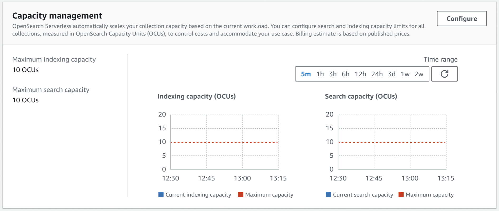

# Managing capacity limits for Amazon OpenSearch Serverless

With Amazon OpenSearch Serverless, you don't have to manage capacity yourself. OpenSearch Serverless automatically scales
the compute capacity for your account based on the current workload. Serverless compute
capacity is measured in _OpenSearch Compute Units_ (OCUs).
Each OCU is a combination of 6 GiB of memory and corresponding virtual CPU (vCPU), as well
as data transfer to Amazon S3. For more information about the decoupled architecture in OpenSearch Serverless,
see [How it works](serverless-overview.md#serverless-process "serverless-overview.md#serverless-process").

When you create your first collection, OpenSearch Serverless instantiates OCUs based on your redundancy
settings. By default, redundant active replicas are enabled, which means that a total of
four OCUs are instantiated (two for indexing and two for search) to ensure high availability
with standby nodes in another Availability Zone. For development and testing purposes, you
can disable the **Enable redundancy** setting for a collection, which
eliminates the standby replicas and only instantiates two OCUs (one for indexing and one for
search). These OCUs always exist, even when there's no indexing or search activity. All
subsequent collections can share these OCUs (except for collections with unique AWS KMS keys,
which instantiate their own set of OCUs). If needed, OpenSearch Serverless automatically scales out and
adds additional OCUs as your indexing and search usage grows. When traffic on your
collection endpoint decreases, capacity scales back down to the minimum number of OCUs
required for your data size. For the search and time series collection, the number of OCUs
required when idle is proportional to the data size and index count. For vectors, it depends
on both the memory (RAM) to store vector graphs and disk space to store indices. If not in
an idle state, OCU requirements take both of these into account.

Vector collections keep index data in OCU local storage. OCU RAM limits are reached faster
than OCU disk limits, causing vector collections to be restricted by RAM space. With
redundancy enabled, the OCU capacity scales down to a minimum of 1 OCU [0.5 OCU x 2] for
indexing and 1 OCU [0.5 OCU x 2] for search. When you disable redundancy, your domain can
scale down to 0.5 OCU for indexing and 0.5 OCU for search. Scaling also factors in the
number of shards needed for your collection or index. Each OCU can support a specified
number of shards. The number of indexes should be proportional to the shard count. The total
number of base OCUs required is the maximum amount of your data, memory, and shards
required. For more information, see [Amazon OpenSearch Serverless cost-effective search capabilities, at any scale](https://aws.amazon.com/blogs/big-data/amazon-opensearch-serverless-cost-effective-search-capabilities-at-any-scale/ "https://aws.amazon.com/blogs/big-data/amazon-opensearch-serverless-cost-effective-search-capabilities-at-any-scale/") on the
_AWS Big Data Blog_.

For _search_ and _vector search_ collections, all
data is stored on hot indexes to ensure fast query response times. _Time series_ collections use a combination of hot and warm storage, keeping
the most recent data in hot storage to optimize query response times for more frequently
accessed data. For more information, see [Choosing a collection type](serverless-overview.md#serverless-usecase "serverless-overview.md#serverless-usecase").

###### Note

A vector search collection can't share OCUs with _search_ and
_time series_ collections, even if the vector
search collection uses the same KMS key as the _search_ or
_time series_ collections. A new set of OCUs will
be created for your first vector collection. The OCUs of vector collections are shared
among the same KMS key collections.

To manage capacity for your collections and to control costs, you can specify the overall
maximum indexing and search capacity for the current account and Region, and
OpenSearch Serverless scales out your collection resources automatically based on these
specifications.

Because indexing and search capacity scale separately, you specify account-level limits
for each:

- **Maximum indexing capacity** – OpenSearch Serverless can
  increase indexing capacity up to this number of OCUs.
- **Maximum search capacity** – OpenSearch Serverless can
  increase search capacity up to this number of OCUs.

###### Note

At this time, capacity settings only apply at the account level. You can't configure
per-collection capacity limits.

Your goal should be to ensure that the maximum capacity is high enough to handle spikes in
workload. Based on your settings, OpenSearch Serverless automatically scales out the number of OCUs for
your collections to process the indexing and search workload.

###### Topics

- [Configuring capacity settings](#serverless-scaling-configure "#serverless-scaling-configure")
- [Maximum capacity limits](#serverless-scaling-limits "#serverless-scaling-limits")
- [Monitoring capacity usage](#serverless-scaling-monitoring "#serverless-scaling-monitoring")

## Configuring capacity settings

To configure capacity settings in the OpenSearch Serverless console, expand
**Serverless** in the left navigation pane and select
**Dashboard**. Specify the maximum indexing and search capacity
under **Capacity management**:



To configure capacity using the AWS CLI, send an [UpdateAccountSettings](../ServerlessAPIReference/API_UpdateAccountSettings.md "../ServerlessAPIReference/API_UpdateAccountSettings.md") request:

```
aws opensearchserverless update-account-settings \
    --capacity-limits '{ "maxIndexingCapacityInOCU": `8`,"maxSearchCapacityInOCU": `9` }'
```

## Maximum capacity limits

The maximum total of indexes a collection can contain is 1000. For all three types of
collections, the default maximum OCU capacity is 10 OCUs for indexing and 10 OCUs for
search. The minimum OCU capacity allowed for an account is 1 OCU [0.5 OCU x 2] for
indexing and 1 OCU [0.5 OCU x 2] for search. For all collections, the maximum allowed
capacity is 1,700 OCUs for indexing and 1,700 OCUs for search. You can configure the OCU
count to be any number from 1 to the maximum allowed capacity, in multiples of 2.

Each OCU includes enough hot ephemeral storage for 120 GiB of index data. OpenSearch Serverless
supports up to 1 TiB of data per index in _search_ and
_vector search_ collections, and 100 TiB of hot data per index in
a _time series_ collection. For time series collections, you can
still ingest more data, which can be stored as warm data in S3.

For a list of all quotas, see [OpenSearch Serverless
quotas](../../../general/latest/gr/opensearch-service.md#opensearch-limits-serverless "../../../general/latest/gr/opensearch-service.md#opensearch-limits-serverless").

## Monitoring capacity usage

You can monitor the `SearchOCU` and `IndexingOCU` account-level
CloudWatch metrics to understand how your collections are scaling. We recommend that you
configure alarms to notify you if your account is approaching a threshold for metrics
related to capacity, so you can adjust your capacity settings accordingly.

You can also use these metrics to determine if your maximum capacity settings are
appropriate, or if you need to adjust them. Analyze these metrics to focus your efforts
for optimizing the efficiency of your collections. For more information about the
metrics that OpenSearch Serverless sends to CloudWatch, see [Monitoring Amazon OpenSearch Serverless](serverless-monitoring.md "serverless-monitoring.md").
