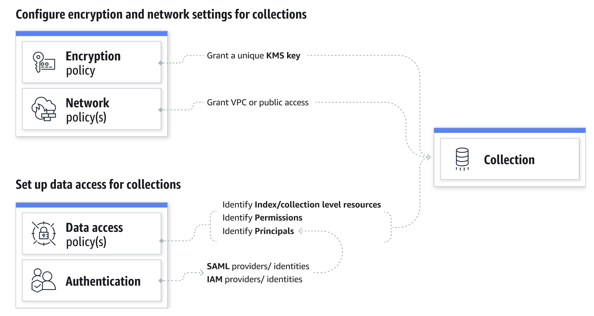
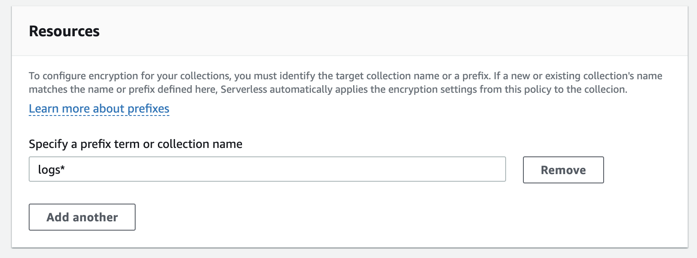
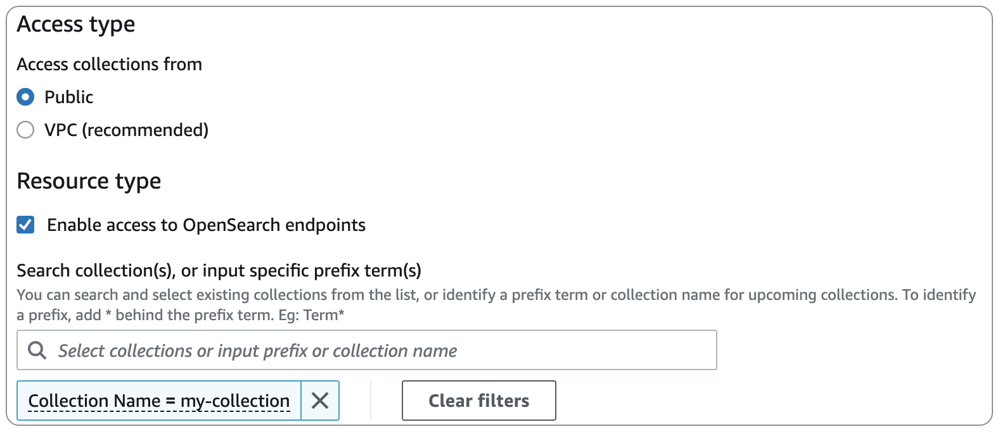
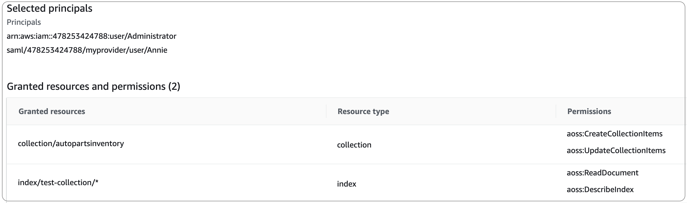

# Overview of security in Amazon OpenSearch Serverless

Security in Amazon OpenSearch Serverless differs fundamentally from security in Amazon OpenSearch Service in the following
ways:

| Feature                                  | OpenSearch Service                                                                       | OpenSearch Serverless                                                                           |
| ---------------------------------------- | ---------------------------------------------------------------------------------------- | ----------------------------------------------------------------------------------------------- |
| **Data access control**                  | Data access is determined by IAM policies and fine-grained access<br>control.            | Data access is determined by data access policies.                                              |
| **Encryption at rest**                   | Encryption at rest is \*optional<br>• for domains.                                       | Encryption at rest is \*required<br>• for<br>collections.                                       |
| **Security setup and<br>administration** | You must configure network, encryption, and data access individually for<br>each domain. | You can use security policies to manage security settings for multiple<br>collections at scale. |

The following diagram illustrates the security components that make up a functional
collection. A collection must have an assigned encryption key, network access settings, and
a matching data access policy that grants permission to its resources.



###### Topics

- [Encryption policies](#serverless-security-encryption "#serverless-security-encryption")
- [Network policies](#serverless-security-network "#serverless-security-network")
- [Data access policies](#serverless-security-data-access "#serverless-security-data-access")
- [IAM and SAML
  authentication](#serverless-security-authentication "#serverless-security-authentication")
- [Infrastructure security](#serverless-infrastructure-security "#serverless-infrastructure-security")
- [Getting started with security in Amazon OpenSearch Serverless](serverless-tutorials.md "serverless-tutorials.md")
- [Identity and Access Management for
  Amazon OpenSearch Serverless](security-iam-serverless.md "security-iam-serverless.md")
- [Encryption in Amazon OpenSearch Serverless](serverless-encryption.md "serverless-encryption.md")
- [Network access for Amazon OpenSearch Serverless](serverless-network.md "serverless-network.md")
- [FIPS compliance in
  Amazon OpenSearch Serverless](fips-compliance-opensearch-serverless.md "fips-compliance-opensearch-serverless.md")
- [Data access control for Amazon OpenSearch Serverless](serverless-data-access.md "serverless-data-access.md")
- [Access Amazon OpenSearch Serverless using an interface endpoint
  (AWS PrivateLink)](serverless-vpc.md "serverless-vpc.md")
- [SAML authentication for Amazon OpenSearch Serverless](serverless-saml.md "serverless-saml.md")
- [Compliance validation for Amazon OpenSearch Serverless](serverless-compliance.md "serverless-compliance.md")

## Encryption policies

[Encryption policies](serverless-encryption.md "serverless-encryption.md") define whether your
collections are encrypted with an AWS owned key or a customer managed key. Encryption policies
consist of two components: a **resource pattern** and an
**encryption key**. The resource pattern defines which
collection or collections the policy applies to. The encryption key determines how the
associated collections will be secured.

To apply a policy to multiple collections, you include a wildcard (\*) in the policy
rule. For example, the following policy applies to all collections with names that begin
with "logs".



Encryption policies streamline the process of creating and managing collections,
especially when you do so programmatically. You can create a collection by specifying a
name, and an encryption key is automatically assigned to it upon creation.

## Network policies

[Network policies](serverless-network.md "serverless-network.md") define whether your
collections are accessible privately, or over the internet from public networks. Private
collections can be accessed through OpenSearch Serverless–managed VPC endpoints, or by specific
AWS services such as Amazon Bedrock using _AWS service private access_.
Just like encryption policies, network policies can apply to multiple collections, which
allows you to manage network access for many collections at scale.

Network policies consist of two components: an **access
type** and a **resource type**. The access
type can either be public or private. The resource type determines whether the access
you choose applies to the collection endpoint, the OpenSearch Dashboards endpoint, or
both.



If you plan to configure VPC access within a network policy, you must first create one
or more [OpenSearch Serverless-managed VPC endpoints](serverless-vpc.md "serverless-vpc.md"). These
endpoints let you access OpenSearch Serverless as if it were in your VPC, without the use of an
internet gateway, NAT device, VPN connection, or Direct Connect connection.

Private access to AWS services can only apply to the collection's OpenSearch
endpoint, not to the OpenSearch Dashboards endpoint. AWS services cannot be granted access
to OpenSearch Dashboards.

## Data access policies

[Data access policies](serverless-data-access.md "serverless-data-access.md") define how your
users access the data within your collections. Data access policies help you manage
collections at scale by automatically assigning access permissions to collections and
indexes that match a specific pattern. Multiple policies can apply to a single
resource.

Data access policies consist of a set of rules, each with three components: a
**resource type**, **granted
resources**, and a set of **permissions**. The
resource type can be a collection or index. The granted resources can be
collection/index names or patterns with a wildcard (\*). The list of permissions
specifies which [OpenSearch API operations](serverless-genref.md#serverless-operations "serverless-genref.md#serverless-operations")
the policy grants access to. In addition, the policy contains a list of **principals**, which specify the IAM roles, users, and SAML
identities to grant access to.



For more information about the format of a data access policy, see the [policy syntax](serverless-data-access.md#serverless-data-access-syntax "serverless-data-access.md#serverless-data-access-syntax").

Before you create a data access policy, you must have one or more IAM roles or
users, or SAML identities, to provide access to in the policy. For details, see the next
section.

###### Note

Switching from Public to Private Access for your collection, will remove the
Indexes Tab in the OpenSearch Serverless Collection Console.

## IAM and SAML

authentication

IAM principals and SAML identities are one of the building blocks of a data access
policy. Within the `principal` statement of an access policy, you can include
IAM roles, users, and SAML identities. These principals are then granted the
permissions that you specify in the associated policy rules.

```
[
   {
      "Rules":[
         {
            "ResourceType":"index",
            "Resource":[
               "index/marketing/orders*"
            ],
            "Permission":[
               "aoss:*"
            ]
         }
      ],
      "Principal":[
         "**arn:aws:iam::123456789012:user/Dale**",
         "**arn:aws:iam::123456789012:role/RegulatoryCompliance**",
         "**saml/123456789012/myprovider/user/Annie**"
      ]
   }
]
```

You configure SAML authentication directly within OpenSearch Serverless. For more information, see
[SAML authentication for Amazon OpenSearch Serverless](serverless-saml.md "serverless-saml.md").

## Infrastructure security

Amazon OpenSearch Serverless is protected by AWS global network security. For information about AWS
security services and how AWS protects infrastructure, see [AWS Cloud Security](https://aws.amazon.com/security/ "https://aws.amazon.com/security/"). To design your AWS environment using
the best practices for infrastructure security, see [Infrastructure Protection](../../../wellarchitected/latest/security-pillar/infrastructure-protection.md "../../../wellarchitected/latest/security-pillar/infrastructure-protection.md") in _Security Pillar AWS
Well‐Architected Framework_.

You use AWS published API calls to access Amazon OpenSearch Serverless through the network. Clients
must support Transport Layer Security (TLS). We require TLS 1.2 and recommend TLS 1.3.
For a list of supported ciphers for TLS 1.3, see [TLS protocols and ciphers](../../../elasticloadbalancing/latest/network/create-tls-listener.md#tls-protocols-ciphers "../../../elasticloadbalancing/latest/network/create-tls-listener.md#tls-protocols-ciphers") in the ELB documentation.

Additionally, you must sign requests using an access key ID and a secret access key
that is associated with an IAM principal. Or you can use the [AWS Security Token Service](../../../STS/latest/APIReference/Welcome.md "../../../STS/latest/APIReference/Welcome.md")
(AWS STS) to generate temporary security credentials to sign requests.
