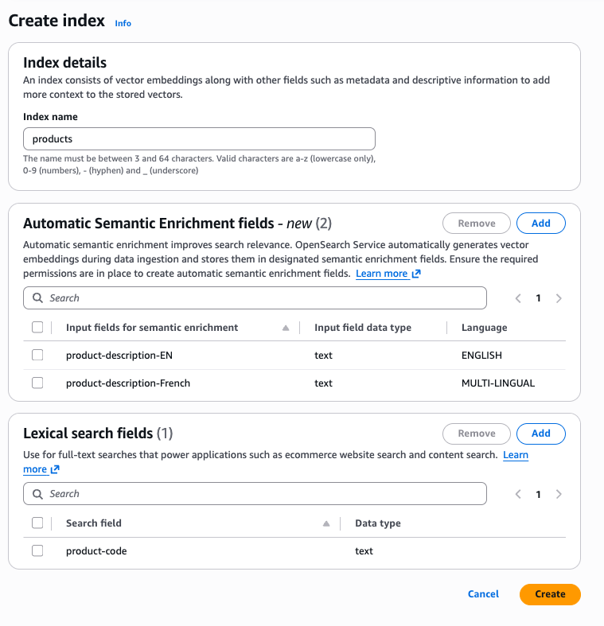

# Automatic semantic

enrichment for Serverless

## Introduction

The automatic semantic enrichment feature can help improve search relevance by up to 20% over lexical search.
Automatic semantic enrichment eliminates the undifferentiated heavy lifting of managing your own ML (machine learning) model
infrastructure and integration with the search engine. The feature is available for all three serverless collection types:
Search, Time Series, and Vector.

## What is semantic search

Traditional search engines rely on word-to-word matching (referred to as lexical search) to find results for queries.
Although this works well for specific queries such as television model numbers, it struggles with more abstract searches.
For example, when searching for "shoes for the beach," a lexical search merely matches individual words "shoes," "beach," "for," and "the"
in catalog items, potentially missing relevant products like "water-resistant sandals" or "surf footwear" that don't contain the exact search terms.

Semantic search returns query results that incorporate not just keyword matching, but the intent and contextual meaning of the user's search.
For example, if a user searches for "how to treat a headache," a semantic search system might return the following results:

- Migraine remedies
- Pain management techniques
- Over-the-counter pain relievers

## Model details and performance benchmark

While this feature handles the technical complexities behind the scenes without exposing the underlying model,
we provide transparency through a brief model description and benchmark results to help you make informed decisions about
feature adoption in your critical workloads.

Automatic semantic enrichment uses a service-managed, pre-trained sparse model that works effectively without requiring custom fine-tuning.
The model analyzes the fields you specify, expanding them into sparse vectors based on learned associations from diverse training data.
The expanded terms and their significance weights are stored in native Lucene index format for efficient retrieval.
We’ve optimized this process using [document-only mode,](https://docs.opensearch.org/docs/latest/vector-search/ai-search/neural-sparse-with-pipelines/#step-1a-choose-the-search-mode "https://docs.opensearch.org/docs/latest/vector-search/ai-search/neural-sparse-with-pipelines/#step-1a-choose-the-search-mode")
where encoding happens only during data ingestion. Search queries are merely tokenized rather than processed through the sparse model,
making the solution both cost-effective and performant.

Our performance validation during feature development used the [MS MARCO](https://huggingface.co/datasets/BeIR/msmarco "https://huggingface.co/datasets/BeIR/msmarco")
passage retrieval dataset, featuring passages averaging 334 characters. For relevance scoring, we measured average Normalized Discounted Cumulative Gain (NDCG) for
the first 10 search results (ndcg@10) on the [BEIR](https://github.com/beir-cellar/beir "https://github.com/beir-cellar/beir")
benchmark for English content and average ndcg@10 on MIRACL for multilingual content.
We assessed latency through client-side, 90th-percentile (p90) measurements and search response p90
[took values.](https://github.com/beir-cellar/beir "https://github.com/beir-cellar/beir")
These benchmarks provide baseline performance indicators for both search relevance and response times. Here are the key benchmark numbers -

- English language - Relevance improvement of 20% over lexical search. It also lowered P90 search latency by 7.7% over lexical search (BM25 is 26 ms, and automatic semantic enrichment is 24 ms).
- Multi-lingual - Relevance improvement of 105% over lexical search, whereas P90 search latency increased by 38.4% over lexical search (BM25 is 26 ms, and automatic semantic enrichment is 36 ms).

Given the unique nature of each workload, we encourage you to evaluate this feature in your development environment using your own benchmarking criteria before making implementation decisions.

## Languages Supported

The feature supports English. In addition, the model also supports Arabic, Bengali, Chinese, Finnish, French, Hindi, Indonesian, Japanese, Korean, Persian, Russian, Spanish, Swahili, and Telugu.

## Set up an automatic semantic enrichment index for serverless collections

Setting up an index with automatic semantic enrichment enabled for your text fields is easy,
and you can manage it through the console, APIs, and CloudFormation templates during new index creation.
To enable it for an existing index, you need to recreate the index with automatic semantic enrichment enabled for text fields.

Console experience -
The AWS console allows you to easily create an index with automatic semantic enrichment fields. Once you select a collection,
you will find the create index button at the top of the console. Once you click the create index button,
you will find options to define automatic semantic enrichment fields. In one index, you can have combinations of
automatic semantic enrichment for English and multilingual, as well as lexical fields.



API experience - To create an automatic semantic enrichment index using the AWS Command Line Interface (AWS CLI), use the create-index command:

```
aws opensearchserverless create-index \
--id [collection_id] \
--index-name [index_name] \
--index-schema [index_body] \

```

In the following example index-schema, the _title_semantic_ field has a field type set to _text_ and has parameter
_semantic_enrichment_ set to status _ENABLED_.
Setting the _semantic_enrichment_ parameter enables automatic semantic enrichment on the _title_semantic_ field.
You can use the _language_options_ field to specify either _english_ or _multi-lingual_.

```

    aws opensearchserverless create-index \
    --id XXXXXXXXX \
    --index-name 'product-catalog' \
    --index-schema '{
    "mappings": {
        "properties": {
            "product_id": {
                "type": "keyword"
            },
            "title_semantic": {
                "type": "text",
                "semantic_enrichment": {
                    "status": "ENABLED",
                    "language_options": "english"
                }
            },
            "title_non_semantic": {
                "type": "text"
            }
        }
    }
}'

```

To describe the created index, use the following command:

```
aws opensearchserverless get-index \
--id [collection_id] \
--index-name [index_name] \

```

You can also use CloudFormation templates (Type:AWS::OpenSearchServerless::CollectionIndex)
to create semantic search during collection provisioning as well as after the collection is created.

## Data ingestion and search

Once you've created an index with automatic semantic enrichment enabled,
the feature works automatically during data ingestion process, no additional configuration required.

Data ingestion: When you add documents to your index, the system automatically:

- Analyzes the text fields you designated for semantic enrichment
- Generates semantic encodings using OpenSearch Service managed sparse model
- Stores these enriched representations alongside your original data

This process uses OpenSearch's built-in ML connectors and ingest pipelines, which are created and managed automatically behind the scenes.

Search: The semantic enrichment data is already indexed, so queries run efficiently without invoking the ML model again.
This means you get improved search relevance with no additional search latency overhead.

## Configuring permissions

for automatic semantic enrichment

Before creating an automated semantic enrichment index, you need to configure the
required permissions. This section explains the permissions needed and how to set
them up.

### IAM policy permissions

Use the following AWS Identity and Access Management (IAM) policy to grant the necessary permissions
for working with automatic semantic enrichment:

JSON

```
`{
 "Version":"2012-10-17",
 "Statement": [
 {
 "Sid": "AutomaticSemanticEnrichmentPermissions",
 "Effect": "Allow",
 "Action": [
 "aoss:CreateIndex",
 "aoss:GetIndex",
 "aoss:UpdateIndex",
 "aoss:DeleteIndex",
 "aoss:APIAccessAll"
 ],
 "Resource": "*"
 }
 ]
}`

```

**Key permissions**

- The `aoss:*Index` permissions enable index
  management
- The `aoss:APIAccessAll` permission allows
  OpenSearch API operations
- To restrict permissions to a specific collection, replace
  `"Resource": "*"` with the collection's
  ARN

### Configure data

access permissions

To set up an index for automatic semantic enrichment, you must have
appropriate data access policies that grant permission to access index,
pipeline, and model collection resources. For more information about data access
policies, see [Data access control for Amazon OpenSearch Serverless](serverless-data-access.md "serverless-data-access.md"). For the procedure to configure a
data access policy, see [Creating data access policies
(console)](serverless-data-access.md#serverless-data-access-console "serverless-data-access.md#serverless-data-access-console").

#### Data access

permissions

```
[
    {
        "Description": "Create index permission",
        "Rules": [
            {
                "ResourceType": "index",
                "Resource": ["index/`collection_name`/*"],
                "Permission": [
                  "aoss:CreateIndex",
                  "aoss:DescribeIndex",
                  "aoss:UpdateIndex",
                  "aoss:DeleteIndex"
                ]
            }
        ],
        "Principal": [
            "arn:aws:iam::`account_id`:role/`role_name`"
        ]
    },
    {
        "Description": "Create pipeline permission",
        "Rules": [
            {
                "ResourceType": "collection",
                "Resource": ["collection/`collection_name`"],
                "Permission": [
                  "aoss:CreateCollectionItems",
                  "aoss:DescribeCollectionItems"
                ]
            }
        ],
        "Principal": [
            "arn:aws:iam::`account_id`:role/`role_name`"
        ]
    },
    {
        "Description": "Create model permission",
        "Rules": [
            {
                "ResourceType": "model",
                "Resource": ["model/`collection_name`/*"],
                "Permission": ["aoss:CreateMLResource"]
            }
        ],
        "Principal": [
            "arn:aws:iam::`account_id`:role/`role_name`"
        ]
    },
]
```

#### Network

access permissions

To allow service APIs to access private collections, you must configure
network policies that permit the required access between the service API and
the collection. For more information about network policies, see [Network access for Amazon OpenSearch Serverless](serverless-network.md "serverless-network.md") .

```
[
   {
      "Description":"Enable automatic semantic enrichment in a private collection",
      "Rules":[
         {
            "ResourceType":"collection",
            "Resource":[
               "collection/`collection_name`"
            ]
         }
      ],
      "AllowFromPublic":false,
      "SourceServices":[
         "aoss.amazonaws.com"
      ],
   }
]
```

###### To configure network access permissions for a private

collection

1. Sign in to the OpenSearch Service console at [https://console.aws.amazon.com/aos/home](https://console.aws.amazon.com/aos/home "https://console.aws.amazon.com/aos/home").
2. In the left navigation, choose _Network
   policies_. Then do one of the following:
   - Choose an existing policy name and choose
     _Edit_
   - Choose _Create network policy_ and
     configure the policy details

3. In the _Access type_ area, choose
   _Private (recommended)_, and then select
   _AWS service private access_.
4. In the search field, choose _Service_, and then
   choose _aoss.amazonaws.com_.
5. In the _Resource type_ area, select the
   _Enable access to OpenSearch endpoint_
   box.
6. For _Search collection(s), or input specific prefix
   term(s)_, in the search field, select
   _Collection Name_. Then enter or select the
   name of the collections to associate with the network policy.
7. Choose _Create_ for a new network policy or
   _Update_ for an existing network
   policy.

## Query Rewrites

Automatic semantic enrichment automatically converts your existing “match”
queries to semantic search queries without requiring query modifications. If a match query is part of a compound query,
the system traverses your query structure, finds match queries, and replaces them with neural sparse queries.
Currently, the feature only supports replacing “match” queries, whether it’s a standalone query or part of a compound query.
“multi_match” is not supported. In addition, the feature supports all compound queries to replace their nested match queries.
Compound queries include: bool, boosting, constant_score, dis_max, function_score, and hybrid.

## Limitations of automatic semantic enrichment

Automatic semantic search is most effective when applied to small-to-medium
sized fields containing natural language content, such as movie titles, product descriptions,
reviews, and summaries. Although semantic search enhances relevance for most use cases,
it might not be optimal for certain scenarios. Consider following limitations when deciding whether
to implement automatic semantic enrichment for your specific use case.

- Very long documents – The current sparse model processes only the first 8,192 tokens of each document for English.
  For multilingual documents, it’s 512 tokens. For lengthy articles, consider implementing document chunking to
  ensure complete content processing.
- Log analysis workloads – Semantic enrichment significantly increases index size,
  which might be unnecessary for log analysis where exact matching typically suffices.
  The additional semantic context rarely improves log search effectiveness enough to justify the increased storage requirements.
- Automatic semantic enrichment is not compatible with the Derived Source feature.

## Pricing

OpenSearch Serverless bills automatic semantic enrichment based on OpenSearch Compute Units (OCUs)
consumed during sparse vector generation at indexing time. You’re charged only for actual usage during indexing.
You can monitor this consumption using the Amazon CloudWatch metric SemanticSearchOCU.
For specific details about model token limits, volume throughput per OCU, and example of sample calculation, visit [OpenSearch Service Pricing](https://aws.amazon.com/opensearch-service/pricing/ "https://aws.amazon.com/opensearch-service/pricing/").
