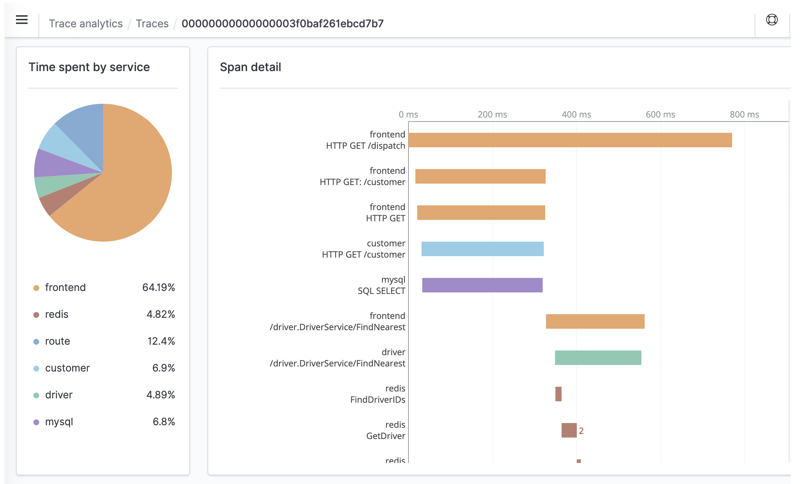
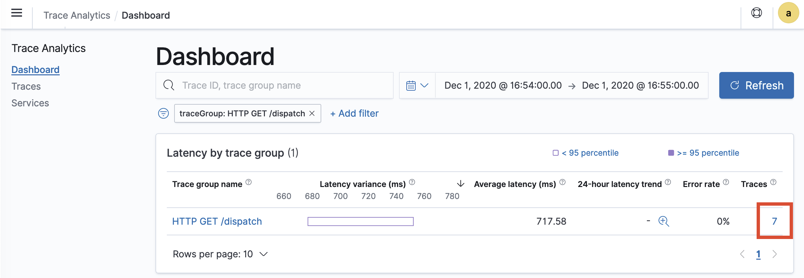
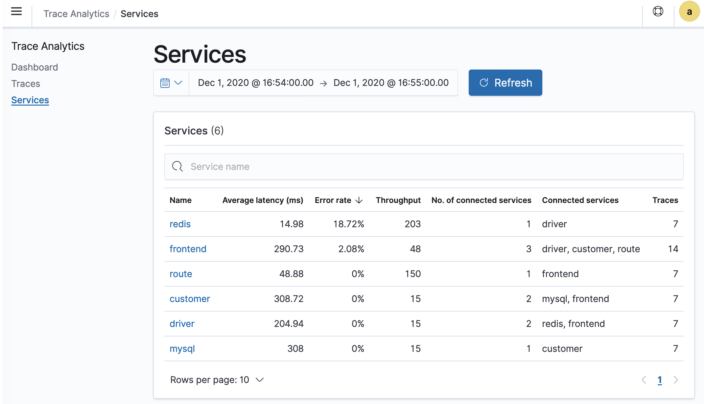

# Trace Analytics for Amazon OpenSearch Service

You can use Trace Analytics, which is part of the OpenSearch Observability plugin, to
analyze trace data from distributed applications. Trace Analytics requires OpenSearch or
Elasticsearch 7.9 or later.

In a distributed application, a single operation, such as a user clicking a button, can
trigger an extended series of events. For example, the application front end might call a
backend service, which calls another service, which queries a database, which processes the
query and returns a result. Then the first backend service sends a confirmation to the front
end, which updates the UI.

You can use Trace Analytics to help you visualize this flow of events and identify
performance problems.

###### Note

This documentation provides a brief overview of Trace Analytics. For comprehensive
documentation, see [Trace
Analytics](https://opensearch.org/docs/latest/observing-your-data/trace/index/ "https://opensearch.org/docs/latest/observing-your-data/trace/index/") in the open source OpenSearch documentation.



## Prerequisites

Trace Analytics requires you to add [instrumentation](https://opentelemetry.io/docs/concepts/instrumenting/ "https://opentelemetry.io/docs/concepts/instrumenting/")
to your application and generate trace data using an OpenTelemetry-supported library
such as [Jaeger](https://www.jaegertracing.io "https://www.jaegertracing.io") or [Zipkin](https://zipkin.io "https://zipkin.io"). This step occurs entirely outside of OpenSearch Service.
The [AWS Distro for
OpenTelemetry documentation](https://aws-otel.github.io/docs/introduction "https://aws-otel.github.io/docs/introduction") contains example applications for many
programming languages that can help you get started, including Java, Python, Go, and
JavaScript.

After you add instrumentation to your application, the [OpenTelemetry
Collector](https://aws-otel.github.io/docs/getting-started/collector "https://aws-otel.github.io/docs/getting-started/collector") receives data from the application and formats it into
OpenTelemetry data. See the list of receivers on [GitHub](https://github.com/open-telemetry/opentelemetry-collector/blob/main/receiver/README.md "https://github.com/open-telemetry/opentelemetry-collector/blob/main/receiver/README.md"). AWS Distro for OpenTelemetry includes a [receiver for
AWS X-Ray](https://aws-otel.github.io/docs/components/x-ray-receiver "https://aws-otel.github.io/docs/components/x-ray-receiver").

Finally, you can use [Overview of Amazon OpenSearch Ingestion](ingestion.md "ingestion.md") to format that OpenTelemetry data for
use with OpenSearch.

## OpenTelemetry Collector sample configuration

To use the OpenTelemetry Collector with [Overview of Amazon OpenSearch Ingestion](ingestion.md "ingestion.md"), try the following
sample configuration:

```
extensions:
  sigv4auth:
    region: "`us-east-1`"
    service: "osis"

receivers:
  jaeger:
    protocols:
      grpc:

exporters:
  otlphttp:
    traces_endpoint: "https://`pipeline-endpoint`.`us-east-1`.osis.amazonaws.com/opentelemetry.proto.collector.trace.v1.TraceService/Export"
    auth:
      authenticator: sigv4auth
    compression: none

service:
  extensions: [sigv4auth]
  pipelines:
    traces:
      receivers: [jaeger]
      exporters: [otlphttp]
```

## OpenSearch Ingestion sample configuration

To send trace data to an OpenSearch Service domain, try the following sample OpenSearch Ingestion
pipeline configuration. For instructions to create a pipeline, see [Creating Amazon OpenSearch Ingestion pipelines](creating-pipeline.md "creating-pipeline.md").

```
version: "2"
otel-trace-pipeline:
  source:
    otel_trace_source:
      "/${pipelineName}/ingest"
  processor:
    - trace_peer_forwarder:
  sink:
    - pipeline:
        name: "trace_pipeline"
    - pipeline:
        name: "service_map_pipeline"
trace-pipeline:
  source:
    pipeline:
      name: "otel-trace-pipeline"
  processor:
    - otel_traces:
  sink:
    - opensearch:
        hosts: ["https://`domain-endpoint`"]
        index_type: trace-analytics-raw
        aws:
          # IAM role that OpenSearch Ingestion assumes to access the domain sink
          sts_role_arn: "arn:aws:iam::`{account-id}`:role/`pipeline-role`"
          region: "`us-east-1`"

service-map-pipeline:
  source:
    pipeline:
      name: "otel-trace-pipeline"
  processor:
    - service_map:
  sink:
    - opensearch:
        hosts: ["https://`domain-endpoint`"]
        index_type: trace-analytics-service-map
        aws:
          # IAM role that the pipeline assumes to access the domain sink
          sts_role_arn: "arn:aws:iam::`{account-id}`:role/`pipeline-role`"
          region: "`us-east-1`"
```

The pipeline role that you specify in the `sts_role_arn` option must have
write permissions to the sink. For instructions to configure permissions for the
pipeline role, see [Setting up roles and users in
Amazon OpenSearch Ingestion](pipeline-security-overview.md "pipeline-security-overview.md").

## Exploring trace data

The **Dashboard** view groups traces together by HTTP
method and path so that you can see the average latency, error rate, and trends
associated with a particular operation. For a more focused view, try filtering by trace
group name.



To drill down on the traces that make up a trace group, choose the number of traces in
the right-hand column. Then choose an individual trace for a detailed summary.

The **Services** view lists all services in the
application, plus an interactive map that shows how the various services connect to each
other. In contrast to the dashboard (which helps identify problems by operation), the
service map helps you identify problems by service. Try sorting by error rate or latency
to get a sense of potential problem areas of your application.


