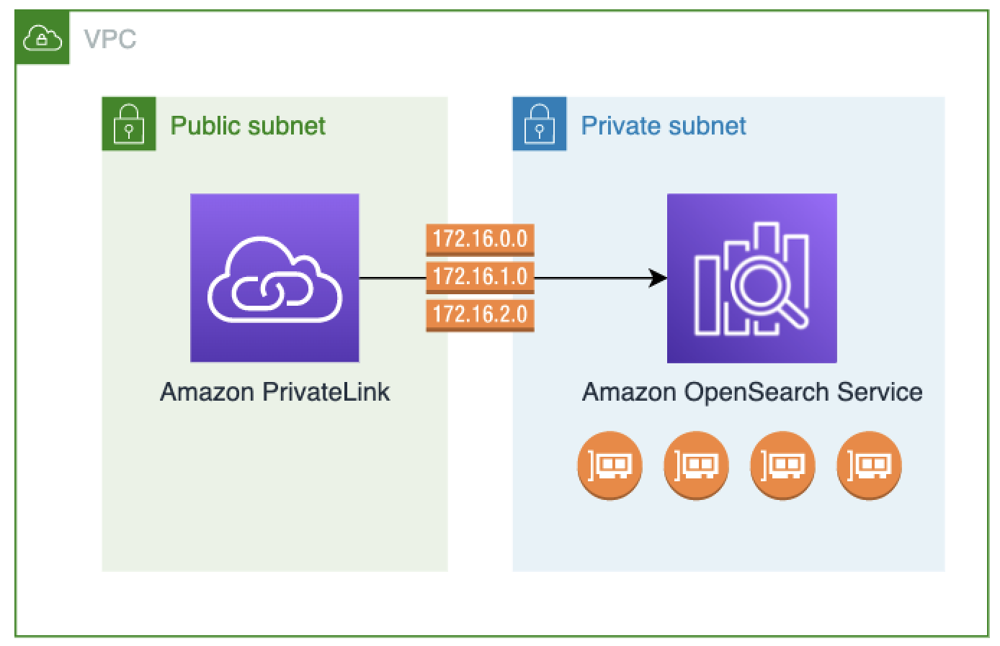

# Access Amazon OpenSearch Service using an OpenSearch Service-managed VPC

endpoint (AWS PrivateLink)

You can access an Amazon OpenSearch Service domain by setting up an OpenSearch Service-managed VPC endpoint (powered
by AWS PrivateLink). These endpoints create a private connection between your VPC and
Amazon OpenSearch Service. You can access OpenSearch Service VPC domains as if they were in your VPC, without the use of
an internet gateway, NAT device, VPN connection, or Direct Connect connection. Instances in your
VPC don't need public IP addresses to access OpenSearch Service.

You can configure OpenSearch Service domains to expose additional endpoints running on public or
private subnets within the same VPC, different VPC, or different AWS accounts. This
enables you to add an additional layer of security to access your domains regardless of
where they run, with no infrastructure to manage. The following diagram illustrates
OpenSearch Service-managed VPC endpoints within the same VPC:

You establish this private connection by creating an OpenSearch Service-managed _interface
VPC endpoint_, powered by AWS PrivateLink. We create an endpoint network
interface in each subnet that you enable for the interface VPC endpoint. These are
service-managed network interfaces that serve as the entry point for traffic destined for
OpenSearch Service. Standard [AWS PrivateLink interface
endpoint pricing](https://aws.amazon.com/privatelink/pricing/ "https://aws.amazon.com/privatelink/pricing/") applies for OpenSearch Service managed VPC endpoints billed under
AWS PrivateLink.

You can create VPC endpoints for domains running all versions of OpenSearch and legacy
Elasticsearch. For more information, see [Access AWS services
through AWS PrivateLink](../../../vpc/latest/privatelink/privatelink-access-aws-services.md "../../../vpc/latest/privatelink/privatelink-access-aws-services.md") in the _AWS PrivateLink
Guide_.

## Considerations and limitations for

OpenSearch Service

Before you set up an interface VPC endpoint for OpenSearch Service, review [Access an AWS service using an interface VPC endpoint](../../../vpc/latest/privatelink/create-interface-endpoint.md "../../../vpc/latest/privatelink/create-interface-endpoint.md") in the
_AWS PrivateLink Guide_.

When using OpenSearch Service-managed VPC endpoints, consider the following:

- You can only use interface VPC endpoints to connect to [VPC
  domains](vpc.md "vpc.md"). Public domains aren't supported.
- VPC endpoints can only connect to domains within the same AWS Region.
- HTTPS is the only supported protocol for VPC endpoints. HTTP is not
  allowed.
- OpenSearch Service supports making calls to all of the [supported OpenSearch API operations](supported-operations.md "supported-operations.md") through an interface VPC
  endpoint.
- You can configure a maximum of 50 endpoints per account, and a maximum of 10
  endpoints per domain. A single domain can have a maximum of 10 [authorized principals](#vpc-endpoint-access "#vpc-endpoint-access").
- You currently can't use AWS CloudFormation to create interface VPC endpoints.
- You can only create interface VPC endpoints through the OpenSearch Service console or using
  the [OpenSearch Service API](../APIReference/Welcome.md "../APIReference/Welcome.md").
  You can't create interface VPC endpoints for OpenSearch Service using the Amazon VPC console.
- OpenSearch Service-managed VPC endpoints aren't accessible from the internet. An
  OpenSearch Service-managed VPC endpoint is accessible only within the VPC where the endpoint is
  provisioned or any VPCs peered with the VPC where the endpoint is provisioned, as
  permitted by the route tables and security groups.
- VPC endpoint policies are not supported for OpenSearch Service. You can associate a security
  group with the endpoint network interfaces to control traffic to OpenSearch Service through the
  interface VPC endpoint.
- Your [service-linked
  role](slr.md "slr.md") must be in the same AWS account that you use to create the VPC
  endpoint.
- To create, update, and delete the OpenSearch Service VPC endpoint, you must have the
  following Amazon EC2 permissions in addition to your Amazon OpenSearch Service permissions:
  - `ec2:CreateVpcEndpoint`
  - `ec2:DescribeVpcEndpoints`
  - `ec2:ModifyVpcEndpoint`
  - `ec2:DeleteVpcEndpoints`
  - `ec2:CreateTags`
  - `ec2:DescribeTags`
  - `ec2:DescribeSubnets`
  - `ec2:DescribeSecurityGroups`
  - `ec2:DescribeVpcs`

###### Note

Currently, you can't limit VPC endpoint creation to OpenSearch Service. We're working to make
this possible in a future update.

## Provide access to a domain

If the VPC that you want to access your domain is in another AWS account, you need
to authorize it from the owner's account before you can create an interface VPC
endpoint.

###### To allow a VPC in another AWS account to access your domain

1. Open the Amazon OpenSearch Service console at [https://console.aws.amazon.com/aos/home/](https://console.aws.amazon.com/aos/home/ "https://console.aws.amazon.com/aos/home/").
2. In the navigation pane, choose **Domains** and open the domain
   that you want to provide access to.
3. Go to the **VPC endpoints** tab, which shows the accounts and
   corresponding VPCs that have access to your domain.
4. Choose **Authorize principal**.
5. Enter the AWS account ID of the account that will access your domain. This
   step authorizes the specified account to create VPC endpoints against the
   domain.
6. Choose **Authorize**.

## Create an interface VPC endpoint for a VPC

domain

You can create an interface VPC endpoint for OpenSearch Service using either the OpenSearch Service console or
the AWS Command Line Interface (AWS CLI).

###### To create an interface VPC endpoint for an OpenSearch Service domain

1. Open the Amazon OpenSearch Service console at [https://console.aws.amazon.com/aos/home/](https://console.aws.amazon.com/aos/home/ "https://console.aws.amazon.com/aos/home/").
2. In the left navigation pane, choose **VPC endpoints**.
3. Choose **Create endpoint**.
4. Select whether to connect a domain in the current AWS account or another
   AWS account.
5. Select the domain that you connect to with this endpoint. If the domain is in
   the current AWS account, use the dropdown to choose the domain. If the domain is
   in a different account, enter the Amazon Resource Name (ARN) of the domain to
   connect to. To choose a domain in a different account, the owner needs to [provide you access](#vpc-endpoint-access "#vpc-endpoint-access") to the domain.
6. For **VPC**, select the VPC from which you'll access
   OpenSearch Service.
7. For **Subnets**, select one or more subnets from which you'll
   access OpenSearch Service.
8. For **Security groups**, select the security groups to
   associate with the endpoint network interfaces. This is a critical step in which
   you limit what ports, protocols, and sources for inbound traffic that you’re
   authorizing into your endpoint. The security group rules must allow the resources
   that will use the VPC endpoint to communicate with OpenSearch Service to communicate with the
   endpoint network interface.
9. Choose **Create endpoint**. The endpoint should be active
   within 2-5 minutes.

## Working with OpenSearch Service-managed VPC endpoints using the

configuration API

Use the following API operations to create and manage OpenSearch Service-managed VPC
endpoints.

- [CreateVpcEndpoint](../APIReference/API_CreateVpcEndpoint.md "../APIReference/API_CreateVpcEndpoint.md")
- [ListVpcEndpoints](../APIReference/API_ListVpcEndpoints.md "../APIReference/API_ListVpcEndpoints.md")
- [UpdateVpcEndpoint](../APIReference/API_UpdateVpcEndpoint.md "../APIReference/API_UpdateVpcEndpoint.md")
- [DeleteVpcEndpoint](../APIReference/API_DeleteVpcEndpoint.md "../APIReference/API_DeleteVpcEndpoint.md")

Use the following API operations to manage endpoint access to VPC domains:

- [AuthorizeVpcEndpointAccess](../APIReference/API_AuthorizeVpcEndpointAccess.md "../APIReference/API_AuthorizeVpcEndpointAccess.md")
- [ListVpcEndpointAccess](../APIReference/API_ListVpcEndpointAccess.md "../APIReference/API_ListVpcEndpointAccess.md")
- [ListVpcEndpointsForDomain](../APIReference/API_ListVpcEndpointsForDomain.md "../APIReference/API_ListVpcEndpointsForDomain.md")
- [RevokeVpcEndpointAccess](../APIReference/API_RevokeVpcEndpointAccess.md "../APIReference/API_RevokeVpcEndpointAccess.md")
