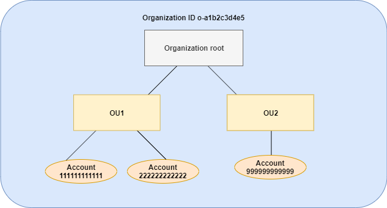

# Inheritance examples

These examples show how policy inheritance works by showing how parent and child tag
policies are merged into an effective tag policy for an account.

The examples assume that you have the organization structure shown in the following
diagram.



###### Examples

- [Example 1: Allow child policies to
  overwrite only tag values](#example-assign-operator "#example-assign-operator")
- [Example 2: Append new values to inherited
  tags](#example-append-operator "#example-append-operator")
- [Example 3: Remove values from inherited
  tags](#example-remove-operator "#example-remove-operator")
- [Example 4: Restrict changes to child
  policies](#example-restrict-child "#example-restrict-child")
- [Example 5: Conflicts with child
  control operators](#multiple-same-node-operators "#multiple-same-node-operators")
- [Example 6: Conflicts with appending
  values at same hierarchy level](#multiple-same-node-values "#multiple-same-node-values")

## Example 1: Allow child policies to

overwrite _only_ tag values

The following tag policy defines the `CostCenter` tag key and two
acceptable values, `Development` and `Support`. If you attach
it to the organization root, the tag policy is in effect for all accounts in the
organization.

**Policy A – Organization root tag
policy**

```
{
    "tags": {
        "costcenter": {
            "tag_key": {
                "@@assign": "CostCenter"
            },
            "tag_value": {
                "@@assign": [
                    "Development",
                    "Support"
                ]
            }
        }
    }
}
```

Assume that you want users in OU1 to use a different tag value for a key, and you
want to enforce the tag policy for specific resource types. Because policy A doesn't
specify which child control operators are allowed, all operators are allowed. You
can use the `@@assign` operator and create a tag policy like the
following to attach to OU1.

**Policy B – OU1 tag policy**

```
{
    "tags": {
        "costcenter": {
            "tag_key": {
                "@@assign": "CostCenter"
            },
            "tag_value": {
                "@@assign": [
                    "Sandbox"
                ]
            },
            "enforced_for": {
                "@@assign": [
                    "redshift:*",
                    "dynamodb:table"
                ]
            }
        }
    }
}
```

Specifying the `@@assign` operator for the tag does the following when
policy A and policy B merge to form the _effective tag policy_
for an account:

- Policy B overwrites the two tag values that were specified in the parent
  policy, policy A. The result is that `Sandbox` is the only
  compliant value for the `CostCenter` tag key.
- The addition of `enforced_for` specifies that the
  `CostCenter` tag _must_ be
  the specified tag value on all Amazon Redshift resources and Amazon DynamoDB tables.

As shown in the diagram, OU1 includes two accounts: 111111111111 and 222222222222.

**Resultant effective tag policy for accounts 111111111111 and
222222222222**

###### Note

You can't directly use the contents of a displayed
effective policy as the contents of a new policy. The syntax doesn't include the
operators needed to control merging with other child and parent policies. The display
of an effective policy is intended only for understanding the results of the merger.

```
{
    "tags": {
        "costcenter": {
            "tag_key": "CostCenter",
            "tag_value": [
                "Sandbox"
            ],
            "enforced_for": [
                "redshift:*",
                "dynamodb:table"
            ]
        }
    }
}
```

## Example 2: Append new values to inherited

tags

There may be cases where you want all accounts in your organization to specify a
tag key with a short list of acceptable values. For accounts in one OU, you may want
to allow an additional value that only those accounts can specify when creating
resources. This example specifies how to do that by using the `@@append`
operator. The `@@append` operator is an advanced feature.

Like example 1, this example starts with policy A for the organization root tag
policy.

**Policy A – Organization root tag
policy**

```
{
    "tags": {
        "costcenter": {
            "tag_key": {
                "@@assign": "CostCenter"
            },
            "tag_value": {
                "@@assign": [
                    "Development",
                    "Support"
                ]
            }
        }
    }
}
```

For this example, attach policy C to OU2. The difference in this example is that
using the `@@append` operator in policy C _adds to_,
rather than overwrites, the list of acceptable values and the
`enforced_for` rule.

**Policy C – OU2 tag policy for appending
values**

```
{
    "tags": {
        "costcenter": {
            "tag_key": {
                "@@assign": "CostCenter"
            },
            "tag_value": {
                "@@append": [
                    "Marketing"
                ]
            },
            "enforced_for": {
                "@@append": [
                    "redshift:*",
                    "dynamodb:table"
                ]
            }
        }
    }
}
```

Attaching policy C to OU2 has the following effects when policy A and policy C
merge to form the effective tag policy for an account:

- Because policy C includes the `@@append` operator, it allows
  for _adding to_, not overwriting, the list of acceptable
  tag values that are specified in Policy A.
- As in policy B, the addition of `enforced_for` specifies that
  the `CostCenter` tag must be used as the specified tag value on
  all Amazon Redshift resources and Amazon DynamoDB tables. Overwriting (`@@assign`)
  and adding (`@@append`) have the same effect if the parent policy
  doesn't include a child control operator that restricts what a child policy
  can specify.

As shown in the diagram, OU2 includes one account: 999999999999. Policy A and
policy C merge to create the effective tag policy for account 999999999999.

**Effective tag policy for account
999999999999**

###### Note

You can't directly use the contents of a displayed
effective policy as the contents of a new policy. The syntax doesn't include the
operators needed to control merging with other child and parent policies. The display
of an effective policy is intended only for understanding the results of the merger.

```
{
    "tags": {
        "costcenter": {
            "tag_key": "CostCenter",
            "tag_value": [
                "Development",
                "Support",
                "Marketing"
            ],
            "enforced_for": [
                "redshift:*",
                "dynamodb:table"
            ]
        }
    }
}
```

## Example 3: Remove values from inherited

tags

There may be cases where the tag policy that is attached to the organization
defines more tag values than you want an account to use. This example explains how
to revise a tag policy using the `@@remove` operator. The
`@@remove` is an advanced feature.

Like the other examples, this example starts with policy A for the organization
root tag policy.

**Policy A – Organization root tag
policy**

```
{
    "tags": {
        "costcenter": {
            "tag_key": {
                "@@assign": "CostCenter"
            },
            "tag_value": {
                "@@assign": [
                    "Development",
                    "Support"
                ]
            }
        }
    }
}
```

For this example, attach policy D to account 999999999999.

**Policy D – Account 999999999999 tag policy for
removing values**

```
{
    "tags": {
        "costcenter": {
            "tag_key": {
                "@@assign": "CostCenter"
            },
            "tag_value": {
                "@@remove": [
                    "Development",
                    "Marketing"
                ],
                "enforced_for": {
                    "@@remove": [
                        "redshift:*",
                        "dynamodb:table"
                    ]
                }
            }
        }
    }
}
```

Attaching policy D to account 999999999999 has the following effects when policy
A, policy C, and policy D merge to form the effective tag policy:

- Assuming you performed all of the previous examples, policies B, C, and C
  are child policies of A. Policy B is only attached to OU1, so it has no
  effect on account 9999999999999.
- For account 9999999999999, the only acceptable value for the
  `CostCenter` tag key is `Support`.
- Compliance is not enforced for the `CostCenter` tag key.

**New effective tag policy for account
999999999999**

###### Note

You can't directly use the contents of a displayed
effective policy as the contents of a new policy. The syntax doesn't include the
operators needed to control merging with other child and parent policies. The display
of an effective policy is intended only for understanding the results of the merger.

```
{
    "tags": {
        "costcenter": {
            "tag_key": "CostCenter",
            "tag_value": [
                "Support"
            ]
        }
    }
}
```

If you later add more accounts to OU2, their effective tag policies would be
different than for account 999999999999. That's because the more restrictive policy
D is only attached at the account level, and not to the OU.

## Example 4: Restrict changes to child

policies

There may be cases where you want to restrict changes in child policies. This
example explains how to do that using child control operators.

This example starts with a new organization root tag policy and assumes that tag
policies aren't yet attached to organization entities.

**Policy E – Organization root tag policy for
restricting changes in child policies**

```
{
    "tags": {
        "project": {
            "tag_key": {
                "@@operators_allowed_for_child_policies": ["@@none"],
                "@@assign": "Project"
            },
            "tag_value": {
                "@@operators_allowed_for_child_policies": ["@@append"],
                "@@assign": [
                    "Maintenance",
                    "Escalations"
                ]
            }
        }
    }
}
```

When you attach policy E to the organization root, the policy prevents child
policies from changing the `Project` tag key. However, child policies can
overwrite or append tag values.

Assume you then attach the following policy F to an OU.

**Policy F – OU tag policy**

```
{
    "tags": {
        "project": {
            "tag_key": {
                "@@assign": "PROJECT"
            },
            "tag_value": {
                "@@append": [
                    "Escalations - research"
                ]
            }
        }
    }
}
```

Merging policy E and policy F have the following effects on the OU's
accounts:

- Policy F is a child policy to Policy E.
- Policy F attempts to change the case treatment, but it can't. That's
  because policy E includes the
  `"@@operators_allowed_for_child_policies": ["@@none"]`
  operator for the tag key.
- However, policy F can append tag values for the key. That's because policy
  E includes `"@@operators_allowed_for_child_policies":
["@@append"]` for the tag value.

**Effective policy for accounts in the OU**

###### Note

You can't directly use the contents of a displayed
effective policy as the contents of a new policy. The syntax doesn't include the
operators needed to control merging with other child and parent policies. The display
of an effective policy is intended only for understanding the results of the merger.

```
{
    "tags": {
        "project": {
            "tag_key": "Project",
            "tag_value": [
                "Maintenance",
                "Escalations",
                "Escalations - research"
            ]
        }
    }
}
```

## Example 5: Conflicts with child

control operators

Child control operators can exist in tag policies that are attached at the same
level in the organization hierarchy. When that happens, the intersection of the
allowed operators is used when the policies merge to form the effective policy for
accounts.

Assume policy G and policy H are attached to the organization root.

**Policy G – Organization root tag policy
1**

```
{
    "tags": {
        "project": {
            "tag_value": {
                "@@operators_allowed_for_child_policies": ["@@append"],
                "@@assign": [
                    "Maintenance"
                ]
            }
        }
    }
}
```

**Policy H – Organization root tag policy
2**

```
{
    "tags": {
        "project": {
            "tag_value": {
                "@@operators_allowed_for_child_policies": ["@@append", "@@remove"]
            }
        }
    }
}
```

In this example, one policy at the organization root defines that the values for
the tag key can only be appended to. The other policy attached to the organization
root allows child policies to both append and remove values. The intersection of
these two permissions is used for child policies. The result is that child policies
can append values, but not remove values. Therefore, the child policy can append a
value to the list of tag values but can't remove the `Maintenance`
value.

## Example 6: Conflicts with appending

values at same hierarchy level

You can attach multiple tag policies to each organization entity. When you do
this, the tag policies that are attached to the same organization entity might
include conflicting information. Policies are evaluated based on the order in which
they were attached to the organization entity. To change which policy is evaluated
first, you can detach a policy and then reattach it.

Assume policy J is attached to the organization root first, and then policy K is
attached to the organization root.

**Policy J – First tag policy attached to the
organization root**

```
{
    "tags": {
        "project": {
            "tag_key": {
                "@@assign": "PROJECT"
            },
            "tag_value": {
                "@@append": ["Maintenance"]
            }
        }
    }
}
```

**Policy K – Second tag policy attached to the
organization root**

```
{
    "tags": {
        "project": {
            "tag_key": {
                "@@assign": "project"
            }
        }
    }
}
```

In this example, the tag key `PROJECT` is used in the effective tag
policy because the policy that defined it was attached to the organization root
first.

**Policy JK – Effective tag policy for
account**

The effective policy for the account is as follows.

###### Note

You can't directly use the contents of a displayed
effective policy as the contents of a new policy. The syntax doesn't include the
operators needed to control merging with other child and parent policies. The display
of an effective policy is intended only for understanding the results of the merger.

```
{
    "tags": {
        "project": {
            "tag_key": "PROJECT",
            "tag_value": [
                "Maintenance"
            ]
        }
    }
}

```
