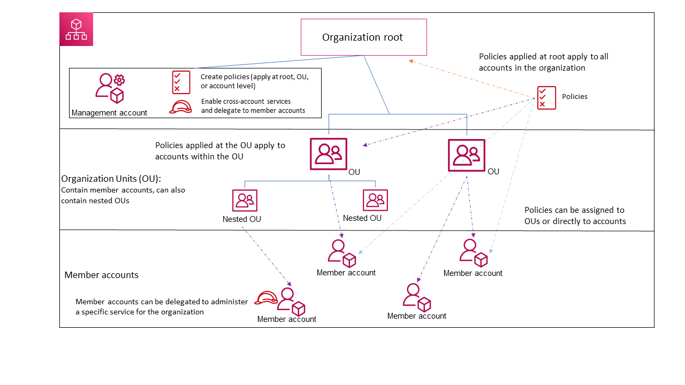

# Terminology and concepts for AWS Organizations

This topic explains some of the key concepts for AWS Organizations.

The following diagram shows an organization that consists of five accounts that are
organized into four organizational units (OUs) under the root. The organization also has
several policies that are attached to some of the OUs or directly to accounts.

For a
description of each of these items, refer to the definitions in this topic.

###### Topics

- [Available feature sets](#feature-set "#feature-set")
- [Organization structure](#organization-structure "#organization-structure")
- [Invitations and handshakes](#invitations-handshakes "#invitations-handshakes")
- [Organization policies](#organization-policies "#organization-policies")

## Available feature sets

**All features (Recommended)**

_All features_ is the default feature set that is available to AWS Organizations.
You can set central policies and configuration requirements for an entire organization,
create custom permissions or capabilities within the organization, manage and organize
your accounts under a single bill,
and delegate responsibilities to other accounts on behalf of the organization.
You can also use integrations with other
AWS services to define central configurations, security mechanisms, audit requirements,
and resource sharing across all member accounts in your organization. For more information, see [Using AWS Organizations with other AWS services](orgs_integrate_services.md "orgs_integrate_services.md").

All features mode provides all the capabilities of consolidated billing along with the administrative capabilities.

**Consolidated billing**

_Consolidated billing_ is the
feature set that provide shared billing functionality, but doesn't include
the more advanced features of AWS Organizations. For example, you can't enable
other AWS services to integrate with your organization to work across
all of its accounts, or use policies to restrict what users and roles in
different accounts can do.

You can enable all features for an organization that originally supported
only the consolidated billing features. To enable all features, all
invited member accounts must approve the change by accepting the
invitation that is sent when the management account starts the
process. For more information, see [Enabling all features for an organization with AWS Organizations](orgs_manage_org_support-all-features.md "orgs_manage_org_support-all-features.md").

## Organization structure

**Organization**

An _organization_ is a collection of [AWS accounts](#account "#account") that you can manage centrally and organize into a hierarchical,
tree-like structure with a [root](#root "#root") at the top and [organizational units](#organizationalunit "#organizationalunit") nested under the root. Each account can be
directly in the root, or placed in one of the OUs in the hierarchy.

Each organization consists of:

- A [management account](#management-account "#management-account")
- Zero or more [member accounts](#member-account "#member-account")
- Zero or more [organizational units (OUs)](#organizationalunit "#organizationalunit")
- Zero or more [policies](#organization-policies "#organization-policies").

An organization has the functionality that is determined by the [feature set](#feature-set "#feature-set") that you enable.

**Root**

An _administrative root (root)_
is contained in the [management account](#management-account "#management-account") and is the starting point for organizing your [AWS accounts](#management-account "#management-account"). The root is the top-most container in your organization’s hierarchy.
Under this root, you can create [organizational units (OUs)](#organizationalunit "#organizationalunit") to logically group your accounts and organize
these OUs into a hierarchy that best matches your needs.

If you apply a [management policy](#management-policies "#management-policies") to the root,
it applies to all [organizational units (OUs)](#organizationalunit "#organizationalunit") and [accounts](#account "#account"), including the management account for the organization.

If you apply
an authorization policy (for example, a service control policy (SCP)), to the root, it applies to all organizational units (OUs) and [member accounts](#member-account "#member-account") in the organization. It does not apply to the management account in the organization.

###### Note

You can have only one root. AWS Organizations automatically creates the root
for you when you create an organization.

**Organizational unit (OU)**

An _organizational unit (OU)_ is a group of [AWS accounts](#account "#account") within an organization.
An OU can also contain other OUs enabling you to create a hierarchy.
For example, you can group all accounts that belong to the same department into a departmental OU.
Similarly, you can group all accounts running security services into a security OU.

OUs are useful when you need to apply the same controls to a subset of accounts in your organization.
Nesting OUs enables smaller units of management. For example, you can create OUs for each workload,
then create two nested OUs in each workload OU to divide production workloads from pre-production.
These OUs inherit the policies from the parent OU in addition to any controls assigned directly to the team-level OU.
Including the [root](#root "#root") and AWS accounts created in the lowest OUs, your hierarchy can be five levels deep.

**AWS account**

An _AWS account_ is a container for your AWS resources.
You create and manage your AWS resources in an AWS account,
and the AWS account provides administrative capabilities for access and billing.

Using multiple AWS accounts is a best practice for scaling your environment,
as it provides a billing boundary for costs, isolates resources for security,
gives flexibility or individuals and teams, in addition to being adaptable for new processes.

###### Note

An AWS account is different from a user. A [user](../../../IAM/latest/UserGuide/introduction_identity-management.md#intro-identity-users "../../../IAM/latest/UserGuide/introduction_identity-management.md#intro-identity-users") is an identity that you create using AWS Identity and Access Management
(IAM) and takes the form of either an [IAM user with long-term
credentials](../../../IAM/latest/UserGuide/id_users.md "../../../IAM/latest/UserGuide/id_users.md") or an [IAM role with short-term
credentials](../../../IAM/latest/UserGuide/id_roles.md "../../../IAM/latest/UserGuide/id_roles.md"). A single AWS account can, and typically does,
contain many users and roles.

There are two types of accounts in an organization: a single account that is
designated as the [management account](#management-account "#management-account") and one or more [member accounts](#member-account "#member-account").

**Management account**

_A management account_ is the AWS account you use to create your organization.
From the management account, you can do the following:

- Create other accounts in your organization
- [Invite and manage invitations](#invitations-handshakes "#invitations-handshakes") for other accounts to join your organization
- Designate [delegated administrator accounts](#delegated-admin "#delegated-admin")
- Remove accounts from your organization
- Attach policies to entities such as [roots](#root "#root"),
  [organizational units (OUs)](#organizationalunit "#organizationalunit"), or accounts within your organization
- Enable integration with supported AWS services to provide
  service functionality across all of the accounts in the
  organization.

The management account is the ultimate owner of the organization,
having final control over security, infrastructure, and finance policies.
This account has the role of a payer account and is responsible
for paying all charges accrued by the accounts in its organization.

###### Notes

- You cannot change which account in your organization is the management account.
- The management account does not have to be directly under the root, it can be placed anywhere in the organization.

**Member account**

A _member account_ is an AWS account, other than the management account,
that is part of an organization. If you are an [administrator](#delegated-admin "#delegated-admin") of an organization,
you can create member accounts in the organization and invite existing accounts to join the organization.
You also can apply policies to member accounts.

###### Note

A member account can belong to only one organization at a time.
You can designate member accounts to be delegated administrator accounts.

**Delegated administrator**

We recommend that you use the management account and its users and
roles only for tasks that must be performed by that account. We recommend that you store your
AWS resources in other member accounts in the organization and keep them out of the management
account. This is because security features like Organizations service control policies (SCPs) do not
restrict any users or roles in the management account. Separating your resources from your
management account can also help you understand the charges on your invoices. From the
organization's management account, you can designate one or more member accounts as a
delegated administrator account to help you implement this recommendation. There are two types of delegated administrators:

- Delegated administrator for Organizations: From these accounts, you can manage organization policies and attach policies to
  entities (roots, OUs, or accounts) within the organization. The management account can control delegation permissions at
  granular levels. For more information, see [Delegated administrator for AWS Organizations](orgs_delegate_policies.md "orgs_delegate_policies.md").
- Delegated administrator for an AWS service: From these accounts, you can manage AWS services that
  integrate with Organizations. The management account can register different member accounts as delegated administrators for different services as needed.
  These accounts have administrative permissions for a specific service, as well as permissions for Organizations read-only actions.
  For more information, see [Delegated administrator for AWS services that work with Organizations](orgs_integrate_delegated_admin.md "orgs_integrate_delegated_admin.md")

## Invitations and handshakes

**Invitation**

An _invitation_ is a request made by the management account
of an organization to another [account](#account "#account"). For
example, the process of asking a standalone account to join an [organization](#org "#org") is an invitation.

Invitations are implemented as [handshakes](#handshake "#handshake"). You might not see handshakes when you work in the
AWS Organizations console. But if you use the AWS CLI or AWS Organizations API, you must work
directly with handshakes.

**Handshake**

A _handshake_ is the secure exchange of information between two AWS accounts: a sender and a recipient.

The following handshakes are supported:

- **INVITE**: Handshake sent to a standalone account for it to join the sender's organization.
- **ENABLE_ALL_FEATURES**: Handshake sent to invited member accounts to enable all features for the organization.
- **APPROVE_ALL_FEATURES**: Handshake sent to the management account when all invited member accounts have approved to enable all features.

You generally need to directly interact with handshakes only if you work
with the AWS Organizations API or command line tools such as the AWS CLI.

## Organization policies

A _policy_ is a "document" with one or more statements that define
the controls that you want to apply to a group of AWS accounts.
AWS Organizations supports authorization policies and management policies.

### Authorization policies

Authorization policies help you to centrally manage the security of AWS accounts across an organization.

**Service control policy (SCP)**

A _service control policy_ is a type of policy that offers central control over the maximum available permissions for IAM users and IAM roles in an organization.

This means that SCPs specify principal-centric controls. SCPs create a permissions guardrail, or set limits on the
maximum permissions available to principals in your member accounts. You use an SCP when
you want to centrally enforce consistent access controls on principals in your
organization.

This can include specifying which services your IAM users and IAM roles can
access, which resources they can access, or the conditions under which they can make
requests (for example, from specific regions or networks). For more information, see [SCPs](orgs_manage_policies_scps.md "orgs_manage_policies_scps.md").

**Resource control policy (RCP)**

A _resource control policy_ is a type of policy that offers central control over the maximum available permissions for resources in an organization.

This means that RCPs specify resource-centric controls. RCPs create a permissions guardrail, or set limits, on the
maximum permissions available for resources in your member accounts. Use an RCP when you
want to centrally enforce consistent access controls across resources in your
organization.

This can include restricting access to your resources so that they can
only be accessed by identities that belong to your organization,
or specifying the conditions under which identities external to your organization can access your resources.
For more information, see [RCPs](orgs_manage_policies_rcps.md "orgs_manage_policies_rcps.md").

### Management policies

Management policies help you centrally configure and manage AWS services and their features across an organization.

**Declarative policy**

A _declarative policy_ is a type of policy that allows you to centrally declare and enforce desired configurations for a given AWS service at scale across an organization. Once attached, the configuration is always maintained when the service adds new features or APIs. for more information, see [declarative policy](orgs_manage_policies_declarative.md "orgs_manage_policies_declarative.md").

**Backup policy**

A _backup policy_ is type of policy that allows you to centrally manage and apply backup plans to the AWS resources across an organization's accounts. For more information, see [backup policy](orgs_manage_policies_backup.md "orgs_manage_policies_backup.md").

**Tag policy**

A _tag policy_ is type of policy that allows you to standardize the tags attached to the AWS resources in an organization's accounts. For more information, see [tag policy](orgs_manage_policies_tag-policies.md "orgs_manage_policies_tag-policies.md").

**Chat applications policy**

A _chat applications policy_ is a type of policy that allows you to control access to an organization's accounts from chat applications such as Slack and Microsoft Teams. For more information, see [Chat applications policy](orgs_manage_policies_chatbot.md "orgs_manage_policies_chatbot.md").

**AI services opt-out policy**

An _AI services opt-out policy_ is a type of policy that allows you to control data collection for AWS AI services for all the accounts in an organization. For more information, see [AI service opt-out policy](orgs_manage_policies_ai-opt-out.md "orgs_manage_policies_ai-opt-out.md").
