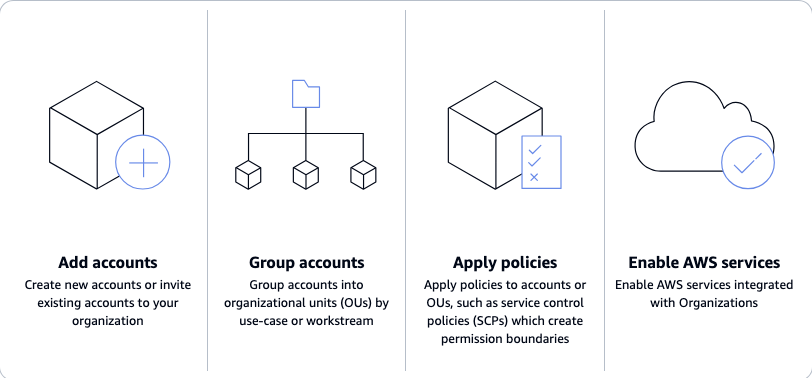

# What is AWS Organizations?

**Centrally manage your environment as you scale your AWS resources**

AWS Organizations helps you centrally manage and govern your environment as you grow and scale
your AWS resources. Using Organizations, you can create accounts and allocate resources,
group accounts to organize your workflows, apply policies for governance,
and simplify billing by using a single payment method for all of your accounts.

Organizations is integrated with other AWS services so you can define central configurations,
security mechanisms, audit requirements, and resource sharing across accounts in your organization.
For more information, see [Using AWS Organizations with other AWS services](orgs_integrate_services.md "orgs_integrate_services.md").

The following diagram shows a high-level explanation of how you can use AWS Organizations:

- Add accounts
- Group accounts
- Apply policies
- Enable AWS services.

###### Topics

- [Features](#features "#features")
- [Use cases](#use-cases "#use-cases")
- [Terminology and concepts](orgs_getting-started_concepts.md "orgs_getting-started_concepts.md")
- [Quotas and service limits](orgs_reference_limits.md "orgs_reference_limits.md")
- [Region support](region-support.md "region-support.md")
- [Billing and pricing](pricing.md "pricing.md")
- [Support and feedback](support-and-feedback.md "support-and-feedback.md")

## Features for AWS Organizations

AWS Organizations offers the following features:

**Manage your AWS accounts**

AWS accounts are natural boundaries for permission, security, costs, and workloads.
Using a multi-account environment is a recommended best-practice when scaling your cloud environment.
You can simplify account creation by programmatically creating new accounts
using the AWS Command Line Interface (AWS CLI), SDKs, or APIs,
and centrally provision recommended resources and permissions to those accounts
with [AWS CloudFormation StackSets](../../../AWSCloudFormation/latest/UserGuide/what-is-cfnstacksets.md "../../../AWSCloudFormation/latest/UserGuide/what-is-cfnstacksets.md").

**Define and manage your organization**

As you create new accounts, you can group them into organizational units (OUs),
or groups of accounts that serve a single application or service.
Apply tag polices to classify or track resources in your organization,
and provide attribute-based access control for users or applications.
In addition, you can delegate responsibility for supported AWS services to accounts
so users can manage them on behalf of your organization.

**Secure and monitor your accounts**

You can centrally provide tools and access for your security team to manage security needs on behalf of the organization.
For example, you can provide read-only security access across accounts, detect and mitigate threats with
[Amazon GuardDuty](../../../guardduty/latest/ug/what-is-guardduty.md "../../../guardduty/latest/ug/what-is-guardduty.md"),
review unintended access to resources with
[IAM Access Analyzer](../../../IAM/latest/UserGuide/what-is-access-analyzer.md "../../../IAM/latest/UserGuide/what-is-access-analyzer.md"),
and secure sensitive data with [Amazon Macie](../../../macie/latest/user/what-is-macie.md "../../../macie/latest/user/what-is-macie.md").

**Control access and permissions**

Set up [AWS IAM Identity Center](../../../singlesignon/latest/userguide/what-is.md "../../../singlesignon/latest/userguide/what-is.md") to provide access to AWS accounts
and resources using your active directory, and customize permissions
based on separate job roles. You can also apply [organization policies](orgs_manage_policies.md "orgs_manage_policies.md") to users, accounts, or OUs. For example,
[service control policies (SCPs)](orgs_manage_policies_scps.md "orgs_manage_policies_scps.md") enable you to
to control access to AWS resources, services, and Regions within your organization.
[Resource control policies (RCPs)](orgs_manage_policies_rcps.md "orgs_manage_policies_rcps.md") enable you to
centrally prevent the unintended use of your AWS resources.
[Chat applications policies](orgs_manage_policies_chatbot.md "orgs_manage_policies_chatbot.md") enable you to control access to your organization's accounts from chat applications such as Slack and Microsoft Teams.

**Share resources across accounts**

You can share AWS resources within your organization using
[AWS Resource Access Manager (AWS RAM)](../../../ram/latest/userguide/what-is.md "../../../ram/latest/userguide/what-is.md").
For example, you can create your
[Amazon Virtual Private Cloud (Amazon VPC)](../../../vpc/latest/userguide/what-is-amazon-vpc.md "../../../vpc/latest/userguide/what-is-amazon-vpc.md") subnets once and share them across your organization.
You can also centrally agree to software licenses with
[AWS License Manager](../../../license-manager/latest/userguide/license-manager.md "../../../license-manager/latest/userguide/license-manager.md"),
and share a catalog of IT services and custom products across accounts with
[AWS Service Catalog](../../../servicecatalog/latest/adminguide/introduction.md "../../../servicecatalog/latest/adminguide/introduction.md").

**Audit your environment for compliance**

You can activate
[AWS CloudTrail](../../../awscloudtrail/latest/userguide/cloudtrail-user-guide.md "../../../awscloudtrail/latest/userguide/cloudtrail-user-guide.md") across accounts, which creates a log of all activity in your cloud environment
that cannot be turned off or modified by member accounts. In addition, you can set policies to enforce
backups on your specified cadence with
[AWS Backup](../../../aws-backup/latest/devguide/whatisbackup.md "../../../aws-backup/latest/devguide/whatisbackup.md"), or define recommended configuration settings
for resources across accounts and AWS Regions with
[AWS Config](../../../config/latest/developerguide/WhatIsConfig.md "../../../config/latest/developerguide/WhatIsConfig.md").

**Centrally manage billing and costs**

Organizations provides you with a single consolidated bill.
In addition, you can view usage from resources across accounts and track costs using
[AWS Cost Explorer](../../../cost-management/latest/userguide/ce-reports.md "../../../cost-management/latest/userguide/ce-reports.md"),
and optimize your usage of compute resources using
[AWS Compute Optimizer](../../../managedservices/latest/userguide/compute-optimizer.md "../../../managedservices/latest/userguide/compute-optimizer.md").

## Use cases for AWS Organizations

The following are some use cases for AWS Organizations:

**Automate the creation of AWS accounts and categorize workloads**

You can automate the creation of AWS accounts to quickly launch new workloads.
Add the accounts to user-defined groups for instant security policy application,
touchless infrastructure deployments, and auditing.
Create separate groups to categorize development and production accounts
and use [AWS CloudFormation StackSets](../../../AWSCloudFormation/latest/UserGuide/what-is-cfnstacksets.md "../../../AWSCloudFormation/latest/UserGuide/what-is-cfnstacksets.md") to provision services and permissions to each group.

**Define and enforce audit and compliance policies**

You can apply service control policies (SCPs) to ensure that your users perform only
the actions that meet your security and compliance requirements.
Create a central log of all actions performed across your organization using [AWS CloudTrail](../../../awscloudtrail/latest/userguide/cloudtrail-user-guide.md "../../../awscloudtrail/latest/userguide/cloudtrail-user-guide.md").
View and enforce standard resource configurations across accounts and AWS Regions using [AWS Config](../../../config/latest/developerguide/WhatIsConfig.md "../../../config/latest/developerguide/WhatIsConfig.md").
Automatically apply regular backups using [AWS Backup](../../../aws-backup/latest/devguide/whatisbackup.md "../../../aws-backup/latest/devguide/whatisbackup.md").
Use [AWS Control Tower](../../../controltower/latest/userguide/what-is-control-tower.md "../../../controltower/latest/userguide/what-is-control-tower.md") to apply pre-packaged governance rules for security,
operations, and compliance for your AWS workloads.

**Provide tools and access for your Security teams while encouraging development**

Create a Security group and provide it
with read-only access to all of your
resources to identify and mitigate security concerns.
You can allow that group to manage [Amazon GuardDuty](../../../guardduty/latest/ug/what-is-guardduty.md "../../../guardduty/latest/ug/what-is-guardduty.md") so they can actively monitor
and mitigate threats to your workloads, and [IAM Access Analyzer](../../../IAM/latest/UserGuide/what-is-access-analyzer.md "../../../IAM/latest/UserGuide/what-is-access-analyzer.md") to quickly identify unintended access to your resources.

**Share common resources across accounts**

Organizations makes it easy for you to share critical central resources across your accounts.
For example, you can share your central
[AWS Directory Service for Microsoft Active Directory](../../../directoryservice/latest/admin-guide/what_is.md "../../../directoryservice/latest/admin-guide/what_is.md") so that applications can access your central identity store.

**Share critical central resources across your accounts**

Share your
[AWS Directory Service for Microsoft Active Directory](../../../directoryservice/latest/admin-guide/what_is.md "../../../directoryservice/latest/admin-guide/what_is.md") as a central identity store for your applications.
Use [AWS Service Catalog](../../../servicecatalog/latest/adminguide/introduction.md "../../../servicecatalog/latest/adminguide/introduction.md") to share IT services in designated accounts so users can quickly
discover and deploy approved services.
Ensure that application resources are created
on your [Amazon Virtual Private Cloud (Amazon VPC)](../../../vpc/latest/userguide/what-is-amazon-vpc.md "../../../vpc/latest/userguide/what-is-amazon-vpc.md") subnets
by centrally defining them once and sharing them across your organization using [AWS Resource Access Manager (AWS RAM)](../../../ram/latest/userguide/what-is.md "../../../ram/latest/userguide/what-is.md").
