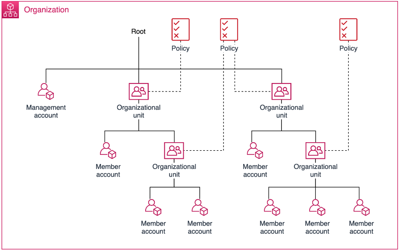

# Managing organizational units (OUs) with AWS Organizations

You can use organizational units (OUs) to group accounts together to administer as a
single unit. This greatly simplifies the management of your accounts. For example, you can attach a
policy-based control to an OU, and all accounts within the OU automatically inherit the
policy. You can create multiple OUs within a single organization, and you can
create OUs within other OUs. Each OU can contain multiple accounts, and you can move
accounts from one OU to another. However, OU names must be unique within a parent OU or
root.

The following diagram shows an organization that consists of seven accounts that are
organized into four OUs under the root. The organization also has a few policies that are applied to
OUs.

###### Note

There is one root in the organization, which AWS Organizations creates for you when you first
set up your organization.

###### Topics

- [Best practices for OUs](orgs_manage_ous_best_practices.md "orgs_manage_ous_best_practices.md")
- [Navigating the root and tree](navigate_tree.md "navigate_tree.md")
- [Viewing details of an OU](orgs_view_ou.md "orgs_view_ou.md")
- [Creating an OU](create_ou.md "create_ou.md")
- [Renaming an OU](rename_ou.md "rename_ou.md")
- [Tagging an OU](tag_ou.md "tag_ou.md")
- [Moving accounts between OUs](move_account_to_ou.md "move_account_to_ou.md")
- [Viewing details of the root](orgs_view_root.md "orgs_view_root.md")
- [Deleting an OU](delete-ou.md "delete-ou.md")
