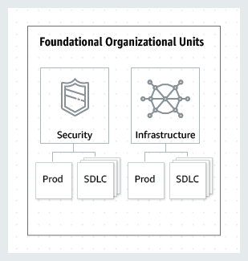
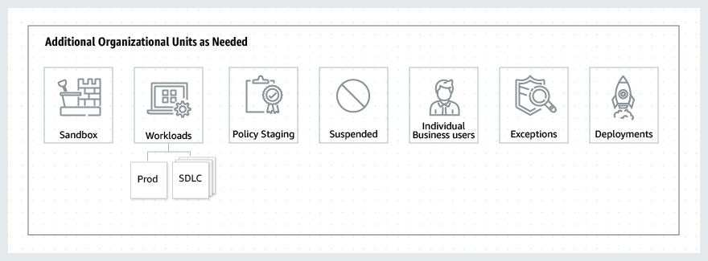
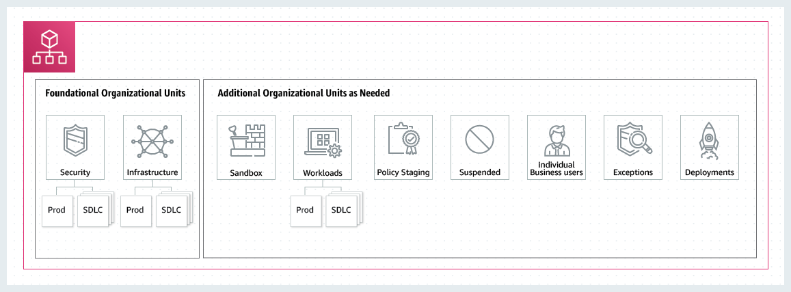

# Best practices for managing organizational units (OUs) with AWS Organizations

Follow these recommendations to help walk you through managing a multi-account environment in AWS Organizations using organization units (OUs).

###### Topics

- [Understanding AWS Organizations](#ous_best_practices_intro "#ous_best_practices_intro")
- [Recommended foundational OUs](#ous_best_practices_foundational "#ous_best_practices_foundational")
- [Recommended additional OUs](#ous_best_practices_recommended "#ous_best_practices_recommended")
- [Conclusion](#ous_best_practices_conclusion "#ous_best_practices_conclusion")

## Understanding AWS Organizations

The basis of a well-architected multi-account AWS environment is AWS Organizations,
which enables you to centrally manage and govern multiple accounts. An organizational unit (OU) is a logical grouping of accounts in an organization.
OUs enable you to organize your accounts into a hierarchy, and help you apply management controls. Organizations [policies](orgs_manage_policies.md "orgs_manage_policies.md") define the controls that you can apply to a group of AWS accounts.
For example, a [service control policy](orgs_manage_policies_scps.md "orgs_manage_policies_scps.md") (SCP) is a policy that defines the AWS service actions, such as Amazon EC2 Run Instance, that accounts in your organization can perform.

While you might begin your AWS journey with a single account, AWS recommends that you set up multiple accounts as your workloads grow in size and complexity. Using a multi-account environment is an AWS best practice that can offer several benefits:

- **Rapid innovation with various requirements**: You can allocate AWS accounts to different teams, projects, or products within your company to help ensure that each of them can rapidly innovate while allowing for their own security requirements.
- **Simplified billing**: Using multiple AWS accounts can simplify how you allocate your AWS cost by helping identify which product or service line is responsible for an AWS charge.
- **Flexible security controls**: You can use multiple AWS accounts to isolate workloads or applications that have specific security requirements, or need to meet strict guidelines for compliance such as HIPAA or PCI.
- **Adapt to business processes**: You can organize multiple AWS accounts in a manner that best reflects the diverse needs of your company's business processes that have different operational, regulatory, and budgetary requirements.

## Recommended foundational organizational unit (OUs)

Your organizational unit (OUs) should be based on function or common set of controls instead of mirroring your company’s reporting structure.
AWS recommends that you start with security and infrastructure in mind. Most businesses have centralized teams that serve the entire organization for those needs. We recommend creating a set of foundational OUs for these specific functions:

- **Security**: Used for security services. Create accounts for log archives, security read-only access, security tooling, and break-glass.
- **Infrastructure**: Used for shared infrastructure services such as networking and IT services. Create accounts for each type of infrastructure service you require.

Given that most companies have different policy requirements for production workloads,
infrastructure and security can have nested OUs for _non-production_ (SDLC) and _production_ (Prod).
Accounts in the SDLC OU host non-production workloads and should not have production dependencies from other accounts.
If there are variations in OU policies between life cycle stages, SDLC can be split into multiple OUs (for example, development and pre-prod). Accounts in the Prod OU host the production workloads.

Apply policies at the OU-level to govern the Prod and SDLC environment according to your requirements.
In general, applying policies at the OU-level is a better practice than at the individual account-level as it simplifies policy management and any potential troubleshooting.

The following diagram shows the foundational OUs (Prod and SDLC) for security and infrastructure:

## Recommended additional organizational unit (OUs)

After the central services are in place, we recommend creating OUs that directly relate to building or running your products or services. Many AWS customers build the following OUs after establishing a foundation:

- **Sandbox**: Holds AWS accounts that individual developers can use to experiment with AWS services. Ensure that these accounts can be detached from internal networks.
- **Workloads**: Contains AWS accounts that host your external-facing application services. You should structure OUs under SDLC and Prod environments (similar to the foundational OUs) in order to isolate and tightly control production workloads.

We also recommend adding additional OUs for maintenance and continued expansion depending on your specific needs. The following are some common themes based on practices from existing AWS customers:

- **Policy Staging**: Holds AWS accounts where you can test proposed policy changes before applying them broadly to the organization. Start by implementing changes at the account level in the intended OU, and slowly work out into other accounts, OUs, and across the rest of the organization.
- **Suspended**: Contains AWS accounts that have been closed and are waiting to be deleted from the organization. Attach an SCP to this OU that denies all actions. Ensure that the accounts are tagged with details for traceability if they need to be restored.
- **Individual Business Users**: A limited access OU that contains AWS accounts for business users (not developers) who might need to create business productivity-related applications, for example set up an S3 bucket to share reports or files with a partner.
- **Exceptions**: Holds AWS accounts used for business use-cases that have highly customized security or auditing requirements,
  different from those defined in the Workloads OU. For example, setting up an AWS account specifically for a confidential new application or feature.
  Use SCPs at the account level to meet customized needs. Consider setting up a Detect and React system using [Amazon EventBridge](../../../eventbridge/latest/userguide/eb-what-is.md "../../../eventbridge/latest/userguide/eb-what-is.md") and [AWS Config rules](../../../config/latest/developerguide/evaluate-config.md "../../../config/latest/developerguide/evaluate-config.md").
- **Deployments**: Contains AWS accounts meant for continuous integration and continuous delivery/deployment (CI/CD deployments). You can create this OU if you have a different governance and operational model
  for CI/CD deployments as compared to accounts in the Workloads OUs (Prod and SDLC). Distribution of CI/CD helps reduce the organizational dependency
  on a shared CI/CD environment operated by a central team. For each set of SDLC/Prod AWS accounts for an application in the Workloads OU, create an account for CI/CD under Deployments OU.
- **Transitional**: This is used as a temporary holding area for existing accounts and workloads before moving them to standard areas of your organization.
  This might be because accounts are part of an acquisition, previously managed by a third party, or legacy accounts from an old organization structure.

The following diagram shows additional OUs for sandbox, workloads, policy staging, suspended, individual business users, exceptions, deployments, and transitional accounts:

## Conclusion

A well-architected multi-account strategy can help you innovate in AWS, while helping to ensure that you meet your security and scalability needs. The framework described in this topic represents AWS best practices that you should use as a starting point for your AWS journey.

The following diagram shows recommended foundational OUs and additional OUs:

