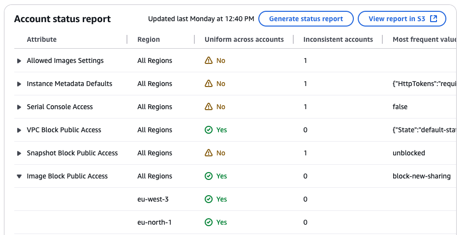

# EC2 policies

EC2 policies allow you to centrally declare and enforce desired configurations for
Amazon EC2, Amazon VPC, and Amazon EBS at scale across an organization. Once attached, the configuration
is always maintained when the service adds new features or APIs.

###### Topics

- [Custom error messages](#orgs_manage_policies_ec2-custom-message "#orgs_manage_policies_ec2-custom-message")
- [Account status report](#orgs_manage_policies_ec2-account-status-report "#orgs_manage_policies_ec2-account-status-report")
- [Supported attributes](#orgs_manage_policies_ec2-supported-controls "#orgs_manage_policies_ec2-supported-controls")
- [Getting started](orgs_manage_policies-ec2_getting-started.md "orgs_manage_policies-ec2_getting-started.md")
- [Best practices](orgs_manage_policies_ec2_best-practices.md "orgs_manage_policies_ec2_best-practices.md")
- [Generating the account status report](orgs_manage_policies_ec2_status-report.md "orgs_manage_policies_ec2_status-report.md")
- [EC2 policy syntax and examples](orgs_manage_policies_ec2_syntax.md "orgs_manage_policies_ec2_syntax.md")

## Custom error messages for EC2 policies

EC2 policies allow you to create custom error messages. For example, if an API
operation fails due to an EC2 policy, you can set the error message or provide a
custom URL, such as a link to an internal wiki or a link to a message that describes the
failure. If you do not specify a custom error message, AWS Organizations provides the following
default error message: `Example: This action is denied due to an organizational
 policy in effect`.

You can also audit the process of creating EC2 policies, updating EC2
policies, and deleting EC2 policies with AWS CloudTrail. CloudTrail can flag API operation
failures due to EC2 policies. For more information, see [Logging
and monitoring](orgs_security_incident-response.md "orgs_security_incident-response.md").

###### Important

Do not include _personally identifiable information (PII)_ or
other sensitive information in a custom error message. PII includes general
information that can be used to identify or locate an individual. It covers records
such as financial, medical, educational, or employment. PII examples include
addresses, bank account numbers, and phone numbers.

## Account status report for EC2 policies

The _account status report_ allows you to review the current status
of all attributes supported by EC2 policies for the accounts in scope. You can
choose the accounts and organizational units (OUs) to include in the report scope, or
choose an entire organization by selecting the root.

This report helps you assess readiness by providing a Region breakdown and if the
current state of an attribute is _uniform across accounts_ (through
the `numberOfMatchedAccounts`) or _inconsistent_ (through
the `numberOfUnmatchedAccounts`). You can also see the _most
frequent value_, which is the configuration value that is most frequently
observed for the attribute.

In Figure 1, there is a generated account status report, which shows uniformity across
accounts for the following attributes: VPC Block Public Access and Image Block Public
Access. This means that, for each attribute, all the accounts in scope have the same
configuration for that attribute.

The generated account status report shows inconsistent accounts for the following
attributes: Allowed Images Settings, Instance Metadata defaults, Serial Console Access,
and Snapshot Block Public Access. In this example, each attribute with an inconsistent
account is due to there being one account with a different configuration value.

If there is a most frequent value, that is displayed in its respective column. For
more detailed information of what each attribute controls, see [EC2 policy syntax and
example policies](orgs_manage_policies_ec2_syntax.md "orgs_manage_policies_ec2_syntax.md").

You can also expand an attribute to see a Region breakdown. In this example, Image
Block Public Access is expanded and in each Region, you can see that there is also
uniformity across accounts.

The choice to attach an EC2 policy for enforcing a baseline configuration
depends on your specific use case. Use the account status report to help you assess your
readiness before attaching an EC2 policy.

For more information, see [Generating the account
status report](orgs_manage_policies_ec2_status-report.md "orgs_manage_policies_ec2_status-report.md").

_Figure 1: Example account status report with uniformity across accounts for
VPC Block Public Access and Image Block Public Access._

## Supported attributes for EC2 policies

The following table displays the attributes supported for Amazon EC2 related
services.

EC2 policies| AWS service | Attribute | Policy effect | Policy contents | More information |
| --- | --- | --- | --- | --- |
| Amazon VPC | VPC Block Public Access | Controls if resources in Amazon VPCs and subnets can reach the internet through internet gateways (IGWs). | [View policy](orgs_manage_policies_ec2_syntax.md#ec2-policy-vpc-block-public-access "orgs_manage_policies_ec2_syntax.md#ec2-policy-vpc-block-public-access") | For more information, see [Block public access to VPCs and subnets](../../../vpc/latest/userguide/security-vpc-bpa.md "../../../vpc/latest/userguide/security-vpc-bpa.md") in the _Amazon VPC User Guide_. |
| VPC Encryption Controls | Controls whether Amazon VPC encryption controls are enabled and its mode (off, monitor, enforce), enforcing encryption in transit within and between VPCs in a Region. | [View policy](orgs_manage_policies_ec2_syntax.md#ec2-policy-vpc-encryption-settings "orgs_manage_policies_ec2_syntax.md#ec2-policy-vpc-encryption-settings") | For more information, see [VPC Encryption Controls](../../../vpc/latest/userguide/vpc-encryption-controls.md "../../../vpc/latest/userguide/vpc-encryption-controls.md") in the _Amazon VPC User Guide_. |
| Amazon EC2 | Serial Console Access | Controls if the EC2 serial console is accessible. | [View policy](orgs_manage_policies_ec2_syntax.md#ec2-policy-ec2-serial-console-access "orgs_manage_policies_ec2_syntax.md#ec2-policy-ec2-serial-console-access") | For more information, see [Configure access to the EC2 Serial Console](../../../AWSEC2/latest/UserGuide/configure-access-to-serial-console.md "../../../AWSEC2/latest/UserGuide/configure-access-to-serial-console.md") in the _Amazon Elastic Compute Cloud User Guide_. |
| Image Block Public Access | Controls if Amazon Machine Images (AMIs) are publicly sharable. | [View policy](orgs_manage_policies_ec2_syntax.md#ec2-policy-ec2-ami-block-public-access "orgs_manage_policies_ec2_syntax.md#ec2-policy-ec2-ami-block-public-access") | For more information, see [Understand block public access for AMIs](../../../AWSEC2/latest/UserGuide/block-public-access-to-amis.md "../../../AWSEC2/latest/UserGuide/block-public-access-to-amis.md") in the _Amazon Elastic Compute Cloud User Guide_. |
| Allowed Images Settings | Controls the discovery and use of Amazon Machine Images (AMI) in Amazon EC2 with Allowed AMIs. | [View policy](orgs_manage_policies_ec2_syntax.md#ec2-policy-ec2-ami-allowed-images "orgs_manage_policies_ec2_syntax.md#ec2-policy-ec2-ami-allowed-images") | For more information, see [Amazon Machine Images (AMIs)](../../../AWSEC2/latest/UserGuide/ec2-allowed-amis.md "../../../AWSEC2/latest/UserGuide/ec2-allowed-amis.md") in the _Amazon Elastic Compute Cloud User Guide_. |
| Instance Metadata Defaults | Controls IMDS defaults for all new EC2 instances launches. | [View policy](orgs_manage_policies_ec2_syntax.md#ec2-policy-default-imds-version "orgs_manage_policies_ec2_syntax.md#ec2-policy-default-imds-version") | For more information, see [Configure instance metadata options for new instances](../../../AWSEC2/latest/UserGuide/configuring-IMDS-new-instances.md "../../../AWSEC2/latest/UserGuide/configuring-IMDS-new-instances.md") in the _Amazon Elastic Compute Cloud User Guide_. |
| Amazon EBS | Snapshot Block Public Access | Controls if Amazon EBS snapshots are publicly accessible. | [View policy](orgs_manage_policies_ec2_syntax.md#ec2-policy-vpc-eb2-snapshots-block-public-access "orgs_manage_policies_ec2_syntax.md#ec2-policy-vpc-eb2-snapshots-block-public-access") | For more information, see [Block public access for Amazon EBS snapshots](../../../ebs/latest/userguide/block-public-access-snapshots.md "../../../ebs/latest/userguide/block-public-access-snapshots.md") in the _Amazon Elastic Block Store User Guide_. |
