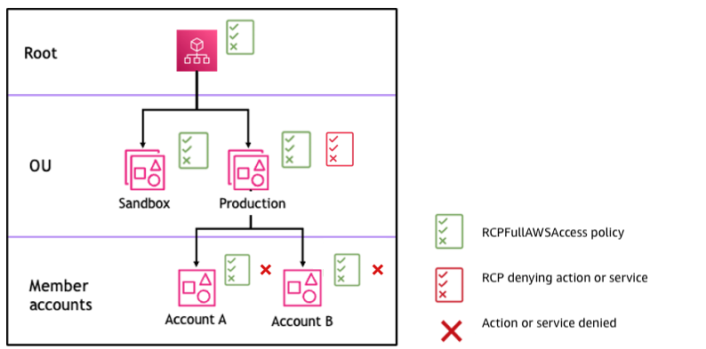

# RCP evaluation

###### Note

The information in this section does **_not_** apply to management policy types, including backup policies, tag policies, chat applications policies, or AI
services opt-out policies. For more information, see
[Understanding management policy
inheritance](orgs_manage_policies_inheritance_mgmt.md "orgs_manage_policies_inheritance_mgmt.md").

As you can attach multiple resource control policies (RCPs) at different levels in
AWS Organizations, understanding how RCPs are evaluated can help you write RCPs that yield the right
outcome.

## Strategy for using RCPs

The `RCPFullAWSAccess` policy is an AWS managed policy. It is automatically attached to the organization root, every OU, and
every account in your organization,
when you enable resource control policies (RCPs). You cannot detach this policy.
This default RCP allows all principals and actions
access to pass through RCP evaluation, meaning until you start creating and attaching RCPs,
all your existing IAM permissions continue to operate as they did. This AWS managed policy does not grant access.

You can make use of `Deny` statements to block access to resources in your
organization. For a permission to be **denied** for a resource in a
specific account, **any RCP** from the root through each OU
in the direct path to the account (including the target account itself) can deny that
permission.

`Deny` statements are a powerful way to implement restrictions
that should be true for a broader part of your organization.
For example, you can attach a policy to help prevent identities external
to your organization from accessing your resources root level, and that will be effective for all accounts in the organization.
AWS strongly recommends that you don't attach RCPs to the root of your organization without thoroughly testing the impact that the policy has on resources in your accounts.
For more information, see [Testing effects of RCPs](orgs_manage_policies_rcps.md#rcp-warning-testing-effect "orgs_manage_policies_rcps.md#rcp-warning-testing-effect").

In Figure 1, there is an RCP attached to the Production OU that has an
explicit `Deny` statement specified for a given service. As a result, both Account A and Account B will
be denied access to the service as a deny policy attached to any level in the
organization is evaluated for all the OUs and member accounts underneath it.

_Figure 1: Example organization structure with an `Deny` statement
attached at Production OU and its impact on Account A and Account B_
