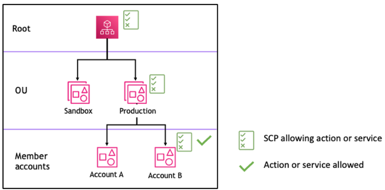
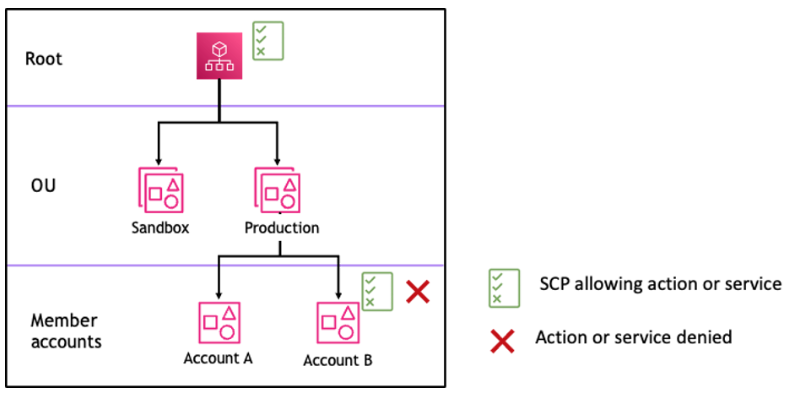
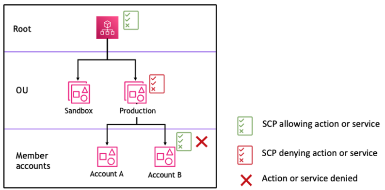
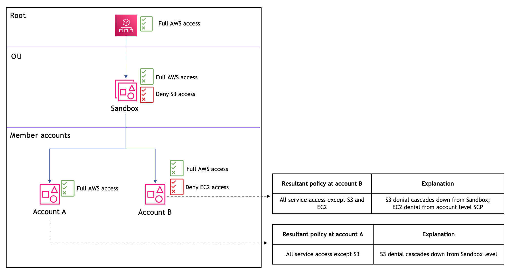
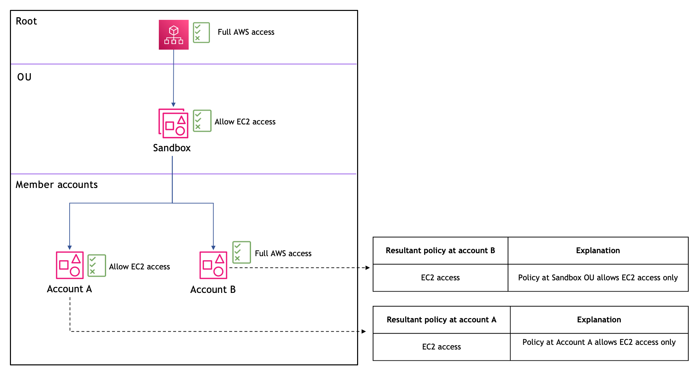
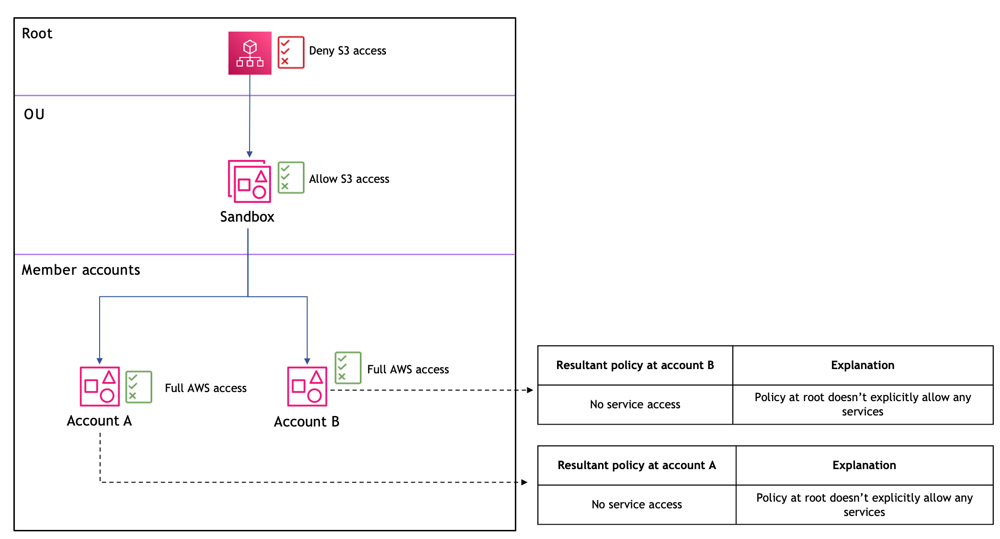
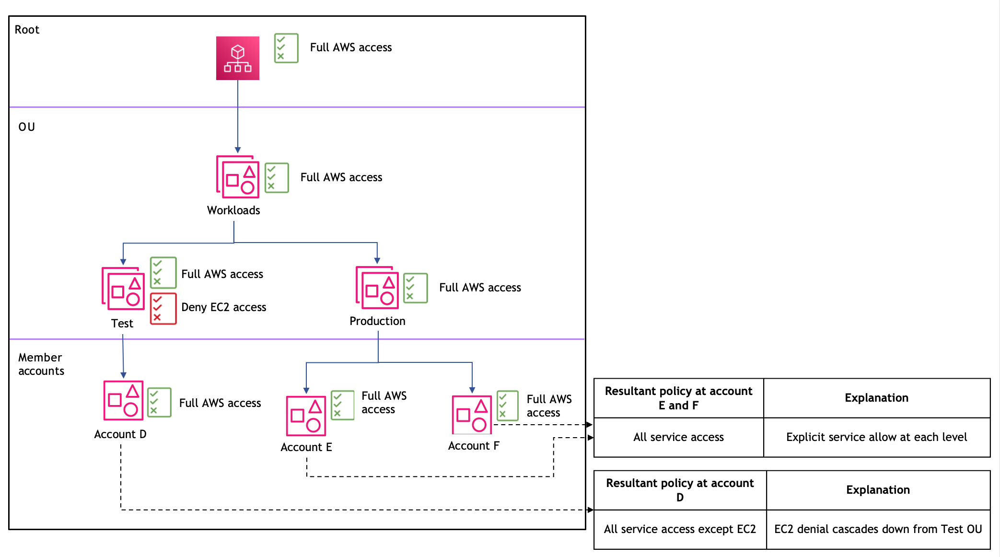
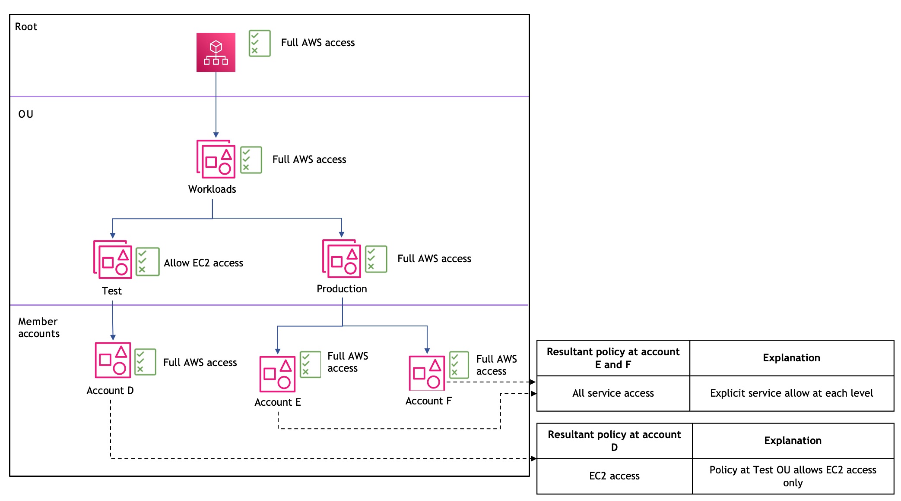
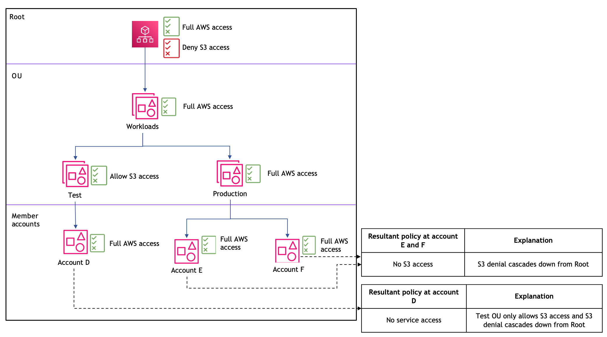

# SCP evaluation

###### Note

The information in this section does **_not_** apply to management policy types, including backup
policies, tag policies, chat applications policies, or AI services opt-out policies. For more
information, see [Understanding management policy
inheritance](orgs_manage_policies_inheritance_mgmt.md "orgs_manage_policies_inheritance_mgmt.md").

As you can attach multiple service control policies (SCPs) at different levels in
AWS Organizations, understanding how SCPs are evaluated can help you write SCPs that yield the right
outcome.

###### Topics

- [How SCPs work with Allow](#how_scps_allow "#how_scps_allow")
- [How SCPs work with Deny](#how_scps_deny "#how_scps_deny")
- [Strategy for using SCPs](#strategy_using_scps "#strategy_using_scps")

## How SCPs work with Allow

For a permission to be **allowed** for a specific
account, there must be an **explicit `Allow`
statement** at every level from the root through each OU in the direct path
to the account (including the target account itself). This is why when you enable SCPs,
AWS Organizations attaches an AWS managed SCP policy named [FullAWSAccess](https://console.aws.amazon.com/organizations/v2/home/policies/service-control-policy/p-FullAWSAccess "https://console.aws.amazon.com/organizations/v2/home/policies/service-control-policy/p-FullAWSAccess") which allows all services and actions. If this policy is
removed and not replaced at any level of the organization, all OUs and accounts under
that level would be blocked from taking any actions.

For example, let's walk through the scenario shown in figures 1 and 2. For a
permission or a service to be allowed at Account B, a SCP that allows the permission or
service should be attached to Root, the Production OU, and to Account B itself.

SCP evaluation follows a deny-by-default model, meaning that any permissions not
explicitly allowed in the SCPs are denied. If an allow statement is not present in the
SCPs at any of the levels such as Root, Production OU or Account B, the access is
denied.



_Figure 1: Example organization structure with an `Allow`
statement attached at Root, Production OU and Account B_



_Figure 2: Example organization structure with an `Allow`
statement missing at Production OU and its impact on Account B_

## How SCPs work with Deny

For a permission to be **denied** for a specific account,
**any SCP** from the root through each OU in the direct
path to the account (including the target account itself) can deny that
permission.

For example, let’s say there is an SCP attached to the Production OU that has an
explicit `Deny` statement specified for a given service. There also happens
to be another SCP attached to Root and to Account B that explicitly allows access to
that same service, as shown in Figure 3. As a result, both Account A and Account B will
be denied access to the service as a deny policy attached to any level in the
organization is evaluated for all the OUs and member accounts underneath it.



_Figure 3: Example organization structure with an `Deny` statement
attached at Production OU and its impact on Account B_

## Strategy for using SCPs

While writing SCPs you can make use of a combination of `Allow` and
`Deny` statements to allow intended actions and services in your
organization. `Deny` statements are a powerful way to implement restrictions
that should be true for a broader part of your organization or OUs because when they are
applied at the root or the OU-level they affect all the accounts under it.

For example, you can implement a policy using `Deny` statements to [Prevent member accounts from leaving the
organization](orgs_manage_policies_scps_examples_general.md#example-scp-leave-org "orgs_manage_policies_scps_examples_general.md#example-scp-leave-org") at the
root-level, which will be effective for all the accounts in the organization. Deny
statements also support condition element which can be helpful to create
exceptions.

###### Tip

You can use [service
last accessed data](../../../IAM/latest/UserGuide/access_policies_access-advisor.md "../../../IAM/latest/UserGuide/access_policies_access-advisor.md") in [IAM](../../../IAM/latest/UserGuide/introduction.md "../../../IAM/latest/UserGuide/introduction.md") to update your SCPs to restrict access to only the AWS services
that you need. For more information, see [Viewing
Organizations Service Last Accessed Data for Organizations](../../../IAM/latest/UserGuide/access_policies_access-advisor-view-data-orgs.md "../../../IAM/latest/UserGuide/access_policies_access-advisor-view-data-orgs.md") in the
_IAM User Guide._

AWS Organizations attaches an AWS managed SCP named [**FullAWSAccess**](https://console.aws.amazon.com/organizations/v2/home/policies/service-control-policy/p-FullAWSAccess "https://console.aws.amazon.com/organizations/v2/home/policies/service-control-policy/p-FullAWSAccess") to every root, OU and account when
it's created. This policy allows all services and actions. You can replace
**FullAWSAccess** with a policy allowing only a set of services so
that new AWS services are not allowed unless they are explicitly allowed by updating
SCPs. For example, if your organization wants to only allow the use of a subset of
services in your environment, you can use an `Allow` statement to only allow
specific services.

JSON

```
`{
"Version":"2012-10-17",
 "Statement": [
 {
 "Effect": "Allow",
 "Action": [
 "ec2:*",
 "cloudwatch:*",
 "organizations:*"
 ],
 "Resource": "*"
 }
 ]
}`

```

A policy combining the two statements might look like the following example, which
prevents member accounts from leaving the organization and allows use of desired AWS
services. The organization administrator can detach the
**FullAWSAccess** policy and attach this one instead.

JSON

```
`{
 "Version":"2012-10-17",
 "Statement": [
 {
 "Effect": "Allow",
 "Action": [
 "ec2:*",
 "cloudwatch:*",
 "organizations:*"
 ],
 "Resource": "*"
 },
 {
 "Effect": "Deny",
 "Action":"organizations:LeaveOrganization",
 "Resource": "*"
 }
 ]
}`

```

To demonstrate how multiple service control policies (SCPs) can be applied in an AWS
Organization, consider the following organizational structure and scenarios.

### Scenario 1: Impact of Deny policies

This scenario demonstrates how deny policies at higher levels in the organization
impact all accounts below. When the Sandbox OU has both "Full AWS access" and
"Deny S3 access" policies, and Account B has a "Deny EC2 access" policy, the result
is that Account B cannot access S3 (from the OU-level deny) and EC2 (from its
account-level deny). Account A does not have S3 access (from the OU-level
deny).



### Scenario 2: Allow policies must exist at every

level

This scenario shows how allow policies work in SCPs. For a service to be
accessible, there must be an explicit allow at every level from the root down to the
account. Here, as the Sandbox OU has an "Allow EC2 access" policy, which only
explicitly allows EC2 service access, Account A and B will only have EC2
access.



### Scenario 3: Impact of missing an Allow statement at

the root-level

Missing an "Allow" statement at the root-level in an SCP is a critical
misconfiguration that will effectively block all access to AWS services and
actions for all member accounts in your organization.



### Scenario 4: Layered Deny statements and resulting

permissions

This scenario demonstrates a two-level deep OU structure. Both the Root and the
Workloads OU have "Full AWS access", the Test OU has "Full AWS access" with
"Deny EC2 access", and the Production OU has "Full AWS access". As a result,
Account D has all service access except EC2 and Account E and F have all service
access.



### Scenario 5: Allow policies at the OU-level to

restrict service access

This scenario shows how allow policies can be used to restrict access to specific
services. The Test OU has an "Allow EC2 access" policy, which means only EC2
services are permitted for Account D. The Production OU maintains "Full AWS
access", so Accounts E and F have access to all services. This demonstrates how more
restrictive allow policies can be implemented at the OU-level while maintaining a
broader allow at the root-level.



### Scenario 6: Root-level deny affects all accounts

regardless of lower-level allows

This scenario demonstrates that a deny policy at the root-level affects all
accounts in the organization, regardless of allow policies at lower levels. The root
has both "Full AWS access" and "Deny S3 access" policies. Even though the Test OU
has an "Allow S3 access" policy, the root-level S3 deny takes precedence. Account D
has no service access because the Test OU only allows S3 access, but S3 is denied at
the root-level. Accounts E and F can access other services except for S3 because of
the explicit deny at the root-level.


