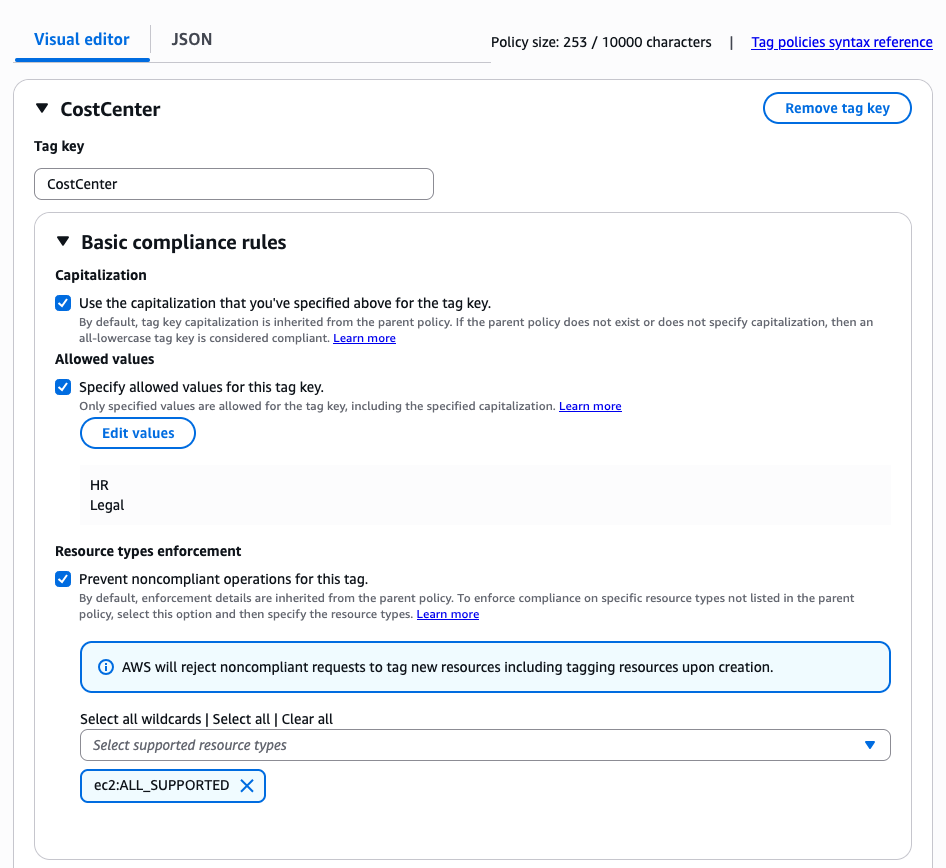

# Enforce tagging consistency

Tag policies provide two capabilities to help you enforce tagging consistency across your AWS environments: "Basic compliance rules" and "Required tag key". You can use these capabilities with two tag policy modes: enforcement and reporting. This section highlights enforcement mode for both capabilities. For details on reporting mode for both capabilities, see "Reporting tagging compliance".

###### Topics

- [Enforce for "Basic compliance rules"](#basic-compliance-rules "#basic-compliance-rules")
- [Best practices](#best-practices "#best-practices")
- [Enforce "Required tag key" with IaC](enforce-required-tag-keys-iac.md "enforce-required-tag-keys-iac.md")
- [Tag policy syntax and
  examples](orgs_manage_policies_example-tag-policies.md "orgs_manage_policies_example-tag-policies.md")

## Enforce for "Basic compliance rules"

With enforcement for basic compliance rules, you can prevent resource creation with tag values that do not meet the requirements specified in your tag policy. For example, you can define a policy that blocks Amazon EC2 create operations if the supplied 'CostCenter' tag key does not have a tag value of "Business" or "Legal". Basic compliance rules also allow you to apply enforcement based on capitalization of tag keys. Enabling capitalization ensures that tag keys are an exact string match. Capitalization treats "CostCenter", "costCenter", and "Costcenter" as unique tag keys, meaning tag key enforcement is case sensitive. Capitalization enforcement prevents teams from accidentally creating tag variations. Tagging consistency is critical for both cost tracking accuracy and attribute-based access control (ABAC) security policies that rely on precise tag matching to grant or deny resource access.

###### Important

Basic compliance rules do not enforce tag compliance on resources that are created without tags. This capability does not enforce missing tag keys. You cannot use this capability to ensure that required or mandatory tag keys are configured at resource creation. Use reporting mode in "Required tag keys" to enforce required tag keys for resources created by IaC tools such as CloudFormation, Terraform, and Pulumi. Use SCPs to prevent IAM users and roles in target accounts from creating certain resource types if the request doesn't include the specified tags. Find sample SCPs for tagging enforcement in our
[Example SCPs for tagging
resources](orgs_manage_policies_scps_examples_tagging.md "orgs_manage_policies_scps_examples_tagging.md").

To enforce basic compliance rules with tag policies, do one of the following when you
[create a tag policy](orgs_policies_create.md "orgs_policies_create.md"):

- From the
  **Visual editor** tab, select the option
  **Prevent noncompliant operations for this tag**. See
  [Create a tag policy](orgs_policies_create.md "orgs_policies_create.md") section for steps on how to author and attach a tag policy.
- From the
  **JSON** tab, use the
  `enforced_for` field. For information on tag policy syntax, see
  [Tag policy syntax and
  examples](orgs_manage_policies_example-tag-policies.md "orgs_manage_policies_example-tag-policies.md").

The image below shows the console experience of the Visual editor tab. In this example, the customer is defining a tag policy that will enforce tag value validation only for Amazon EC2 resource types that are supported by tag policies. This policy will check if the tag value is either "Legal" or "HR" when the supplied tag key is "CostCenter" for Amazon EC2 resource types. This policy also enforces capitalization, which means that the policy is looking for an exact string match to the "CostCenter" tag key.



The JSON below is the generated tag policy from the above "CostCenter" example.

###### Important

We recommend that you use the Visual editor when you are defining your tag policy for the first time. The Visual editor ensures that your tag policy syntax is valid, with no additional steps, and gives you a simplified clickable experience to define your tag policy. You can use either the Visual editor or JSON tab to define your tag policy.

```
{
    "tags": {
        "CostCenter": {
            "tag_key": {
                "@@assign": "CostCenter"
            },
            "tag_value": {
                "@@assign": [
                    "HR",
                    "Legal"
                ]
            },
            "enforced_for": {
                "@@assign": [
                    "ec2:ALL_SUPPORTED"
                ]
            }
        }
    }
}
```

## Best practices

Follow these best practices for enforcement with "Basic compliance rules" and "Required tag keys for IaC" with tag policies:

- **Use caution when enforcing compliance** – Make sure you understand the effects of using tag policies and follow the recommended workflows described in
  [Getting started with tag
  policies](orgs_manage_policies_tag-policies-getting-started.md "orgs_manage_policies_tag-policies-getting-started.md"). Test how enforcement works on a test account before expanding it to more accounts or organizational units. Otherwise, you could prevent users in your organization's accounts from creating the resources they need.
- **Be aware of what resource types you can enforce on** – You can only enforce compliance with tag policies on
  [supported resource types](orgs_manage_policies_supported-resources-enforcement.md "orgs_manage_policies_supported-resources-enforcement.md"). Resource types that support enforcing compliance are listed when you use the visual editor to build a tag policy.
- **Understand interactions with some services** – Some AWS services have container-like groupings of resources that automatically create resources for you and propagate tags from a resource in one service to another. For example, tags on Amazon EC2 groups and Amazon EMR clusters can automatically propagate to the contained Amazon EC2 instances. You may have tag policies for Amazon EC2 that are more strict than for groups or Amazon EMR clusters. If you enable enforcement, the tag policy prevents resources from being tagged and may block dynamic scaling and provisioning.

The following sections show how you can find non-compliant resources, and correct them to be compliant.

###### Topics

- [Identify and remediate tagging inconsistencies](orgs_manage_policies_tag-policies-identify-remediate.md "orgs_manage_policies_tag-policies-identify-remediate.md")
