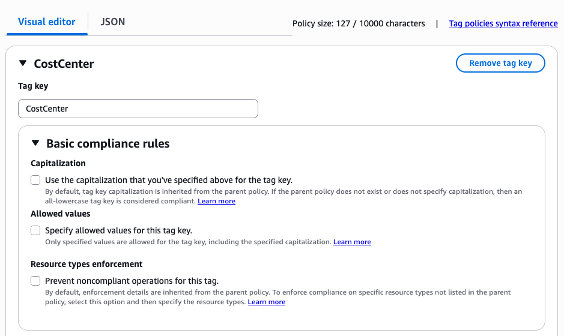
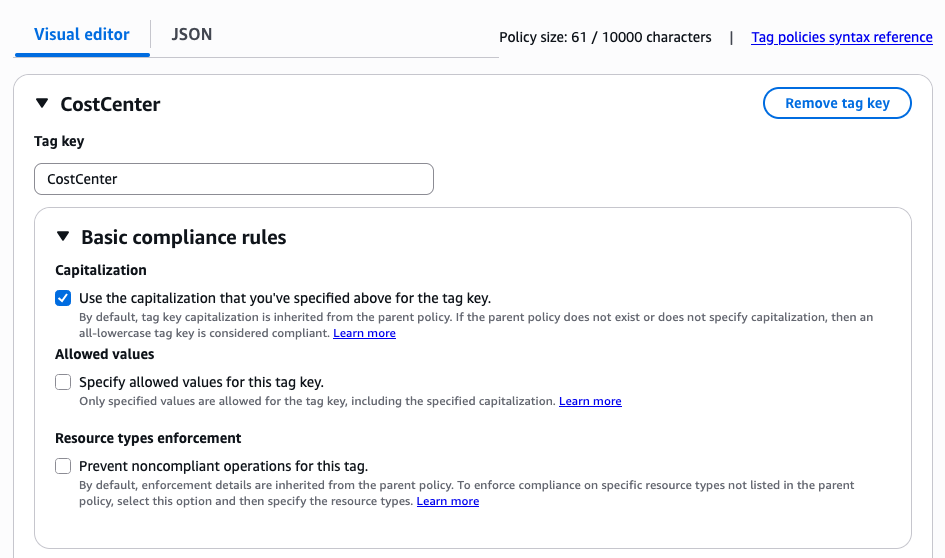
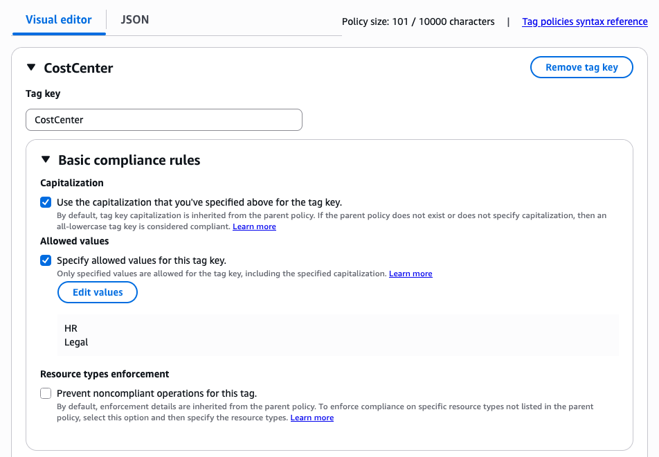
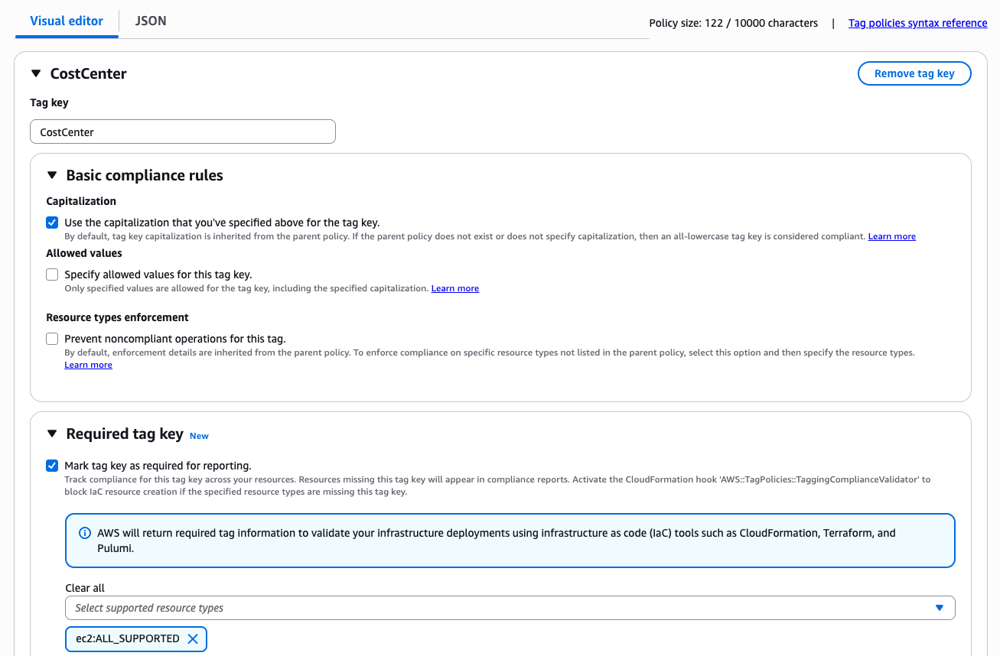

# Report tagging compliance

Tag policies provide reporting mode for "Basic compliance rules" and "Required tag key". You can use this mode to evaluate the compliance of an account in your organization with its effective tag policy. The generated report includes only resources that have had at least one user-defined tag at any point in their lifecycle.

###### Important

Untagged resources don't appear as non-compliant in results.

To find untagged resources in your account, use AWS Resource Explorer with a query that uses `tag:none`. For more information, see [Search for untagged resources](../../../resource-explorer/latest/userguide/using-search-query-examples.md#example-1 "../../../resource-explorer/latest/userguide/using-search-query-examples.md#example-1") in the _AWS Resource Explorer User Guide_.

###### Topics

- [Reporting for "Basic compliance rules"](#reporting-basic-compliance-rules "#reporting-basic-compliance-rules")
- [Reporting for "Required tag key"](#reporting-required-tag-key "#reporting-required-tag-key")
- [Generating an organization-wide compliance report](enforcement-report.md "enforcement-report.md")

## Reporting for "Basic compliance rules"

With reporting for basic compliance rules, you can generate a tagging compliance report that checks for compliance against capitalization and allowed tag values.

**To report,**

From the Visual editor tab, enter the value for the tag key that you want to report compliance against. The screenshot below shows a customer compliance report for the "CostCenter" tag key. In this example, the report will highlight a tagged resource as compliant if it matches only a lowercase value of the "CostCenter" tag key, meaning the string is equal to "costcenter".



The JSON below generates a compliance report for resources against a lowercase value of the "CostCenter" tag key.

```
{
    "tags": {
        "CostCenter": {}
    }
}
```

**To report on capitalization,**

From the Visual editor tab, enter the value for the tag key that you want to report compliance against, and select the Capitalization option. The screenshot below shows a customer compliance report for the "CostCenter" tag key with capitalization. In this example, the report will highlight a tagged resource as compliant if it is an exact string match to the "CostCenter" tag key.



The JSON below generates a compliance report for resources against the "CostCenter" tag key with capitalization.

```
{
    "tags": {
        "CostCenter": {
            "tag_key": {
                "@@assign": "CostCenter"
            }
        }
    }
}
```

**To report on allowed tag values with capitalization,**

From the Visual editor tab, enter the value for the tag key that you want to report compliance against, select the Allowed values option, and enter values for allowed tag values. The screenshot below shows a customer compliance report for the "CostCenter" tag key with capitalization and allowed tag values. In this example, the report will highlight a tagged resource as compliant if it is an exact string match to the "CostCenter" tag key, and the tag value is either "HR" or "Legal".



The JSON below generates a compliance report for resources against the "CostCenter" tag key with capitalization and allowed tag values "HR" and "Legal".

```
{
    "tags": {
        "CostCenter": {
            "tag_key": {
                "@@assign": "CostCenter"
            },
            "tag_value": {
                "@@assign": [
                    "HR",
                    "Legal"
                ]
            }
        }
    }
}
```

## Reporting for "Required tag key"

With reporting for required tag keys, you can evaluate whether your resource creation operation is missing required or mandatory tag keys. Run the following command in your CLI to list required tag keys that are defined in the account's effective tag policy. You can use this information to manually verify that you are creating a resource with all required tags as defined by your account administrator.

```
$ aws resourcegroupstaggingapi list-required-tags
```

**To report required tag keys,**

From the Visual editor tab, enter the value for the tag key that you want to report compliance against, and select the **Mark tag as required for reporting** option. The screenshot below shows a customer compliance report for the "CostCenter" tag key with capitalization and reporting for required tag key. In this example, the report will highlight a tagged resource as compliant if it contains the exact string "CostCenter" as a tag key.

###### Important

You need to select both Capitalization and Mark tags as required for reporting options to generate a report of selected resource types that are missing the exact required tags. For example, you will use both of these options when you are trying to check for an exact match to the "CostCenter" tag key.

You can select only the Mark tags as required for reporting option to generate a report of selected resource types that are missing the required tags. In this scenario, the generated report will mark resources as compliant if they have "CostCenter", "costCenter", "Costcenter", "costcenter", or any similar variation. This feature allows you to generate compliance reports for selected resource types, instead of all tagged resources in your account.

Selecting only Capitalization will generate a report for ALL tagged resources, and mark those resources as non-compliant if the tag key does not have an exact string match.



The JSON below generates a compliance report for resources against the "CostCenter" tag key with capitalization and mark tag as required for reporting.

```
{
    "tags": {
        "CostCenter": {
            "tag_key": {
                "@@assign": "CostCenter"
            },
            "report_required_tag_for": {
                "@@assign": [
                    "ec2:ALL_SUPPORTED"
                ]
            }
        }
    }
}
```

**To enforce,**

You can use reporting with IaC tools such as CloudFormation, Terraform, and Pulumi to warn your developers or block deployments with missing required tags. You can now use one effective tag policy that works across CloudFormation, Terraform, and Pulumi. See [Enforce "Required tag key" with IaC](enforce-required-tag-keys-iac.md "enforce-required-tag-keys-iac.md") for more details.
