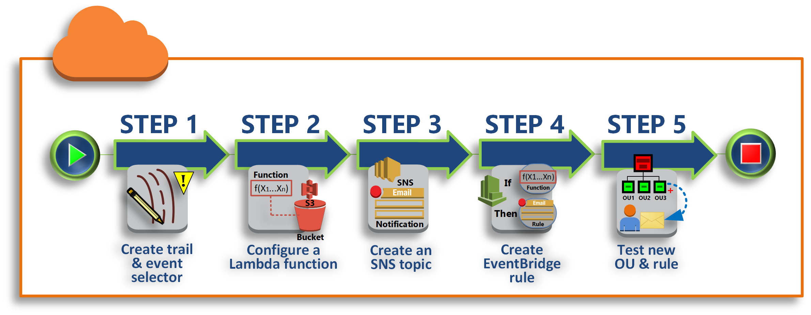
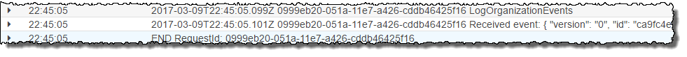

# Tutorial: Monitor important changes to your

organization with Amazon EventBridge

This tutorial shows how to configure Amazon EventBridge, formerly Amazon CloudWatch Events, to monitor your organization for changes.
You start by configuring a rule that is triggered when users invoke specific AWS Organizations
operations. Next, you configure Amazon EventBridge to run an AWS Lambda function when the rule is
triggered, and you configure Amazon SNS to send an email with details about the event.

The following illustration shows the main steps of the tutorial.



**[Step 1: Configure a trail and event
selector](#tutorial-cwe-step1 "#tutorial-cwe-step1")**

Create a log, called a _trail_, in AWS CloudTrail. You configure
it to capture all API calls.

**[Step 2: Configure a Lambda function](#tutorial-cwe-step2 "#tutorial-cwe-step2")**

Create an AWS Lambda function that logs details about the event to an S3
bucket.

**[Step 3: Create an Amazon SNS topic that sends emails to
subscribers](#tutorial-cwe-step3 "#tutorial-cwe-step3")**

Create an Amazon SNS topic that sends emails to its subscribers, and then subscribe
yourself to the topic.

**[Step 4: Create an Amazon EventBridge rule](#tutorial-cwe-step4 "#tutorial-cwe-step4")**

Create a rule that tells Amazon EventBridge to pass details of
specified API calls to the Lambda function and to SNS topic subscribers.

**[Step 5: Test your Amazon EventBridge rule](#tutorial-cwe-step5 "#tutorial-cwe-step5")**

Test your new rule by running one of the monitored operations. In this
tutorial, the monitored operation is creating an organizational unit (OU). You
view the log entry that the Lambda function creates, and you view the email that
Amazon SNS sends to subscribers.

###### Tip

You can also use this tutorial as a guide in configuring similar operations, such as
sending email notifications when account creation is complete. Because account creation
is an asynchronous operation, you're not notified by default when it completes. For more
information on using AWS CloudTrail and Amazon EventBridge with AWS Organizations, see [Logging and monitoring in AWS Organizations](orgs_security_incident-response.md "orgs_security_incident-response.md").

## Prerequisites

This tutorial assumes the following:

- You can sign in to the AWS Management Console as an IAM user from the management account
  in your organization. The IAM user must have permissions to create and
  configure a log in CloudTrail, a function in Lambda, a topic in Amazon SNS, and a rule in
  Amazon EventBridge. For more information about granting permissions, see [Access Management](../../../IAM/latest/UserGuide/access.md "../../../IAM/latest/UserGuide/access.md") in the _IAM User Guide_, or the guide for the service for
  which you want to configure access.
- You have access to an existing Amazon Simple Storage Service (Amazon S3) bucket (or you have permissions
  to create a bucket) to receive the CloudTrail log that you configure in step 1.

###### Important

Currently, AWS Organizations is hosted in only the US East (N. Virginia) Region (even though
it is available globally). To perform the steps in this tutorial, you must configure
the AWS Management Console to use that region.

## Step 1: Configure a trail and event

selector

In this step, you sign in to the management account and configure a log (called a
_trail_) in AWS CloudTrail. You also configure an event
selector on the trail to capture all read/write API calls so that Amazon EventBridge has calls to
trigger on.

###### To create a trail

1. Sign in to AWS as an administrator of the organization's management account
   and then open the CloudTrail console at [https://console.aws.amazon.com/cloudtrail/](https://console.aws.amazon.com/cloudtrail/ "https://console.aws.amazon.com/cloudtrail/").
2. On the navigation bar in the upper-right corner of the console, choose the
   **US East (N. Virginia)** Region. If you choose a different
   region, AWS Organizations doesn't appear as an option in the Amazon EventBridge configuration
   settings, and CloudTrail doesn't capture information about AWS Organizations.
3. In the navigation pane, choose **Trails**.
4. Choose **Create trail**.
5. For **Trail name**, enter
   `My-Test-Trail`.
6. Perform one of the following options to specify where CloudTrail is to deliver its
   logs:
   - If you need to create a bucket, choose **Create new S3 bucket** and then, for
     **Trail log bucket and folder**, enter a name for the new
     bucket.

   ###### Note

   S3 bucket names must be **_globally_** unique.
   - If you already have a bucket, choose
     **Use existing S3 bucket** and then choose the
     bucket name from the **S3 bucket** list.

7. Choose **Next**.
8. On the **Choose log events** page, in the **Management
   events** section, choose **Read** and
   **Write**.
9. Choose **Next**.
10. Review your selections and choose **Create trail**.

Amazon EventBridge enables you to choose from several different ways to send alerts when an
alarm rule matches an incoming API call. This tutorial demonstrates two methods:
invoking a Lambda function that can log the API call and sending information to an Amazon SNS
topic that sends an email or text message to the topic's subscribers. In the next two
steps, you create the components you need: the Lambda function, and the Amazon SNS
topic.

## Step 2: Configure a Lambda function

In this step, you create a Lambda function that logs the API activity that is sent to
it by the Amazon EventBridge rule that you configure later.

###### To create a Lambda function that logs Amazon EventBridge events

1. Open the AWS Lambda console at [https://console.aws.amazon.com/lambda/](https://console.aws.amazon.com/lambda/ "https://console.aws.amazon.com/lambda/").
2. If you are new to Lambda, choose **Get Started Now** on the
   welcome page; otherwise, choose **Create function**.
3. On the **Create function** page, choose **Use a
   blueprint**.
4. From the **Blueprints** search box, enter
   `hello` for the filter and choose the
   **hello-world** blueprint.
5. Choose **Configure**.
6. On the **Basic information** page, do the following:
   1. For the Lambda function name, enter
      `LogOrganizationEvents` in the
      **Name** text box.
   2. For **Role**, choose **Create a new role with basic Lambda permissions**. This role grants your Lambda function
      permissions to access the data it requires and to write its output
      log.

7. Edit the Lambda function code, as shown in the
   following example.

```
console.log('Loading function');

exports.handler = async (event, context) => {
    console.log('LogOrganizationsEvents');
    console.log('Received event:', JSON.stringify(event, null, 2));
    return event.key1;  // Echo back the first key value
    // throw new Error('Something went wrong');
};
```

This sample code logs the event with a
`LogOrganizationEvents` marker string followed by the
JSON string that makes up the event. 8. Choose **Create function**.

## Step 3: Create an Amazon SNS topic that sends emails to

subscribers

In this step, you create an Amazon SNS topic that emails information to its subscribers.
You make this topic a target of the Amazon EventBridge rule that you create later.

###### To create an Amazon SNS topic to send an email to subscribers

1. Open the Amazon SNS console at [https://console.aws.amazon.com/sns/v3/](https://console.aws.amazon.com/sns/v3/ "https://console.aws.amazon.com/sns/v3/").
2. In the navigation pane, choose **Topics**.
3. Choose **Create new topic**.
   1. For **Topic name**, enter
      `OrganizationsCloudWatchTopic`.
   2. For **Display name**, enter
      `OrgsCWEvnt`.
   3. Choose **Create topic**.

4. Now you can create a subscription for the topic. Choose the ARN for the topic
   that you just created.
5. Choose **Create subscription**.
   1. On the **Create subscription** page, for
      **Protocol**, choose
      **Email**.
   2. For **Endpoint**, enter your email address.
   3. Choose **Create subscription**. AWS sends an email
      to the email address that you specified in the preceding step. Wait for
      that email to arrive, and then choose the **Confirm
      subscription** link in the email to verify that you
      successfully received the email.
   4. Return to the console and refresh the page. The **Pending
      confirmation** message disappears and is replaced by the
      now valid subscription ID.

## Step 4: Create an Amazon EventBridge rule

Now that the required Lambda function exists in your account, you create an Amazon EventBridge rule
that invokes it when the criteria in the rule are met.

###### To create an EventBridge rule

1. Open the Amazon EventBridge console at [https://console.aws.amazon.com/events/](https://console.aws.amazon.com/events/ "https://console.aws.amazon.com/events/").
2. Set the console to the
   **US East (N. Virginia)** Region or information about Organizations is
   not available. On the navigation bar in the upper-right corner of the console,
   choose the **US East (N. Virginia)** Region.
3. For instructions on creating rules, see [Rules in Amazon EventBridge](../../../eventbridge/latest/userguide/eb-rules.md "../../../eventbridge/latest/userguide/eb-rules.md") in the Amazon EventBridge user guide.

## Step 5: Test your Amazon EventBridge rule

In this step, you create an organizational unit (OU) and observe the Amazon EventBridge rule,
generate a log entry, and send an email to yourself with details about the event.

AWS Management Console

###### To create an OU

1. Open the AWS Organizations console to the [**AWS accounts** page](https://console.aws.amazon.com/organizations/v2/home/accounts "https://console.aws.amazon.com/organizations/v2/home/accounts").
2. Choose the check box
   

**Root** OU, choose **Actions**,
and then under **Organizational unit** choose
**Create new**. 3. For the name of the OU, enter `TestCWEOU` and
then choose **Create organizational unit**.

###### To see the EventBridge log entry

1. Open the CloudWatch console at [https://console.aws.amazon.com/cloudwatch/](https://console.aws.amazon.com/cloudwatch/ "https://console.aws.amazon.com/cloudwatch/").
2. In the navigation page, choose **Logs**.
3. Under **Log Groups**, choose the group that is associated
   with your Lambda function:
   **/aws/lambda/LogOrganizationEvents**.
4. Each group contains one or more streams, and there should be one group for
   today. Choose it.
5. View the log. You should see rows similar to the following.

 6. Select the middle row of the entry to see the full JSON text of the received
event. You can see all the details of the API request in the
`requestParameters` and `responseElements` pieces of
the output.

```
2017-03-09T22:45:05.101Z 0999eb20-051a-11e7-a426-cddb46425f16 Received event:
{
    "version": "0",
    "id": "123456-EXAMPLE-GUID-123456",
    "detail-type": "AWS API Call via CloudTrail",
    "source": "aws.organizations",
    "account": "123456789012",
    "time": "2017-03-09T22:44:26Z",
    "region": "us-east-1",
    "resources": [],
    "detail": {
        "eventVersion": "1.04",
        "userIdentity": {
            ...
        },
        "eventTime": "2017-03-09T22:44:26Z",
        "eventSource": "organizations.amazonaws.com",
        "eventName": "CreateOrganizationalUnit",
        "awsRegion": "us-east-1",
        "sourceIPAddress": "192.168.0.1",
        "userAgent": "AWS Organizations Console, aws-internal/3",
        "requestParameters": {
            "parentId": "r-exampleRootId",
            "name": "TestCWEOU"
        },
        "responseElements": {
            "organizationalUnit": {
                "name": "TestCWEOU",
                "id": "ou-exampleRootId-exampleOUId",
                "arn": "arn:aws:organizations::1234567789012:ou/o-exampleOrgId/ou-exampleRootId-exampeOUId"
            }
        },
        "requestID": "123456-EXAMPLE-GUID-123456",
        "eventID": "123456-EXAMPLE-GUID-123456",
        "eventType": "AwsApiCall"
    }
}
```

7. Check your email account for a message from **OrgsCWEvnt**
   (the display name of your Amazon SNS topic). The body of the email contains the same
   JSON text output as the log entry that is shown in the preceding step.

## Clean up: Remove the resources you no longer

need

To avoid incurring charges, you should delete any AWS resources that you created as
part of this tutorial that you don't want to keep.

###### To clean up your AWS environment

1. Use the [CloudTrail console](https://console.aws.amazon.com/cloudtrail/ "https://console.aws.amazon.com/cloudtrail/") to
   delete the trail named `My-Test-Trail` that you created in
   step 1.
2. If you created an Amazon S3 bucket in step 1, use the [Amazon S3 console](https://console.aws.amazon.com/s3/ "https://console.aws.amazon.com/s3/") to delete it.
3. Use the [Lambda console](https://console.aws.amazon.com/lambda/ "https://console.aws.amazon.com/lambda/") to
   delete the function named `LogOrganizationEvents` that you
   created in step 2.
4. Use the [Amazon SNS console](https://console.aws.amazon.com/sns/ "https://console.aws.amazon.com/sns/") to delete
   the Amazon SNS topic named `OrganizationsCloudWatchTopic` that
   you created in step 3.
5. Use the [CloudWatch console](https://console.aws.amazon.com/cloudwatch/ "https://console.aws.amazon.com/cloudwatch/") to
   delete the EventBridge rule named `OrgsMonitorRule` that you
   created in step 4.
6. Finally, use the [Organizations console](https://console.aws.amazon.com/organizations/ "https://console.aws.amazon.com/organizations/") to delete
   the OU named `TestCWEOU` that you created in step 5.

That's it. In this tutorial, you configured EventBridge to monitor your organization for
changes. You configured a rule that is triggered when users invoke specific AWS Organizations
operations. The rule ran a Lambda function that logged the event and sent an email that
contains details about the event.
