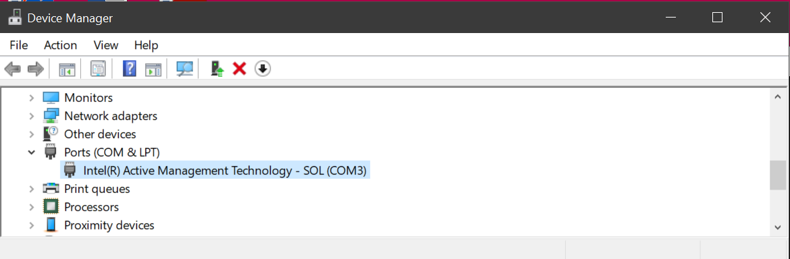
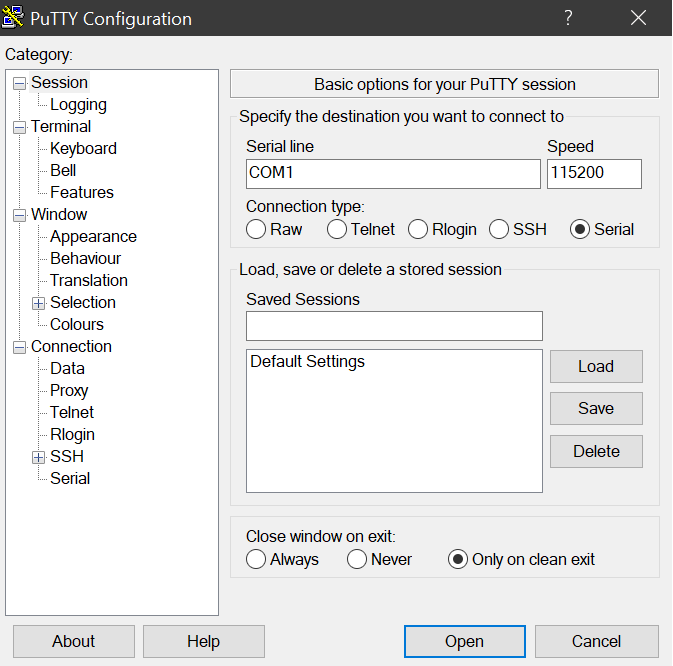

# Create a serial connection to the Outposts server

The following are instructions to create a serial connection from your laptop to the
Outposts server. They use popular serial terminal programs. You are not required to use these
programs. You can use the serial terminal program that you prefer, if it supports a connection
speed of `115200` baud.

###### Examples

- [Windows serial connection](#windows-serial "#windows-serial")
- [Mac serial connection](#mac-serial "#mac-serial")

## Windows serial connection

The following instructions are for PuTTY on Windows. PuTTY is free, but you may have to
download it.

###### Download PuTTY

Download and install PuTTY from the [PuTTY download
page](https://www.chiark.greenend.org.uk/~sgtatham/putty/latest.html "https://www.chiark.greenend.org.uk/~sgtatham/putty/latest.html").

###### To create a serial terminal on Windows using PuTTY

1. Plug the USB cable into your Windows laptop first, then into the server.
2. From the Desktop, right-click **Start**, and choose
   **Device Manager**.
3. In **Device Manager**, expand **Ports (COM &
   LPT)** to determine the COM port for the USB serial connection. You will see
   a node named **USB Serial Port (COM`#`)**. The
   value for the COM port depends on your hardware.

 4. In PuTTY, from **Session**, choose **Serial** for
**Connection type**, and then enter the following information:

    * Under **Serial line**, enter the
     COM`#` port from Device Manager.
    * Under **Speed**, enter: `115200`

The following image shows an example on the **PuTTY Configuration**
page:

 5. Choose **Open**.

An empty console window appears. It can take between 1 to 2 minutes for one of the
following to appear:

    * `Please wait for the system to stabilize. This can take up to 900 seconds,
     so far `x seconds` have elapsed on this
     boot.`
    * The `Outpost>` prompt.

## Mac serial connection

The following instructions are for **screen** on macOS. You can find
**screen** included with the operating system.

###### To create a serial terminal on macOS using **screen**

1. Plug the USB cable into your Mac laptop first, then into the server.
2. In Terminal, list `/dev` with a `*usb*` filter for output to
   find the virtual serial port.

```
`ls -ltr /dev/*usb*`
```

The serial device appears as `tty`. For example, consider the following
sample output from the previous list command:

```
`ls -ltr /dev/*usb*``crw-rw-rw- 1 root wheel 21, 3 Feb 8 15:48 /dev/cu.usbserial-`EXAMPLE1`
crw-rw-rw- 1 root wheel 21, 2 Feb 9 08:56 /dev/tty.usbserial-`EXAMPLE1``
```

3. In Terminal, use **screen** with the serial device and a baud rate of
   the serial connection to set up the serial connection. In the following command, replace
   `EXAMPLE1` with the value from your laptop.

```
`screen /dev/tty.usbserial-`EXAMPLE1` 115200`
```

An empty console window appears. It can take between 1 to 2 minutes for one of the
following to appear:

    * `Please wait for the system to stabilize. This can take up to 900 seconds,
     so far `x seconds` have elapsed on this
     boot.`
    * The `Outpost>` prompt.
