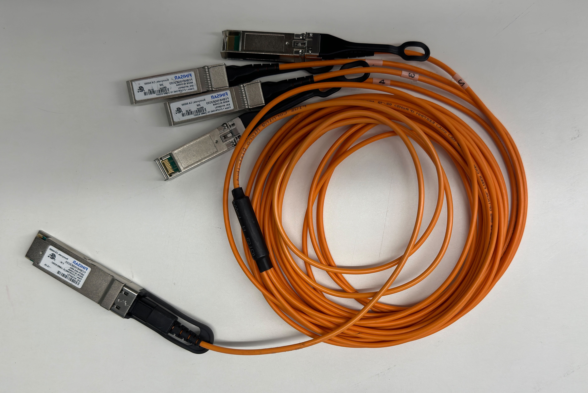
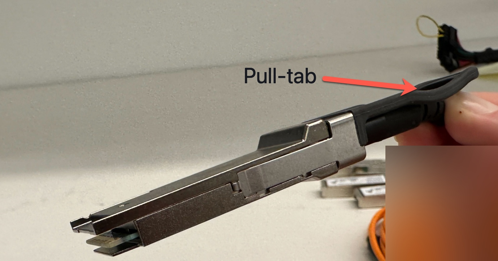
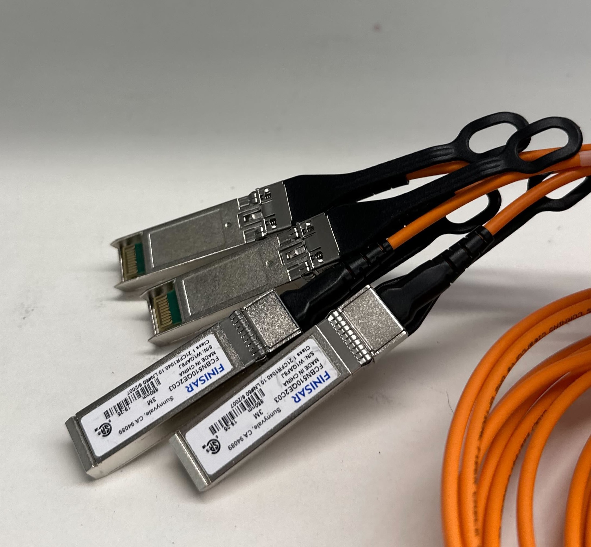
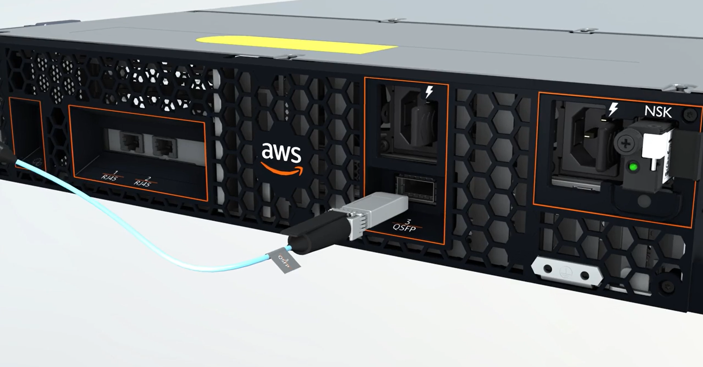
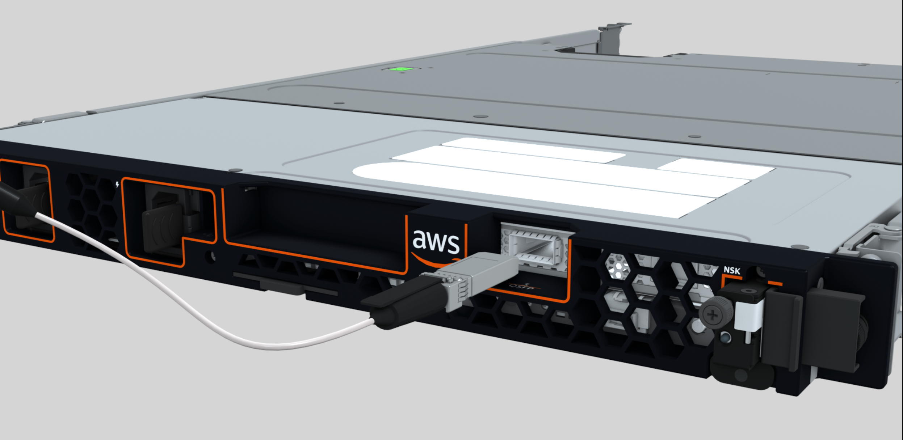
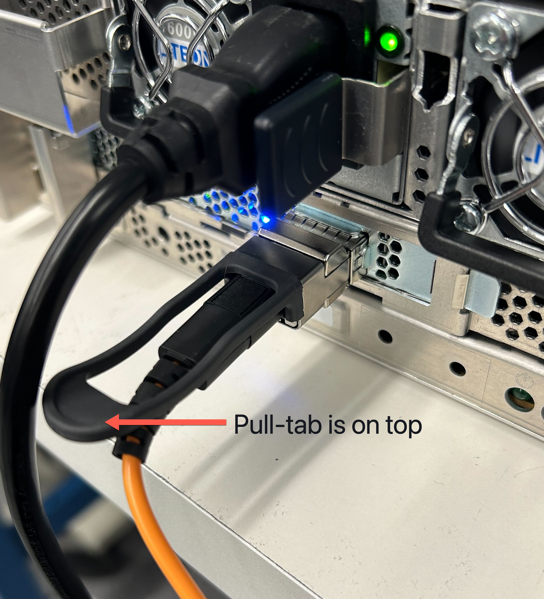
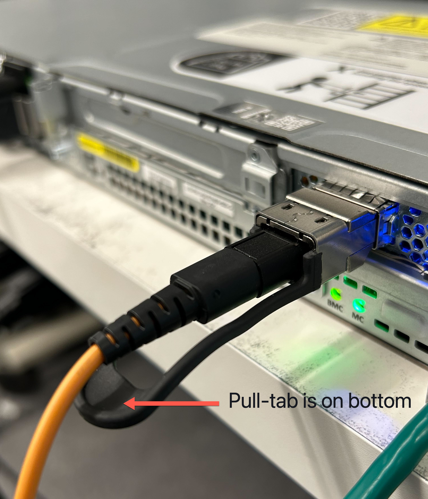

# Configure the QSFP network for your Outposts server

With the QSFP breakout cable, you use breakouts to segment traffic.

The following image shows the QSFP breakout cable:

###### Note

AWS Outposts servers have a physical RJ45 port beside the QSFP port. However, this RJ45 port is
not enabled for any customer use. If you require RJ45 1GbE connectivity, use the included
QSFP cable to connect a 10GBASE-X SFP+ to a 1GbE RJ45 media converter.

One end of the QSFP cable has a single connector. Connect this end to the server.

The following image shows the end of the cable with the single connector:

The other end of the QSFP cable has 4 breakout cables labeled 1 through 4. Use the cable
labeled 1 for LNI link traffic and the cable labeled 2 for service link
traffic.

The following image shows the end of the cable with the 4 breakout cables:

###### To connect the server to the network with the QSFP breakout cable

1. Locate the QSFP breakout cable that came with the server.
2. Connect the single end of the QSFP breakout cable to the QSFP port on the
   server.
   1. Locate the QSFP port.

   The following image shows the location of the QSFP port on the 2U server.

   

   The following image shows the location of the QSFP port on the 1U server.

    2. Plug in the QSFP with the pull-tab in the correct orientation.

   For the 2U server, plug in the QSFP with the pull-tab on top as the following
   image shows.

   

   For the 1U server, plug in the QSFP with the pull-tab on the bottom as the
   following image shows.

    3. Ensure that you feel or hear a click when you plug the cables in. This indicates
   that you plugged in the cables correctly.

3. Connect breakouts 1 and 2 of the QSFP cable to the upstream
   networking device.

###### Important

Both of the following cables are required for an Outposts server to function.

    * Use the cable labeled 1 for LNI link traffic.
    * Use the cable labeled 2 for service link traffic.
