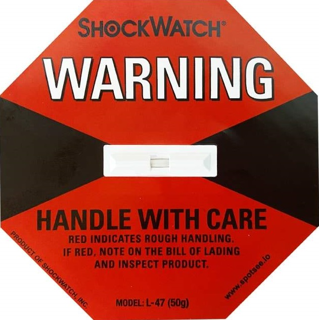

# Step 2: Inspect the Outposts server equipment

To complete an inspection of the Outposts equipment, you should check the shipping package
for damage, unpack the shipping package, and locate the Nitro Security Key (NSK). Consider the
following information when inspecting the server:

- The shipping package has shock sensors located on the two largest sides of the
  box.
- The inside flap of the shipping package contains instructions about how to unpack the
  server and locate the NSK.
- The NSK is an encryption module. To complete inspection, you _locate_ the NSK. You attach the NSK to the server in a later step.

###### Tasks

- [Check the shipping package](#inspect-1 "#inspect-1")
- [Unpack the shipping package](#inspect-2 "#inspect-2")
- [Find the NSK](#inspect-3 "#inspect-3")

## Check the shipping package

Before you open the shipping package, observe both shock sensors and note if they have
been activated. If the shock sensors have been activated it is possible that the unit has been
damaged. Proceed with the installation taking time to note any further damage to the server or
accessories. If any part of the system is obviously damaged or the installation fails to
proceed as expected contact AWS Support for guidance on replacing your Outposts server.

If the bar in the middle of the sensor is red, the sensor has been activated.

## Unpack the shipping package

Open the package and ensure it contains the following items:

- Server
- Nitro Security Key (encryption module) – packaging marked with "NSK" in red.
  See the following procedure for locating the NSK from the shipping package for more
  information.
- Rack installation kit (2 inner rails, 2 outer rails, and screws)
- Installation pamphlet
- Accessory kit
  - Pair of C13/14 power cables ‐ 10 feet (3m)
  - QSFP breakout cable ‐10 feet (3m)
  - USB cable, micro-USB to USB-C ‐ 10 feet (3m)
  - Brush guard

## Find the NSK

The NSK is inside the box labelled **A** that includes the
accessories for the server.

###### Important

- Do not use the NSK to destroy data on the server during installation.
- NSKs are not interchangeable between servers. You must use the NSK from the box the
  sever came in. If you have multiple servers, ensure that the correct NSK is attached to
  each server.

If you use the wrong NSK, it will cause the provisioning
process to fail until the correct NSK is attached to the server and the authorize-server
process repeated.

The NSK is required to activate the server. The NSK is also used to destroy data on the
server when you send the server back. In this installation step, **ignore** the instructions on the body of the NSK because those instructions are to
destroy data.
