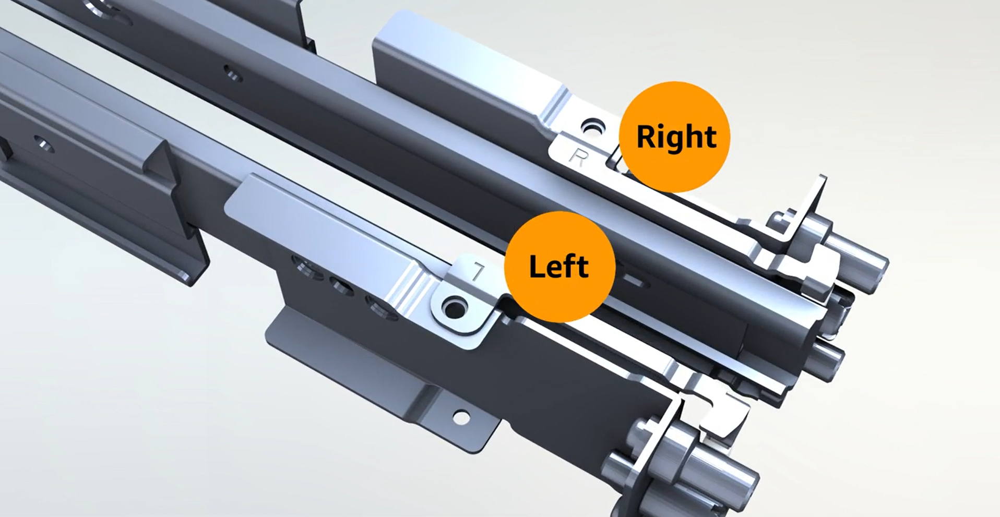
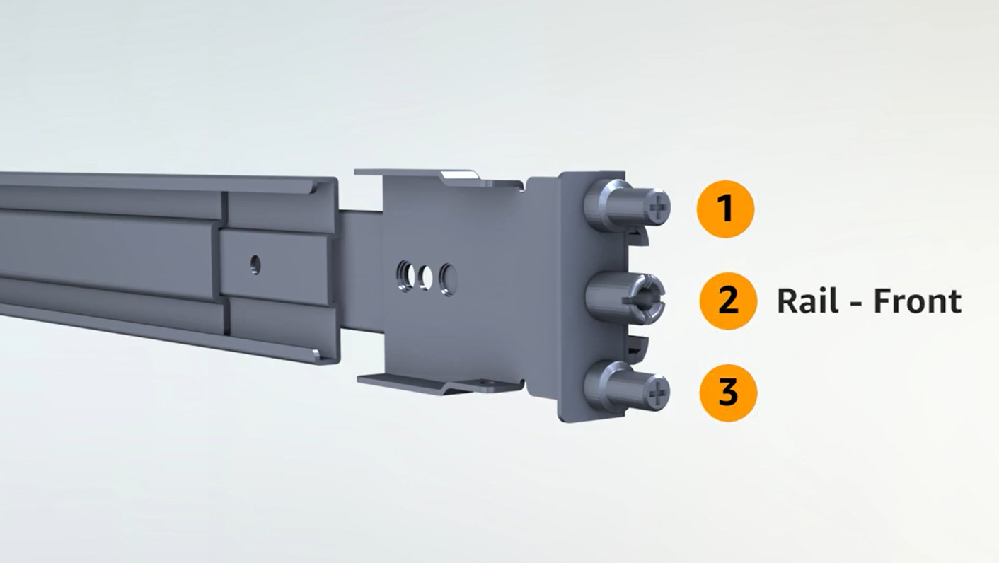
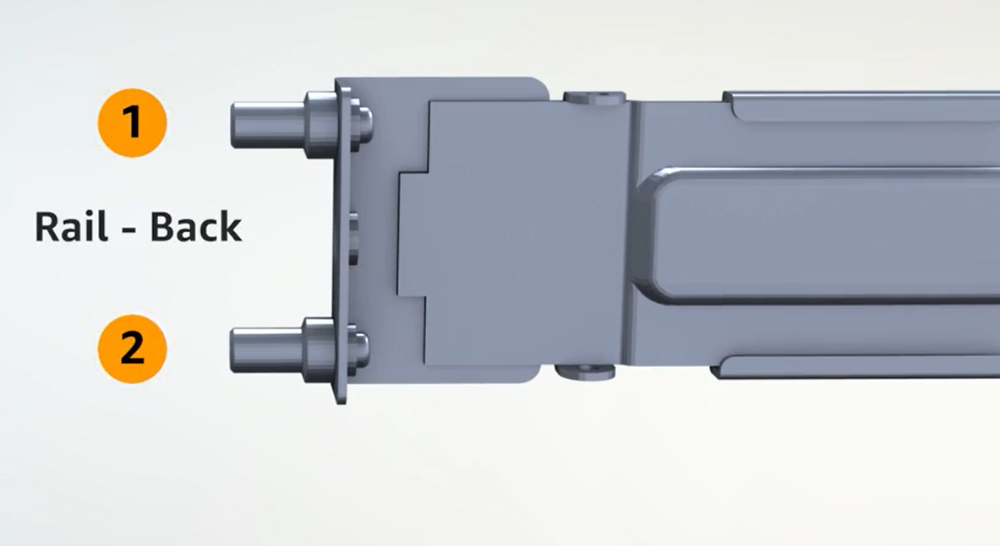

# Step 3: (Optional) Mount your Outposts server in a rack

To complete this step, you must attach inner rails to the server, outer rails to the rack,
then mount the server on the rack. You need a Phillips-head screwdriver to complete these
steps.

###### Rack mount alternatives

You are not required to mount the server in a rack. If you're not mounting the server in
a rack, consider the following information:

- Ensure a minimum clearance of 6 inches (15 cm) between the server and walls in front
  of and behind the server to allow the hot air to circulate.
- Place the server on a stable surface free from mechanical hazards such as moisture or
  falling objects.
- To use the networking cables included with the server, you must place the server
  within 10 feet (3 m) of your upstream networking device.
- Follow local guidance for seismic bracing and bonding.

###### Tasks

- [Identify sides and ends](#mount-0 "#mount-0")
- [Attach inner rails](#mount-1 "#mount-1")
- [Attach outer rails](#mount-2 "#mount-2")
- [Mount the server](#mount-3 "#mount-3")

## Identify sides and ends

Locate and open the box of rack rails that came with the server. Use the following
procedure to identify the sides and ends of the rails.

###### To identify left from right, front from back

1. Look at the markings on the rails to determine which is left and right. These
   markings determine to which side of the server each rail gets attached.

 2. Look at the posts on each end of the rails to determine which is front, and which
is back.

The front end has three posts.

The back end has two posts.

## Attach inner rails

Use the following procedure to attach the inner rails to the server.

###### To attach inner rails to the server

1. Detach the inner rail from the outer rail for both rails. You should have four
   rails.
2. Attach the right inner rail to the right side of the server and secure the rail
   with a screw. Make sure you orient the rail correctly with the server. Point the front
   part of the rail toward the front of the server.
3. Attach the left inner rail to the left side of the server and secure the rail with
   a screw.

## Attach outer rails

To attach outer rails to the rack, face the rack and use the rail marked R on the
right side of the rack. Attach the back of the rail to the rack first, then extend
the rail to connect it to the front of the rack.

###### Tip

Pay attention to the orientation of the rails. Use included pin adapters if
necessary.

Repeat with the left rail on the left side.

## Mount the server

To mount the server in the rack, slide the server into the outer rails you
installed on the rack in the previous step and secure the server at the front
with two provided screws.

###### Note

- Use two people to slide the server into the rack.
- Do not mount the server vertically.
