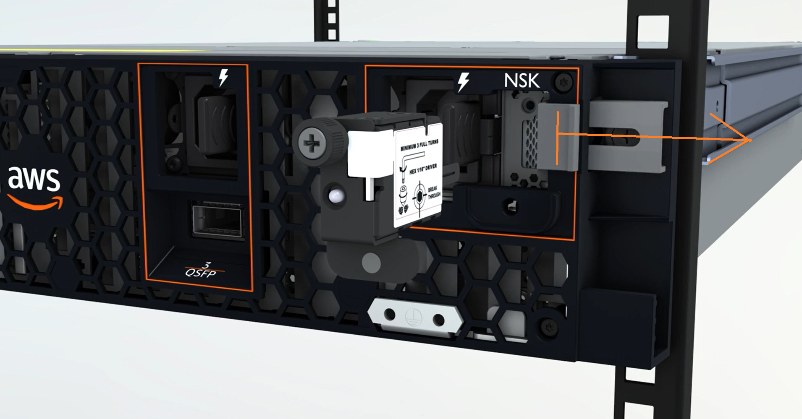
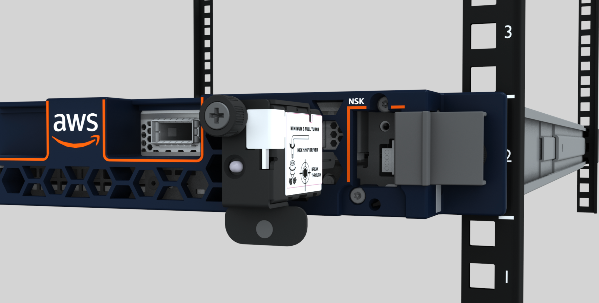
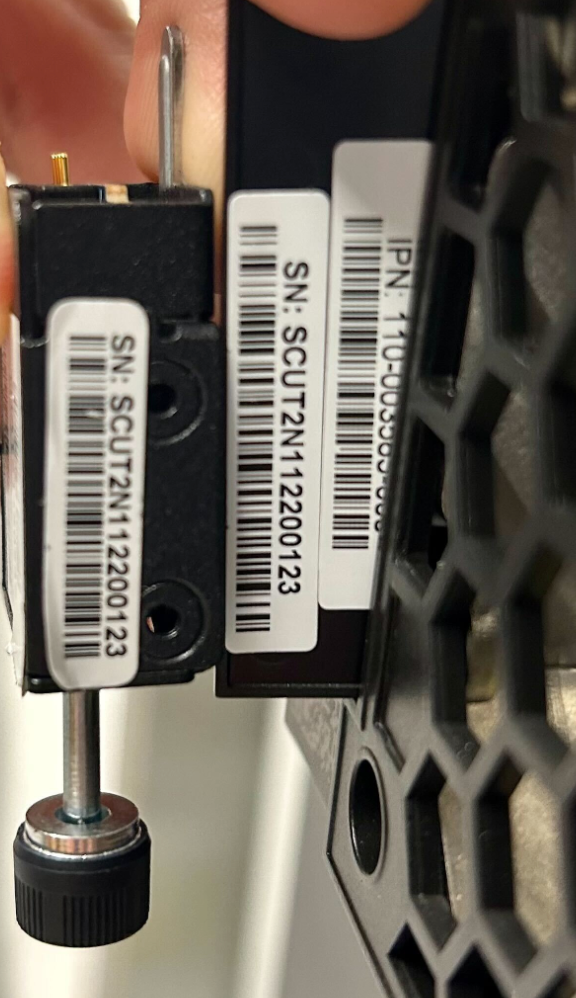
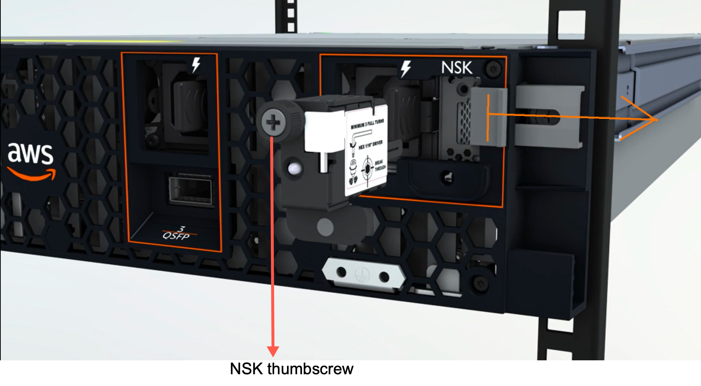
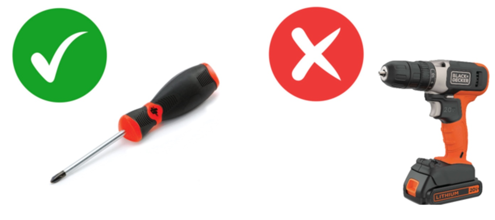

# Attach the NSK to your Outposts server

You must attach the NSK to the server so it can decrypt data on the server during
operation.

###### Important

- The side of the NSK has instructions on how to destroy the NSK. Do not follow those
  instructions now. Follow those instructions only when returning the server to AWS, to
  [cryptographically shred the data](../server-userguide/outpost-maintenance.md#outpost-server-cryptographically-shred-data "../server-userguide/outpost-maintenance.md#outpost-server-cryptographically-shred-data") on the server.
- If you are installing multiple servers at the same time, ensure that you do not mix
  up the NSKs. You must attach the NSK to the server that it shipped with. If you use a
  different NSK, the server will not boot up.

###### To attach the NSK

1. On the front right side of the server, open the NSK compartment.

The following image shows the NSK attached to a 2U server.

The following image shows the NSK attached to a 1U server.

 2. Ensure that the serial number (SN) on the NSK matches the SN on the bezel pull-out tab
of the NSK compartment on the server.

The following image shows the SN number on the NSK and bezel pull-out tab:

 3. Fit the NSK into the slot. 4. Hand tighten using the thumbscrew or tighten with a screwdriver (0.7 Nm / 0.52 lb-ft)
until snug. Do not use power tool as it might over-torque and damage the NSK.

The following image shows the location of the thumbscrew.

The following image shows the type of screwdriver you can use to attach the NSK to the
server.

